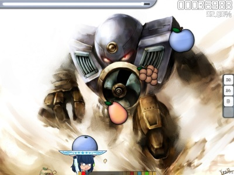

# osu!catch

osu!catch, previously well known as "Catch the Beat" or "CTB", is a game mode that requires the player to control a character who catches falling fruit in time to the music.

## Score

Scoring for osu!catch follows the same multiplier as in [osu!standard](/wiki/Game-Modes/osu!).
However, the fruit that adds up your score is different from osu!stanard.

A regular sized fruit gives a score of 300 times the multiplier. While a large juice drop gives a score of 100.
The smallest drop (also called "droplet") gives a score of 10.

You will not lose your combo for missing droplets in this mode.

<table>
 <thead>
  <tr>
   <th colspan="2">Score = (Hit Value) + (Hit Value) * (((Combo multiplier) * (Difficulty multiplier) * (Mod multiplier)) / 25)</th>
  </tr>
 </thead>
 <tbody>
  <tr>
   <td>Hit Value</td>
   <td>The hit circle judgement (50, 100 or 300), any slider ticks and spinner's bonus</td>
  </tr>
  <tr>
   <td>Combo multiplier</td>
   <td>(Combo before this hit - 1) or 0; whichever is higher</td>
  </tr>
  <tr>
   <td>Difficulty multiplier</td>
   <td>The difficulty setting for the beatmap</td>
  </tr>
  <tr>
   <td>Mod multiplier</td>
   <td>The multiplier of the selected mods</td>
  </tr>
 </tbody>
</table>

**NOTE:** There is a difference between osu!standard and osu!catch's scoring methods:

-    300s aren't given to a finished spinner, nor is the combo given,
-    reverse slider ticks are counted as a full score of a hit
     -    (note that in osu!standard, a reverse tick only gives 30 points)

## Accuracy

Your accuracy is defined by how much you have caught and how much you missed.

<table>
 <thead>
  <tr>
   <th colspan="2">Accuracy = (Total numbers of fruits caught) / (Total number of fruits)</th>
  </tr>
 </thead>
 <tbody>
  <tr>
   <td>(Total numbers of fruits caught)</td>
   <td>Number of droplets + 100s + 300s</td>
  </tr>
  <tr>
   <td>(Total numbers of fruits)</td>
   <td>Misses + Droplets + 100s + 300s + Missed droplets</td>
  </tr>
 </tbody>
</table>

Note that bananas (or spinner fruit) are considered to be bonus or extra points you could obtain and does not count towards your accuracy.

If you use the API to calculate the accuracy, number of droplets is under count50 and number of miss droplets is under countkatu.

## Grading

Here are the possible grades:

-   SS: 100.00% Accuracy
-   S: 98.01% to 99.99% Accuracy (You can have an S-rank even if you make several misses, just like in [osu!mania](/wiki/Game-Modes/osu!mania))
-   A: 94.01% - 98.00% Accuracy
-   B: 90.01% - 94.00% Accuracy
-   C: 85.01% - 90.00% Accuracy
-   D: Any other accuracy under 85.00%.

A silver S or SS can be obtained by using the [Hidden]() or [Flashlight]() mod.

## Controls

By default, the left and right arrow keys are used to move the catcher left and right respectively.
Pressing the left shift key with one of the arrow keys will make the catcher dash in that direction (indicated by a bright glow around the catcher).

Hyperdash is an automatically triggered gameplay element in osu!catch and is designed to obliterate "impossible jumps" (where two objects were previously impossible to catch because of the distance that separated them).
It is automatically activated when obtaining a red glowing fruit (the first of an impossible pair) and stays active until you are in range of the second fruit, or have already missed it.
It will speed you up a variable amount such that if you are dashing, you will always be able to make it to the destination in time.

If you so choose to use teh [Relax]() mod, you can use mouse to move the catch instead.

Sliders leading into jumps is self explanatory.
Players will be forced to move slowly on a track going left for about a second, then have to change speed, direction, and pacing in order to keep up.

## Trivia

-    Until April 10, 2012, osu!catch maps could not be ranked or be included in ranked maps. However, this has now changed, and mappers may now make osu!catch-specific difficulties, provided they follow the guidelines. These guidelines are very much a work in progress, but as more CTB maps are ranked and feedback is given from their players, the guidelines will evolve to be as thorough and comprehensive as the osu!standard guidelines.

[Category:Catch The Beat](Category:Catch_The_Beat "wikilink")
