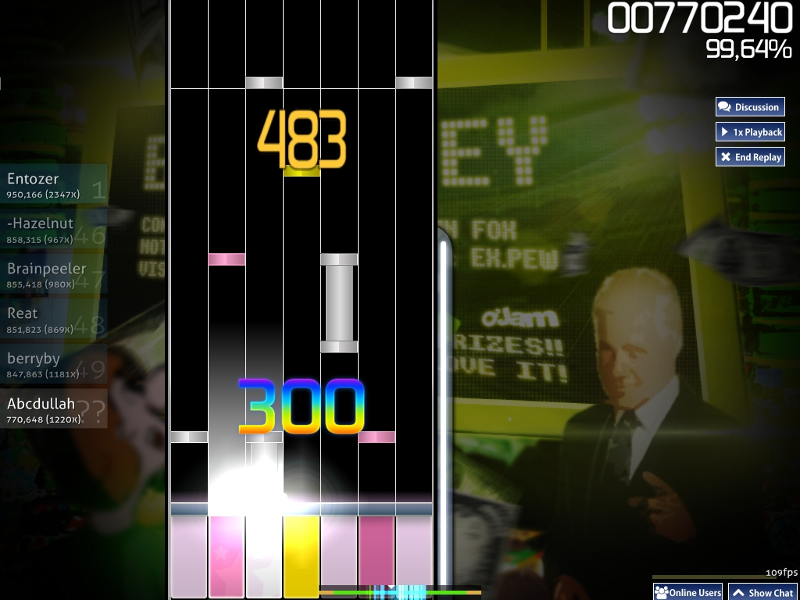
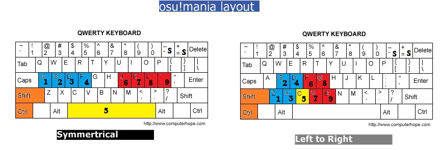

# osu!mania



osu!mania is osu!'s newest game mode.
It is similar to Beatmania IIDX (or DJMAX, Guitar Hero, O2Jam/mania, StepMania, DDR and other rhythm games that require more than 3 buttons) in which a player needs to press the specific buttons for the beat notes that are coming down.
It is somewhat similar to [osu!taiko](/wiki/Game_Modes/osu!taiko), but with more buttons to press and notes moving downward rather than moving horizontally to the left.

## Gameplay

This mode has been widely used in almost all the major rhythm games that require good hands/legs coordination, where the beat notes with their quantity depending on BPM and difficulty move on the conveyor, and the player have to press the correct button for that specific beat note in time.
Though the game mode was originally made as an imitation of Beatmania style of playing, however, by changing the number of buttons, you can make it look more like Guitar Hero (5) or Dance Dance Revolution (4) and so on.
Currently, you can play with 1 to 10 buttons.

In the song selection screen, the number next to the "K" tells you how many keys you'll be playing (can be changed with the xKey mods, if not an osu!mania-specific map).
When you see "K↓", it means that the judgement is easier (meaning that it easier to get a higher score).
Without the "↓" symbol, the beatmap will be played with its normal judgement.
The judgement of a beatmap is determined automatically.

## Controls


There *used to be* two different binding-styles, *Symmetrical* and *Left to Right*.

-   *Symmetrical* style mimics the button placement of DJMAX, in which the center key is "spacebar", in which, created a feeling of "stepping" the pedal similar to the arcade version. Centre key matches the middle column (5K, 7K, and 9K only) and the other column matches the keys in its corresponding place.
-   *Left to Right* style mimics the button placement of Beatmania IIDX, where the first column matches to the key1, then the second column matches the key2 and so on.
    -   However, the option to pick had already been removed and the current style is based on "Symmetrical" style. For legacy reason, "Left to Right" style is kept here.

*Symmetrical* key binding (For DJMAX style)

-   For *left* hand buttons — (K1)**A**, (K2)**S**, (K3)**D**, (K4)**F**
-   For *right* hand buttons — (K6)**J**, (K7)**K**, (K8)**L**, (K9)**semicolon ";"**.
-   *Center* button — (K5)**spacebar**. \[On 5K, 7K, and 9K only\]
-   The *Special* button — (S1)**left SHIFT** \[Using special style\] or **left control "Ctrl"** \[Alternate binding\].

*Left to Right* key binding (For Beatmania IIDX style)

-   From down to up then down to up again: (K1)**Z**, (K2)**S**, (K3)**X**, (K4)**D**, (K5)**C**, (K6)**F**, (K7)**V**, (K8)**G**, (K9)**B** \[K9 is not used\]
-   The *Special* button — (S1)**left SHIFT** and **left control "Ctrl"**.



<table>
 <thead>
  <tr>
   <th>Key</th>
   <th colspan="3">Symmetrical binding</th>
  </tr>
 </thead>
 <tbody>
  <tr>
   <td>1K</td>
   <td>-</td>
   <td>K5</td>
   <td>-</td>
  </tr>
  <tr>
   <td>2K</td>
   <td>K4</td>
   <td>-</td>
   <td>K6</td>
  </tr>
  <tr>
   <td>3K</td>
   <td>K4</td>
   <td>K5</td>
   <td>K6</td>
  </tr>
  <tr>
   <td>4K</td>
   <td>K3, K4</td>
   <td>K5</td>
   <td>K6, K7</td>
  </tr>
  <tr>
   <td>5K</td>
   <td>K3, K4</td>
   <td>-</td>
   <td>K6, K7</td>
  </tr>
  <tr>
   <td>6K</td>
   <td>K2, K3, K4</td>
   <td>-</td>
   <td>K6, K7, K8</td>
  </tr>
  <tr>
   <td>6K (L)</td>
   <td><b>S1</b>, K3, K4</td>
   <td>K5</td>
   <td>K6, K7</td>
  </tr>
  <tr>
   <td>6K (R)</td>
   <td>K3, K4</td>
   <td>K5</td>
   <td>K6, K7, <b>S1</b></td>
  </tr>
   <tr>
   <td>7K</td>
   <td>K2, K3, K4</td>
   <td>K5</td>
   <td>K6, K7, K8</td>
  </tr>
  <tr>
   <td>8K</td>
   <td>K1, K2, K3, K4</td>
   <td>-</td>
   <td>K5, K6, K7, K8</td>
  </tr>
  <tr>
   <td>8K(L)</td>
   <td><b>S1</b>, K2, K3, K4</td>
   <td>K5</td>
   <td>K6, K7, K8</td>
  </tr>
  <tr>
   <td>8K(R)</td>
   <td>K2, K3, K4</td>
   <td>K5</td>
   <td>K6, K7, K8, <b>S1</b></td>
  </tr>
  <tr>
   <td>9K</td>
   <td>K1, K2, K3, K4</td>
   <td>K5</td>
   <td>K6, K7, K8, K9</td>
  </tr>
 </tbody>
</table>

<table>
 <thead>
  <tr>
   <th>Key</th>
   <th colspan="3">Left-To-Right binding</th>
  </tr>
 </thead>
 <tbody>
  <tr>
   <td>4K</td>
   <td>K1, K2</td>
   <td>-</td>
   <td>K4, K5</td>
  </tr>
  <tr>
   <td>5K</td>
   <td colspan="3">K1, K2, K3, K4, K5</td>
  </tr>
  <tr>
   <td>6K</td>
   <td colspan="3">K1, K2, K3, K4, K5, K6</td>
  </tr>
  <tr>
   <td>7K</td>
   <td colspan="3">K1, K2, K3, K4, K5, K6, K7</td>
  </tr>
  <tr>
   <td>8K</td>
   <td colspan="3">K1, K2, K3, K4, K5, K6, K7, K8</td>
  </tr>
  <tr>
   <td>8K(L)</td>
   <td colspan="3"><b>S1</b>, K1, K2, K3, K4, K5, K6, K7</td>
  </tr>
  <tr>
   <td>8K(R)</td>
   <td colspan="3">K1, K2, K3, K4, K5, K6, K7, <b>S1</b></td>
  </tr>
 </tbody>
</table>

-   Note: Please refer to the picture based on style used.

### Co-Op


The **[5th of March 2015 update](http://osu.ppy.sh/p/changelog?v=b20150305)** gave osu!mania a new mod called [Co-Op]().
With this mod enabled, you can control a second different set of keys along with the primary set of keys as above.

*Symmetrical* key binding for second set.

-   For *left* hand buttons — (B1)**Q**, (B2)**W**, (B3)**E**, (B4)**R**
-   For *right* hand buttons — (B6)**U**, (B7)**I**, (B8)**O**, (B9)**P**.
-   *Center* button — (B5)**right ALT**. \[On 5K, 7K, and 9K only\]
-   *Special* button - (X1)**right SHIFT** \[Using special style\] or **right control "Ctrl"** \[Alternate binding\].

<table>
 <thead>
  <tr>
   <th>Key</th>
   <th colspan="3">Primary</th>
   <th colspan="3">Secondary</th>
  </tr>
 </thead>
 <tbody>
  <tr>
  </tr>
  <tr>
   <td>1K Co-op</td>
   <td>-</td>
   <td>K5</td>
   <td>-</td>
   <td>-</td>
   <td>B5</td>
   <td>-</td>
  </tr>
  <tr>
   <td>2K Co-op</td>
   <td>K4</td>
   <td>-</td>
   <td>K6</td>
   <td>B4</td>
   <td>-</td>
   <td>B6</td>
  </tr>
  <tr>
   <td>3K Co-op</td>
   <td>K4</td>
   <td>K5</td>
   <td>K6</td>
   <td>B4</td>
   <td>B5</td>
   <td>B6</td>
  </tr>
  <tr>
   <td>4K Co-op</td>
   <td>K3,K4</td>
   <td>-</td>
   <td>K6, K7</td>
   <td>B3, B4</td>
   <td>-</td>
   <td>B6, B7</td>
  </tr>
  <tr>
   <td>5K Co-op</td>
   <td>K3, K4</td>
   <td>K5</td>
   <td>K6, K7</td>
   <td>B3, B4</td>
   <td>B5</td>
   <td>B6, B7</td>
  </tr>
  <tr>
   <td>6K Co-op</td>
   <td>K2, K3, K4</td>
   <td>-</td>
   <td>K6, K7, K8</td>
   <td>B2, B3, B4</td>
   <td>-</td>
   <td>B6, B7, B8</td>
  </tr>
  <tr>
   <td>6K(L) Co-op</td>
   <td><b>S1</b>, K3, K4</td>
   <td>K5</td>
   <td>K6, K7</td>
   <td>B3, B4</td>
   <td>B5</td>
   <td>B6, B7, <b>X1</b></td>
  </tr>
  <tr>
   <td>6K(R) Co-op</td>
   <td>K3, K4</td>
   <td>K5</td>
   <td>K6, K7, <b>S1</b></td>
   <td>X1, B3, <b>B4</b></td>
   <td>B5</td>
   <td>B6, B7</td>
  </tr>
  <tr>
   <td>7K Co-op</td>
   <td>K2, K3, K4</td>
   <td>K5</td>
   <td>K6, K7, K8</td>
   <td>B2, B3, B4</td>
   <td>B5</td>
   <td>B6, B7, B8</td>
  </tr>
  <tr>
   <td>8K Co-op</td>
   <td>K1, K2, K3, K4</td>
   <td>-</td>
   <td>K6, K7, K8, K9</td>
   <td>B1, B2, B3, B4</td>
   <td>-</td>
   <td>B6, B7, B8, B9</td>
  </tr>
  <tr>
   <td>8K(L) Co-op</td>
   <td><b>S1</b>, K2, K3, K4</td>
   <td>K5</td>
   <td>K6, K7, K8</td>
   <td>B2, B3, B4</td>
   <td>B5</td>
   <td>B6, B7, B8, <b>X1</b></td>
  </tr>
  <tr>
   <td>8K(R) Co-op</td>
   <td>K2, K3, K4</td>
   <td>K5</td>
   <td>K6, K7, K8, <b>S1</b></td>
   <td><b>X1</b>, B2, B3, B4</td>
   <td>B5</td>
   <td>B6, B7, B8</td>
  </tr>
  <tr>
   <td>9K Co-op</td>
   <td>K1, K2, K3, K4</td>
   <td>K5</td>
   <td>K6, K7, K8, K9</td>
   <td>B1, B2, B3, B4</td>
   <td>B5</td>
   <td>B6, B7, B8, B9</td>
  </tr>
 </tbody>
</table>

-   This table is based on xK mod used in conjunction with Co-Op mod.

<table>
 <thead>
  <tr>
   <th>Key</th>
   <th colspan="3">Primary</th>
   <th colspan="3">Secondary</th>
  </tr>
 </thead>
 <tbody>
  <tr>
  </tr>
  <tr>
   <td>3K</td>
   <td>K4</td>
   <td>-</td>
   <td>K6</td>
   <td>-</td>
   <td>B5</td>
   <td>-</td>
  </tr>
  <tr>
   <td>5K</td>
   <td>K4</td>
   <td>K5</td>
   <td>K6</td>
   <td>B4</td>
   <td>-</td>
   <td>B6</td>
  </tr>
  <tr>
   <td>7K</td>
   <td>K3, K4</td>
   <td>-</td>
   <td>K6, K7</td>
   <td>B4</td>
   <td>B5</td>
   <td>B6</td>
  </tr>
  <tr>
   <td>9K</td>
   <td>K3, K4</td>
   <td>-</td>
   <td>K6, K7</td>
   <td>B3, B4</td>
   <td>B5</td>
   <td>B6, B7</td>
  </tr>
 </tbody>
</table>

-   This only applies to osu!mania specific difficulties. Only odd-numbered xK specifics are mentioned. Refer to first table for even number xK specific (For 4K specific, refer to 2K Co-op and so on)

### Speed Change

**Scrolling speed of the beat notes** can be changed by pressing **\[Ctrl\]** (Or **\[Shift\]**) with (**\[+\]** / **\[-\]**) while playing the beatmap or while in song selection menu.
Alternatively, you can also use **F3** or **F4**, but they will not work in the song selection menu.

## Scoring

This section details all the intricacies of scoring, including mathematical formulas.

### Grades

-   SS: 100% accuracy (only MAX and/or 300).
-   S: Over 95% accuracy (You can have 'S' rank even if you make several misses, like in osu!catch).
-   A: Over 90% accuracy.
-   B: Over 80% accuracy.
-   C: Over 70% accuracy.
-   D: Anything else.

It is possible to obtain SSH or SH ranks (silver S or SS), if you can obtain S or SS with Hidden, FadeIn or Flashlight mod.

### Judgement

**Hit notes**

-   You get a MAX (rainbow 300), 300, 200, 100 or 50 from a note depending on how accurately you hit it.
-   If you do not hit a note at all or hit it way too early, you will receive a miss.

**Hold notes**

-   The judgement for hold notes depends on both how accurately you hit it and how accurately you release it.
-   Keep holding till end of note, with initial and final with perfect timing: MAX
-   Keep holding till end of note, without releasing the note: 200
-   Do a *NG* and not recover the hold note: Miss
-   Do a *NG* and even hold back the note: 50

(NG: *Not Good* aka *NG* terms in StepMania and DDR, which happens when you release the hold note during hold timing.)

### Accuracy

<table>
 <thead>
  <tr>
   <th colspan="2">Accuracy = (Total points of hits) / (Total number of hits)</th>
  </tr>
 </thead>
 <tbody>
  <tr>
   <td>(Total points of hits)</td>
   <td>(50s * 50) + (100s * 100) + (200s * 200) + (300s * 300) + (MAXs * 300)</td>
  </tr>
  <tr>
   <td>(Total number of hits)</td>
   <td>(Misses + 50s + 100s + 200s + 300s + MAXs) * 300</td>
  </tr>
 </tbody>
</table>

Note that MAX and 300 are both worth the maximum for calculating accuracy, despite a MAX being worth more in terms of score than a 300.

### Score

In osu!mania, each beatmap has the same maximum total score (it's 1,000,000).

The score is given in two parts, base score and bonus score, each contributing 50% of total score.

Base score is based on hit judgement. A rainbow 300 is worth a bit more than 300.

Bonus score is based on hit judgement and a floating bonus multiplier. The multiplier increases when you get a rainbow 300 or 300, while it decreases when you get a 200 or below. The better judgement you get, the more the multiplier increase, or the less punishment. There's an upper limit for the multiplier.

The score given by each note is calculated with the following formula:

```
Score = BaseScore + BonusScore

BaseScore = (MaxScore * ModMultiplier * 0.5 / TotalNotes) * (HitValue / 320)

BonusScore = (MaxScore * ModMultiplier * 0.5 / TotalNotes) * (HitBonusValue * Sqrt(Bonus) / 320)
Bonus = Bonus before this hit + HitBonus - HitPunishment / ModDivider
Bonus is limited to [0, 100], initially 100.

MaxScore = 1 000 000
ModMultiplier = The score multiplier of the selected mods (difficulty reduction and/or nK)
ModDivider = The punishment divider of the selected mods (difficulty increase) 

Judgement  HitValue  HitBonusValue  HitBonus  HitPunishment
   MAX       320          32            2
   300       300          32            1
   200       200          16                        8
   100       100           8                       24
    50        50           4                       44
  Miss         0           0                        ∞

       Mod  ModMultiplier  ModDivider
      Easy       0.5
    NoFail       0.5
  HalfTime       0.5
  HardRock                    1.08
DoubleTime                     1.1
 NightCore                     1.1
    FadeIn                    1.06
    Hidden                    1.06
Flashlight                    1.06
```

## Editing

### Map Editor


Just like the other modes, osu! will convert osu!standard beatmaps to osu!mania when playing in this mode.
However, when you change the map's mode to "osu!mania", the editor will change, as shown in the screenshot.
If you press the arrow button you will see the lines with possible notes.
Number of lines can be set in the “Song Setup” =&gt; Column Count.

## Trivia

-    osu!mania was released on **08.10.2012**
-    The old osu!mania editor required the beatmapper to place hitcircles onto the playfield, where they'll be transcribed onto the stage.

## References

-    [Announcement post](http://osu.ppy.sh/forum/p/1825880)
