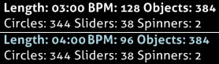
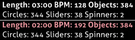
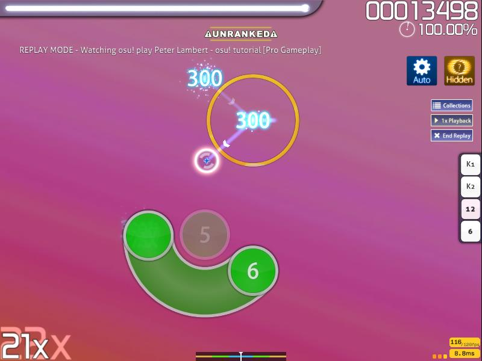
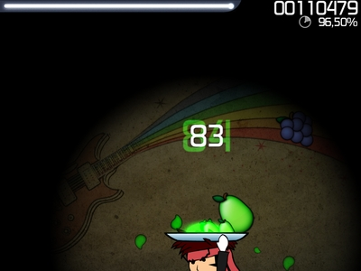
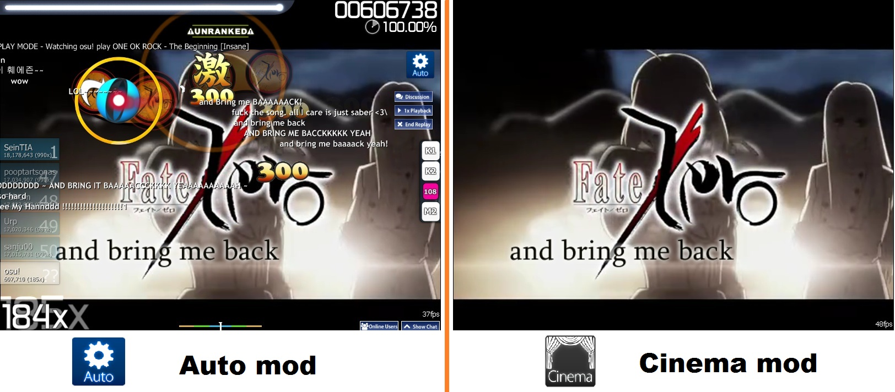

<!-- TODO: /Summary should be updated at the same time as this -->

# Game modifiers

")

Game modifiers (mods) are optional modifications to a beatmap's elements and settings that the player can enable at will. A mod effect can range from simple gameplay changes like changing the beatmap's settings to automation such as allowing osu! to do a perfect replay (Auto), on a condition of possible Score Multiplier changes to making the play unrankable. When multiple mods are enabled, the Score Multiplier is the product of the enabled mods' Score Multiplier. For example, when Hidden and Flashlight are applied at the same time, the Score Multiplier will be 1.19x (1.06 * 1.12 = 1.1872; 1.19 by rounding up to nearest hundredths).

Players can change the shortcut keys used to enable mods by clicking `Change keyboard bindings` under the Keyboard header inside the Options menu. The shortcut keys will only work while the mod selection screen is open.

The mod selection screen can be accessed by pressing `F1` in the song selection screen or by clicking the `Mods` button near the lower left corner of the screen.

## Difficulty Reduction

These mods can make the game easier at the cost of decreasing the Score Multiplier.

### Easy

 mod icon")

- Score Multiplier: 0.50x
- Shortcut key: `Q`

Easy mod halves all difficulty settings of the selected beatmap.

The Easy mod also grants the player two additional "lives"; if the [life bar](/wiki/Glossary#life-bar) is exhausted completely, the play will pause and refills the life bar slowly to about 80% with no sound in-between at a cost of one "life" of the play. The refill is signaled by the ready sound (`readys.wav`) instead of the typical fail sound (`failsound.wav`) for failing the beatmap with an empty life bar. The beatmap will resume once the refill is successful signaled by playing the go sound (`gos.wav`). The play will fail instead if there are no "lives" remain when the life bar has been exhausted completely again.

When watching a replay where an extra "life" is used, the health refill animation will be ignored and the replay will continue as if playing with [No Fail](#no-fail) mod on.

In [Multi](/wiki/Multi) mode, the effect of "lives" will not work in [Tag Coop / Tag Team Vs](/wiki/Multi#tag-coop-tag-team-vs) team mode.

---

- Reduces overall difficulty - larger circles, more forgiving HP drain, less accuracy required.

In [osu!standard](/wiki/Game_Modes/osu!) mode, the Easy mod decreases [circle size](/wiki/Beatmap_Editor/Song_Setup#circle-size), [approach rate](/wiki/Beatmapping/Approach_rate) (AR), [overall difficulty](/wiki/Beatmap_Editor/Song_Setup#overall-difficulty) (OD) as well as [HP drain](/wiki/Beatmap_Editor/Song_Setup#hp-drain-rate) (HP); each of these by a huge amount (half of the current amount set).

---

- Reduces overall difficulty - notes move slower, less accuracy required.

In [osu!taiko](/wiki/Game_Modes/osu!taiko) mode, the Easy mod decreases the [slider velocity](/wiki/Glossary#slider-velocity) (same as reducing AR in osu!standard mode), [overall difficulty](/wiki/Beatmap_Editor/Song_Setup#overall-difficulty) (OD) and [HP drain](/wiki/Beatmap_Editor/Song_Setup#hp-drain-rate) (HP) by half. Note that the amount of hits which are required to finish a spinner is reduced due to the reduction of [overall difficulty](/wiki/Beatmap_Editor/Song_Setup#overall-difficulty). Unlike the other game modes, the reduced note score requirement to gain health in [osu!taiko](/wiki/Game_Modes/osu!taiko) makes the life bar fill up much more faster to replace the two additional "lives" as it is impossible to fail in the middle of the song.

---

- Reduces overall difficulty - larger circles, more forgiving HP drain, less accuracy required.

In [osu!catch](/wiki/Game_Modes/osu!catch) mode, the effects are the same as in osu!standard mode - all fruits fall slower (same as reducing AR in osu!standard mode), the camera is zoomed in (increased CS in osu!standard mode) and two additional "lives" are granted. Despite only using one axis, the fruits' larger size and slower falling rate may cause them to clump together, creating the same alleged problems as in osu!standard mode.

---

- Reduces overall difficulty - more forgiving HP drain, less accuracy required.

In [osu!mania](/wiki/Game_Modes/osu!mania) mode, the effects are the same as in osu!taiko mode except two additional "lives" are granted, and slider velocity and the default key count will still be the same.

### No Fail

 mod icon")

- Score Multiplier: 0.50x
- Shortcut key: `W`
- You can't fail, no matter what.

No Fail mod makes the player incapable of failing when the [life bar](/wiki/Glossary#life-bar) hits zero.

If the player has not scored any points during the map, the beatmap will fail instead even if No Fail is used.

Do note that the usage of No Fail mod reduces the amount of possible [Performance Points](/wiki/Performance_Points) gain by 10%. Since this mod allows submitting scores with a very high miss-to-hit ratio, playing many beatmaps with this mod can drastically lower one's [accuracy](/wiki/Accuracy).

### Half Time

 mod icon")

- Score Multiplier: 0.30x (osu!standard, osu!taiko, osu!catch), 0.50x (osu!mania)
- Shortcut key: `E`
- Less zoom. ("Zoom" refers to the beatmap's BPM)

Half Time mod decreases the overall beatmap's speed (BPM) to 75% of the original, increases the length of the song by 33%, and decreases AR, OD, and HP by a small amount (signified by the superscript inverted triangle).

The method used to slow down may cause the song to sound "muddy" but vocals may sound similar.

---

In [osu!taiko](/wiki/Game_Modes/osu!taiko) mode, the slowed song and BPM causes note density becoming denser due to decreased approach rate. However, due to the way dendens are calculated in osu!taiko, dendens now take more hits to clear and cause *the dendens to award a higher total value than without the mod* (since each denden hits are not affected by Score Multiplier except the ending denden hit). This leads to the **increase** in maximum possible score when Half Time is enabled for maps with very low combos and many long dendens, and the effect is more significant when Hard Rock mod is turned on simultaneously (which boost the number of hit required per denden as well).

---

In [osu!catch](/wiki/Game_Modes/osu!catch) mode, the BPM is lowered by the same factor as in other modes. This mod *also* decreases the player character's speed so normal fruits without any mods *may* turned into *hyperdash* fruits in Half Time. In addition, the leniency for hyperdashes are increased, making it much easier to stop underneath the next fruit when doing a hyperdash.

## Difficulty Increasing

These mods introduce new elements to make the game harder and rewards the player in terms of an increase in Score Multiplier.

### Hard Rock

 mod icon.png")

- Score Multiplier: 1.06x (osu!standard, osu!taiko), 1.12x (osu!catch), 1.00x (osu!mania; unranked)
- Shortcut key: `A`
- Everything just got a bit harder...

Hard Rock (named after the hardest difficulty of the DS game [Elite Beat Agents](/wiki/Glossary#eba)) raises [circle size](/wiki/Beatmap_Editor/Song_Setup#circle-size) by 30% and the rest of the difficulty settings by 40%.

---

.")

In [osu!standard](/wiki/Game_Modes/osu!) mode, Hard Rock mod also flips the beatmap on the X axis, so that elements that were at the bottom of the map are now at the top and vice versa.

---

In [osu!taiko](/wiki/Game_Modes/osu!taiko) mode, Hard Rock mod increases [slider velocity](/wiki/Glossary#slider-velocity) as well as [overall difficulty](/wiki/Beatmap_Editor/Song_Setup#overall-difficulty). This is the most commonly used mod in osu!taiko due to it being the only difficulty increasing mod that does not require memorization or super-fast hitting on hard/insane maps.

Note that hit required to finish a denden is increased due to the increase of overall difficulty. Therefore, the maximum possible score of osu!taiko difficulties with Hard Rock on is larger than that of Hidden mod. However, this effect is insignificant in most cases because each hit in denden gives a static score of 300, which is even smaller than a typical score difference between a GREAT hit and a GOOD hit (550 points at 100 combo or above).

---

.")

In [osu!catch](/wiki/Game_Modes/osu!catch) mode, Hard Rock mod has a multitude of effects. In addition to making the player character and fruits smaller (CS) and increasing how fast they fall (AR), this mod can cause ordinary fruits to veer slightly to the left or right of where they were placed on the grid, requiring the player to make more chaotic movements and to use hyperdash.

As this mod increases difficulty in a huge way compared to the other two modes, it is worth a 1.12x multiplier rather than 1.06x.

---

In [osu!mania](/wiki/Game_Modes/osu!mania) mode, only the judgement difficulty (OD) and the [approach rate](/wiki/Beatmapping/Approach_rate) (AR) values are increased.

Hard Rock mod will not affect the note placement. For mod that will change the note placement, see [Random](#random) mod under Special.

Using this mod on osu!mania will result in an unranked play.

### Sudden Death

 mod icon")

- Score Multiplier: 1.00x
- Shortcut key: `S` (from unselected)
- Miss a note and fail.

Sudden Death mod causes the player to fail the map if the [combo](/wiki/Glossary#combo) is ever broken, resulting in an extra large miss figure (osu!standard mode only) and a full HP drain.

Combo can be broken by missing a note, not clicking on a starting slider circle (osu!standard only), not collecting a slider tick, or failing to complete a spinner. However, combo will not be broken by missing a slider end (result in getting 100 score value instead for that slider completion; osu!standard only) or not holding/collecting on the empty slider path.

#### Perfect

 mod icon")

Click on Sudden Death again to activate Perfect mod.

- Score Multiplier: 1.00x
- Shortcut key: `SS` (from unselected) or `Shift`+`S`
- SS or quit.

Perfect mod causes *any* imperfect hit (as in, any score values that does not give 100% accuracy) to be counted as a **miss** and will **forcefully restart the song automatically**, something Sudden Death does not do.

While this mod gives no Score Multiplier, it is *more unforgiving* (100% accuracy or force auto-restart until the player gives up by quitting the beatmap manually) when compared to Sudden Death (as long as the combo did not break). There will not be any failed screen and if the beatmap has a skippable prologue, it will be played *again* since Perfect mod uses restart functionality (not quick-restart) the moment a miss (by Perfect's standard) is given.

---

In [osu!mania](/wiki/Game_Modes/osu!mania) mode, Perfect mod accepts both Rainbow 300/MAX (the highest score value) and 300 score values as legitimate score values since both gives 100% accuracy score and everything else as miss.

### Double Time

 mod icon")

- Score Multiplier: 1.12x (osu!standard, osu!taiko) , 1.06x (osu!catch), 1.00x (osu!mania)
- Shortcut key: `D` (from unselected)
- Zoooooooooom

Double Time mod increases the overall beatmap's speed (BPM) to 150% of the original, reducing the length of the song by 33%, and increases AR, OD, and HP by a small amount (signified by the superscript triangle).

The method used to increase the speed does not increase the pitch of the song, but can make it sound "muddy".

---

In [osu!taiko](/wiki/Game_Modes/osu!taiko) mode, since the hit leniency is greatly reduced on top of osu!taiko's already strict overall difficulty, along with slider ticks being considerably more difficult to hit (and reducing the value of dendens), Double Time is usually regarded as the hardest mod in osu!taiko and is seldom used.

---

In [osu!catch](/wiki/Game_Modes/osu!catch) mode, as there is no overall difficulty to increase, this mod does nothing more than a BPM and approach rate multiplier and is thus only worth a 1.06x multiplier. Being the opposite of Half Time, though, Double Time greatly decreases the hyperdash leniency, making fruits requiring hyperdashes nigh impossible to catch in some cases.

#### Nightcore

 mod icon")

Click on Double Time again to activate Nightcore mod.

- Score Multiplier: 1.12x (osu!standard, osu!taiko) , 1.06x (osu!catch), 1.00x (osu!mania).
- Shortcut key: `DD` (from unselected) or `Shift`+`D`
- uguuuuuuuu

Nightcore mod increases the pitch and adds a drum track to the background that (in 4/4 time) goes in the order of bass drum on beats 1 and 3, clap on beats 2 and 4, and crash on beat 1 every 4 measures.

The multiplier stays the same, and the beatmap itself is unaffected beyond what Double Time would do because **Double Time will be automatically activated in order to use Nightcore mod**.

### Hidden

 mod icon")

- Score Multiplier: 1.06x (osu!standard, osu!taiko, osu!catch) , 1.00x (osu!mania)
- Shortcut key: `F`

Hidden (debuted in Ouendan 2, the second Japanese DS game) mod removes the approach circles and causes the hit objects to fade after appearing on the screen.

If the beatmap was passed with S or SS grade with Hidden mod enabled, the beatmap will award the sliver variant of the grade instead.

---

- Play with no approach circles and fading notes for a slight score advantage.

In [osu!standard](/wiki/Game_Modes/osu!), it eliminates the approach circles and causes the hit objects to fade out shortly after appearing, forcing players to more or less memorize the timing and, to a lesser degree, the placement and the slider path.

By default, the first hit object will have an approach circle. However, this behaviour can be safely disabled in Options under Gameplay General's as `Show approach circle on first "Hidden" object`.

---

- The notes fade out before you hit them!

In [osu!taiko](/wiki/Game_Modes/osu!taiko) mode, the notes fade out about halfway through the screen, requiring that the player remembers the timing and colour. However, sliders and dendens still cross the full timeline and do not fade out except that the denden has no approach circle to indicate when it times out. On beatmap with high overall difficulty, Hidden is used by experienced players to increase score instead of Hard Rock, because Hard Rock occasionally makes the timing window too small.

---

- Play with no approach circles and fading notes for a slight score advantage.

In [osu!catch](/wiki/Game_Modes/osu!catch) mode, Hidden causes the fruits to fade out about halfway down the screen.

---

Click on Fade In again to activate Hidden mod.

- Shortcut key: `FF` (from unselected) or `Shift`+`F` (osu!mania only)
- The notes fade out before you hit them!

")

In [osu!mania](/wiki/Game_Modes/osu!mania) mode, Hidden can be used by pressing Fade In mod again, and functions as the inverse of Fade In.

#### Fade In

 mod icon")

- **osu!mania only**
- Score Multiplier: 1.00x (osu!mania only)
- Shortcut key: `F`

")

Fade In mod causes notes to fade in as they approach the judgement bar.

The speed at which they fade is based on the combo, with higher combo causing the notes to fade in later and remain invisible longer. The fading size only stops when 500 combo milestone (covers about 70% of the playfield) has been reached. The fading will be reverted to 0 combo size (covers about 20% of the playfield) when the combo is broken.

If the beatmap was passed with S or SS grade with Fade In mod enabled, the beatmap will award the sliver variant of the grade instead.

### Flashlight

 mod icon")

- Score Multiplier: 1.12x (osu!standard, osu!taiko, osu!catch), 1.00x (osu!mania)
- Shortcut key: `G`
- Restricted view area.

Flashlight mod limits and reduces the visible area of the screen.

If the beatmap was passed with S or SS grade with Flashlight mod enabled, the beatmap will award the sliver variant of the grade instead.

---

In [osu!standard](/wiki/Game_Modes/osu!) mode, only a small, illuminated circle (visible area) surrounding the cursor is shown which will display the limited playfield and the hit objects. The visible area will become smaller at 100 combo and again at 200 combo; returning to its original size if the combo is broken. When holding the slider ball to a slider path, the visible area will also darken until the slider is completed.

When paired with Hidden mod, the Flashlight's visible area barely matters (with limited vision, the fading of the hit objects may occur while the cursor is not focused to the hit object's appearance point) and may requires the player to memorize the entire beatmap.

---

In [osu!taiko](/wiki/Game_Modes/osu!taiko) mode, the position of visible area is fixed at the hitting area. The visible area shrinks at the same combo intervals as in osu!standard mode (at 100 and 200 combo); returning to its original size if the combo is broken.

When paired with Hidden, the Flashlight's visible area becomes a moot point since notes are technically *invisible* (the notes fade out completely upon reaching the visible area, even at 0 combo visible area size) and requires the player to memorize the entire beatmap instead.

---

In [osu!catch](/wiki/Game_Modes/osu!catch) mode, the Flashlight mod behaviour is the same as osu!standard mode, except that the visible area follows the catcher instead. The visible area is notably larger than in osu!standard mode or in osu!taiko mode but is still quite a challenge as it disables the player entirely from seeing notes on the top or the other side of the screen.

When paired with Hidden, fruits are visible momentarily if the catcher is *directly under* the fruits until reaching 100 combo, at which point the fruits become invisible by the time the fruits reach the visible area and requires player's memory of the beatmap's pattern to clear the beatmap instead.

---

In [osu!mania](/wiki/Game_Modes/osu!mania) mode, visible area is restricted to a relatively thin horizontal bar at the center of the screen with everything else obstructed.

## Special

The mods listed below cannot be used in conjunction with each other, except for Relax, Spun Out, and ScoreV2. Additionally, Auto cannot be used along with Sudden Death/Perfect.

Only the usage of Relax, Auto Pilot, or Auto/Cinema will not save the replay and score to the local leaderboard after leaving the results screen. However, the player can export the replay and then loading it to the osu! client will cause the play to appear on the local scoreboard of the beatmap with the specified mods displayed.

### Relax

 mod icon")

- **osu!standard, osu!taiko, and osu!catch only**
- Score Multiplier: 0.00x (osu!standard, osu!taiko, osu!catch; unranked)
- Shortcut key: `Z`

---

- You don't need to click.
- Give your clicking/tapping finger a break from the heat of things.
- \*\* UNRANKED \*\*

In [osu!standard](/wiki/Game_Modes/osu!) mode, the player only needs to hover the cursor over the hit objects and the hit objects will be hit with perfect timing (or any later score values if the player reaches the hit object late).

Relax mod also hides the score, combo, and misses (except in osu!taiko) and makes it impossible to fail the map, much like No Fail mod does. Also, spins per minute value will be doubled, allowing the player to spin much faster easily and obtain a higher score than in regular play.

---

- Relax! You will no longer get dizzyfied by ninja-like spinners, demanding drumrolls or unexpected katu's.
- \*\* UNRANKED \*\*

In [osu!taiko](/wiki/Game_Modes/osu!taiko) mode, Relax mod removes colour judgement; the correct colour for the note is hit regardless of the colour given, lenient timing to collect the slider ticks during drumrolls, and dendens can be cleared with any colour sequence instead of alternating the colour sequence. The animated mascot will also be removed in Relax mod.

---

- Use the mouse to control the catcher.
- \*\* UNRANKED \*\*

In [osu!catch](/wiki/Game_Modes/osu!catch) mode, Relax mod allows the character to be moved freely at any speed with the mouse.

---

Relax mod is not available for use in [osu!mania](/wiki/Game_Modes/osu!mania).

### Auto Pilot

 mod icon")

- **osu!standard only**
- Score Multiplier: 0.00x (osu!standard only; unranked)
- Shortcut key: `X`
- Automatic cursor movement - just follow the rhythm.
- \*\* UNRANKED \*\*

Auto Pilot mod will take control of the cursor movement and systematically move to the exact centre of the next hit object, leaving the hit object timing to the player.

Auto Pilot mod also hides the score, combo, and misses and makes it impossible to fail the map, much like No Fail mod does. Also, the spins per minute value done by Auto Pilot is similar to the spins per minute done by Spun Out mod and the player cannot increase the spins per minute by spinning it (the spinner will be darken and does not read the player's spin input).

---

Auto Pilot is not available for use in [osu!taiko](/wiki/Game_Modes/osu!taiko), [osu!catch](/wiki/Game_Modes/osu!catch), or [osu!mania](/wiki/Game_Modes/osu!mania).

### Spun Out

 mod icon")

- **osu!standard only**
- Score Multiplier: 0.90x (osu!standard only)
- Shortcut key: `C`
- Spinners will be automatically completed

Spun Out mod will clear all the beatmap's spinner(s) at 286.48 spins per minute (3/5 of Auto's 477.46 spins per minute) in clockwise rotation.

Spinners will be disabled and the player cannot spin to increase the spins per minute value.

---

Spun Out is not available for use in [osu!taiko](/wiki/Game_Modes/osu!taiko), [osu!catch](/wiki/Game_Modes/osu!catch), or [osu!mania](/wiki/Game_Modes/osu!mania).

### Auto

- Score Multiplier: 1.00x (unranked)
- Shortcut key: `V` / Hold `Ctrl` when selecting a beatmap
- Watch a perfect automated play through the song

Auto mod allows the player to watch a perfect playthrough of the selected beatmap.

This mod functions exactly like a [replay](/wiki/Replay), allowing 2x/0.5x speed to be used and comments on the beatmap to be seen and made. The Auto mod will always get an SS (100% accuracy) except in special cases.

Since the player is not actively playing the beatmap and more to watching the replay, the play is considered unranked.

---

In [osu!standard](/wiki/Game_Modes/osu!) mode, Auto mod will spin quickly to the maximum 477 spins per minute in counter-clockwise rotation for spinners.

---

In [osu!taiko](/wiki/Game_Modes/osu!taiko) mode, the Auto mod will attempt a perfect playthrough. It will occasionally misses a tick on drumrolls that do not start on a whole or half beat and will not always be able to complete dendens on maps with a very high overall difficulty.

---

In [osu!catch](/wiki/Game_Modes/osu!catch) mode, the Auto mod will actually go beyond perfect and use unlimited speed to catch *every* banana in a spinner, despite being impossible for a human player.

---

In [osu!mania](/wiki/Game_Modes/osu!mania), the Auto mod will attempt a perfect playthrough, but may miss densely stacked notes (e.g. multiple key presses close together on a hold bar).

#### Cinema

Click on Auto again to activate Cinema mod.

- Score Multiplier: 1.00x (unranked)
- Shortcut key: `VV` (from unselected) / `Shift`+`V` / Hold `Ctrl`+`Shift` when selecting a beatmap

Cinema mod shows the **background and storyboard only** without the gameplay elements.

Hitsounds can still be heard based on the selected beatmap. In addition, replay elements and the Results screen will be disabled and background dim will be set to 0%.

Since the player is not actively playing the beatmap and more to watching the replay, the play is considered unranked.

### xK

- **osu!mania only**
- Score Multiplier: 0.66x ~ 1.00x (osu!mania only; varies)
- Shortcut key: `Z` (each click goes from 4K to 9K then back to 1K until 3K and lastly disabled)

This mod will force all *converted* osu!mania beatmaps to use the selected K setting, ignoring the supposed K setting of the beatmap at the cost of decreasing Score Multiplier depending on the K difference.

Score Multiplier only applies within these conditions:

- Using 1K, 2K, or 3K mod will result in an unranked play.
- The table only affects beatmaps converted from osu!standard mode to osu!mania mode.
- The mod does not work on osu!mania-specific beatmaps.

| Default/Modifier | 1k | 2k | 3k | 4k | 5k | 6k | 7k | 8k | 9k |
| :-: | :-: | :-: | :-: | :-: | :-: | :-: | :-: | :-: | :-: |
| 4k | 0.78 | 0.82 | 0.86 | - | 0.90 | 0.90 | 0.90 | 0.90 | 0.90 |
| 5k | 0.74 | 0.78 | 0.82 | 0.86 | - | 0.90 | 0.90 | 0.90 | 0.90 |
| 6k | 0.70 | 0.74 | 0.78 | 0.82 | 0.86 | - | 0.90 | 0.90 | 0.90 |
| 7k | 0.66 | 0.70 | 0.74 | 0.78 | 0.82 | 0.86 | - | 0.90 | 0.90 |

### Co-Op

- **osu!mania only**
- Score Multiplier: 0.70x ~ 1.00x (osu!mania only; unranked)
- Shortcut key: -
- Double the key amount, double the fun!

 and Co-Op (right) for osu!mania-specific (top) and non-specific (bottom) beatmap.")

[Introduced in the 05 March 2015 (2015-03-05) build \[b20150305 (Stable)\]](https://osu.ppy.sh/home/changelog), Co-Op mod introduces a second playfield with a second set of controls based on the current xK count (7K -> 7K + 7K = 14K). For osu!mania specific maps, the xK is split to half (7K -> 4K + 3K = 7K).

Score Multiplier only applies within these conditions:

- Using Co-Op mod will result in an unranked play.
- The table only affects beatmaps converted from osu!standard mode to osu!mania with Co-Op mod on.
- The Co-Op mod gives **no** penalty on osu!mania-specific beatmaps.

| Default | 1k | 2k | 3k | 4k | 5k | 6k | 7k | 8k | 9k |
| :-: | :-: | :-: | :-: | :-: | :-: | :-: | :-: | :-: | :-: |
| 4k | 0.82 | - | 0.90 | 0.90 | 0.90 | 0.90 | 0.90 | 0.90 | 0.90 |
| 5k | 0.78 | 0.86 | 0.90 | 0.90 | 0.90 | 0.90 | 0.90 | 0.90 | 0.90 |
| 6k | 0.74 | 0.82 | - | 0.90 | 0.90 | 0.90 | 0.90 | 0.90 | 0.90 |
| 7k | 0.70 | 0.78 | 0.86 | 0.90 | 0.90 | 0.90 | 0.90 | 0.90 | 0.90 |

A detailed explanation about the second playfield can be found in the [osu!mania page under Co-Op](/wiki/Game_Modes/osu!mania#co-op).

### Random

 mod icon")

- **osu!mania only**
- Score Multiplier: 1.00x (osu!mania only; unranked)
- Shortcut key: `X`
- Shuffle around the notes!

, Random only (middle), and Random with Co-Op (right) for osu!mania-specific (top) and non-specific (bottom) beatmap.")

Random mod will **randomize the note placement** only.

It does not affect the notes' timeline and is not shuffled every time Random mod is used.

### ScoreV2

- Score Multiplier: 1.00x (unranked)
- Shortcut key: -
- Try the future scoring system.
- \*\* UNRANKED \*\*

[Introduced in the 22 February 2017 (2017-02-22) build \[b20170222.3 (Stable)\]](https://osu.ppy.sh/home/changelog), ScoreV2 mod uses the prototype ScoreV2 system instead of the current scoring system used by the mode. ScoreV2 system attempts to scale *all* hit object scoring values to a hard limit of 1,000,000 (1 million) score limit at 1.00 score modifier excluding bonus spinner value of spinners in osu!standard mode, dendens in osu!taiko mode, and collected bananas (spinner equivalent) in osu!catch mode.

Full information regarding ScoreV2 can be found at [the Score page under ScoreV2](/wiki/Score#scorev2).

## Experimental

**Notice:** These mods do not appear in the `Stable` build due to their experimental nature. Proceed at your own risk.

### Special

#### Target Practice

 mod icon")

- **osu!standard only**
- Score Multiplier: 1.00x (unranked, osu!standard only)
- Shortcut key: ?
- ?

Target Practice mod removes all the mapped hit objects and replace it with a simplified and consistent "Target Practice" game.

The play will immediately end if the player failed to hit *any* of the targets once.

## Others

### Inverse mods

Not all mods can be applied at the same time. Some mods are the inverse of others and will be deactivated if the inverse mod is selected.

These are a few notable examples:

- Hard Rock is the inverse of Easy
- Sudden Death/Perfect is the inverse of No Fail, Relax, Auto Pilot, and Auto/Cinema
- Double Time/Nightcore is the inverse of Half Time

### Unranked

All of the special mods (except 4K, 5K, 6K, 7K, 8K, 9K, and Spun Out) will cause any plays with them activated to be **unranked** and ineligible for addition to ranked or online stats.

## Removed

These mods were used some time ago, but are now resting here in peace.

### 10K

- **osu!mania only**
- Score Multiplier: 0.90x (osu!mania only)
- Shortcut key: `Z` (from 9K)

This mod used to enable the player to use 10 keys for a single playfield in osu!mania.

### Fade Out

 mod icon")

- **osu!mania only**
- Score Multiplier: 1.00x (osu!mania only, unranked).
- Shortcut key: `FF` (from unselected) or `Shift`+`F` (osu!mania only)
- The notes fade out before you hit them!

[See Hidden mod for osu!mania for the Fade Out functionality](#hidden).

### No Video

- Score Multiplier: 1.00x
- Shortcut key: -
- A handy mod to disable video temporarily when required.

No Video mod disables background video of the beatmap.

The mod functionality was moved to [Visual Settings](/wiki/Visual_Settings) and the icon is no longer being used.

## Trivia

- osu! used to round down Score Multiplier to the nearest hundredth (0.01). Thankfully, a patch fixed the rounding problem by rounding up if the thousandths value is 0.005 or higher and rounding down otherwise.
- Some (if not, most) argue that Easy mod fails to make beatmaps easier to play. The claim is that circles become comically large, and AR becomes ridiculously slower. The mod has the potential of making the play area much more cluttered and harder to read, especially on more difficult beatmaps.
  - These points are elaborated upon in [Let's talk Easy Mod](https://osu.ppy.sh/community/forums/topics/56606) feature request to improve the mod, by [Lybydose](https://osu.ppy.sh/users/64501).
- When playing with Sudden Death mod enabled in osu!standard mode, there are *rare cases* where the player *may* survives from a full life bar drain for breaking the combo count. If the player managed to preserve at least a sliver of health by getting a slider tick in a very short time-margin right after the combo broke and *before* the life bar is drained completely, the player can continue playing the beatmap as is and no large miss figure will be imposed.
  - Since the slider tick health gain must be sufficient enough to outlast the natural health drain over time, it may be impossible to continue at higher difficulty settings even when the player survives the full life bar drain.
- [Nightcore was originated from an April Fools joke.](https://osu.ppy.sh/community/forums/topics/49733)
- Flashlight mod was subjected to heavy controversy regarding the implementation in 2010 for being the *easiest* mod to hack on forced the mod to be unranked until a patch was implemented to cover the Flashlight implementation loophole. Further information regarding this incident can be found at the two threads below.
  - [Flashlight is back!](https://osu.ppy.sh/community/forums/topics/41519)
  - [Flashlight mod disabled #2](https://osu.ppy.sh/community/forums/topics/41039)
- By using Co-Op mod, it is entirely possible to increase the key count to *18 Keys* (9K mod -> 9K + 9K = 18K, applied to non-specific difficulties only).
