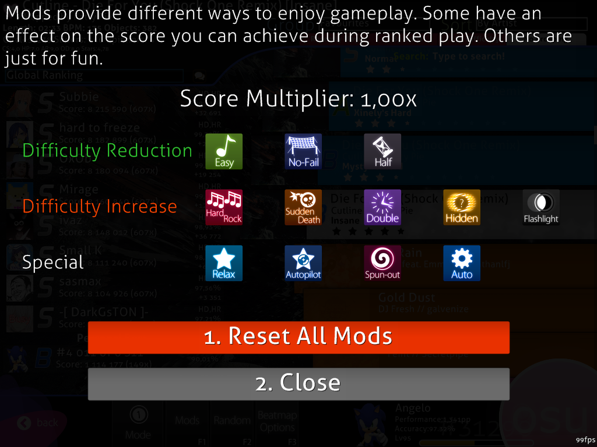
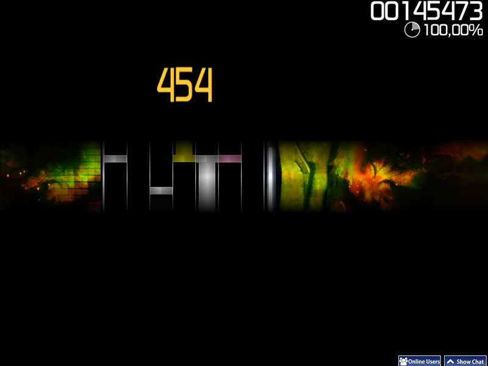
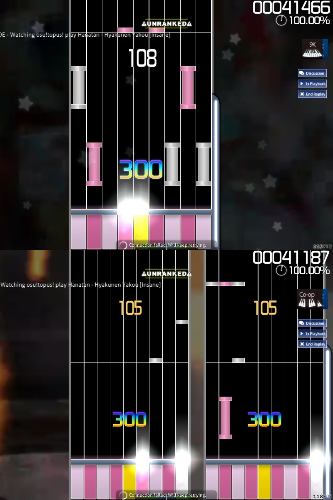
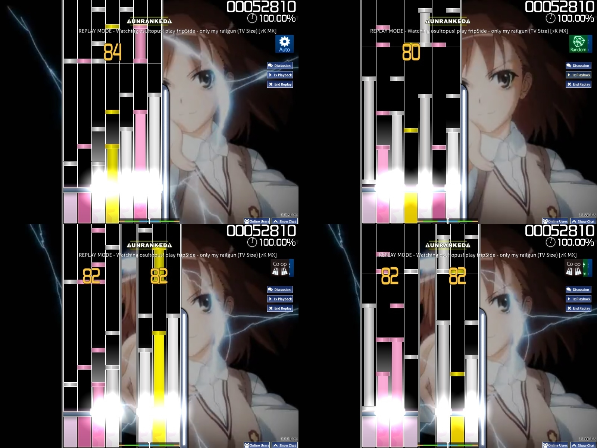
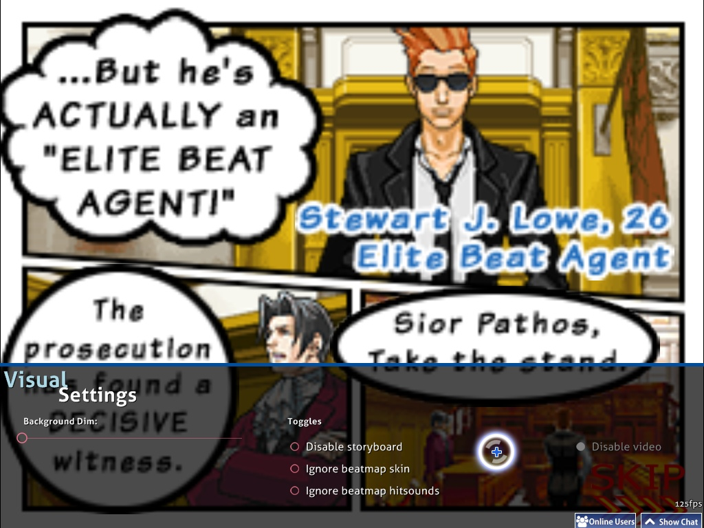

# Game Modifiers

A **game modifier** is one of several optional modifications to gameplay the player can select. Some modifiers (mods) lower difficulty in various ways but assign a score penalty by multiplying the final score with a modifier less than 1.00. Other mods increase difficulty to provide a greater challenge and also reward the player with a modifier greater than 1.00 to the final score. Players who use the Hidden and Flashlight mods also gain the possibility to attain Silver S and Silver SS grades. Finally, some mods can alter the gameplay experience without affecting difficulty (such as the Relax mod, which you just move your mouse to the hit objects).

Game modifiers can be accessed by pressing `F1` at song select, or by clicking the `Mods` button near the lower left of the screen.

Note that when multiple mods are applied, the product of the score multipliers is given instead of the sum of them. For example, when Hidden and Flashlight are applied at the same time, they give 1.1872x because (1.06 x 1.12) = 1.1872, rather than (1.06 + 1.12 - 1.00) = 1.18. osu! used to round this number down to the nearest hundredth (0.01), so Hidden and Flashlight together would appear to give a 1.18x multiplier, denying the supposed number round up. Thankfully, a patch corrected this, and now Hidden + Flashlight rounds correctly to 1.19x.

Difficulty Reduction Mods
-------------------------

These mods make the game easier at the cost of decreasing the score obtained.

### Easy

**Score multiplier**: 0.5

**Description**: Reduces overall difficulty - larger circles, more forgiving HP drain, less accuracy required.

This mod is intended to lessen the difficulty of beatmaps, at a cost to your score. It increases [circle size](/wiki/Beatmap_Editor/Song_Setup/#circle-size-osu-osu-catch-osu-taiko-only) (CS) while decreasing [approach rate](/wiki/Beatmap_Editor/Song_Setup/#approach-rate) (AR), [overall difficulty](/wiki/Beatmap_Editor/Song_Setup/#overall-difficulty) (OD) as well as [HP drain ](/wiki/Beatmap_Editor/Song_Setup/#hp-drain-rate); each of these by a huge amount. It also allows 3 "lives"; that is, when the [life bar](/wiki/Glossary/#life-bar) is exhausted, the game pauses and it refills up to two times. This restart will stop the song temporary to fill up the HP bar and rhythm hint is the "ready" (depends on skin used). In addition, replays do not show the restart or restored HP, and so if a replay is watched where the player had to use a "life", it will appear as though the player continues to play at 0 HP.

However, some (if not most) argue that Easy Mod fails to make maps easier to play. They claim that circles become comically large, and AR becomes ridiculously slower. The mod has the potential of making the play area much more cluttered and harder to read, especially on [insane](/wiki/Difficulties/osu!/Insane) or approved beatmaps. These points are elaborated upon in [Let's talk Easy Mod](https://osu.ppy.sh/forum/viewtopic.php?f=4&t=56606) feature request to improve the mod, by [Lybydose](https://osu.ppy.sh/u/64501).

For [osu!taiko](/wiki/Game_Modes/osu!taiko) mode, the Easy Mode decreases the [slider velocity](/wiki/Glossary/#slider-velocity) (which is, the same as reducing AR in osu! mode), [overall difficulty](/wiki/Beatmap_Editor/Song_Setup/#overall-difficulty) and [HP](/wiki/Beatmap_Editor/Song_Setup/#hp-drain-rate). Note that the amount of hits which are required to finish a spinner is reduced due to the reduction of [overall difficulty](/wiki/Beatmap_Editor/Song_Setup/#overall-difficulty). Unlike [osu!standard](/wiki/Game_Modes/osu!standard) and [osu!catch](/wiki/Game_Modes/osu!catch), the reduced note score requirement to gain HP in [osu!taiko](/wiki/Game_Modes/osu!taiko) makes the HP bar fill up much more faster to replace the 2 revival chance as it is impossible to fail in the middle of the song.

In [osu!catch](/wiki/Game_Modes/osu!catch) mode, the effects are the same as in osu! mode - all fruits fall slower (same as reducing AR in osu! mode), the camera is zoomed in (increased circle size in osu! mode) and 3 lives are granted. Despite only using one axis, however, the fruits' larger size and slower falling rate causes them to clump together, creating the same alleged problems as in normal osu!

 

### No Fail

**Score multiplier**: 0.5

**Description**: You can't fail, no matter what.

This mod makes the player incapable of failing when the [life bar](/wiki/Glossary/#life-bar) hits zero and reduces the amount of possible [Performance Points](/wiki/Performance_Points) by 10%. However, if the player has not scored any points during the map, they will not pass even if No Fail is used. Since this mod allows submitting scores with a very high miss-to-hit ratio, playing many maps with this mod can drastically lower one's [accuracy](/wiki/Accuracy).

In [osu!taiko](/wiki/Game_Modes/osu!taiko) mode, since the gameplay does not end even if the HP bar is zero and only fails the player if their life is too low at the end of the map, this mod allows the player to pass at the end even if the life bar is lower than the required amount to pass.

In [osu!catch](/wiki/Game_Modes/osu!catch) mode, this mod acts exactly the same as in osu!standard.

### Half Time

**Score multiplier**: 0.3 (osu!, osu!taiko, osu!catch), 0.5 (osu!mania)

**Description**: Less zoom("Zoom" meaning here means how fast the beatmap's BPM is)

Half Time slows down the speed of the song and beatmap for easier play. However, the BPM is not decreased to half the original, as the name suggests, but to 75% the original. This causes an increases in the length of the song by 33%. The method used to slow down may cause the song to sound "muddy" but vocals may sound similar.

In [osu!taiko](/wiki/Game_Modes/osu!taiko) mode, all remains mostly the same as in osu!standard, including the slowed music. As a result, the density and approaching rate decreases. However, due to the way spinners are calculated in osu!taiko, this mod makes them to take more hits to clear and, since spinner points are not affected by multiplier, causes them to have a higher total value than without the mod. This leads to the **increase** in maximum possible score when Half Time is switch on for maps with very low combos and many long spinners, and the effect is more significant when Hard Rock mod is turned on simultaneously (which boost the hit required per spinner as well).

In [osu!catch](/wiki/Game_Modes/osu!catch) mode, the BPM is lowered by the same factor as in other modes. This mod also decreases the player character's speed, so many fruits that are ordinary without any mods are turned into hyperdash fruits in Half Time. In addition, the leniency for hyperdashes is increased, making it much easier to stop underneath the next fruit when doing a hyperdash.

Difficulty Increasing Mods
--------------------------

These mods introduce new elements to make the game harder and rewards the player in terms of an increase in score multiplier.

### Hard Rock

**Score multiplier**: 1.06 (osu!, osu!taiko), 1.12 (Catch the Beat), 1.00 (Mania, unranked)

**Description**: Everything just got a bit harder...

Hard Rock (named after the hardest difficulty of the DS game [Elite Beat Agents](/wiki/Glossary/#eba)) decreases hit circle size by 1 tick while increasing the [overall difficulty](/wiki/Beatmap_Editor/Song_Setup/#overall-difficulty), [approach rate](/wiki/Beatmap_Editor/Song_Setup/#approach-rate), and the [HP drain](/wiki/Beatmap_Editor/hp-drain-rate)) by 2 or 3 ticks of their original value up to a maximum of 10. The difference in AR is often hard to notice except when used on maps with an original AR of 7 or greater, as it will push the AR to the maximum value of 10. Hard Rock can be a very difficult mod (especially on insane maps) as it not only demands higher cursor accuracy, it also requires the ability to read lightning-fast approach circles. Additionally, this mod flips the map on the X axis, so that elements that were at the bottom of the map are now at the top and vice versa.

In [osu!taiko](/wiki/Game_Modes/osu!taiko) mode, Hard Rock increases [slider velocity](/wiki/Glossary/#sv) as well as [overall difficulty](/wiki/Beatmap_Editor/Song_Setup/#overall-difficulty). This is the most commonly used mod in osu!taiko due to it being the only difficulty increasing mod that does not require memorization or super-fast hitting on Hard/Insane maps. Note that hit required to finish a spinner is increased due to the increase of [overall difficulty](/wiki/Beatmap_Editor/Song_Setup/#overall-difficulty). Therefore, the maximum possible score of osu!taiko difficulties with Hard Rock on is larger than that of Hidden mod. However, this effect is insignificant in most cases because each hit in spinner gives a score of 300, which is even smaller than a typical score difference between a GREAT hit and a GOOD hit (550 points at 100 combo or above).

In [osu!catch](/wiki/Game_Modes/osu!catch) mode, Hard Rock has a multitude of effects. In addition to making the player character and fruits smaller (Circle size decreased) and increasing how fast they fall (AR increase), this mod can cause ordinary fruits to veer slightly to the left or right of where they were placed on the grid, requiring the player to make more chaotic movements and to use hyperdash. As this mod increases difficulty in a huge way compared to the other two modes, it is worth a 1.12x multiplier in Catch the Beat rather than 1.06x.

In [osu!mania](osu!/wiki/Game_Modes/osu!mania) mode, however, Hard Rock will not affect the note placement. It will only raise the judgement difficulty (OD) and the Approach Rate (AR). For changing the note placement, see "Random" mod under Special. Using this mod on osu!mania will only allow unranked play.

###  Sudden Death

**Description**: Miss a note and fail.

**Sudden Death causes the player to fail the map if the [combo](/wiki/Glossary/#combo) is ever broken, creating an extra large miss figure and a full HP drain.** Combos can be broken by missing notes, slider ticks, or failing a spinner, but will not be broken by missing a slider end (but may result in getting 100). This mod can be useful when trying to full combo a map, although many players dislike using it as it denies them a chance to practice the remainder of the map and get better at it faster.

Do note there are **rare cases** where the **combo is broken** but if the player managed to **preserve at least a sliver of health by getting a slider tick in a very short time-margin right after the combo broke**, the player can continue the map and **no large miss figure will be imposed**.

In [osu!taiko](/wiki/Game_Modes/osu!taiko) mode, depending on whether you are playing using a mouse or keyboard, you may \[1\] instantly fail the beatmap \[keyboard\] or \[2\] unable to pass the beatmap with no HP gain where all HP is drained \[mouse\]. The second case seems to only happen when you managed to hit some notes using mouse before missing a note during play.

In [osu!catch](/wiki/Game_Modes/osu!catch) mode, this mod has the exact same effects as in normal osu! mode, minus the large miss figure.

#### Perfect

Click on Sudden Death again to get Perfect mod.

**Description**: SS or quit.

If you click the Sudden Death mod again, the Perfect mod will come out. When this mod is activated, any imperfect hit will be counted as a **miss** and the song will **restart automatically** - something Sudden Death doesn't do. While this mod gives no score multiplier, it is more unforgiving (100% accuracy or auto reset until you give up) when compared to Sudden Death (as long as the combo did not break).

### Double Time

**Score multiplier**: 1.12 (osu!, osu!taiko) , 1.06 (Catch the Beat).

**Description**: Zoooooooooom

Double Time increases the overall beatmap's speed to 150% of the original, reducing the length of the song by 33%. This might be considered deceptive because the BPM is not actually doubled, despite being called "Double Time". The method used to increase the speed doesn't increase the pitch of the song, but can make it sound "muddy".

Because the song is sped up, the [approach rate](/wiki/Beatmap_Editor/Song_Setup/#approach-rate) also increases, which often makes it quite difficult when paired with Hard Rock.

In [osu!taiko](/wiki/Game_Modes/osu!taiko) mode, the speed is raised and the overall difficulty increased just like in osu!standard. Since the hit leniency is greatly increased on top of osu!taiko's already strict overall difficulty in addition to making slider ticks a lot harder to hit and reducing the value of spinners, Double Time is usually regarded as the hardest mod in osu!taiko, and is seldom used.

In [osu!catch](/wiki/Game_Modes/osu!catch) mode, the speed and approach rate are changed the same as in other modes. However, since Catch the Beat has no overall difficulty to increase, this mod does nothing more than a BPM and approach rate multiplier and is thus only worth a 1.06x multiplier. Being the opposite of Half Time, though, Double Time greatly decreases the hyperdash leniency, making fruits requiring hyperdashes nigh impossible to catch in some cases.

#### Nightcore

Click on Double Time again to activate Nightcore mod

**Description**: uguuuuuuuu

If you click the Double Time icon again, it becomes the Nightcore mod which increases the pitch and adds a drum track to the background that (in 4/4 time) goes in the order of bass drum on beats 1 & 3, clap on beats 2 & 4, and crash on beat 1 every 4 measures. The multiplier stays the same, and the beatmap itself is unaffected beyond what Double Time would do because **Double Time will automatically be activated in order to use Nightcore mod**.

### Hidden

**Score multiplier**: 1.06 (osu!,osu!taiko,osu!catch) , 1.00 (osu!mania)

**Description**(osu!, osu!catch): Play with no approach circles and fading notes for a slight score advantage.
(osu!taiko, osu!mania): The notes fade out before you hit them!

Hidden debuted in Ouendan 2, the second Japanese DS game. In osu!, it eliminates the approach circles and causes the hit circles to fade out shortly after appearing, forcing players to more or less memorize the timing and, to a lesser degree, placement. Numbers on sliders and their approach circles vanish, but the sliders themselves do not, so the player only needs to remember the timing and which end to begin sliding from. Turning on "Snaking Sliders" in the options can help with this.

In [osu!taiko](/wiki/Game_Modes/osu!taiko) mode, the notes fade out about halfway through the screen, requiring that the player remembers their timing and color. However, sliders and spinners still cross the full timeline and do not fade out, except that the spinner has no approach circle to indicate when it times out. On maps with high overall difficulty, Hidden is used by experienced players to increase score instead of Hard Rock, because Hard Rock sometimes makes the timing window much too small.

In [osu!catch](/wiki/Game_Modes/osu!catch) mode, Hidden causes notes to fade out about halfway down the screen. This is the most commonly used mod in Catch the Beat, since the other difficulty increasing mods are very difficult. They either greatly increase approach rate (DT and HR) or require heavy memorization (Flashlight).

In [osu!mania](osu!/wiki/Game_Modes/osu!mania) mode, Hidden can be used by pressing Fade In mod again. It is an inverse of Fade In where the bottom of the conveyor is blocked instead. Your judgement bar will be invisible too, but not the keys.

#### Fade In

**Score multiplier**: 1.00 (osu!mania only)

This mod is specially for osu!mania only. It causes notes to fade in as they approach the judgement bar. The speed at which they fade is based on your combo, with higher combos causing the notes to fade in faster and remain invisible for longer.

Clicking Fade In again will turn on Hidden mod.

For a comparison, see pictures below.

  ") ") 

 

### Flashlight

**Score multiplier**: 1.12 (osu!,osu!taiko,osu!catch) , 1.00 (osu!mania)

**Description**: Restricted view area.

Flashlight reduces the visible area of the screen to a small, illuminated section around the cursor. The visible area becomes smaller at 100 combo and again at 200 combo, returning to its original size if the combo is broken.

In [osu!taiko](/wiki/Game_Modes/osu!taiko), the position of visible area is fixed at the hitting area. The visible area shrinks at the same combo intervals as in osu!standard.
Theoretically, Flashlight does not require memorization for every map, as unlike in the other two modes, all notes are guaranteed to be visible at some point in time. However, except on songs with a very low BPM or low combo, human reaction times generally aren't adequate for such a feat. When paired with Hidden, the flashlight size barely matters, as the notes are completely invisible at any combo, requiring the player to memorize the entire map.

In [osu!catch](/wiki/Game_Modes/osu!catch), the flashlight is the same, except that it follows the character. The visible area is greater than in osu!standard or in osu!taiko, but is still quite a challenge as it disables you entirely from seeing notes on the top or the other side of the screen. When paired with Hidden, fruits are visible momentarily if you are directly under them until you reach 100 combo, at which point they become completely invisible.

In [osu!mania](osu!/wiki/Game_Modes/osu!mania), vision is restricted to a thin horizontal bar in the center of the screen.

   

Special Mods
------------

The mods listed below can't be used in conjunction with each other, except for Relax and Spun Out. Additionally, Auto can't be used along with Sudden Death/Perfect.

### Relax

**Score multiplier**: 0 (Unranked)

**Description**(osu!): "You don't need to click.
Give your clicking/tapping finger a break from the heat of things.
(osu!taiko)Relax! You will no longer get dizzyfied by ninja-like spinners, demanding drumrolls or unexpected katu's.
(osu!catch)Use the mouse to control the catcher.

A mod in which you don't need to click. Simply hover your cursor over each [hit circle](/wiki/Hit_Objects/#hit-circle) and it will be hit with the correct timing automatically. Using this mod also hides the score, combo and misses (except in osu!taiko) and makes it impossible to fail the map, much like No Fail. Also, your spin per minute value will be doubled, allowing you to spin much faster and obtain a higher score than in regular play.

In [osu!taiko](/wiki/Game_Modes/osu!taiko), the correct color for the notes is hit regardless of the color of the button pressed, sliders do not stop you from hitting slider ticks if you hit too fast, and spinners can be cleared with any button sequence instead of alternating blue and red.

In [osu!catch](/wiki/Game_Modes/osu!catch), this mod allows the character to be moved freely at any speed with the mouse.

### Auto Pilot

**Score multiplier**: 0 (Unranked, osu! only)

**Description**: Automatic cursor movement - just follow the rhythm.
UNRANKED

A mod in which you only need to click. The game moves the cursor for you, so you can focus on clicking with the correct timing. Using this mod also hides the score, combo and misses, and makes it impossible to fail the map, much like No Fail.

Auto Pilot is not available for use in [osu!taiko](/wiki/Game_Modes/osu!taiko) or [osu!catch](/wiki/Game_Modes/osu!catch).

### Spun Out

**Score multiplier**: 0.9 (osu! only)

**Description**: Spinners will be automatically completed

Spun Out is a mod in which the game does spinners for you, allowing you to relax during spinners, instead of tiring your arm out on them.

Spun Out is not available for use in [osu!taiko](/wiki/Game_Modes/osu!taiko) or [osu!catch](/wiki/Game_Modes/osu!catch).

### Auto

**Score multiplier**: 1.00(unranked)

**Description**: Watch a perfect automated play through the song

A mod that allows the player to watch a perfect playthrough of the selected beatmap. This mod functions exactly like a [replay](/wiki/replay), allowing 2x speed to be used and comments on the beatmap to be seen and made. The Auto mod will always get an SS, except in special cases.

In [osu!taiko](/wiki/Game_Modes/osu!taiko) mode, the Auto mod will attempt a perfect playthrough. It occasionally misses a tick on sliders that do not start on a whole or half beat and will not always be able to complete spinners on maps with a very high overall difficulty.

In [osu!catch](/wiki/Game_Modes/osu!catch) mode, the Auto mod will actually go beyond perfect and use unlimited speed to catch every fruit in a spinner, despite this being literally impossible for a human player.

#### Cinema

Click on Auto again to get Cinema mod

This mod will show **background and storyboard only** without the gameplay objects. You can use DT/NC/HT, and you can still hear the hitsounds of the respective difficulty selected. User comments and the Results screen are disabled. Background Dim will be set to 0%, Background Video and Storyboard will be turned on when this mod is in effect.

### xK

**Score multiplier**: 0.66~1.00 (osu!mania only)

This mod will force all beatmap difficulties to use the selected K setting, ignoring the supposed K setting of the beatmap's difficulty at the cost of decreasing Score punishment. Using the 1K, 2K and 3K mod causes your score to be unranked.

Score multiplier only applies within this condition: **This table only affects beatmaps converted from osu!standard to osu!mania during play**.

|Default|1k|2k|3k|4k|5k|6k|7k|8k|9k|
|:-:|:-:|:-:|:-:|:-:|:-:|:-:|:-:|:-:|:-:|
|4k|0.78|0.82|0.86|-|0.90|0.90|0.90|0.90|0.90|
|5k|0.74|0.78|0.82|0.86|-|0.90|0.90|0.90|0.90|
|6k|0.70|0.74|0.78|0.82|0.86|-|0.90|0.90|0.90|
|7k|0.66|0.70|0.74|0.78|0.82|0.86|-|0.90|0.90|

**The mod does not work on osu!mania-specific beatmaps!**

### Co-Op

 

**Score multiplier**: 0.70 ~ 1.00 (osu!mania only)

**Description**: Double the key amount, double the fun!

[Introduced in 5th of March, 2015 build](https://osu.ppy.sh/p/changelog?v=b20150305), this mod will introduce a second playfield with second set of control based on current xK count (7K -\> 7K + 7K). For osu!mania specific mode, the xK is split to half (7K -\> 4K + 3K). It is entirely possible to increase the key count to *18 Keys* (9K \[mod\] -\> 9K + 9K, applied to non-specific difficulties only).

A detailed explanation about the second playfield can be found in the [osu!mania page](/wiki/Game_Modes/osu!mania#co-op).

Score multiplier only applies within this condition:

**This table only affects beatmaps converted from osu!standard to osu!mania during play with Co-Op mod on**.

|Default|1k|2k|3k|4k|5k|6k|7k|8k|9k|
|:-:|:-:|:-:|:-:|:-:|:-:|:-:|:-:|:-:|:-:|
|4k|0.82|-|0.90|0.90|0.90|0.90|0.90|0.90|0.90|
|5k|0.78|0.86|0.90|0.90|0.90|0.90|0.90|0.90|0.90|
|6k|0.74|0.82|-|0.90|0.90|0.90|0.90|0.90|0.90|
|7k|0.70|0.78|0.86|0.90|0.90|0.90|0.90|0.90|0.90|

The Co-Op mod gives **no** penalty on osu!mania-specific beatmaps.

### Random

**Score multiplier**: 1.00 (Unranked, osu!mania only)

**Description**: Shuffle around the notes!

This mod will **change the note placement** only. It does not affect the timeline note to hit and is not shuffled every time this mod is used. Take caution prior using the mod as certain note pattern will change to be easier/harder to do, as shown on the picture at the right.

Experimental Mods
=================

**Notice:** These mods may not appear in the "Stable" build due to their experimental nature. Please proceed at your own risk!

Special Mods
------------

### Target Practice

**Score multiplier**: 1.00 (Unranked, osu! only)

Play a simple and consistent "Target Practice" game. The game will immediately end if you failed to hit the target once.

Others
======

Inverse Mods
------------

Not all mods can be applied at the same time. Some mods are the inverse of others, and will be deactivated if their inverse mod is selected.

These are a few notable examples:-

-   Hard Rock is the inverse of Easy
-   Sudden Death/Perfect is the inverse of No Fail, Relax, AutoPilot, and Auto
-   Double Time is the inverse of Half Time

Unranked Mods
-------------

All of the special mods (except Spun Out) will cause any plays with them activated to be unranked and ineligible for addition to ranked or online stats. However, exporting a replay of one of these scores and loading it up into your game will cause them to appear on your local scoreboard.

In [Multi-play](/wiki/Multi), Tag Co-Op and Tag Team VS are under this category because it was not done by the skill of a player but as a whole group of players cooperation. Despite it is an unranked mod, player will still get a increase in total score by their own individual score rather than their group/team score.

Removed Mods
------------

These mods were used some time ago, but are now resting here in peace.

### 10K

This mod used to enable the player to use 10 keys. (Though, you could still use 5K + COOP to achieve 10 Keys)

### Fade Out

This mod was similar to Hidden but was strictly for [osu!mania](/wiki/Game_Modes/osu!mania). When enabled, this mod will place a curtain at the bottom of the stage (or top, if upsidedown stage is enabled), fading the notes out when before they reach the keys. This mod's functionality truly wasn't removed, but rather, it was called "Hidden," using the Hidden mod icon.

### No Video

This mod does exactly what you might expect it to do, disable the video, if any. This mod's function was moved to Visual Settings and the icon is no longer being used.

## Trivia
- [Nightcore was originated from an April Fools joke.](https://osu.ppy.sh/forum/t/49733)
-  Flashlight nearly ran out of batteries!

 5 years ago, this mod had been subject to heavy controversy in the past, as its implementation makes it the easiest mod for hackers to cheat on. It was made unranked before during a time of heavy cheater activity, but was restored not long after. \\:D/
 If you want to know more, refer to these two threads:

--   [Flashlight is back!](http://osu.ppy.sh/forum/viewtopic.php?f=9&t=41519)

--   [Flashlight mod disabled #2](http://osu.ppy.sh/forum/viewtopic.php?f=9&t=41039)

### How to find Visual Settings

-   Visual Settings is below the screen, a few seconds before the beatmap starts. Having it open delays the beatmap from starting until your mouse pointer leaves it.
    -   You can pause the game to open Visual Settings (Does not work on [Multi](/wiki/Multi)).

Usages
------

|**Name**|**Effect**|**Notes**|
|:---:|:---:|:---:|
| Background Dim	| Darken the playfield. |	During breaks, the dim is -30% of the rate you set. No special effects at 100% dim. Also darkens Storyboard elements at 100% dim. |
| Disable Storyboard | Remove any elements of storyboarding, if any. Does not affect Kiai Time and Background Video. |	In maps with an epilepsy warning, this is recommended for affected people. |
| Ignore Skin |	Don't allow the beatmap's custom skin, if any, to override the player's current skin. The player's selected skin will be used. | Requires a retry to take effect. |
| Ignore Hitsound | Don't use the beatmap's custom hitsounds, if any. The player's selected skin's hitsounds will be used. |	Requires a retry to take effect.|
| Disable Video |	Doesn't play the video, if any. This does not remove the storyboard. This is disabled by default, if there isn't a video to play. | Requires a retry if activated after the song starts.
