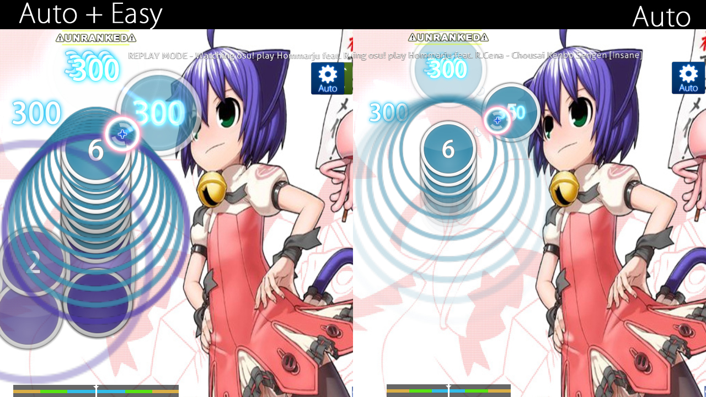
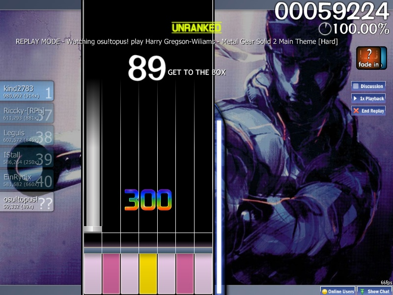
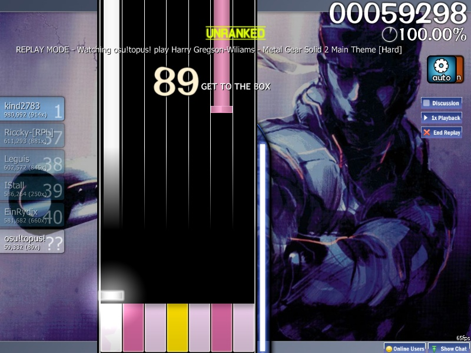
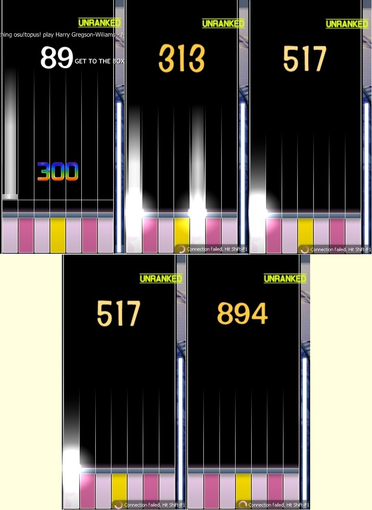

A **game modifier** is one of several optional modifications to gameplay the player can select. Some modifiers (mods) lower difficulty in various ways but assign a score penalty by multiplying the final score with a modifier less than 1.00. Other mods increase difficulty to provide a greater challenge and also reward the player with a modifier greater than 1.00 to the final score. Players who use the Hidden and Flashlight mods also gain the possibility to attain Silver S and Silver SS grades. Finally, some mods can alter the gameplay experience without affecting difficulty (such as the Relax mod, which you just move your mouse to the hit objects).

Game modifiers can be accessed by pressing "**F1**" at song select, or by clicking the "**Mods**" button near the lower left of the screen.

Note that when multiple mods are applied, the product of the score multipliers is given instead of the sum of them. For example, when Hidden and Flashlight are applied at the same time, they give 1.1872x because (1.06 x 1.12) = 1.1872, rather than (1.06 + 1.12 - 1.00) = 1.18. osu! used to round this number down to the nearest hundredth (0.01), so Hidden and Flashlight together would appear to give a 1.18x multiplier, denying the supposed number round up. Thankfully, a patch corrected this, and now Hidden + Flashlight rounds correctly to 1.19x. 

Difficulty Reduction Mods
-------------------------

Queste mod rendono la partita più facile, al costo di un abbassamento del punteggio però.

###  Easy

***Moltiplicatore punteggio: 0.5***

***"Riduce la difficoltà generale della Beatmap - cerchi più larghi, assorbimento degli HP minore, viene richiesta meno precisione."***

Questa mod è stata pensata per ridurre la difficoltà delle Beatmap, al costo di metà del tuo punteggio. Aumenta la [Dimensione dei cerchi](IT:Dimensione_dei_cerchi "wikilink"), mentre diminuisce il [Rateo di avvicinamento delle note](IT:Rateo_di_avvicinamento_delle_note "wikilink") (AR), la [Difficoltà generale](IT:Difficoltà_generale "wikilink") come anche l'[Assorbimento HP](IT:Assorbimento_HP "wikilink"); tutte vengono diminuite considerevolmente. Ti fornisce anche 3 vite; in pratica, quando la [Barra HP](IT:Barra_HP "wikilink") si svuota, il gioco fa una pausa e la barra si riempirà altre 2 volte. Questa ripartenza fermerà temporaneamente la canzone affinchè la barra HP si possa riempire ed un segnale "Ready" (dipende dalla skin) verrà disposto prima della ripartenza. Inoltre, nei replay non ci saranno le ripartenze nè il riempimento della barra HP, quindi se un giocatore lo guardasse non vedrebbe l'utilizzo della di una delle vite. Sarà come se il giocatore vontinuasse a giocare con la barra HP a zero.

Però, alcuni giocatori (se non molti) ribattono come la mod Easy fallisca nel suo intento di rendere la partita più facile. Fanno notare che la dimensione dei cerchi diventa esageratamente grande e l'AR diventa ridicolosamente lento. La mod è anche in grado di far diventare il campo da gioco un agglomerato di note difficili da leggere, specialmente nelle [Insane](IT:Insane "wikilink") o nelle Beaatmap "Approved". Questi aspetti vengono analizzati in [questo](http://osu.ppy.sh/forum/viewtopic.php?f=4&t=56606) topic di Lybydose.

Per la modalità [Taiko](IT:Taiko "wikilink"), la mod Easy riduce la [Velocità degli slider](IT:Velocità_degli_slider "wikilink") (che è uguale alla riduzione dell'AR per la modalità osu!), [La difficoltà generale](IT:La_difficoltà_generale "wikilink") e l'[Assorbimento HP](IT:Assorbimento_HP "wikilink"). Ricordarsi che le note necesarie per uno spinnervengono diminuite a causa della riduzione della [Difficoltà generale](IT:Difficoltà_generale "wikilink"). A differenza delle modalità [Standard](IT:Standard "wikilink") e [Catch The Beat](IT:Catch_The_Beat "wikilink"), il ridotto numero di note necessario per mantenre HP nella barra verrà tradotto con un aumento più veloce di tale barra in [Taiko](IT:Taiko "wikilink"), in modo da sostituire equamente le 2 vite che vengono assegnate nelle altre modalità, siccome non si può fallire durante la canzone.

Nella modalità [Catch The Beat](IT:Catch_The_Beat "wikilink"), gli effetti sono gli stessi della modalità osu! - tutti i frutti cadranno più lentamente (che è uguale alla riduzione dell'AR per la modalità osu!), la telecamera sarà più vicina al campo da gioco (aumento delle dimensioni dei cerchi per la modalità osu!) e sono garantite 3 vite. Nonstante questa modalità utilizzi un solo asse per il gioco, l'aumento delle dimensioni dei frutti e la diminuzione della loro discesa provocano lo stesso effetto agglutinato che si verifica nella modallità osu!

 

###  No Fail

***Score multiplier: 0.5***

***"You can't fail, no matter what."***

This mod makes the player incapable of failing when the [life bar](IT:Life_bar "wikilink") hits zero. However, if the player has not scored any points during the map, they will not pass even if No Fail is used. Since this mod allows submitting scores with a very high miss-to-hit ratio, playing many maps with this mod can drastically lower one's [Accuracy](IT:Accuracy "wikilink").

In [Taiko](IT:Taiko "wikilink") mode, since the gameplay does not end even if the HP bar is zero and only fails the player if their life is too low at the end of the map, this mod allows the player to pass at the end even if the life bar is lower than the required amount to pass.

In [Catch the Beat](IT:Catch_the_Beat "wikilink") mode, this mod acts exactly the same as in standard osu!.

###  Half Time

***Score multiplier: 0.3***

***"Less zoom"*** ("Zoom" meaning here means how fast the beatmap's BPM is)

Half Time slows down the speed of the song and beatmap for easier play. However, the BPM is not decreased to half the original, as the name suggests, but to 75% the original. This causes an increases in the length of the song by 25%. The method used to slow down may cause the song to sound "muddy" but vocals may sound similar.

In [Taiko](IT:Taiko "wikilink") mode, all remains mostly the same as in standard osu!, including the slowed music. As a result, the density and approaching rate decreases. However, due to the way spinners are calculated in Taiko, this mod makes them to take more hits to clear and, since spinner points are not affected by multiplier, causes them to have a higher total value than without the mod. This leads to the **increase** in maximum possible score when Half Time is switch on for maps with very low combos and many long spinners, and the effect is more significant when Hard Rock mod is turned on simultaneously (which boost the hit required per spinner as well).

In [Catch the Beat](IT:Catch_the_Beat "wikilink") mode, the BPM is lowered by the same factor as in other modes. This mod also decreases the player character's speed, so many fruits that are ordinary without any mods are turned into hyperdash fruits in Half Time. In addition, the leniency for hyperdashes is increased, making it much easier to stop underneath the next fruit when doing a hyperdash.

Difficulty Increasing Mods
--------------------------

These mods introduce new elements to make the game harder and rewards the player in terms of an increase in score multiplier.

###  Hard Rock

***Score multiplier: 1.06 (osu!, Taiko) , 1.12 (Catch the Beat)***

***"Everything just got a bit harder..."***

Hard Rock (named after the hardest difficulty of the DS game [Elite Beat Agents](IT:Elite_Beat_Agents "wikilink")) decreases hit circle size by 1 tick while increasing the [Overall difficulty](IT:Overall_difficulty "wikilink"), [Approach rate](IT:Approach_rate "wikilink"), and the [HP drain](IT:HP_drain "wikilink") by 2 or 3 ticks of their original value up to a maximum of 10. The difference in AR is often hard to notice except when used on maps with an original AR of 7 or greater, as it will push the AR to the maximum value of 10. Hard Rock can be a very difficult mod (especially on insane maps) as it not only demands higher cursor accuracy, it also requires the ability to read lightning-fast approach circles. Additionally, this mod flips the map on the X axis, so that elements that were at the bottom of the map are now at the top and vice versa.

In [Taiko](IT:Taiko "wikilink") mode, Hard Rock increases [Slider velocity](IT:Slider_velocity "wikilink") as well as [Overall difficulty](IT:Overall_difficulty "wikilink"). This is the most commonly used mod in Taiko due to it being the only difficulty increasing mod that does not require memorization or super-fast hitting on Hard/Insane maps. Note that hit required to finish a spinner is increased due to the increase of [Overall difficulty](IT:Overall_difficulty "wikilink"). Therefore, the maximum possible score of Taiko difficulties with Hard Rock on is larger than that of Hidden mod. However, this effect is insignificant in most cases because each hit in spinner gives a score of 300, which is even smaller than a typical score difference between a GREAT hit and a GOOD hit (550 points at 100 combo or above).

In [Catch the Beat](IT:Catch_the_Beat "wikilink") mode, Hard Rock has a multitude of effects. In addition to making the player character and fruits smaller (Circle size decreased) and increasing how fast they fall (AR increase), this mod can cause ordinary fruits to veer slightly to the left or right of where they were placed on the grid, requiring the player to make more chaotic movements and to use hyperdash. As this mod increases difficulty in a huge way compared to the other two modes, it is worth a 1.12x multiplier in Catch the Beat rather than 1.06x.

In [Osu!mania](IT:Osu!mania "wikilink") mode, however, Hard Rock will not affect the note placement. It will only raise the judgement difficulty (OD) and the Approach Rate (AR). For changing the note placement, see "Random" mod under Special.

###  Sudden Death

***"Miss a note and fail."***

**Sudden Death causes the player to fail the map if the [Combo](IT:Combo "wikilink") is ever broken, creating an extra large miss figure and a full HP drain.** Combos can be broken by missing notes, slider ticks, or failing a spinner, but will not be broken by missing a slider end (but may result in getting 100). This mod can be useful when trying to full combo a map, although many players dislike using it as it denies them a chance to practice the remainder of the map and get better at it faster.

Do note there are **rare cases** where the **combo is broken** but if the player managed to **preserve at least a silver of health by getting a slider tick in a very short time-margin right after the combo broke**, the player can continue the map and **no large miss figure will be imposed**.

In [Taiko](IT:Taiko "wikilink") mode, depending on whether you are playing using a mouse or keyboard, you may \[1\] instantly fail the beatmap \[keyboard\] or \[2\] unable to pass the beatmap with no HP gain where all HP is drained \[mouse\]. The second case seems to only happen when you managed to hit some notes using mouse before missing a note during play.

In [Catch the Beat](IT:Catch_the_Beat "wikilink") mode, this mod has the exact same effects as in normal osu! mode, minus the large miss figure.

####  Perfect

***Click on Sudden Death again to get Perfect mod***

***"SS or quit."***

If you click the Sudden Death mod, the Perfect mod will come out. When this mod is activated, any hit that **decrease** the accuracy will be counted as a **miss** and the song will **restart automatically**. While this mod give no score multiplier, it is more unforgiving (100% accuracy or auto reset until you give up) when compared to Sudden Death (as long as the combo did not break).

###  Double Time

***Score multiplier: 1.12 (osu!, Taiko) , 1.06 (Catch the Beat)***

***"Zoooooooooom"***

Double Time increases the overall beatmap's speed to 150% of the original, reducing the length of the song by 33%. This might be considered deceptive because the BPM is not strictly doubled, despite being called "Double Time". The method used to increase the speed doesn't increase the pitch of vocals (making them allegedly sound like chipmunks) but can make the song sound "muddy".

Because the song is sped up, the [Approach rate](IT:Approach_rate "wikilink") also increases, which often makes it quite difficult when paired with Hard Rock.

In [Taiko](IT:Taiko "wikilink") mode, the speed is raised and the overall difficulty increased just like in osu! mode. Since the hit leniency is greatly increased on top of Taiko's already strict overall difficulty in addition to making slider ticks a lot harder to hit and reducing the value of spinners, Double Time is usually regarded as the hardest mod in Taiko, and is seldom used.

In [Catch the Beat](IT:Catch_the_Beat "wikilink") mode, the speed and approach rate are changed the same as in other modes. However, since Catch the Beat has no overall difficulty to increase, this mod does nothing more than a BPM and approach rate multiplier and is thus only worth a 1.06x multiplier. Being the opposite of Half Time, though, Double Time greatly decreases the hyperdash leniency, making fruits requiring hyperdashes nigh impossible to catch in some cases.

####  Nightcore

***Click on Double Time again to get Nightcore mod***

***"uguuuuuuuu"***

If you click and drag the Double Time icon, it becomes the Nightcore mod which increases the pitch and adds a steady bass beat to the background. The multiplier stays the same, and the beatmap itself is unaffected beyond what Double Time would do because <u>**Double Time will automatically be activated in order to use Nightcore mod**.</u>

[This mod was originated from an April Fool joke.](https://osu.ppy.sh/forum/t/49733)

###  Hidden

***Score multiplier: 1.06*** (osu!,Taiko,CtB) , ***1.00*** (osu!mania)

***"Play with no approach circles and fading notes for a slight score advantage."***

Hidden debuted in Ouendan 2, the second Japanese DS game. In osu!, it eliminates the approach circles and causing the hit circles to vanish shortly after appearing, forcing players to more or less memorize the timing and, to a lesser degree, placement. Numbers on sliders and their approach circles vanish, but the sliders themselves do not, so the player only need remember the timing and which end to click.

In [Taiko](IT:Taiko "wikilink") mode, the notes fade out about halfway through the screen, requiring that the player not only memorize their timing and placement but their color too. However, sliders and spinners still cross the full timeline and remain visible, except that the spinner has no spinner circle to indicate when it times out. On maps with high overall difficulty, Hidden is used by experienced players to increase score instead of Hard Rock.

In [Catch the Beat](IT:Catch_the_Beat "wikilink") mode, Hidden causes notes to disappear halfway down the screen. This is the most commonly used mod in Catch the Beat, since the other difficulty increasing mods either greatly increase approach rate (DT and HR) or require heavy memorization (Flashlight).

In [Osu!mania](IT:Osu!mania "wikilink") mode, Hidden can be used upon pressing Fade In mod again. It is an inverse of Fade In where the below of the conveyor is blocked instead. Your Judgement bar will be blocked too but not your colourful keys.

####  Fade In

***Score multiplier: 1.00*** (osu!mania only)

This mod is specially for osu!mania only. It hides about 1/4 vision dead above the conveyor. The darkness will spread until the 500th combo count where 3/4 of the conveyor will be blocked until you break the combo streak. At 300th combo count, it is 1/2 of the conveyor.

Clicking Fade In again with summon Hidden mod. (Inverse of Fade In)

For a comparison, see pictures below.

  ") ")

 

###  Flashlight

***Score multiplier: 1.12*** (osu!,Taiko,CtB) ,*'* 1.00 ***(osu!mania)***

***"Restricted view area."***

Flashlight reduces the visible area of the screen to a small, illuminated section around the cursor. The visible area becomes smaller at 100 combo and again at 200 combo, returning to its original size if the combo is broken. This mod has been subject to heavy controversy in the past, as its implementation makes it the easiest mod for hackers to cheat on. This mod has been made unranked before during a time of heavy cheater activity, but was restored not long after.

In [Taiko](IT:Taiko "wikilink") mode, the position of visible area is fixed at the hitting area. The visible area shrinks at the same combo intervals as in standard osu!. Theoretically, Flashlight does not require memorization for every map, as unlike in the other two modes, all notes are guaranteed to be visible at some point in time. However, except on songs with a very low BPM or low combo, human reaction times generally aren't adequate for such a feat. When paired with Hidden, the flashlight size barely matters, as the notes are completely invisible at any combo.

In [Catch the Beat](IT:Catch_the_Beat "wikilink") mode, the flashlight is the same, except that it follows the character. The visible area is greater than in standard osu! or in Taiko, but is still quite a challenge as it disables you entirely from seeing notes on the top or the other side of the screen. When paired with Hidden, fruits are visible momentarily if you are directly under them until you reach 100 combo, at which point they become completely invisible.

<File:flashlightosu.jpg%7CFlashlight> mod in Standard. <File:flashlighttaiko.jpg%7CFlashlight> mod in Taiko. <File:flashlightctb.jpg%7CFlashlight> mod in Catch the Beat. <File:Flashlight> Mania.jpg|Flashlight mod in osu!mania

-   \[<http://osu.ppy.sh/forum/viewtopic.php?f=9&t=41519>| A forum thread regarding flashlight cheating\]
-   \[<http://osu.ppy.sh/forum/viewtopic.php?f=9&t=41039>| Another such thread\]

Special Mods
------------

The mods listed below can't be used in conjunction with each other, except for Relax and Spun Out. Additionally, Auto can't be used along with Sudden Death/Perfect.

###  Relax

***Score multiplier: 0 (Unranked)***

***<osu!> "You don't need to click.
Give your clicking/tapping finger a break from the heat of things.
\*\*UNRANKED\*\*"***

***<Taiko>"Relax! You will no longer get dizzyfied by ninja-like spinners, demanding drumrolls or unexpected katu's.
\*\*UNRANKED\*\*"***

***<CtB>"Use the mouse to control the catcher.
\*\*UNRANKED\*\*"***

A mod in which you don't need to click. Simply hover your cursor over each [hit circle](IT:Hit_Objects#Hit_Circle "wikilink") and it will be hit with the correct timing automatically. Using this mod also hides the score, combo and misses (except in Taiko) and makes it impossible to fail the map, much like No Fail. Also, your spin/min value will be in x2 value, in which completing certain spinners becomes slightly easier.

In [Taiko](IT:Taiko "wikilink") mode, the correct color for the notes is hit regardless of the button pressed, sliders do not stop you from hitting slider ticks if you hit too fast, and spinners can be cleared with any button sequence instead of alternating blue and red.

In [Catch the Beat](IT:Catch_the_Beat "wikilink") mode, this mod allows the character to be moved freely at any speed with the mouse.

###  Auto Pilot

***Score multiplier: 0 (Unranked, osu! only)***

***"Automatic cursor movement - just follow the rhythm.
\*\*UNRANKED\*\*"***

A mod in which you only need to click. The game moves the cursor for you so you can focus on clicking with the correct timing. Using this mod also hides the score, combo and misses, and makes it impossible to fail the map, much like No Fail.

Auto Pilot is not available for use in [Taiko](IT:Taiko "wikilink") or [Catch the Beat](IT:Catch_the_Beat "wikilink") modes.

###  Spun Out

***Score multiplier: 0.9 (osu! only)***

***"Spinners will be automatically completed"***

Spun Out is a mod in which the game does spinners for you, allowing you to relax instead of tire your arm out spinning while playing the map.

Spun Out is not available for use in [Taiko](IT:Taiko "wikilink") or [Catch the Beat](IT:Catch_the_Beat "wikilink") modes.

###  Auto

***"Watch a perfect automated play through the song"***

A mod that allows the player to watch a perfect playthrough of the selected beatmap. This mod functions exactly like a [Replay](IT:Replay "wikilink"), allowing 2x speed to be used and comments on the beatmap to be seen and made. The Auto mod will always get an SS, except in special cases. These cases are all noted as unrankable designs and with the exception of ninja [Spinners](IT:Spinners "wikilink") in some old maps, will never occur in current ranked beatmaps.

In [Taiko](IT:Taiko "wikilink") mode, the Auto mod will do a perfect playthrough, except that occasionally it will miss a tick on sliders that do not start on a whole or half beat and will not always be able to complete spinners on maps with high overall difficulty.

In [Catch the Beat](IT:Catch_the_Beat "wikilink") mode, the Auto mod will actually go beyond perfect and use unlimited speed to catch every fruit in a spinner, despite this being literally impossible for a player.

####  Cinema

***Click on Auto again to get Cinema mod***

This mod will show **background and storyboard only** without the hitcircles. You can use DT/NC/HT and can hear the hitsounds of the respective difficulty selected. However, you cannot *pause* and will only play "pass" storyboard only. User comments and Results screen are disabled by default. Background Dim will be auto-set to 0%, Background Video and Storyboard will be allowed temporary when this mod is in effect.

### xK

***Score multiplier: 0.78~1.0 (osu!mania only)***

This mod will force all beatmap difficulties to use the selected K setting, ignoring the supposed K setting of the beatmap's difficulty at the cost of decreasing Score punishment.

Score multiplier only applies within this condition: **This table only affects beatmaps converted from Standard to osu!mania during play**.

**The mod does not work on osu!mania-specific beatmaps.**

###  Co-Op

 

***Score multiplier: 0.70 ~ 1.00 (osu!mania only)***

[Introduced in 5th of March, 2015 build](http://osu.ppy.sh/p/changelog?v=b20150305), this mod will introduce a second playfield with second set of control based on current xK count (7K -&gt; 7K + 7K). For osu!mania specific mode, the xK is split to half (7K -&gt; 4K + 3K). It is entirely possible to increase the key count to *18 Keys* (9K \[mod\] -&gt; 9K + 9K, applied to non-specific difficulties only).

[A detailed explanation about the second playfield can be found in the osu!mania page.](IT:Osu!mania#Co-Op "wikilink")

Score multiplier only applies within this condition:

<table style="width:32%;">
<colgroup>
<col width="5%" />
<col width="3%" />
<col width="3%" />
<col width="3%" />
<col width="3%" />
<col width="3%" />
<col width="3%" />
<col width="3%" />
<col width="3%" />
<col width="3%" />
</colgroup>
<thead>
<tr class="header">
<th>
Default
</th>
<th>
1K
</th>
<th>
2K
</th>
<th>
3K
</th>
<th>
4K
</th>
<th>
5K
</th>
<th>
6K
</th>
<th>
7K
</th>
<th>
8K
</th>
<th>
9K
</th>
</tr>
</thead>
<tbody>
<tr class="odd">
<td>
4K
</td>
<td>
0.82
</td>
<td>
-
</td>
<td>
0.90
</td>
<td>
0.90
</td>
<td>
0.90
</td>
<td>
0.90
</td>
<td>
0.90
</td>
<td>
0.90
</td>
<td>
0.90
</td>
</tr>
<tr class="even">
<td>
5K
</td>
<td>
0.78
</td>
<td>
0.86
</td>
<td>
0.90
</td>
<td>
0.90
</td>
<td>
0.90
</td>
<td>
0.90
</td>
<td>
0.90
</td>
<td>
0.90
</td>
<td>
0.90
</td>
</tr>
<tr class="odd">
<td>
6K
</td>
<td>
0.74
</td>
<td>
0.82
</td>
<td>
-
</td>
<td>
0.90
</td>
<td>
0.90
</td>
<td>
0.90
</td>
<td>
0.90
</td>
<td>
0.90
</td>
<td>
0.90
</td>
</tr>
<tr class="even">
<td>
7K
</td>
<td>
0.70
</td>
<td>
0.78
</td>
<td>
0.86
</td>
<td>
0.90
</td>
<td>
0.90
</td>
<td>
0.90
</td>
<td>
0.90
</td>
<td>
0.90
</td>
<td>
0.90
</td>
</tr>
</tbody>
</table>

**This table only affects beatmaps converted from Standard to osu!mania during play with Co-Op mod on**.

**The Co-Op mod gives NO penalty on osu!mania-specific beatmaps.**

###  Random

***Score multiplier: 0 (Unranked, osu!mania only)***

This mod will **change the note placement** only. It does not affect the timeline note to hit and is not shuffled every time this mod is used. Take caution prior using the mod as certain note pattern will change to be easier/harder to do, as shown on the picture at the right.

Inverse Mods
------------

Not all mods can be applied at the same time. Some mods are the inverse of others, and will be deactivated if their inverse mod is selected.

These are a few notable examples:-

-   Hard Rock is the inverse of Easy
-   Sudden Death/Perfect is the inverse of No Fail and any unranked mods.
    -   Unranked mods: Relax, Auto-Pilot, Auto.
-   Double Time is the inverse of Half Time

Unranked Mods
-------------

All of the special mods (except Spun Out) will cause any plays with them activated to be unranked and ineligible for addition to ranked or online stats. However, exporting a replay of one of these scores and loading it up into your game will cause them to appear on your local scoreboard.

In [Multi-play](IT:Multiplayer "wikilink"), Tag Co-Op and Tag Team VS are under this category because it was not done by the skill of a player but as a whole group of players cooperation. Despite it is an unranked mod, player will still get a increase in total score by their own individual score rather than their group/team score.

Visual Settings
---------------

### How to find Visual Settings

-   Below the screen, few seconds before the beatmap starts. Having it open delays the beatmap from starting until you leave the coverage area.
    -   You can pause the game to call the Visual Settings (Does not work on [Multi](IT:Multi "wikilink")).

### Usages

<table style="width:60%;">
<colgroup>
<col width="12%" />
<col width="24%" />
<col width="24%" />
</colgroup>
<thead>
<tr class="header">
<th align="center">
Name
</th>
<th align="center">
Effect
</th>
<th align="center">
Notes
</th>
</tr>
</thead>
<tbody>
<tr class="odd">
<td align="center">
Background Dim
</td>
<td align="center">
Darken the playfield.
</td>
<td align="center">
During breaks, the dim is -30% of the rate you set. No special effects at 100% dim. Also darkens Storyboard elements at 100% dim.
</td>
</tr>
<tr class="even">
<td align="center">
Disable Storyboard
</td>
<td align="center">
Remove any elements of storyboarding. Does not affect Kial Time and Background Video.
</td>
<td align="center">
If <strong>epilepsy warning is issued, this toggle can be used at start.</strong>
</td>
</tr>
<tr class="odd">
<td align="center">
Ignore Skin
</td>
<td align="center">
Remove beatmap's custom skin. 
Own selected skin will be used.
</td>
<td align="center">
Requires a retry to take effect.
</td>
</tr>
<tr class="even">
<td align="center">
Ignore Hitsound
</td>
<td align="center">
Remove beatmap's custom hitsound. 
Own selected skin's hitsound will be used.
</td>
<td align="center">
Requires a retry to take effect.
</td>
</tr>
<tr class="odd">
<td align="center">
Disable Video
</td>
<td align="center">
Negates video file from playing with the beatmap difficulty. This does not negate the storyboard. Does not work on beatmaps without video files.
</td>
<td align="center">
No Video mod migrated to here. Requires restart if activated after the song is being played.
</td>
</tr>
</tbody>
</table>
