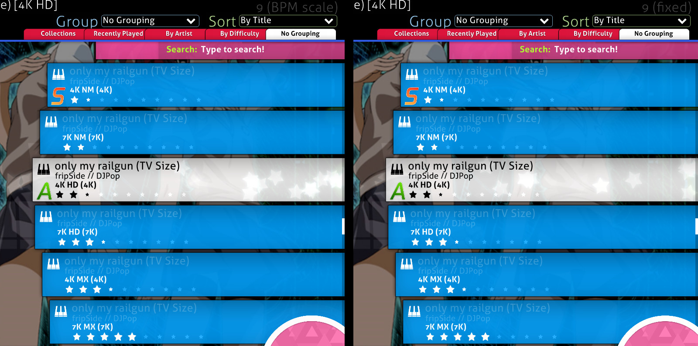
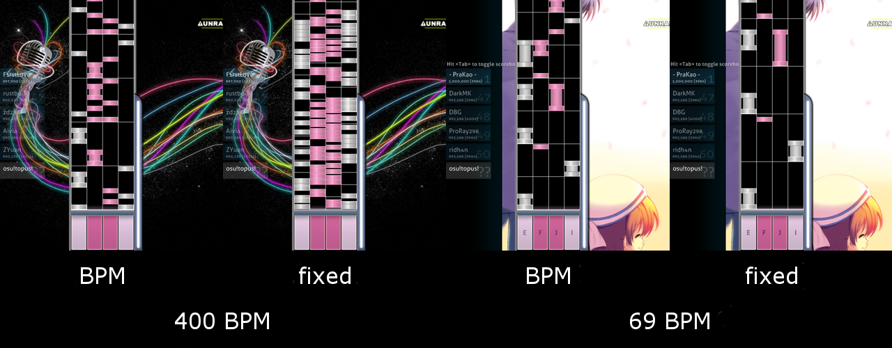
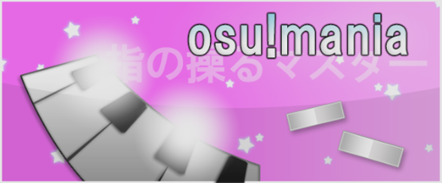

# osu!mania

The mode has been widely used in almost all of the major rhythm games. It requires good hand and/or leg coordination where the notes (with their quantity depending on BPM and difficulty) move on a conveyor. The player will have to press the correct key for that specific note in time. Though the game mode was originally made as an imitation of the *Beatmania* style of playing, osu!mania allows changing the number of keys or vertically flipping the orientation of the playfield (this means that it can be made to look more like *Guitar Hero* \[5 keys\] or *Dance Dance Revolution* \[4 keys\] and so on).

It is somewhat similar to [osu!taiko](/wiki/Game_mode/osu!taiko), but with more buttons and notes moving vertically rather than moving horizontally.

##  Gameplay explanation

### Song Selection

To access the osu!mania game mode, press `Ctrl`+`4`.

Alternatively, click on the `Mode` button and select `osu!mania`.

#### Keys and Judgement

In the song selection screen, the number next to the *K* shows how many keys will be used for the play. The beatmap will be played with looser judgement if "↓" symbol was appended at the end of *K*.

For example, *4K↓* means that it will be played with four(4) keys with a looser judgement timing than usual.

Do note that the judgement of a beatmap is determined automatically.

#### osu!specific beatmaps and conversion from osu! beatmap difference

When converting a non-specific beatmap, the default key range would be around 4 to 7 keys.

With the [xK](/wiki/Gameplay/Game_modifier/xK) game modifier, the player can manually set the number of keys from 1 to a total of 9 keys with a score multiplier reduction. However, the game modifier will not work with osu!mania-specific beatmaps.

With the [Co-Op](/wiki/Gameplay/Game_modifier/Co-op) game modifier, the stage will be split in two, use Co-Op's control scheme, and will allows the player to play from 2 to a total of 18 keys with a score multiplier reduction. Do note that while the preset number of keys will not be doubled on osu!mania-specific beatmaps, it will split the stage in two (left stage priority if odd-numbered), use Co-Op's control scheme, and no score multiplier reduction.

#### Speed Change

**Scrolling speed of the beat notes** can be changed by pressing `Ctrl` (or `Shift`) with `+` (faster) / `-` (slower).

The lowest limit is 1 and the highest limit is 40.

##### BPM scaling and Fixed scroll speed

**BPM scaling** is the current default old scaling system which scale the scroll speed relative to the current BPM played. There will be a difference in scroll speed when playing a 100BPM (scrolls slower) and 200BPM (scrolls faster) beatmap with the same scaling speed.

**Fixed** scroll speed is the new system that enforce a constant scroll speed along with the current BPM speed. [A very simple introduction post by Blazier in 29 October 2014 (2014-10-29) about the fixed scaling](https://osu.ppy.sh/community/forums/topics/254145).

Do note that both scaling system will still be affected by speed up/down by BPM changes, with the changes ranging from drastic (usually for BPM scaling to higher BPM with speedy notes; very low BPM for fixed scaling with condensed notes) to minor (usually fixed scaling on most BPM spectrum) depending on Speed Change settings used.

### Gameplay

#### Playfield

By default, the flow of the notes falls from top to bottom of the conveyor (the starting arrow will show where notes will flow to), with the key control at the bottom and the judgement line above the key control. To change the flow of the playfield from bottom-to-top instead, it can be changed in the `Options` sidebar; click on `osu!mania layout` button to set osu!mania keys settings and enable `Vertically flip playfield (DDR style)` for this key setting manually.

Health bar is located at the right side of the conveyor belt. Please note that health drain is disabled in osu!mania, so only the hit objects will affect the health bar. Combo will not break when playing the keys on empty judgement line.

**Scrolling speed of the beat notes** can be changed by pressing `Ctrl` (or `Shift`) with `+` (faster) / `-` (slower) or just `F3` (faster) / `F4` (slower).

#### Notes

Notes are the hit circles of osu!mania. The falling notes must be tapped on the judgement line, with correct key corresponding to each of the note it falls to. More keys corresponding to the falling notes must be tapped simultaneously if the notes fall simultaneously.

A score burst will be given when tapped a correct key corresponding to the note in the judgement line.

#### Hold notes

Hold notes are the sliders and spinners of osu!mania. When the hold note reaches the judgement line, tap the starting note in time with correct key, hold, and release it at the ending note of the hold note.

Health bar regeneration occurs slowly while holding the hold note(s). Depending on the song and mapping quirks, it is possible that other notes or hold notes to appear while holding the previous hold note(s).

## Play Styles

*Refer to [Play Styles page under osu!mania](/wiki/Gameplay/Play_style#osu!mania).*

*See also: [osu!mania 10K+ playstyles](/wiki/Beatmapping/osu!mania_10K_plus_playstyles)*

## Controls

Do note that the controls information provided below refers to the *old* key settings used in Options where the keys are mapped relatively and applied to all key settings.

The new key settings require the player to manually set it using the `osu!mania layout` button provided above for *every* key layout (unmapped key layouts will use the default key settings instead).

The current default key settings is based on *Symmetrical* style.

### Normal

There *used to be* two different binding-styles, *Symmetrical* and *Left to Right*:

- *Symmetrical* style mimics the button placement of *DJMAX*, in which the centre key is `Spacebar` to simulate a feeling of stepping the pedal similar to the arcade version. Centre key matches the middle column (odd numbered keys only) and the other column matches the keys in its corresponding place.
- *Left to Right* style mimics the button placement of *Beatmania IIDX*, where the first column matches to the *key1*, then the second column matches the *key2* and so on.
  - However, the option to pick had been removed and the current style is based on "Symmetrical" style. For legacy reason, "Left to Right" style is kept here.

*Symmetrical* key binding (For *DJMAX* style)

- For *left* hand buttons — (K1)`A`, (K2)`S`, (K3)`D`, (K4)`F`
- For *right* hand buttons — (K6)`J`, (K7)`K`, (K8)`L`, (K9)`;`.
- *Center* button — (K5)`Spacebar`. \[odd numbered keys only\]
- The *Special* button — `leftShift` \[Using special style\] and `leftCtrl` \[Alternate binding\].

| Key | L | C | R |
| :-: | :-- | :-: | --: |
| 1K | - | K5 |  |
| 2K | K4 | - | K6 |
| 3K | K4 | K5 | K6 |
| 4K | K3, K4 | - | K6, K7 |
| 5K | K3, K4 | K5 | K6, K7 |
| 6K | K2, K3, K4 | - | K6, K7, K8 |
| 6K(L) | **S1**, K3, K4 | K5 | K6, K7 |
| 6K(R) | K3, K4 | K5 | K6, K7, **S1** |
| 7K | K2, K3, K4 | K5 | K6, K7, K8 |
| 8K | K1, K2, K3, K4 | - | K6, K7, K8, K9 |
| 8K(L) | **S1**, K2, K3, K4 | K5 | K6, K7, K8 |
| 8K(R) | K2, K3, K4 | K5 | K6, K7, K8, **S1** |
| 9K | K1, K2, K3, K4 | K5 | K6, K7, K8, K9 |

*Left to Right* key binding (For *Beatmania IIDX* style)

- From down to up then down to up again: (K1)`Z`, (K2)`S`, (K3)`X`, (K4)`D`, (K5)`C`, (K6)`F`, (K7)`V`, (K8)`G`, (K9)`B` \[K9 is not used\]
- The *Special* button — `leftShift` and `leftCtrl`.

| Key | Bindings |
| :-: | :-- |
| 4K | K1, K2, -, K4, K5 |
| 5K | K1, K2, K3, K4, K5 |
| 6K | K1, K2, K3, K4, K5, K6 |
| 7K | K1, K2, K3, K4, K5, K6, K7 |
| 8K | K1, K2, K3, K4, K5, K6, K7, K8 |
| 8K(L) | **S1**, K1, K2, K3, K4, K5, K6, K7 |
| 8K(R) | K1, K2, K3, K4, K5, K6, K7, **S1** |

- Note: Please refer to the picture based on style used.

### Co-Op

")

The **[05 March 2015 (2015-03-05) update](https://osu.ppy.sh/home/changelog)** gave osu!mania a new mod called [Co-Op](/wiki/Gameplay/Game_modifier/Co-op). With this mod enabled, a second different set of keys will be given along with the primary set of keys as above.

*Symmetrical* key binding for second set.

- For *left* hand buttons — (B1)`Q`, (B2)`W`, (B3)`E`, (B4)`R`
- For *right* hand buttons — (B6)`U`, (B7)`I`, (B8)`O`, (B9)`P`.
- *Center* button — (B5)`rightAlt`. \[odd numbered keys only\]
- *Special* button - (X1)`rightShift` \[Using special style\] or `rightCtrl` \[Alternate binding\].

**Table below is based on xK mod used in conjunction with Co-Op mod.**

| Key | PL | PC | PR | SL | SC | SR |
| :-: | :-- | :-: | --: | :-- | :-: | --: |
| 1K Co-op | - | K5 | - | - | B5 | - |
| 2K Co-op | K4 | - | K6 | B4 | - | B6 |
| 3K Co-op | K4 | K5 | K6 | B4 | B5 | B6 |
| 4K Co-op | K3, K4 | - | K6, K7 | B3, B4 | - | B6, B7 |
| 5K Co-op | K3, K4 | K5 | K6, K7 | B3, B4 | B5 | B6, B7 |
| 6K Co-op | K2, K3, K4 | - | K6, K7, K8 | B2, B3, B4 | - | B6, B7, B8 |
| 6K(L) Co-op | **S1**, K3, K4 | K5 | K6, K7 | B3, B4 | B5 | B6, B7, **X1** |
| 6K(R) Co-op | K3, K4 | K5 | K6, K7, **S1** | **X1**, B3, B4 | B5 | B6, B7 |
| 7K Co-op | K2, K3, K4 | K5 | K6, K7, K8 | B2, B3, B4 | B5 | B6, B7, B8 |
| 8K Co-op | K1, K2, K3, K4 | - | K6, K7, K8, K9 | B1, B2, B3, B4 | - | B6, B7, B8, B9 |
| 8K(L) Co-op | **S1**, K2, K3, K4 | K5 | K6, K7, K8 | B2, B3, B4 | B5 | B6, B7, B8, **X1** |
| 8K(R) Co-op | K2, K3, K4 | K5 | K6, K7, K8, **S1** | **X1**, B2, B3, B4 | B5 | B6, B7, B8 |
| 9K Co-op | K1, K2, K3, K4 | K5 | K6, K7, K8, K9 | B1, B2, B3, B4 | B5 | B6, B7, B8, B9 |

**Table below only applies to osu!mania-specific beatmaps. Only odd-numbered xK specifics are mentioned. Refer to first table for even number xK specific (For 4K specific, refer to 2K Co-op and so on).**

| Key | PL | PC | PR | SL | SC | SR |
| :-: | :-- | :-: | --: | :-- | :-: | --: |
| 3K | K4 | - | K6 | - | B5 | - |
| 5K | K4 | K5 | K6 | B4 | - | B6 |
| 7K | K3, K4 | - | K6, K7 | B4 | B5 | B6 |
| 9K | K3, K4 | - | K6, K7 | B3, B4 | B5 | B6, B7 |

## Scoring

[Score in osu!mania](/wiki/Gameplay/Score/ScoreV1/osu!mania) is capped at 1 million and consists of two parts, each contributing 50% of the total score:

1. Base score, which is [judgement](/wiki/Gameplay/Judgement/osu!mania)-centred. Judgement determines a hit object's base scoring value (MAX, 300, 200, 100, 50, or 0 in case of a miss).
2. Bonus score, which is based on judgement and a floating bonus multiplier, which increases when getting a MAX or a 300, and decreases with a 200 or below.

In addition, score also has the following components:

- [Accuracy](/wiki/Gameplay/Accuracy#osu!mania) depends on judgement and shows how precise hits are. Late or early key presses, as well as misses, decrease overall accuracy.
- [Combo](/wiki/Gameplay/Combo_(score_multiplier)) shows how many objects were hit in a row. It has no effect on total score and may be [broken](/wiki/Gameplay/Judgement/Combobreak) by a miss.

After completing a beatmap, the score is assigned a [grade](/wiki/Gameplay/Grade#osu!mania), a short accuracy assessment in form of a single letter. A golden or silver SS denotes 100% accuracy.

## Skinning

*Refer to [Skinning page of osu!mania](/wiki/Skinning/osu!mania) for full information.*

## Beatmapping

### osu!mania-specific Editor

To access osu!mania-specific editor, change the beatmap to osu!mania-specific in Song Setup under Advanced tab.
Do note that the beatmap will be locked to osu!mania only when the settings was changed from *All* to *osu!mania*.

To change the enforce key count, go to Song Setup under Difficulty tab and adjust the *Key Count*.
Enable the `Co-op mode` button to force *Co-Op* game modifier when played, with doubled *Key Count* to map on.

## Trivia

### Gameplay

- If the key count is the same after using the xK or Co-Op modifier, no score reduction will be given.
  - For example, for a 4K beatmap, using 2K and Co-Op modifier will not incur any score reduction.
  - Respectively, for a 5K beatmap, using 5K modifier will also not incur any score reduction.
  - Using xK or Co-Op modifier on osu!mania-specific beatmap will not incur any score reduction, too.
- Mascots for osu!mania are [Mani & Mari](/wiki/Mascots#mani-&-mari).
- When played by [Auto](/wiki/Gameplay/Game_modifier/Auto), the player name will be *osu!topus*.

### History

- osu!mania was released on [08 October 2012 (2012-10-08), chiefly implemented by woc2006](https://osu.ppy.sh/community/forums/posts/1825880).
- The old osu!mania editor *used* to require the beatmapper to place hit circles/sliders onto a osu! playfield, where it will then be transcribed onto the stage as proper notes based on position placed and hit objects used.
- The first osu!mania-only beatmap to be officially ranked is [fripSide - only my railgun (TV Size) (DJPop)](https://osu.ppy.sh/beatmapsets/63089).

## References

- [Announcement post](https://osu.ppy.sh/community/forums/posts/1825880)
