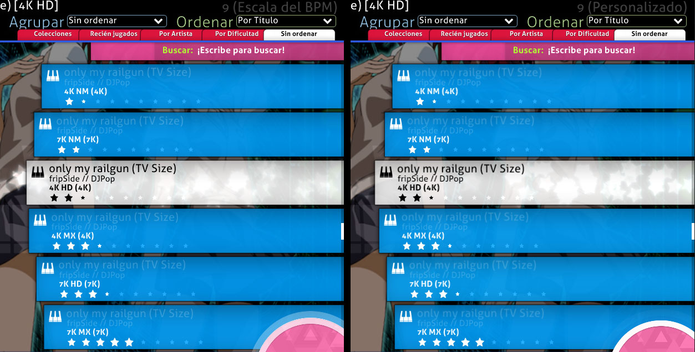
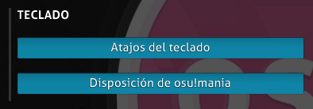
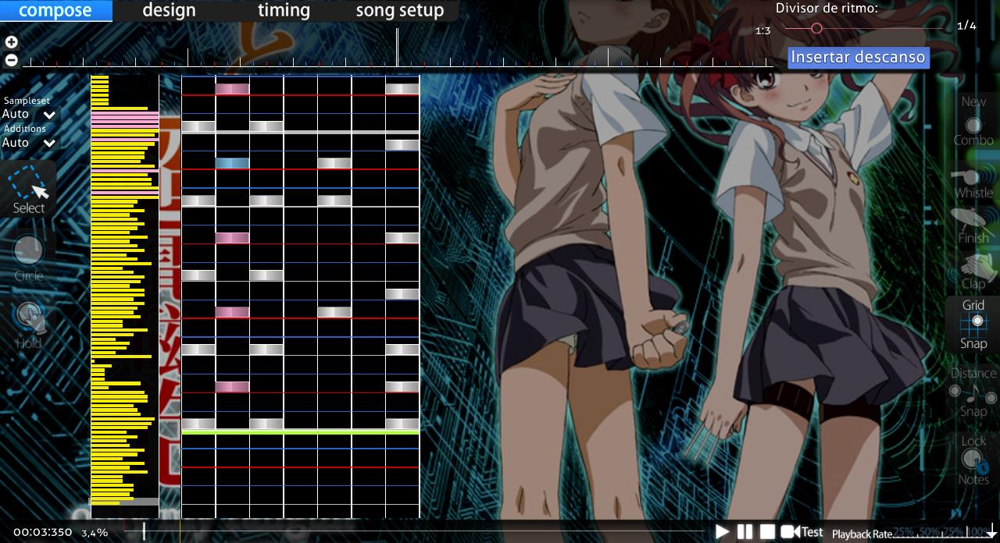

# osu!mania

El modo ha sido bastamente usado en casi todos los juegos de ritmo de renombre. Requiere de una buena coordinación de manos y/o piernas donde las notas (con su cantidad dependiente del BPM y la difcultad) se mueven en una especie de rieles. El jugador tendrá que presionar la tecla correcta para esa específica nota a tiempo. Aunque el modo de juego fue originalmente hecho como una imitación del estilo de juego de *Beatmania*, osu!mania permite que se cambie el número de teclas o que se pueda poner el camino por donde vienen las notas de manera vertical (esto significa que puedes hacer que tenga un estilo como *Guitar Hero* \[5 teclas\] o como *Dance Dance Revolution* \[4 teclas\] y así con otros juegos similares).

Es, de cierta manera, similar a [osu!taiko](/wiki/Game_mode/osu!taiko), pero con más botones de notas moviéndose verticalmente que horizontalmente.

##  Explicación de la jugabilidad

### Selección de canciones

Para acceder al modo de juego de osu!mania, presiona `Ctrl`+`4` al mismo tiempo.

Otra manera de acceder es dando clic en el botón de `Mode` y seleccionar `osu!mania`.

#### Teclas y juicio

En la pantalla de selección de canciones, el número al lado de la *K* muestra cuántas teclas serán usadas en la partida. El beatmap será jugado con un juicio más blando si el símbolo "↓" está adjunto al final de la *K*.

Por ejemplo, *4K↓* significa que será jugado con cuatro(4) teclas con un juicio en cuanto al timing más blando de lo normal.

Hay que denotar que el juicio de un beatmap se determina automáticamente.

#### Beatmaps específicos de un modo y diferencias en la conversión a mania

Cuando se convierte un beatmap con un modo no específico, el rango por defecto de teclas debería de ser entre 4 y 7.

Con el modificador del juego [xK](/wiki/Gameplay/Game_modifier/xK), el jugador puede cambiar manualmente desde 1 a un total de 9 teclas. Sin embargo, el modificador no funcionará con beatmaps específicos de osu!mania.

Con el modoficador de juego [Co-Op](/wiki/Gameplay/Game_modifier/Co-op), la etapa será dividida en dos, usa el esquema de control Co-Op y permitirá que los jugadores jueguen desde 2 a un total de 18 teclas con una reducción en el multiplicador de puntaje. Hay que destacar que el número de teclas de un beatmap específico de osu!mania no será duplicado, sino que serán divididas en dos (el jugador de la izquierda de la pantalla tendrá prioridad si el número de teclas es impar), usará el esquema Co-Op y no será aplicada una reducción en el multiplicador de puntaje.

#### Cambio de velocidad

Puedes **cambiar la velocidad de desplazamiento de las notas** presionando `Ctrl` (o `Shift`) con `+` (más rápido) / `-` (más despacio).

El límite más bajo es de 1 y el más alto es de 40.

##### Escalado de BPM y Velocidad de desplazamiento fija

El **escalado de BPM** es el antiguo sistema de escalado predeterminado que se usa actualmente, el cual escala la velocidad de desplazamiento en función de los BPM actuales. Hay una diferencia en la velocidad de desplazamiento entre los 100BPM (se desplaza más lento) y 200BPM (se desplaza más rápido) con el mismo escalado de velocidad.

La velocidad de desplazamiento **fija** es el nuevo sistema que cumple con una velocidad de desplazamiento constante junto con los BPM actuales. [Una introducción muy simple hecho por Blazier el 29 de octubre de 2014 (29/10/2014) sobre el escalado fijo](https://osu.ppy.sh/community/forums/topics/254145).

Hay que notar que los dos sistemas de escalado son afectados por la subida/bajada de velocidad por los cambios de BPM, con los cambios llendo desde drásticos (usualmente el BPM escalando a un BPM más alto con notas veloces; BPM muy bajo para escalados fijos con notas condensadas) a menores (usualmente escalados fijos en la mayoría del espectro del BPM) dependiendo de las configuraciones usadas en el cambio de velocidad.

### Jugabilidad

#### Campo de juego

Por defecto, el flujo de notas cae desde la parte superior hasta la inferior del transportador (la flecha inicial mostrará hacia dónde las notas fluirán), con las teclas al fondo y la línea de juicio arriba de las teclas. Para tener el flujo del campo de juego desde abajo hacia arriba en vez de la por defecto, puedes cambiarlo en la barra de `Opciones`; haz clic en el botón de `Disposición de osu!mania` para configurar las teclas y activar `Invertir verticalmente (estilo DDR)` para esta configuración de teclas manualmente.

La barra de vida está al lado derecho de la barra transportadora. Hay que notar que el drenaje de vida está desactivado en osu!mania, por lo que solo los objetos afectarán a dicha barra. El combo no se romperá al apretar las teclas en una línea sin juicios.

**La velocidad de desplazamiento de las notas** se puede cambiar presionando `Ctrl` (o `Shift`) con `+` (más rápido) / `-` (más lento) o simplemente `F3` (más rápido) / `F4` (más lento).

#### Notas

Las notas son los círculos de osu!mania. Las notas cayendo deben de ser presionadas en la línea de juicio, con la tecla correspondiente a cada nota. Más teclas deberán de ser presionadas simultáneamente si las notas caen al mismo tiempo.

una explosión de puntos derá dada cuando se teclee la tecla correcta correspondiente a la nota en la línea de juicio.

#### Notas sostenidas

Las notas sostenidas son los sliders y spinners de osu!mania. Cuando la nota sostenida alcanza la línea de juicio, apreta la tecla correspondiente a la nota en el tiempo adecuado, sostén, y suelta la tecla al final de la nota sostenida.

Mientras estás sujetando las notas sostenidas hay una pequeña regeneración en la barra de vida. Dependiendo de la canción y la peculiaridad del mapeo, es posible que otras notas o notas sostenidas aparezcan mientras sostienes las notas previas.

## Estilos de juego

*Refiérase a [Página de estilos de juego de osu!mania](/wiki/Gameplay/Play_style#osu!mania).*

## Controles

Hay que destacar que la información de los controles mostrados abajo hace referencia a las configuraciones *antiguas* usadas en opciones, donde las teclas son asignadas relativamente y aplicadas a todas las configuraciones.

La nueva configuración de teclas requiere que el jugador ingrese manualmente las teclas a usar usando el botón `Disposición de osu!mania` para *todas* las disposiciones de teclas (las teclas no asignadas usarán las configuraciones predeterminadas).

La actual configuración por defecto de teclas está basada en un estilo *simétrico*.

### Normal

*Solían haber* dos estilos diferentes de asignaciones de teclas, *simétrico* y *de izquierda a derecha*:

- El estilo *simétrico* mimetiza el posicionamiento de los botones de *DJMAX*, en el cual la tecla central es la `Barra espaciadora` para simular la sensación de pisar el pedal similar a la versión arcade.
- El estilo *de izquierda a derecha* mimetiza el posicionamiento de los botones de *Beatmania IIDX*, donde la primera columna coincide con la *tecla1*, la segunda columna con la *tecla2* y así.
  - Sin embargo, la opción de elegir entre estos dos ha sido removida y el estilo actual está basado en el estilo «simétrico». Por razones de legado, el estilo «de izquierda a derecha» se mantiene aquí.

Asignación de teclas *simétrico* (para el estilo *DJMAX*)

- Para los botones de la mano *izquierda* — (T1)`A`, (T2)`S`, (T3)`D`, (T4)`F`
- Para los botones de la mano *derecha* — (T6)`J`, (T7)`K`, (T8)`L`, (T9)`;`.
- El botón *central* — (T5)`Barra espaciadora`. \[solo para teclas impares\]
- El botón *especial* — `Shift izquierdo` \[Usando el estilo especial\] y `Ctrl izquierdo` \[Alternar asignación\].

| Teclas | I | C | D |
| :-: | :-- | :-: | --: |
| 1K | - | T5 | - |
| 2K | T4 | - | T6 |
| 3K | T4 | T5 | T6 |
| 4K | T3, T4 | - | T6, T7 |
| 5K | T3, T4 | T5 | T6, T7 |
| 6K | T2, T3, T4 | - | T6, T7, T8 |
| 6K(I) | **E1**, T3, T4 | T5 | T6, T7 |
| 6K(D) | T3, T4 | T5 | T6, T7, **E1** |
| 7K | T2, T3, T4 | T5 | T6, T7, T8 |
| 8K | T1, T2, T3, T4 | - | T6, T7, T8, T9 |
| 8K(I) | **E1**, T2, T3, T4 | T5 | T6, T7, T8 |
| 8K(D) | T2, T3, T4 | T5 | T6, T7, T8, **E1** |
| 9K | T1, T2, T3, T4 | T5 | T6, T7, T8, T9 |

La asignación de teclas de *izquierda a derecha* (para el estilo *Beatmania IIDX*)

- Desde abajo hacia arriba y luego desde abajo hacia arriba nuevamente: (T1)`Z`, (T2)`S`, (T3)`X`, (T4)`D`, (T5)`C`, (T6)`F`, (T7)`V`, (T8)`G`, (T9)`B` \[La Tecla 9 no es usada\]
- El botón *especial* — `Shift izquierdo` y `Ctrl izquierdo`.

| Teclas | Asignaciones |
| :-: | :-- |
| 4K | T1, T2, -, T4, T5 |
| 5K | T1, T2, T3, T4, T5 |
| 6K | T1, T2, T3, T4, T5, T6 |
| 7K | T1, T2, T3, T4, T5, T6, T7 |
| 8K | T1, T2, T3, T4, T5, T6, T7, T8 |
| 8K(I) | **E1**, T1, T2, T3, T4, T5, T6, T7 |
| 8K(D) | T1, T2, T3, T4, T5, T6, T7, **E1** |

- Nota: Por favor refiérase a la imagen basándose en el estilo usado.

### Co-Op

")

La **[actualización del 5 de marzo de 2015 (5/3/2015)](https://osu.ppy.sh/home/changelog)** le dio a osu!mania un nuevo mod llamado [Co-Op](/wiki/Gameplay/Game_modifier/Co-op). Con este mod activado, un segundo conjunto de teclas será desplegado junto con el primero como se muestra en la imagen de arriba.

Asignación *simétrica* para el segundo conjunto de teclas.

- Para los botones de la mano *izquierda* — (B1)`Q`, (B2)`W`, (B3)`E`, (B4)`R`
- Para los botones de la mano *derecha* — (B6)`U`, (B7)`I`, (B8)`O`, (B9)`P`.
- El botón *central* — (B5)`Alt derecho`. \[solo para teclas impares\]
- El botón *especial* — (X1)`Shift derecho` \[Usando el estilo especial\] o `Ctrl derecho` \[Alternar asignación\].

**La siguiente tabla está basada en el mod xK junto con el mod Co-Op.**

| Teclas | PI | PC | PD | SI | SC | SD |
| :-: | :-- | :-: | --: | :-- | :-: | --: |
| 1K Co-op | - | T5 | - | - | B5 | - |
| 2K Co-op | T4 | - | T6 | B4 | - | B6 |
| 3K Co-op | T4 | T5 | T6 | B4 | B5 | B6 |
| 4K Co-op | T3, T4 | - | T6, T7 | B3, B4 | - | B6, B7 |
| 5K Co-op | T3, T4 | T5 | T6, T7 | B3, B4 | B5 | B6, B7 |
| 6K Co-op | T2, T3, T4 | - | T6, T7, T8 | B2, B3, B4 | - | B6, B7, B8 |
| 6K(I) Co-op | **E1**, T3, T4 | T5 | T6, T7 | B3, B4 | B5 | B6, B7, **X1** |
| 6K(D) Co-op | T3, T4 | T5 | T6, T7, **E1** | **X1**, B3, B4 | B5 | B6, B7 |
| 7K Co-op | T2, T3, T4 | T5 | T6, T7, T8 | B2, B3, B4 | B5 | B6, B7, B8 |
| 8K Co-op | T1, T2, T3, T4 | - | T6, T7, T8, T9 | B1, B2, B3, B4 | - | B6, B7, B8, B9 |
| 8K(I) Co-op | **E1**, T2, T3, T4 | T5 | T6, T7, T8 | B2, B3, B4 | B5 | B6, B7, B8, **X1** |
| 8K(D) Co-op | T2, T3, T4 | T5 | T6, T7, T8, **E1** | **X1**, B2, B3, B4 | B5 | B6, B7, B8 |
| 9K Co-op | T1, T2, T3, T4 | T5 | T6, T7, T8, T9 | B1, B2, B3, B4 | B5 | B6, B7, B8, B9 |

**La siguiente tabla solo aplica a beatmaps específicos de osu!mania. Solo xK impares son mencionados. Refiérase a la primera tabla para un número par de xK (para 4K, refiérase a 2K Co-Op y así).**

| Teclas | PI | PC | PD | SI | SC | SD |
| :-: | :-- | :-: | --: | :-- | :-: | --: |
| 3K | T4 | - | T6 | - | B5 | - |
| 5K | T4 | T5 | T6 | B4 | - | B6 |
| 7K | T3, T4 | - | T6, T7 | B4 | B5 | B6 |
| 9K | T3, T4 | - | T6, T7 | B3, B4 | B5 | B6, B7 |

## Puntuaciones

La [puntuación en osu!mania](/wiki/Gameplay/Score/ScoreV1/osu!mania) tiene un límite de 1 millón y consta de dos partes, cada una de las cuales contribuye con el 50 % de la puntuación total:

1. Puntuación base, que está centrada en el [juicio](/wiki/Gameplay/Judgement/osu!mania). El juicio determina el valor de la puntuación base de un objeto (MAX, 300, 200, 100, 50 o 0 en caso de fallo).
2. Puntuación de bonificación, que se basa en el juicio y un multiplicador de bonificación variable, que aumenta al obtener un MAX o 300, y disminuye con un 200 o menos.

Además, la puntuación también tiene los siguientes componentes:

- La [precisión](/wiki/Gameplay/Accuracy#osu!mania) depende del juicio y muestra cuán precisos son los golpes. Las pulsaciones tardías o tempranas de teclas, así como los fallos, disminuyen la precisión general.
- El [combo](/wiki/Gameplay/Combo_(score_multiplier)) muestra cuántos objetos fueron golpeados consecutivamente. No tiene ningún efecto en la puntuación total y puede [romperse](/wiki/Gameplay/Judgement/Combobreak) si fallas.

Después de completar un beatmap, a la puntuación se le asigna un [grado](/wiki/Gameplay/Grade#osu!mania), una breve evaluación de la precisión en forma de una sola letra. Una SS dorada o plateada denota 100 % de precisión.

## Skinning

*Refiérase a [la página de Skinning de osu!mania](/wiki/Skinning/osu!mania) para la información completa.*

## Beatmapping

### Editor específico de osu!mania

Para acceder al editor específico de osu!mania, cambia el beatmap a uno específico de osu!mania en las configuraciones de la canción bajo la pestaña de Advanced.
Ten en cuenta que el beatmap se limitará solo a osu!mania cuando en las configuraciones se hayan cambiado desde *All* a *osu!mania*.

Para cambiar la aplicación del conteo de teclas, ve a Song Setup en la pestaña de Difficulty y ajusta el *Key Count*.
Activa el botón de `Co-op mode` para forzar el modificador del juego *Co-Op* cuando se juegue, con el doble de *Key Count* para mapear.

## Trivia

### Jugabilidad

- Si el conteo de teclas es el mismo después de usar un modificador xK o Co-Op, no se aplicará una reducción de puntaje.
  - Por ejemplo, para un beatmap 4K, usando los modificadores 2K y Co-Op no incurrirá en alguna reducción de puntaje.
  - Respectivamente, para un beatmap 5K, usar un modificador 5K tampoco incurrirá en alguna reducción de puntaje.
  - Usar el modificador xK o Co-Op en beatmaps específicos de osu!mania tampoco incurrirá en alguna reducción de puntaje.
- La mascota de osu!mania es [Mari](/wiki/Mascots#mani-&-mari).
- Cuando [Auto](/wiki/Gameplay/Game_modifier/Auto) juega el beatmap, el nombre del jugador será *osu!topus*.

### Historia

- osu!mania fue lanzado el [8 de octubre de 2012 (8/10/2012), principalmente implementado por woc2006](https://osu.ppy.sh/community/forums/posts/1825880).
- El antiguo editor de osu!mania *solía* requerir que el mapper pusiera círculos/sliders en el campo de juego de osu!, donde serán transcritos en la etapa como notas basadas en la posición y el tipo de objetos usados.
- El primer beatmap de osu!mania en ser clasificado fue [fripSide - only my railgun (TV Size) (DJPop)](https://osu.ppy.sh/beatmapsets/63089).

## Referencias

- [Publicación de anuncio](https://osu.ppy.sh/community/forums/posts/1825880)
