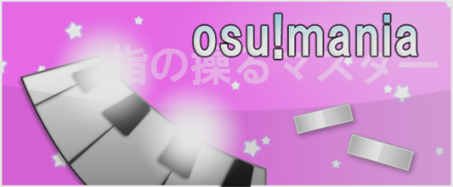

# osu!mania

โหมดนี้ถูกใช้กันอย่างแพร่หลายใน rhythm games หลักแทบทั้งหมด ต้องใช้การประสานมือและ/หรือเท้าที่ดี โดยโน้ต (ซึ่งจำนวนขึ้นอยู่กับ BPM และความยาก) จะเคลื่อนบน conveyor ผู้เล่นต้องกดคีย์ที่ถูกต้องสำหรับโน้ตนั้นให้ตรงเวลา แม้โหมดเกมนี้เดิมถูกสร้างมาเพื่อเลียนแบบสไตล์การเล่นของ *Beatmania* แต่ osu!mania อนุญาตให้เปลี่ยนจำนวน keys หรือ flip แนวตั้งของเพลย์ฟีลด์ได้ (หมายความว่าสามารถทำให้ดูคล้าย *Guitar Hero* \[5 keys\] หรือ *Dance Dance Revolution* \[4 keys\] และอื่น ๆ ได้)

มันค่อนข้างคล้ายกับ [osu!taiko](/wiki/Game_mode/osu!taiko) แต่มีปุ่มมากกว่า และโน้ตเคลื่อนที่แนวตั้งแทนที่จะเป็นแนวนอน

##  Gameplay explanation

### Song Selection

หากต้องการเข้าโหมดเกม osu!mania ให้กด `Ctrl`+`4`

หรือคลิกปุ่ม `Mode` แล้วเลือก `osu!mania`

#### Keys and Judgement

ในหน้าจอเลือกเพลง ตัวเลขข้าง *K* แสดงจำนวน keys ที่จะใช้เล่น บีตแมปจะเล่นด้วย judgement ที่หลวมขึ้นหากมีสัญลักษณ์ "↓" ต่อท้าย *K*

ตัวอย่างเช่น *4K↓* หมายความว่าจะเล่นด้วยสี่ปุ่ม (4) พร้อม judgement timing ที่หลวมกว่าปกติ

โปรดทราบว่า judgement ของบีตแมปถูกกำหนดโดยอัตโนมัติ

#### ความต่างระหว่าง beatmaps เฉพาะ osu!mania และ conversion จากบีตแมป osu!

เมื่อแปลงบีตแมปที่ไม่ใช่ beatmap เฉพาะ osu!mania ช่วงจำนวน keys เริ่มต้นจะอยู่ประมาณ 4 ถึง 7 keys

ด้วยม็อด [xK](/wiki/Gameplay/Game_modifier/xK) ผู้เล่นสามารถตั้งจำนวน keys ด้วยตัวเองได้ตั้งแต่ 1 ถึงรวม 9 keys โดยมีการลด score multiplier อย่างไรก็ตาม ม็อดนี้จะไม่ทำงานกับบีตแมปเฉพาะ osu!mania

ด้วยม็อด [Co-Op](/wiki/Gameplay/Game_modifier/Co-op) stage จะแบ่งเป็นสองฝั่ง ใช้ control scheme ของ Co-Op และทำให้ผู้เล่นเล่นได้ตั้งแต่ 2 ถึงรวม 18 keys พร้อมการลด score multiplier โปรดทราบว่าในบีตแมปเฉพาะ osu!mania จำนวน keys ที่ตั้งไว้ล่วงหน้าจะไม่ถูกเพิ่มเป็นสองเท่า แต่ stage จะถูกแบ่งเป็นสองฝั่ง (ให้ความสำคัญฝั่งซ้ายหากเป็นเลขคี่), ใช้ control scheme ของ Co-Op, และไม่มีการลด score multiplier

#### Speed Change

**ความเร็วการเลื่อนของ beat notes** สามารถเปลี่ยนได้ด้วยการกด `Ctrl` (หรือ `Shift`) พร้อม `+` (เร็วขึ้น) / `-` (ช้าลง)

ค่าต่ำสุดคือ 1 และค่าสูงสุดคือ 40

##### BPM scaling and Fixed scroll speed

**BPM scaling** คือระบบ scaling เก่าเริ่มต้นในปัจจุบัน ซึ่งปรับ scroll speed ตาม BPM ที่กำลังเล่นอยู่ จะมีความต่างของ scroll speed เมื่อเล่นบีตแมป 100BPM (เลื่อนช้ากว่า) และ 200BPM (เลื่อนเร็วกว่า) ด้วย scaling speed เท่ากัน

**Fixed** scroll speed คือระบบใหม่ที่บังคับ scroll speed ให้คงที่ร่วมกับความเร็ว BPM ปัจจุบัน [โพสต์แนะนำ fixed scaling แบบง่ายมากโดย Blazier เมื่อ 29 October 2014 (2014-10-29)](https://osu.ppy.sh/community/forums/topics/254145)

โปรดทราบว่าทั้งสองระบบ scaling ยังได้รับผลจากการเร่ง/ลดความเร็วตามการเปลี่ยน BPM อยู่ โดยความเปลี่ยนแปลงมีตั้งแต่รุนแรง (มักเกิดกับ BPM scaling เมื่อไป BPM สูงที่โน้ตเร็ว หรือ BPM ต่ำมากสำหรับ fixed scaling ที่โน้ตอัดแน่น) ไปจนถึงเล็กน้อย (มักเป็น fixed scaling ในช่วง BPM ส่วนใหญ่) ขึ้นอยู่กับค่า Speed Change ที่ใช้

### Gameplay

#### Playfield

ตามค่าเริ่มต้น flow ของโน้ตจะตกจากด้านบนลงด้านล่างของ conveyor (ลูกศรเริ่มต้นจะแสดงว่าโน้ตจะไหลไปทางไหน) โดย key control อยู่ด้านล่าง และ judgement line อยู่เหนือ key control หากต้องการเปลี่ยน flow ของเพลย์ฟีลด์ให้เป็นจากล่างขึ้นบนแทน สามารถเปลี่ยนได้ใน sidebar `Options`; คลิกปุ่ม `osu!mania layout` เพื่อตั้งค่าปุ่ม osu!mania และเปิด `Vertically flip playfield (DDR style)` สำหรับ key setting นี้ด้วยตัวเอง

Health bar อยู่ด้านขวาของ conveyor belt โปรดทราบว่า health drain ถูกปิดใน osu!mania ดังนั้นมีเพียง hit objects เท่านั้นที่ส่งผลต่อ health bar คอมโบจะไม่ขาดเมื่อกดคีย์บน judgement line ที่ว่าง

**ความเร็วการเลื่อนของ beat notes** สามารถเปลี่ยนได้ด้วยการกด `Ctrl` (หรือ `Shift`) พร้อม `+` (เร็วขึ้น) / `-` (ช้าลง) หรือแค่ `F3` (เร็วขึ้น) / `F4` (ช้าลง)

#### Notes

Notes คือ hit circles ของ osu!mania โน้ตที่ตกลงมาต้องถูกกดบน judgement line ด้วยคีย์ที่ตรงกับคอลัมน์ของโน้ตนั้น หากโน้ตตกลงมาพร้อมกัน ต้องกดหลายคีย์ที่ตรงกับโน้ตเหล่านั้นพร้อมกัน

Score burst จะถูกให้เมื่อกดคีย์ที่ถูกต้องตรงกับโน้ตบน judgement line

#### Hold notes

Hold notes คือสไลเดอร์และสปินเนอร์ของ osu!mania เมื่อ hold note ถึง judgement line ให้กดโน้ตเริ่มต้นให้ตรงเวลาด้วยคีย์ที่ถูกต้อง กดค้างไว้ แล้วปล่อยที่โน้ตปลายของ hold note

Health bar จะฟื้นช้า ๆ ระหว่างกด hold note(s) ค้างอยู่ ขึ้นอยู่กับเพลงและลูกเล่นการแมป อาจมีโน้ตหรือ hold notes อื่นปรากฏระหว่างที่กด hold note(s) ก่อนหน้าอยู่ได้

## Play Styles

*ดู [หน้า Play Styles ใต้ osu!mania](/wiki/Gameplay/Play_style#osu!mania)*

*ดูเพิ่มเติม: [osu!mania 10K+ playstyles](/wiki/Beatmapping/osu!mania_10K_plus_playstyles)*

## Controls

โปรดทราบว่าข้อมูลการควบคุมด้านล่างอ้างอิง *key settings เก่า* ที่ใช้ใน Options ซึ่งปุ่มถูก map แบบสัมพันธ์กันและใช้กับ key settings ทั้งหมด

Key settings ใหม่ต้องให้ผู้เล่นตั้งค่าด้วยตัวเองผ่านปุ่ม `osu!mania layout` ด้านบนสำหรับ *ทุก* key layout (key layouts ที่ยังไม่ map จะใช้ key settings เริ่มต้นแทน)

Key settings เริ่มต้นปัจจุบันอิงจากสไตล์ *Symmetrical*

### Normal

เคยมี binding-styles ต่างกันสองแบบ คือ *Symmetrical* และ *Left to Right*:

- สไตล์ *Symmetrical* เลียนแบบตำแหน่งปุ่มของ *DJMAX* โดยปุ่มกลางคือ `Spacebar` เพื่อจำลองความรู้สึกเหมือนเหยียบ pedal คล้ายเวอร์ชัน arcade ปุ่มกลางตรงกับคอลัมน์กลาง (เฉพาะ keys เลขคี่) และคอลัมน์อื่นตรงกับปุ่มในตำแหน่งที่สัมพันธ์กัน
- สไตล์ *Left to Right* เลียนแบบตำแหน่งปุ่มของ *Beatmania IIDX* โดยคอลัมน์แรกตรงกับ *key1*, คอลัมน์ที่สองตรงกับ *key2* และต่อไปเรื่อย ๆ
  - อย่างไรก็ตาม ตัวเลือกนี้ถูกนำออกแล้ว และสไตล์ปัจจุบันอิงจากสไตล์ "Symmetrical" ด้วยเหตุผลด้าน legacy จึงยังเก็บสไตล์ "Left to Right" ไว้ที่นี่

*Symmetrical* key binding (สำหรับสไตล์ *DJMAX*)

- ปุ่มของมือ *ซ้าย* - (K1)`A`, (K2)`S`, (K3)`D`, (K4)`F`
- ปุ่มของมือ *ขวา* - (K6)`J`, (K7)`K`, (K8)`L`, (K9) ปุ่ม `;`
- ปุ่ม *Center* - (K5)`Spacebar` \[เฉพาะ keys เลขคี่\]
- ปุ่ม *Special* - `leftShift` \[ใช้ special style\] และ `leftCtrl` \[alternate binding\]

| Key | L | C | R |
| :-: | :-- | :-: | --: |
| 1K | - | K5 |  |
| 2K | K4 | - | K6 |
| 3K | K4 | K5 | K6 |
| 4K | K3, K4 | - | K6, K7 |
| 5K | K3, K4 | K5 | K6, K7 |
| 6K | K2, K3, K4 | - | K6, K7, K8 |
| 6K(L) | **S1**, K3, K4 | K5 | K6, K7 |
| 6K(R) | K3, K4 | K5 | K6, K7, **S1** |
| 7K | K2, K3, K4 | K5 | K6, K7, K8 |
| 8K | K1, K2, K3, K4 | - | K6, K7, K8, K9 |
| 8K(L) | **S1**, K2, K3, K4 | K5 | K6, K7, K8 |
| 8K(R) | K2, K3, K4 | K5 | K6, K7, K8, **S1** |
| 9K | K1, K2, K3, K4 | K5 | K6, K7, K8, K9 |

*Left to Right* key binding (สำหรับสไตล์ *Beatmania IIDX*)

- จากล่างขึ้นบน แล้วล่างขึ้นบนอีกครั้ง: (K1)`Z`, (K2)`S`, (K3)`X`, (K4)`D`, (K5)`C`, (K6)`F`, (K7)`V`, (K8)`G`, (K9)`B` \[K9 ไม่ได้ใช้\]
- ปุ่ม *Special* - `leftShift` และ `leftCtrl`

| Key | Bindings |
| :-: | :-- |
| 4K | K1, K2, -, K4, K5 |
| 5K | K1, K2, K3, K4, K5 |
| 6K | K1, K2, K3, K4, K5, K6 |
| 7K | K1, K2, K3, K4, K5, K6, K7 |
| 8K | K1, K2, K3, K4, K5, K6, K7, K8 |
| 8K(L) | **S1**, K1, K2, K3, K4, K5, K6, K7 |
| 8K(R) | K1, K2, K3, K4, K5, K6, K7, **S1** |

- หมายเหตุ: โปรดดูภาพตามสไตล์ที่ใช้

### Co-Op

")

**[อัปเดต 05 March 2015 (2015-03-05)](https://osu.ppy.sh/home/changelog)** เพิ่มม็อดใหม่ให้ osu!mania ชื่อ [Co-Op](/wiki/Gameplay/Game_modifier/Co-op) เมื่อเปิดม็อดนี้ จะมีชุดปุ่มชุดที่สองที่แตกต่างจากชุดหลักด้านบนเพิ่มเข้ามา

*Symmetrical* key binding สำหรับชุดที่สอง

- ปุ่มของมือ *ซ้าย* - (B1)`Q`, (B2)`W`, (B3)`E`, (B4)`R`
- ปุ่มของมือ *ขวา* - (B6)`U`, (B7)`I`, (B8)`O`, (B9)`P`
- ปุ่ม *Center* - (B5)`rightAlt` \[เฉพาะ keys เลขคี่\]
- ปุ่ม *Special* - (X1)`rightShift` \[ใช้ special style\] หรือ `rightCtrl` \[alternate binding\]

**ตารางด้านล่างอิงจากการใช้ม็อด xK ร่วมกับม็อด Co-Op**

| Key | PL | PC | PR | SL | SC | SR |
| :-: | :-- | :-: | --: | :-- | :-: | --: |
| 1K Co-op | - | K5 | - | - | B5 | - |
| 2K Co-op | K4 | - | K6 | B4 | - | B6 |
| 3K Co-op | K4 | K5 | K6 | B4 | B5 | B6 |
| 4K Co-op | K3, K4 | - | K6, K7 | B3, B4 | - | B6, B7 |
| 5K Co-op | K3, K4 | K5 | K6, K7 | B3, B4 | B5 | B6, B7 |
| 6K Co-op | K2, K3, K4 | - | K6, K7, K8 | B2, B3, B4 | - | B6, B7, B8 |
| 6K(L) Co-op | **S1**, K3, K4 | K5 | K6, K7 | B3, B4 | B5 | B6, B7, **X1** |
| 6K(R) Co-op | K3, K4 | K5 | K6, K7, **S1** | **X1**, B3, B4 | B5 | B6, B7 |
| 7K Co-op | K2, K3, K4 | K5 | K6, K7, K8 | B2, B3, B4 | B5 | B6, B7, B8 |
| 8K Co-op | K1, K2, K3, K4 | - | K6, K7, K8, K9 | B1, B2, B3, B4 | - | B6, B7, B8, B9 |
| 8K(L) Co-op | **S1**, K2, K3, K4 | K5 | K6, K7, K8 | B2, B3, B4 | B5 | B6, B7, B8, **X1** |
| 8K(R) Co-op | K2, K3, K4 | K5 | K6, K7, K8, **S1** | **X1**, B2, B3, B4 | B5 | B6, B7, B8 |
| 9K Co-op | K1, K2, K3, K4 | K5 | K6, K7, K8, K9 | B1, B2, B3, B4 | B5 | B6, B7, B8, B9 |

**ตารางด้านล่างใช้กับบีตแมปเฉพาะ osu!mania เท่านั้น และกล่าวถึงเฉพาะ xK specifics เลขคี่ สำหรับ xK specifics เลขคู่ให้ดูตารางแรก (สำหรับ 4K specific ให้ดู 2K Co-op และต่อไปตามนั้น)**

| Key | PL | PC | PR | SL | SC | SR |
| :-: | :-- | :-: | --: | :-- | :-: | --: |
| 3K | K4 | - | K6 | - | B5 | - |
| 5K | K4 | K5 | K6 | B4 | - | B6 |
| 7K | K3, K4 | - | K6, K7 | B4 | B5 | B6 |
| 9K | K3, K4 | - | K6, K7 | B3, B4 | B5 | B6, B7 |

## Scoring

[Score ใน osu!mania](/wiki/Gameplay/Score/ScoreV1/osu!mania) ถูกจำกัดสูงสุดที่ 1 ล้าน และประกอบด้วยสองส่วน ซึ่งแต่ละส่วนคิดเป็น 50% ของ total score:

1. Base score ซึ่งมี [judgement](/wiki/Gameplay/Judgement/osu!mania) เป็นศูนย์กลาง Judgement กำหนดค่าคะแนนพื้นฐานของ hit object (MAX, 300, 200, 100, 50, หรือ 0 เมื่อ miss)
2. Bonus score ซึ่งอิงจาก judgement และ floating bonus multiplier ที่เพิ่มขึ้นเมื่อได้ MAX หรือ 300 และลดลงเมื่อได้ 200 หรือต่ำกว่า

นอกจากนี้ score ยังมีองค์ประกอบต่อไปนี้:

- [Accuracy](/wiki/Gameplay/Accuracy#osu!mania) ขึ้นอยู่กับ judgement และแสดงว่าการกดแม่นแค่ไหน การกดเร็วหรือช้า รวมถึง misses จะลด accuracy โดยรวม
- [Combo](/wiki/Gameplay/Combo_(score_multiplier)) แสดงจำนวนออบเจกต์ที่กดต่อเนื่องกัน มันไม่มีผลต่อ total score และอาจถูก[ตัด](/wiki/Gameplay/Judgement/Combobreak)ด้วย miss

หลังเล่นบีตแมปจบ score จะได้รับ [grade](/wiki/Gameplay/Grade#osu!mania) ซึ่งเป็นการประเมิน accuracy แบบสั้น ๆ ในรูปของตัวอักษรหนึ่งตัว SS สีทองหรือสีเงินหมายถึง accuracy 100%

## Skinning

*ดูข้อมูลเต็มได้ที่ [หน้า Skinning ของ osu!mania](/wiki/Skinning/osu!mania)*

## Beatmapping

### osu!mania-specific Editor

หากต้องการเข้า editor เฉพาะ osu!mania ให้เปลี่ยนบีตแมปเป็น osu!mania-specific ใน Song Setup ใต้แท็บ Advanced
โปรดทราบว่าบีตแมปจะถูกล็อกให้เป็น osu!mania เท่านั้น เมื่อเปลี่ยนการตั้งค่าจาก *All* เป็น *osu!mania*

หากต้องการเปลี่ยน enforce key count ให้ไปที่ Song Setup ใต้แท็บ Difficulty แล้วปรับ *Key Count*
เปิดปุ่ม `Co-op mode` เพื่อบังคับใช้ม็อด *Co-Op* เมื่อเล่น พร้อมเพิ่ม *Key Count* เป็นสองเท่าสำหรับการแมป

## Trivia

### Gameplay

- หาก key count เท่าเดิมหลังใช้ตัวปรับแต่ง xK หรือ Co-Op จะไม่มีการลด score
  - ตัวอย่างเช่น สำหรับบีตแมป 4K การใช้ม็อด 2K และ Co-Op จะไม่ทำให้ score ลด
  - ในทำนองเดียวกัน สำหรับบีตแมป 5K การใช้ม็อด 5K ก็จะไม่ทำให้ score ลดเช่นกัน
  - การใช้ม็อด xK หรือ Co-Op บนบีตแมปเฉพาะ osu!mania ก็จะไม่ทำให้ score ลดเช่นกัน
- มาสคอตของ osu!mania คือ [Mani & Mari](/wiki/Mascots#mani-&-mari)
- เมื่อเล่นโดย [Auto](/wiki/Gameplay/Game_modifier/Auto) ชื่อผู้เล่นจะแสดงเป็น *osu!topus*

### History

- osu!mania เปิดตัวเมื่อ [08 October 2012 (2012-10-08), โดยพัฒนาหลักโดย woc2006](https://osu.ppy.sh/community/forums/posts/1825880)
- osu!mania editor แบบเก่า *เคย* ต้องให้ beatmapper วาง hit circles/sliders ลงบนเพลย์ฟีลด์ osu! จากนั้นระบบจึงแปลงไปเป็น notes ที่เหมาะสมบน stage ตามตำแหน่งที่วางและ hit objects ที่ใช้
- บีตแมปเฉพาะ osu!mania ชุดแรกที่ ranked อย่างเป็นทางการคือ [fripSide - only my railgun (TV Size) (DJPop)](https://osu.ppy.sh/beatmapsets/63089)

## อ้างอิง

- [Announcement post](https://osu.ppy.sh/community/forums/posts/1825880)
