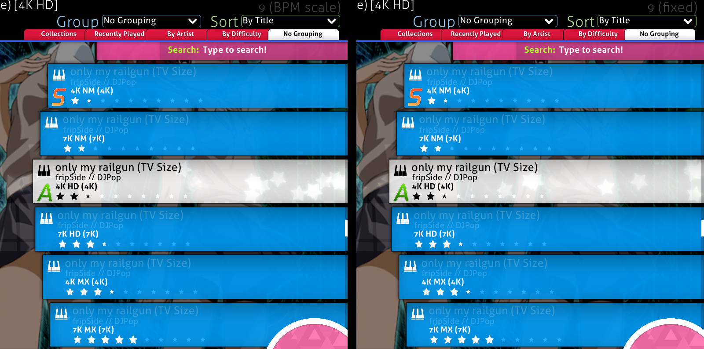
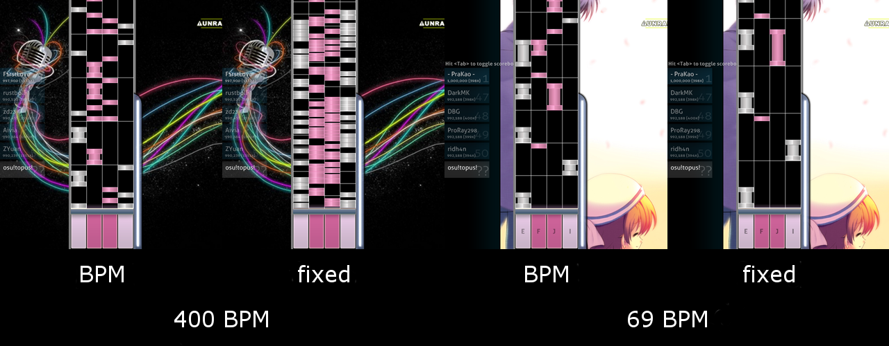
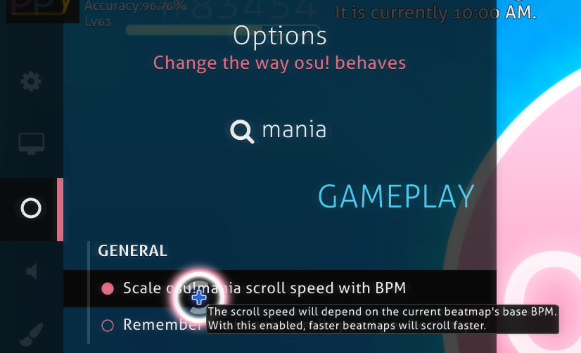

# osu!mania

โหมดการเล่นนี้เป็นรูปแบบที่ได้รับความนิยมอย่างแพร่หลายในเกมแนวจังหวะดนตรีเกือบทุกเกม ผู้เล่นต้องอาศัยการทำงานประสานกันของมือและสายตาที่ดีเยี่ยม โดยตัวโน้ต (ซึ่งจำนวนจะขึ้นอยู่กับค่า BPM และความยาก) จะเคลื่อนที่ไปตามสายพาน และผู้เล่นจะต้องกดปุ่มให้ตรงกับโน้ตนั้นๆ ให้ทันเวลา แม้ว่าเริ่มแรกโหมดนี้จะถูกสร้างขึ้นเพื่อเลียนแบบสไตล์การเล่นของ *Beatmania* แต่ osu!mania เปิดโอกาสให้ผู้เล่นสามารถปรับเปลี่ยนจำนวนปุ่ม (Keys) หรือกลับทิศทางการเลื่อนของสนามเล่นได้ (ทำให้สามารถปรับแต่งให้ดูเหมือนเกมอย่าง *Guitar Hero* [5 ปุ่ม] หรือ *Dance Dance Revolution* [4 ปุ่ม] และอื่นๆ ได้ตามต้องการ)

ลักษณะการเล่นจะคล้ายกับ [osu!taiko](/wiki/Game_mode/osu!taiko) แต่มีจำนวนปุ่มที่มากกว่าและโน้ตจะเคลื่อนที่ในแนวตั้งแทนแนวขวน

##  คำอธิบายเกมเพลย์ {#gameplay-description}

### การเลือกเพลง {#song-selection}

หากต้องการเข้าสู่โหมดการเล่น osu!mania ให้กดปุ่ม `Ctrl`+`4`

หรือคลิกที่ปุ่ม `Mode` แล้วเลือก `osu!mania`

#### จำนวนปุ่มและการตัดสิน (Keys and Judgement) {#keys-and-judgement}

ในหน้าจอเลือกเพลง ตัวเลขที่อยู่ถัดจากตัวอักษร *K* จะแสดงจำนวนปุ่มที่จะต้องใช้ในการเล่นแมพนั้น หากมีสัญลักษณ์ "↓" ต่อท้ายตัว *K* หมายความว่าบีทแมพนั้นจะถูกเล่นด้วยระบบการตัดสิน (Judgement) ที่ผ่อนปรนกว่าปกติ

ตัวอย่างเช่น *4K↓* หมายความว่าใช้ปุ่มเล่น 4 ปุ่ม และมีการตัดสินที่ง่ายกว่าปกติ

โปรดทราบว่าระบบจะกำหนดการตัดสินของบีทแมพให้โดยอัตโนมัติ

#### ความแตกต่างระหว่างบีทแมพเฉพาะโหมดและการแปลงแมพ {#differences-between-mode-specific-and-converts}

เมื่อมีการแปลงแมพจากโหมดอื่นมาเป็น mania จำนวนปุ่มพื้นฐานจะอยู่ที่ประมาณ 4 ถึง 7 ปุ่ม

ผู้เล่นสามารถใช้ [Mod xK](/wiki/Gameplay/Game_modifier/xK) เพื่อกำหนดจำนวนปุ่มด้วยตนเองได้ตั้งแต่ 1 ถึง 9 ปุ่ม โดยจะมีการลดตัวคูณคะแนนลง อย่างไรก็ตาม Mod นี้จะไม่ทำงานกับบีทแมพที่เป็นโหมด osu!mania โดยเฉพาะ (Mania-specific)

หากใช้งาน [Mod Co-Op](/wiki/Gameplay/Game_modifier/Co-op) หน้าจอการเล่นจะถูกแบ่งเป็นสองฝั่ง และอนุญาตให้เล่นได้ตั้งแต่ 2 ถึง 18 ปุ่ม โดยมีการลดตัวคูณคะแนนเช่นกัน แต่สำหรับบีทแมพที่เป็น Mania-specific ตัวคูณคะแนนจะไม่ลดลงและจะแบ่งหน้าจอเป็นสองฝั่งตามการตั้งค่าปุ่มที่มีอยู่

#### การเปลี่ยนความเร็ว (Speed Change) {#speed-change}

**ความเร็วการเลื่อนของโน้ต (Scrolling speed)** สามารถปรับเปลี่ยนได้โดยการกดปุ่ม `Ctrl` (หรือ `Shift`) ค้างไว้พร้อมกับกดปุ่ม `+` (เร็วขึ้น) หรือ `-` (ช้าลง)

ค่าความเร็วต่ำสุดคือ 1 และสูงสุดคือ 40

##### BPM scaling และ Fixed scroll speed {#bpm-scaling-and-fixed-scroll-speed}

**BPM scaling** คือระบบเดิมที่เป็นค่าเริ่มต้น ซึ่งจะปรับความเร็วการเลื่อนตามค่า BPM ของเพลงในขณะนั้น ส่งผลให้เพลงที่มี BPM 100 จะเลื่อนช้ากว่าเพลงที่มี BPM 200 แม้จะตั้งค่าความเร็วเท่ากันก็ตาม

**Fixed scroll speed** คือระบบใหม่ที่บังคับให้ความเร็วการเลื่อนคงที่ตลอดเวลาโดยไม่สนค่า BPM

โปรดทราบว่าทั้งสองระบบยังคงได้รับผลกระทบจากการเปลี่ยนค่า BPM ในระหว่างเพลง (BPM changes) ซึ่งอาจทำให้ความเร็วเปลี่ยนไปเล็กน้อยหรือมาก ขึ้นอยู่กับสไตล์ของแมพและการตั้งค่าที่คุณใช้

### เกมเพลย์ {#gameplay}

#### สนามเล่น (Playfield) {#playfield}

โดยค่าเริ่มต้น โน้ตจะเลื่อนจากบนลงล่าง (จะมีลูกศรบอกทิศทางในช่วงเริ่มเพลง) โดยมีปุ่มควบคุมอยู่ที่ด้านล่างและเส้นตัดสิน (Judgement line) อยู่เหนือปุ่มควบคุม หากต้องการเปลี่ยนให้โน้ตเลื่อนจากล่างขึ้นบนแทน (สไตล์ DDR) สามารถปรับได้ในเมนู `Options` โดยคลิกที่ปุ่ม `osu!mania layout` และเปิดใช้งาน `Vertically flip playfield (DDR style)`

แถบพลังชีวิตจะอยู่ที่ด้านขวาของสายพาน โปรดทราบว่าในโหมดนี้พลังชีวิตจะไม่ลดลงเองตามเวลา (No health drain) เฉพาะการกดโน้ตเท่านั้นที่มีผลต่อเลือด คอมโบจะไม่หลุดหากมีการกดปุ่มในขณะที่ไม่มีโน้ตที่เส้นตัดสิน

**ความเร็วการเลื่อน** สามารถปรับได้ด้วยปุ่ม `Ctrl`+`+`/`-` หรือกดปุ่ม `F3` (เร็วขึ้น) / `F4` (ช้าลง)

#### Notes (โน้ตปกติ) {#notes}

โน้ตปกติเปรียบได้กับ Hit circles ในโหมดอื่น คุณต้องกดปุ่มที่ตรงกับช่องของโน้ตนั้นในขณะที่โน้ตเลื่อนมาถึงเส้นตัดสิน หากมีโน้ตตกลงมาพร้อมกันหลายช่อง คุณต้องกดปุ่มเหล่านั้นพร้อมกันด้วย

เมื่อกดได้ตรงจังหวะ จะมีเอฟเฟกต์ระเบิดคะแนนแสดงขึ้นที่เส้นตัดสิน

#### Hold notes (โน้ตยาว) {#hold-notes}

โน้ตยาวเปรียบได้กับ Sliders และ Spinners ในโหมดอื่น เมื่อหัวของโน้ตยาวมาถึงเส้นตัดสิน ให้กดปุ่มค้างไว้และปล่อยเมื่อส่วนท้ายของโน้ตยาวมาถึงเส้นตัดสิน

พลังชีวิตจะค่อยๆ ฟื้นฟูในขณะที่คุณกดโน้ตยาวค้างไว้ และอาจจะมีโน้ตอื่นๆ ปรากฏขึ้นมาในขณะที่คุณกำลังกดโน้ตยาวค้างไว้อยู่ด้วย

## สไตล์การเล่น (Play Styles) {#play-styles}

*ดูรายละเอียดที่ [หน้าสไตล์การเล่นของ osu!mania](/wiki/Gameplay/Play_style#osu!mania)*

*ดูเพิ่มเติม: [สไตล์การเล่นโหมด osu!mania 10K+](/wiki/Beatmapping/osu!mania_10K_plus_playstyles)*

## การควบคุม (Controls) {#controls}

โปรดทราบว่าข้อมูลด้านล่างนี้อ้างอิงจากการตั้งค่าปุ่มแบบเก่าในเมนู Options

ระบบใหม่ต้องการให้ผู้เล่นตั้งค่าแยกกันสำหรับแต่ละจำนวนปุ่ม (Layout) ผ่านปุ่ม `osu!mania layout` (หากไม่ได้ตั้งไว้ ระบบจะใช้ค่าพื้นฐานแทน)

การตั้งค่าพื้นฐานในปัจจุบันจะอิงตามสไตล์ **Symmetrical (สมมาตร)**

### ปกติ (Normal) {#normal}

ในอดีตเคยมีสไตล์การตั้งค่า 2 แบบ คือ *Symmetrical* และ *Left to Right*:

- **Symmetrical (สมมาตร):** เลียนแบบการวางปุ่มของเกม *DJMAX* โดยมีปุ่ม `Spacebar` อยู่ตรงกลางเพื่อจำลองการเหยียบแป้นเหยียบในตู้เกม ปุ่มกลางจะใช้กับช่องตรงกลาง (เฉพาะจำนวนปุ่มที่เป็นเลขคี่) และปุ่มอื่นๆ จะเรียงออกไปทั้งสองข้าง
- **Left to Right (จากซ้ายไปขวา):** เลียนแบบการวางปุ่มของเกม *Beatmania IIDX* โดยเรียงปุ่มจากช่องแรกไปจนถึงช่องสุดท้ายตามลำดับ
  - ปัจจุบันตัวเลือกนี้ถูกนำออกไปแล้ว และใช้สไตล์ Symmetrical เป็นหลัก แต่ข้อมูลนี้ยังคงไว้เพื่อการอ้างอิงทางประวัติศาสตร์

การตั้งค่าแบบ **Symmetrical** (สำหรับสไตล์ *DJMAX*)

- ปุ่มสำหรับมือ **ซ้าย** — (K1)`A`, (K2)`S`, (K3)`D`, (K4)`F`
- ปุ่มสำหรับมือ **ขวา** — (K6)`J`, (K7)`K`, (K8)`L`, (K9)`;`
- ปุ่ม **กลาง** — (K5)`Spacebar` (เฉพาะเลขคี่)
- ปุ่ม **พิเศษ** — `leftShift` และ `leftCtrl`

| ปุ่ม | ซ้าย (L) | กลาง (C) | ขวา (R) |
| :-: | :-- | :-: | :-- |
| 1K | - | K5 | - |
| 2K | K4 | - | K6 |
| 3K | K4 | K5 | K6 |
| 4K | K3, K4 | - | K6, K7 |
| 5K | K3, K4 | K5 | K6, K7 |
| 6K | K2, K3, K4 | - | K6, K7, K8 |
| 6K(L) | **S1**, K3, K4 | K5 | K6, K7 |
| 6K(R) | K3, K4 | K5 | K6, K7, **S1** |
| 7K | K2, K3, K4 | K5 | K6, K7, K8 |
| 8K | K1, K2, K3, K4 | - | K6, K7, K8, K9 |
| 8K(L) | **S1**, K2, K3, K4 | K5 | K6, K7, K8 |
| 8K(R) | K2, K3, K4 | K5 | K6, K7, K8, **S1** |
| 9K | K1, K2, K3, K4 | K5 | K6, K7, K8, K9 |