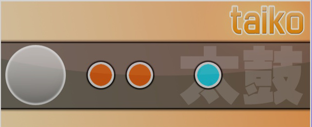

# osu!taiko (mode de jeu)

osu!taiko est un mode de jeu d'osu! basé sur la série de jeux de rythme japonais [Taiko no Tatsujin](https://fr.wikipedia.org/wiki/Taiko_no_Tatsujin) (sorti sous le nom de [Taiko : Drum Master](http://en.wikipedia.org/wiki/Taiko:_Drum_Master) en Amérique du Nord).

##  Gameplay

### Sélection des beatmaps

Pour accéder au mode de jeu osu!taiko, appuyez simultanément sur les touches `Ctrl` + `2`.

Vous pouvez aussi cliquer sur le bouton `Mode` et sélectionner `osu!taiko`.

### Les bases du gameplay

#### Playfield

Pour les joueurs ayant une expérience préalable de *Taiko no Tatsujin* :

- Pas de danseuses chibi en bas (doit être storyboardé)
- La barre de vie doit être remplie à au moins 50 % pour réussir la beatmap
- Le *Kiai Time* déclenche le *"Go-Go Time"*.
  - Certains éléments de gameplay comme les ballons ou les chemins bifurqués ne sont pas implémentés (seules les bases sont présentes).
- Différence d'arrière-plan :
  - Une vidéo ou un arrière-plan statique d'une beatmap occupera la partie inférieure de l'écran.
  - Si la map a fait l'objet d'un storyboard, ce dernier s'affichera en bas de l'écran.

Pour les nouveaux venus du mode osu!taiko :

L'écran est divisé en deux sections ; la section supérieure contient les éléments de gameplay tandis que la section inférieure contient une image, une vidéo ou un storyboard pour la beatmap. Dans la partie supérieure se trouve la barre de santé qui, contrairement aux autres modes de jeu, commence vide et doit être remplie à au moins 50 % ou à moitié pour passer les difficultés. Sous la barre de santé, un tambour taiko se trouve sur le côté gauche et un tapis roulant transporte les objets de droite à gauche à travers le cercle de jugement situé près du tambour taiko. Au-dessus du tambour de taiko se trouve une mascotte de taiko animée (également connue sous le nom de pippidon ou de don) qui réagit en fonction des sections de kiai, des jalons de combo et des notes manquées pendant le kiai time, ainsi qu'un slider de fond défilant qui change de couleur lorsque des notes sont manquées. Enfin, il y a le score habituel, la précision et la progression de la beatmap en haut à droite.

Veuillez noter que le drain time est désactivé dans osu!taiko, de sorte que seuls les objets affectent la barre de santé. Contrairement à osu!, les combos sont réalisés tous les 50 coups consécutifs. Le score de base sera boosté après l'obtention d'un combo multiple de 10, mais s'arrête à 100 (limite maximale de combo pour le boost). Si le combo est rompu, le boost revient au score de base. Pendant le *Kiai Time*, chaque coup réussi donne au joueur 20 % de points supplémentaires par rapport au score actuel. Le score obtenu grâce à un coup peut être vérifié sous la précision dans le coin supérieur droit en rouge.

#### Notes d'osu!taiko

Les notes de taiko apparaissent sous la forme d'un cercle rouge ou bleu. Ces cercles sont appelés Don (pour les notes rouges) et Katsu ou Kat (pour les notes bleues), respectivement.

S'il s'agit d'une petite note rouge, appuyez sur le bouton lié à la partie intérieure du tambour taiko ou frappez la grande zone plate (centre) du *TaTaCon*. S'il s'agit d'une petite note bleue, appuyez sur le bouton lié à l'anneau extérieur du tambour taiko ou frappez les côtés du *TaTaCon*. Si la note est un **GRAND cercle**, appuyez sur le bouton lié à l'anneau extérieur du tambour taiko ou frappez les deux côtés du *TaTaCon*, selon la couleur de la note, pour doubler les points (une seule frappe correcte donnera le simple point).

Les notes doivent être pressées ou frappées dans le petit cercle blanc de jugement à côté du tambour. Frapper la mauvaise couleur, ou les deux couleurs rouge et bleue en même temps, sera considéré comme un miss.

#### Drumrolls

Frappez les parties intérieures (ou extérieures) du tambour en continu pour obtenir des points jusqu'à la fin du drumroll. Pour les **GRANDES** notes, frappez les deux boutons de la partie intérieure (ou extérieure) du tambour simultanément et sans interruption jusqu'à ce qu'elle soit terminée. Notez que les drumrools ne sont pas comptabilisés et qu'ils ne sont comptés que lorsqu'ils sont frappés sur les petits cercles, plutôt que de pouvoir faire un drumrool aussi vite que possible comme dans *Taiko no Tatsujin*.

Les drumrolls peuvent être ignorés sans pénalité de santé, car ils ne récupèrent pas du tout la barre de santé. Cependant, cela coûtera les éventuels points gagnés grâce au drumroll. Chaque coup réussi sur le petit cercle donne un score statique de 300.

#### Dendens/Shaker

")

Frappez les tambours intérieur et extérieur **dans l'ordre** (rouge, bleu, rouge, bleu, rouge, bleu, ...) jusqu'à ce que le compteur denden atteigne 0. La couleur de départ n'a pas d'importance (vous pouvez commencer par le bleu ou le rouge), et si vous ne réussissez pas, vous subirez une pénalité de santé manquée mais pas de rupture de combo. Frapper la même couleur ne décrémentera pas le compteur de denden, jusqu'à ce qu'une autre couleur soit frappée à la place.

Ils n'incrémentent pas le compteur de combo, et ne récupèrent pas la barre de santé de quelque manière que ce soit. Chaque coup de denden réussi ne donne qu'un score statique de 300, et l'achèvement du denden donnera un score parfait (GRAND) de grande note.

## Styles de jeu

*Voir [Styles de jeu sous osu!taiko](/wiki/Gameplay/Play_style).*

## Contrôles

Les contrôles par défaut pour osu!taiko sont :

| Type | Souris | Clavier | TaTaCon |
| :-- | :-- | :-- | :-- |
| Rouge | Clic gauche (L) | `X` (L) / `C` (R) | Surface plane du tambour |
| Bleu | Clic droit (L) | `Z` (L) / `V` (R) | Surface extérieure du tambour |

L'emplacement du curseur dans le jeu n'a pas d'importance pendant le jeu.

Si le mod [Relax](/wiki/Gameplay/Game_modifier/Relax) est utilisé, le jugement du score ne prend en compte que le timing des coups (le mod frappe automatiquement la bonne couleur).

Le contrôleur de batterie *TaTaCon* a été principalement conçu pour les portages de *Taiko no Tatsujin* et *Taiko : Drum Master*, mais n'est pas aussi courant dans osu!taiko.

## Scoring

Le [score dans osu!taiko](/wiki/Gameplay/Score/ScoreV1/osu!taiko) est une somme pondérée de plusieurs composantes de la jouabilité. Il dépend des éléments suivants :

- Le [jugement](/wiki/Gameplay/Judgement/osu!taiko) détermine la valeur de base du score d'un objet (300, 100, ou 0 en cas de miss). La valeur des notes normales et des grandes notes dépend du timing du coup, tandis que la valeur de base de tous les autres objets est constante.
- La [précision](/wiki/Gameplay/Accuracy#osu!taiko) dépend du jugement et montre la précision des coups. Les pressions de touche trop tôt ou trop tard, ainsi que les notes normales, diminuent la précision globale.
- Le [combo](/wiki/Gameplay/Combo_(score_multiplier)) est un multiplicateur de score : jouer un objet contribue davantage au score total lorsque le combo est élevé et vice versa. Le combo peut être [cassé](/wiki/Gameplay/Judgement/Combobreak) par un miss. Dans osu!taiko, le multiplicateur de score dérivé du combo est limité et n'affecte pas le score total autant qu'il le fait dans osu! ou osu!catch.
- Le [Kiai time](/wiki/Gameplay/Kiai_time) : dans osu!taiko, le kiai time augmente le gain de score de 20%, comme dans la série originale *Taiko no Tatsujin*.

En plus de donner des points, chaque objet remplit une petite partie de la [barre de vie](/wiki/Client/Interface/Health_bar), qui doit être remplie au moins à **50%** pour qu'un joueur puisse terminer une beatmap.

Après avoir complété une beatmap, le score se voit attribuer une [note](/wiki/Gameplay/Grade#osu!taiko), une courte évaluation de la précision sous la forme d'une seule lettre. Un SS doré ou argenté indique une précision de 100 %, et tout le reste, de S à D, dépend de la quantité de 300, 100 et de notes manquées.

## Skinning

*Voir la page [Skinning d'osu!taiko](/wiki/Skinning/osu!taiko) pour des informations complètes.*

## Mapping d'osu!taiko

- Les notes rouges se réfèrent aux cercles normaux,
  - Les grandes notes rouges ont besoin d'un hitsound finish.
- Les notes bleues doivent être accompagnées d'un hitsound whistle/clap sur le cercle,
  - les grandes notes bleues doivent avoir un finish et un whistle/clap ensemble.
- Les sliders représentent la longue note jaune (également connue sous le nom de drumroll)
- Le spinner représente un denden.

L'emplacement des notes n'a pas d'importance.

### Conversion des beatmaps osu! > osu!taiko

Lorsqu'une conversion de beatmaps se produit (en jouant une beatmap osu! en mode osu!taiko), les sliders très courts (généralement moins d'un temps) sont automatiquement convertis en notes rouges ou bleues, selon le hitsound utilisé.

Pour les beatmaps avec 125 BPM ou moins, les drumrolls 1/8 sont donnés au lieu des drumrolls 1/4.

Notez que les rythmes 1/8 ne sont pas souvent utilisés en musique. Il n'est pas suggéré de placer un slider en rythme 1/8.

Notez également que des drumrolls 1/6 sont donnés si le slider tick rate de **3** a été utilisé.

## Le saviez-vous ?

### Gameplay

- Appuyer dans le vide n'entraîne pas de miss.
- Drumrolls : La limite supérieure du nombre d'occurrences du slider est :
  - 4 fois la longueur du slider, ou
  - 8 fois la longueur du slider dans les beatmaps qui sont égales ou inférieures à 125 BPM.
- Contrairement aux autres modes de jeu, *Kiai Time* a un effet sur les scores car il fait référence au *"Go-Go Time "* de *Taiko no Tatsujin*. Lorsque le mode *Kiai Time* est actif, le tambour en haut à gauche change d'animation (il s'appelle *pippidon* ou *Don*/*Katsu* dans *Taiko no Tatsujin*), le terrain de jeu présente un dégradé d'arrière-plan et la zone touchée est entourée d'un graphique de feu.
  - En outre, toutes les notes frappées bénéficient d'un multiplicateur de score de 1,2x, y compris les longues notes jaunes, à l'exception des frappes sur un shaker (la dernière frappe est toujours multipliée).
- Les mascottes de osu!taiko sont [pippidon](/wiki/Mascots#pippi) et [Mocha](/wiki/Mascots#mocha).
- Lorsque le mod [Auto](/wiki/Gameplay/Game_modifier/Auto) est utilisé, le nom du joueur sera *mekkadosu!*.

### Histoire

- L'option `Utiliser le skin Taiko pour le mode Taiko` dans le menu latéral des options sous la section Skin utilisera les éléments du skin du dossier `taiko` lorsque vous jouerez dans osu!taiko, sans tenir compte des éléments taiko du skin actuel. Le dossier utilisé pour contenir le skin *[Taiko by LuiginHann](https://osu.ppy.sh/community/forums/topics/41319)*, qui pouvait être téléchargé à partir du désormais obsolète `osume.exe` (un outil de mise à jour d'osu! quand osu! a besoin de se mettre à jour) sous l'onglet `Skin`.
- La première beatmap classée contenant une difficulté osu!taiko est [Taiko no Tatsujin - Saitama2000 (Kharl)](https://osu.ppy.sh/beatmapsets/210).
- La beatmap osu!taiko pure la mieux classée est [Mutsuhiko Izumi - Red Goose (lepidopodus)](https://osu.ppy.sh/beatmapsets/55920)
