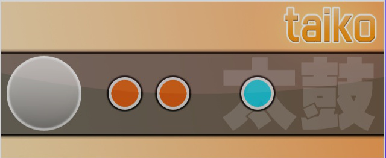

# osu!taiko

osu!taiko คือโหมดเกมใน osu! ที่อิงจากซีรีส์ rhythm game ญี่ปุ่น [Taiko no Tatsujin](https://en.wikipedia.org/wiki/Taiko_no_Tatsujin) (วางจำหน่ายในอเมริกาเหนือในชื่อ [Taiko: Drum Master](http://en.wikipedia.org/wiki/Taiko:_Drum_Master))

##  Gameplay

### Song Selection

หากต้องการเข้าโหมดเกม osu!taiko ให้กด `Ctrl` + `2` พร้อมกัน

หรือคลิกปุ่ม `Mode` แล้วเลือก `osu!taiko`

### Gameplay Basics

#### Playfield

สำหรับผู้เล่นที่มีประสบการณ์ *Taiko no Tatsujin* มาก่อน:

- ไม่มี chibi dancers ด้านล่าง (ต้องทำผ่าน storyboard)
- Health bar ต้องเต็มอย่างน้อย 50% จึงจะผ่านเพลง
- *Kiai Time* จะเปิด *"Go-Go Time"*
  - Gameplay gimmicks อย่าง hit balloons หรือ forked paths ไม่ได้ถูกใช้งาน (มีแค่พื้นฐาน)
- ความต่างของพื้นหลัง
  - บีตแมปที่มีวิดีโอหรือภาพพื้นหลังนิ่งอย่างเดียวจะกินพื้นที่ส่วนล่างของหน้าจอ
  - หากแมปมี storyboard, storyboard จะครอบคลุมทั้งหน้าจอ แต่ยังอยู่เป็นเลเยอร์ด้านหลังเพลย์ฟีลด์

สำหรับผู้เล่นใหม่ในโหมด osu!taiko:

หน้าจอแบ่งเป็นสองส่วน ส่วนบนมีองค์ประกอบ gameplay ส่วนล่างมีรูปภาพ วิดีโอ หรือ storyboard ของบีตแมป ในส่วนบนจะมี health bar ซึ่งต่างจากโหมดเกมอื่นตรงที่เริ่มจากว่างเปล่า และต้องเติมให้เต็มอย่างน้อย 50% หรือครึ่งหนึ่งเพื่อผ่านบีตแมป ใต้ health bar จะมีกลอง taiko อยู่ทางซ้าย และมี conveyor belt เคลื่อนที่พา hit objects จากขวาไปซ้ายผ่าน judgement circle ใกล้กลอง taiko เหนือกลอง taiko คือมาสคอต taiko แบบเคลื่อนไหว (หรือที่รู้จักในชื่อ pippidon หรือ don) ซึ่งจะตอบสนองตามช่วง kiai, combo milestones, และโน้ตที่ miss ระหว่าง kiai time พร้อมกับ background slider ที่เลื่อนและเปลี่ยนสีเมื่อมีโน้ต miss สุดท้าย ด้านขวาบนจะมี score, accuracy, และ progress ของบีตแมปตามปกติ

โปรดทราบว่า health drain ถูกปิดใน osu!taiko ดังนั้นมีเพียง hit objects เท่านั้นที่ส่งผลต่อ health bar ต่างจาก osu! ตรงที่ combo milestones เกิดทุก ๆ 50 hits ต่อเนื่อง Base score จะถูก boost หลังได้คอมโบที่เป็นพหุคูณของ 10 แต่หยุดที่ 100 (ลิมิตคอมโบสูงสุดสำหรับ boost) หากคอมโบขาด boost จะรีเซ็ตกลับไปที่ base score ระหว่าง *Kiai Time* ทุก hit ที่สำเร็จจะให้คะแนนมากขึ้น 20% จากจำนวน score ปัจจุบัน คะแนนที่ได้จาก hit สามารถดูได้ใต้ accuracy ที่มุมขวาบนเป็นสีแดง

#### Taiko notes

Taiko notes จะปรากฏเป็นวงกลมสีแดงหรือสีน้ำเงิน วงกลมเหล่านี้เรียกว่า Don (สำหรับโน้ตแดง) และ Katsu หรือ Kat (สำหรับโน้ตน้ำเงิน) ตามลำดับ

ถ้าเป็นโน้ตแดงเล็ก ให้กดปุ่มที่ผูกกับส่วนด้านในของกลอง taiko หรือตีพื้นที่เรียบขนาดใหญ่ (ตรงกลาง) ของ *TaTaCon* ถ้าเป็นโน้ตน้ำเงินเล็ก ให้กดปุ่มที่ผูกกับวงแหวนด้านนอกของกลอง taiko หรือตีด้านข้างของ *TaTaCon* ถ้าโน้ตเป็นวงกลม **LARGE** ให้กดหรือตีทั้งสองปุ่มของด้านในหรือด้านนอกของกลองตามสีของโน้ต เพื่อรับคะแนนสองเท่า (การกดถูกเพียงครั้งเดียวจะให้คะแนนปกติแทน)

ต้องกดหรือตีโน้ตใน judgement circle สีขาวเล็ก ๆ ข้างกลอง การตีผิดสี หรือกดทั้งสีแดงและสีน้ำเงินพร้อมกัน จะถือว่า miss

#### Drumrolls

ตีส่วนด้านใน (หรือด้านนอก) ของกลองต่อเนื่องเพื่อเก็บคะแนนจนจบ drumroll สำหรับโน้ต **LARGE** ให้กดทั้งสองปุ่มของกลองด้านใน (หรือด้านนอก) พร้อมกันและต่อเนื่องจนกว่าจะจบ โปรดทราบว่า drumroll hits มี hard cap และนับเฉพาะเมื่อกดตรงฮิตเซอร์เคิลเล็ก ๆ ไม่ใช่ตีเร็วที่สุดเท่าที่ทำได้แบบใน *Taiko no Tatsujin*

Drumrolls สามารถปล่อยผ่านได้โดยไม่มีโทษต่อ health เพราะมันไม่ฟื้น health bar เลย อย่างไรก็ตาม จะเสียคะแนนที่อาจได้จาก drumroll แต่ละ hit ที่สำเร็จบนฮิตเซอร์เคิลเล็กจะให้ score คงที่ 300

#### Dendens/Shaker

")

ตีด้านในและด้านนอกของกลอง **ตามลำดับ** (เช่น แดง, น้ำเงิน, แดง, น้ำเงิน, แดง, น้ำเงิน, ...) จน denden counter เหลือ 0 สีเริ่มต้นไม่สำคัญ (จะเริ่มด้วยน้ำเงินหรือแดงก็ได้) และหากทำไม่สำเร็จจะโดนโทษ health แบบ miss แต่ไม่ทำให้คอมโบขาด การตีสีเดิมซ้ำจะไม่ลด denden counter จนกว่าจะตีอีกสีแทน

มันไม่เพิ่ม combo counter และไม่ฟื้น health bar แต่อย่างใด denden hit ที่สำเร็จแต่ละครั้งให้ score คงที่ 300 เท่านั้น และการทำ denden สำเร็จจะให้คะแนนโน้ตใหญ่แบบ perfect (GREAT)

## Play Styles

*ดู [หน้า Play Styles ใต้ osu!taiko](/wiki/Gameplay/Play_style)*

## Controls

การควบคุมเริ่มต้นของ osu!taiko คือ:

| Type | Mouse | Keyboard | TaTaCon |
| :-- | :-- | :-- | :-- |
| Red | Left click(L) | `X` (L) / `C` (R) | Flat surface of the drum |
| Blue | Right click(L) | `Z` (L) / `V` (R) | Outer surface of the drum |

ตำแหน่งของเคอร์เซอร์ในเกมไม่มีผลระหว่างเล่น

หากใช้ม็อด [Relax](/wiki/Gameplay/Game_modifier/Relax) score judgement จะคิดเฉพาะ hit timing เท่านั้น (ม็อดจะปรับ hit ให้เป็นสีที่ถูกต้องโดยอัตโนมัติ)

คอนโทรลเลอร์กลอง *TaTaCon* ถูกสร้างขึ้นเป็นหลักสำหรับเวอร์ชัน home ports ของ *Taiko no Tatsujin* และ *Taiko: Drum Master* แต่ไม่ค่อยพบใน osu!taiko อย่างไรก็ตาม เมนู [options](/wiki/Client/Options#other) มีตัวเลือก `Wiimote/TaTaCon Drum support`

## Scoring

[Score ใน osu!taiko](/wiki/Gameplay/Score/ScoreV1/osu!taiko) คือผลรวมแบบถ่วงน้ำหนักของหลายองค์ประกอบใน gameplay โดยขึ้นอยู่กับสิ่งต่อไปนี้:

- [Judgement](/wiki/Gameplay/Judgement/osu!taiko) กำหนดค่าคะแนนพื้นฐานของ hit object (300, 100, หรือ 0 เมื่อ miss) ค่าของโน้ตปกติและโน้ตใหญ่ขึ้นอยู่กับ hit timing ส่วนออบเจกต์อื่นทุกชนิดมี base value คงที่
- [Accuracy](/wiki/Gameplay/Accuracy#osu!taiko) ขึ้นอยู่กับ judgement และแสดงว่าการกดแม่นแค่ไหน การกดเร็วหรือช้า รวมถึง misses จะลด accuracy โดยรวม
- [Combo](/wiki/Gameplay/Combo_(score_multiplier)) คือ score multiplier: การเคลียร์ hit object จะมีผลต่อ total score มากขึ้นเมื่อคอมโบสูง และกลับกัน คอมโบอาจถูก[ตัด](/wiki/Gameplay/Judgement/Combobreak)ด้วย miss ใน osu!taiko score multiplier ที่มาจากคอมโบมีลิมิต และไม่ส่งผลต่อ total score มากเท่ากับใน osu! หรือ osu!catch
- [Kiai time](/wiki/Gameplay/Kiai_time): ใน osu!taiko, kiai time เพิ่ม score gain 20% เช่นเดียวกับซีรีส์ *Taiko no Tatsujin* ต้นฉบับ

นอกจากให้ score แล้ว ออบเจกต์แต่ละตัวที่เคลียร์ได้จะเติม[health bar](/wiki/Client/Interface/Health_bar) เล็กน้อย ซึ่งต้องเต็มอย่างน้อย **50%** ผู้เล่นจึงจะผ่านบีตแมป

หลังเล่นบีตแมปจบ score จะได้รับ [grade](/wiki/Gameplay/Grade#osu!taiko) ซึ่งเป็นการประเมิน accuracy แบบสั้น ๆ ในรูปของตัวอักษรหนึ่งตัว SS สีทองหรือสีเงินหมายถึง accuracy 100% ส่วนที่เหลือตั้งแต่ S ถึง D ขึ้นอยู่กับจำนวน 300s, 100s, และ misses

## Skinning

*ดูข้อมูลเต็มได้ที่ [หน้า Skinning ของ osu!taiko](/wiki/Skinning/osu!taiko)*

## osu!taiko Mapping

- โน้ตแดงหมายถึง hit circles ปกติ
  - โน้ตแดงใหญ่ต้องมี finish hitsound
- โน้ตน้ำเงินต้องมี whistle/clap hitsound บน hit circle นั้น
  - โน้ตน้ำเงินใหญ่ต้องมี finish และ whistle/clap พร้อมกัน
- สไลเดอร์แทนโน้ตเหลืองยาว (หรือที่รู้จักกันว่า drumroll)
- สปินเนอร์แทน denden

ตำแหน่งของโน้ตไม่มีผล

### osu! conversion notes

เมื่อเกิดการแปลงแมป (เล่นแมป osu! ในโหมด osu!taiko) สไลเดอร์ที่สั้นมาก (โดยปกติน้อยกว่าหนึ่ง beat) จะถูกแปลงเป็นโน้ตแดงหรือน้ำเงินโดยอัตโนมัติ ขึ้นอยู่กับ hitsound ที่ใช้

สำหรับแมปที่มี 125 BPM หรือต่ำกว่า ระบบจะให้ drumrolls แบบ 1/8 แทน drumrolls แบบ 1/4

โปรดทราบว่า rhythms แบบ 1/8 ไม่ค่อยถูกใช้ในเพลง จึงไม่แนะนำให้วางสไลเดอร์เมื่ออยู่ใน rhythm 1/8

นอกจากนี้ โปรดทราบว่าจะได้ drumrolls แบบ 1/6 หากใช้ slider tick rate เป็น **3**

## Trivia

### Gameplay

- การเล่นบนเพลย์ฟีลด์ว่างจะไม่ทำให้ miss
- Drumroll: ขีดจำกัดสูงสุดของจำนวน hits บนสไลเดอร์คือ:
  - 4 เท่าของความยาวสไลเดอร์ หรือ
  - 8 เท่าของความยาวสไลเดอร์ในเพลงที่มี BPM เท่ากับหรือต่ำกว่า 125
- ต่างจากโหมดเกมอื่น *Kiai Time* ส่งผลต่อคะแนน เพราะอิงจาก *"Go-Go Time"* ใน *Taiko no Tatsujin* ระหว่างที่ *Kiai Time* ทำงาน กลองมุมซ้ายบนจะเปลี่ยน animation (ชื่อ *pippidon* ใน osu!taiko หรือ *Don*/*Katsu* ใน *Taiko no Tatsujin*) เพลย์ฟีลด์จะมี background gradient และพื้นที่ hit จะมีกราฟิกไฟรอบ ๆ
  - นอกจากนี้ hit notes ทั้งหมดจะได้ score multiplier 1.2x รวมถึงโน้ตเหลืองยาว ยกเว้น hits บนสปินเนอร์ (hit สุดท้ายยังคูณอยู่)
- มาสคอตของ osu!taiko คือ [pippidon](/wiki/Mascots#pippi) และ [Mocha](/wiki/Mascots#mocha)
- เมื่อเล่นโดย [Auto](/wiki/Gameplay/Game_modifier/Auto) ชื่อผู้เล่นจะแสดงเป็น *mekkadosu!*

### History

- `Use Taiko skin for Taiko mode` ใน Options sidebar ภายใต้ส่วน Skin จะใช้ skin elements จากโฟลเดอร์ `taiko` เมื่อเล่น osu!taiko โดยไม่สนว่า taiko elements ของสกินปัจจุบันเป็นอย่างไร เดิมโฟลเดอร์นี้เคยเก็บสกิน *[Taiko by LuiginHann](https://osu.ppy.sh/community/forums/topics/41319)* ซึ่งดาวน์โหลดได้จาก `osume.exe` ที่เลิกใช้แล้ว (ระบบอัปเดตดั้งเดิม ก่อนจะถูกรวมเข้ากับเกม) ใต้แท็บ `Skin`
- บีตแมป ranked แรกที่มีระดับความยาก osu!taiko คือ [Taiko no Tatsujin - Saitama2000](https://osu.ppy.sh/beatmapsets/210) โดย [Kharl](https://osu.ppy.sh/users/452)
- บีตแมปเฉพาะ osu!taiko ที่ ranked เป็นชุดแรกคือ [Mutsuhiko Izumi - Red Goose](https://osu.ppy.sh/beatmapsets/55920) โดย [lepidopus](https://osu.ppy.sh/users/194807)
