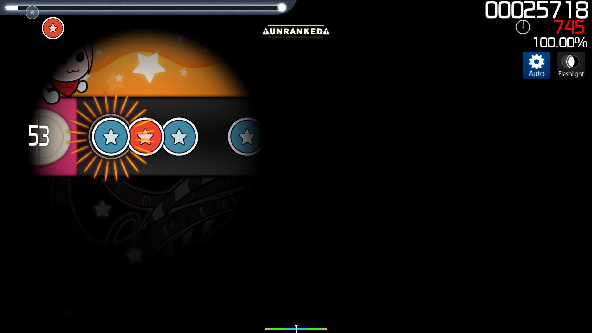
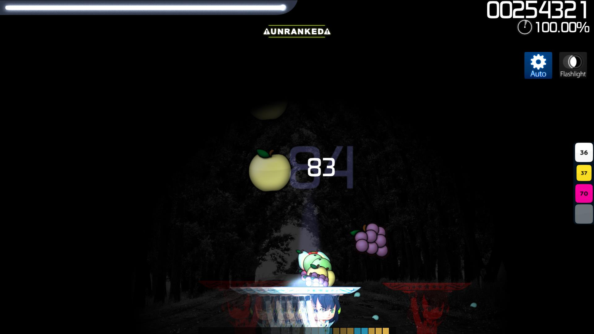
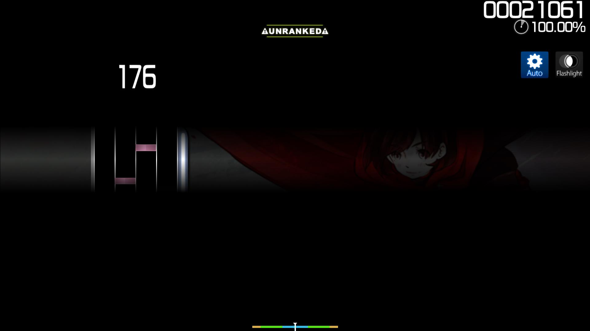

# 플래시라이트 (모드)

 모드 아이콘")

*모든 모드의 목록을 확인하려면 [여기](/wiki/Game_modifier)를 눌러주세요.*\
*[히든 (모드)](/wiki/Game_modifier/Hidden)와 혼동하지 말아주세요.*

## 플래시라이트

- 축약형: FL (플라)
- 종류: 난이도 상승 모드
- 점수 배수:
  - ![][osu!] ![][osu!taiko] ![][osu!catch]: 1.12x
  - ![][osu!mania]: 1.00x
- 기본 단축키: `G`
- 설명: `마우스 주변의 제한된 부분만 보입니다.`
- 플라 모드를 사용할 수 있는 osu! 장르: ![][osu!] ![][osu!taiko] ![][osu!catch] ![][osu!mania]

## 상세 설명

**플래시라이트**는 화면에 보이는 시야를 제한하여 [비트맵](/wiki/Beatmap)의 난이도를 상승시키는 [모드](/wiki/Game_modifier)입니다.

### osu!

[osu!](/wiki/Game_mode/osu!)에서는 커서 주변에 환한 원, 즉 노트가 보이는 가시 영역이 플레이 필드에 표시됩니다. 이 가시 영역의 크기는 플레이어의 현재 콤보에 따라 달라집니다.

가시 영역의 크기는 100 콤보, 200 콤보일 때 더 작아집니다. 만약 플레이어의 콤보가 깨진다면 가시 영역의 크기는 처음 크기로 돌아옵니다. 추가적으로, [슬라이더](/wiki/Hit_object/Slider)의 경우 가시 영역이 슬라이더가 끝날 때 까지 더 어두워집니다.

하단의 이미지 모두는 마치 플레이어의 커서에 가상의 손전등이 비춰지는 것 처럼 보입니다:

, 100 콤보일 때 (하단 좌측), 그리고 200 콤보일 때 (하단 우측)")

플라를 히든 모드와 같이 걸 경우 플라의 가시 영역의 크기는 중요하지 않다는 것을 기억해주세요. 커서를 히트 오브젝트의 등장 타이밍에 신경쓰지 않는 동안 히트 오브젝트가 희미해집니다.  

플라는 흔히 osu!에서 가장 어려운 모드로 알려져 있으며, 점수를 얻기 위해서는 맵 전체를 외워야 합니다.

### osu!taiko

[osu!taiko](/wiki/Game_mode/osu!taiko)에서는 가시 영역의 위치가 히트 영역에 있습니다. osu!와 비슷하게 100 콤보, 200콤보일 때 가시 영역이 줄어들며 콤보가 깨지면 원래 크기로 돌아옵니다.

히든 모드와 함께 사용할 경우 노트가 가시 영역에 보이기 전에 완전히 보이지 않게 되기 때문에 플라의 가시 영역은 쓸모가 없게 됩니다. 따라서 비트맵 전체를 외워야 합니다.

### osu!catch

[osu!catch](/wiki/Game_mode/osu!catch)에서는 커서 대신 캐쳐 주변에 가시 영역이 생기며 osu! 또는 osu!taiko보다 가시 영역이 특히 큰 것을 제외하고는 osu!와 비슷합니다.

When paired with the Hidden mod, the fruits are momentarily visible if the catcher is *directly under* the fruits. That is, up until the player reaches 100x combo, at which point the fruits become completely invisible by the time the fruits reach the visible area. Much like osu! and osu!taiko, this also requires complete memorisation of the beatmap.

### osu!mania

In [osu!mania](/wiki/Game_mode/osu!mania), the visible area is restricted to a relatively thin horizontal bar at the centre of the track whilst everything else is obstructed from view. In that sense, the Flashlight mod could be thought of as the Hidden mod and [Fade In](/wiki/Game_modifier/Fade_In) mod combined. (That is, without the changing sizes of the visible area.)
[osu!mania](/wiki/Game_mode/osu!mania)에서는 가시 영역이 트랙 중앙에 얇은 가로로 제한되어 있으며, 그 외의 구역은 보이지 않습니다. 이러한 점에서 플라 모드는 히든과 (페이드 인)(/wiki/Game_modifier/Fade_In) 모드가 합쳐진 느낌입니다. 또한, 가시 구역 크기의 변화가 없습니다.

## 그 외

- 만약 플라 모드를 켠 상태로 비트맵을 클리어하여 S 또는 SS 등급을 얻었다면, 랭크가 은색으로 표시됩니다.
- The Flashlight mod was originally subjected to heavy controversy regarding the implementation in 2010 for being the easiest mod to hack on; subsequently forcing the mod to be unranked until a patch was implemented to cover the Flashlight mod implementation loophole.
- 플라는 2010년 구현 당시, 쉽게 해킹하거나 악용할 수 있는 모드로 큰 논란이 있었습니다. 그 후 플라의 취약점 보완 패치가 이루어질 때 까지 플라 사용이 불가능했습니다.
  - [2차 플라 모드 비활성화](https://osu.ppy.sh/community/forums/topics/41039)
  - [플라 모드의 컴백!](https://osu.ppy.sh/community/forums/topics/41519)

[osu!]: /wiki/shared/mode/osu.png "osu!"
[osu!taiko]: /wiki/shared/mode/taiko.png "osu!taiko"
[osu!catch]: /wiki/shared/mode/catch.png "osu!catch"
[osu!mania]: /wiki/shared/mode/mania.png "osu!mania"
