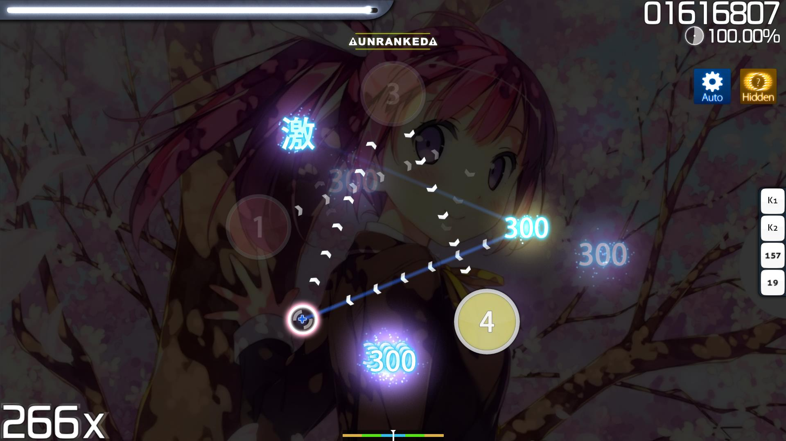
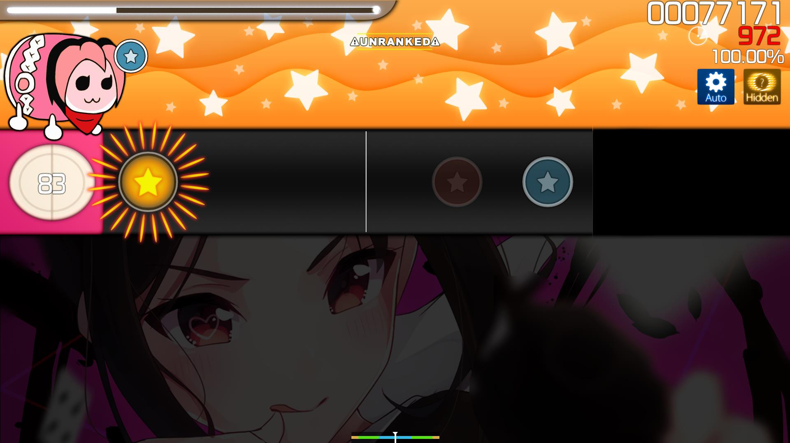
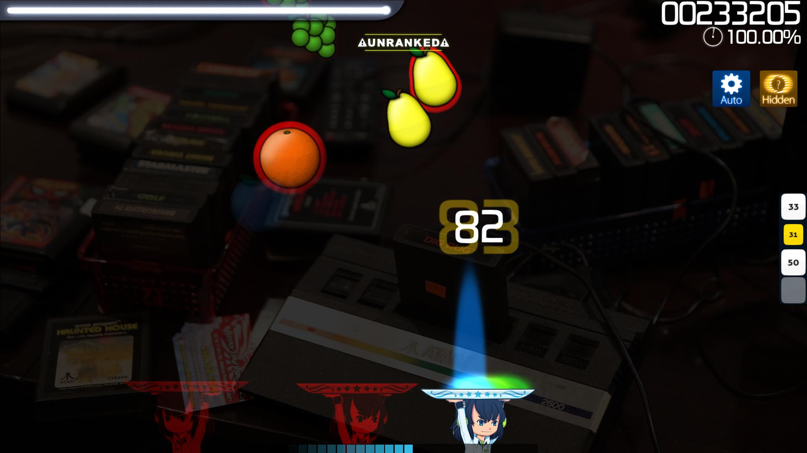

# Hidden (mod)

")

*Untuk melihat daftar keseluruhan dari semua mod, kunjungi: [Game Modifier](/wiki/id/Game_modifier)*\
*Berbeda konteks dengan [Fade In (mod)](/wiki/id/Game_modifier/Fade_In) ataupun [Flashlight (mod)](/wiki/id/Game_modifier/Flashlight).*

## Tentang

- Singkatan: HD
- Tipe: Peningkat Kesulitan
- Pengali skor:
  - ![][o!s] ![][o!t] ![][o!c]: 1.06x
  - ![][o!m]: 1.00x
  - Tombol shortcut default ([osu!mania](/wiki/Game_mode/osu!catch)): `F` `F` atau `Shift`+`F`
- Caption:
  - ![][o!s]: `Approach circle serta not-not akan memudar/menghilang perlahan-lahan, namun nilai maksimal Anda akan sedikit bertambah.`
  - ![][o!t]: `Not-not akan menghilang perlahan sebelum anda mengenainya!`
  - ![][o!c]: `Approach circle serta not-not akan memudar/menghilang perlahan-lahan, namun nilai maksimal Anda akan sedikit bertambah.`
  - ![][o!m]: `Not-not akan menghilang perlahan sebelum anda mengenainya!
- Mode-mode game yang cocok: ![][o!s] ![][o!t] ![][o!c] ![][o!m]
- Variasi (osu!mania): [Fade In](/wiki/id/Game_modifier/Fade_In)

## Description

Mod **Hidden** adalah sebuah [game modifier](/wiki/id/Game_modifier) yang meningkatkan kesulitan sebuah beatmap dengan menghilangkan approach circle dan menyebabkan [hit objek](/wiki/id/Hit_object) untuk memudar setelah muncul di layar.

### osu!standard

Pada [osu!standard](/wiki/Game_mode/osu!), mod Hidden melenyapkan approach circle dan menyebabkan [hit objek](/wiki/Hit_object) memudar setelah muncul dengan singkat, membuat para pemain harus setidaknya mengingat timing not-not dan—pada tingkat yang lebih rendah—penempatannya dan alur slidernya.

Perlu diperhatikan bahwa mod Hidden dianggap sebagai salah satu mod peningkat kesulitan yang paling mudah bagi para top player karena konsistensinya dalam kapan hit objek muncul dan hilang. Oleh karena konsistensi itu, sangat mungkin dipelajari kapan harus menekan hit objek hanya berdasarkan pada kapan objek tersebut itu menghilang.

### osu!taiko

Pada [osu!taiko](/wiki/Game_mode/osu!taiko), not-not memudar saat mereka berada setengah jalan pada layar, mengharuskan pemain untuk mengingat timing dan warna notenya. Namun, slider dan denden tetap berjalan melewati waktu penuh dan tidak memudar, dengan tambahan bahwa denden tidak mempunyai approach circle untuk menandakan kapan waktunya habis.

Pada beatmap yang mempunyai overall difficulty (OD) tinggi, mod Hidden biasanya digunakan oleh pemain yang berpengalaman untuk meningkatkan skor daripada menggunakan mod [Hard Rock (HR)](/wiki/id/Game_modififer/Hard_Rock) karena HR kadang-kadang membuat timing window terlalu kecil.

Tidak seperti osu!standard, mod Hidden pada osu!taiko biasanya dianggap lebih susah untuk dibaca atau "diharuskan terbiasa menggunakannya" karena mod ini membuat para pemain diharuskan mengingat warna yang akan datang selanjutnya.

### osu!catch

Pada [osu!catch](/wiki/Game_mode/osu!catch), mod Hidden menyebabkan fruit menghilang sekitar setengah jalan kebawah menuju layar.

Dampak kesulitan pada penggunaan mod Hidden untuk osu!catch berbeda-beda antarbeatmap, tetapi biasanya dianggap bahwa map-map dengan [approach rate (AR)](/wiki/Beatmapping/Approach_rate) 9 atau lebih tinggi membuat perbedaan yang sangat kecil dalam peningkatan kesusahan.

### osu!mania

Pada [osu!mania](/wiki/Game_mode/osu!mania), mod Hidden berfungsi sebagai semacam kebalikan dengan mod Fade in karena not-not memudar sebelum dikenai oleh pemain.

, pada 326x kombo (atas-tengah), pada 516x kombo (atas-kanan/bawah-kiri), dan pada 900x kombo (bawah-kanan) pada osu!mania")

## Trivia

- Mod Hidden pertama kali muncul di Ouendan 2, permainan jepang DS kedua pada seri [Osu! Tatake! Ouendan](/wiki/Ouendan) (seri awal yang menginspirasikan osu!).
- Bila pemain berhasil lolos melewati sebuah beatmap dengan nilai S atau SS menggunakan mod Hidden, pemain akan diberikan nilai variasi perak.
bawah `Gameplay`.
- Secara default, pada [osu!standard](/wiki/id/Game_mode/osu!) [approach circle](/wiki/id/Hit_object/Approach_circle) dari [hit objek](/wiki/Hit_object) yang pertama akan muncul untuk sementara pada awal map untuk membantu pemain memperkirakan kapan untuk menekan hit objek yang selanjutnya. Perlakuan ini bisa dimatikan di menu `Options`, terletak di bawah `Gameplay`.
- Pada osu!mania, mod Hidden adalah sebuah variasi dari mod [Fade In](/wiki/id/Game_modifier/Fade_In).
- Versi mod Hidden osu!mania yang seperti sekarang dulunya adalah mod terpisah bernama [Fade Out](/wiki/id/Game_modifier/Fade_Out).

[o!s]: /wiki/shared/mode/osu.png "osu!standard"
[o!t]: /wiki/shared/mode/taiko.png "osu!taiko"
[o!c]: /wiki/shared/mode/catch.png "osu!catch"
[o!m]: /wiki/shared/mode/mania.png "osu!mania"
