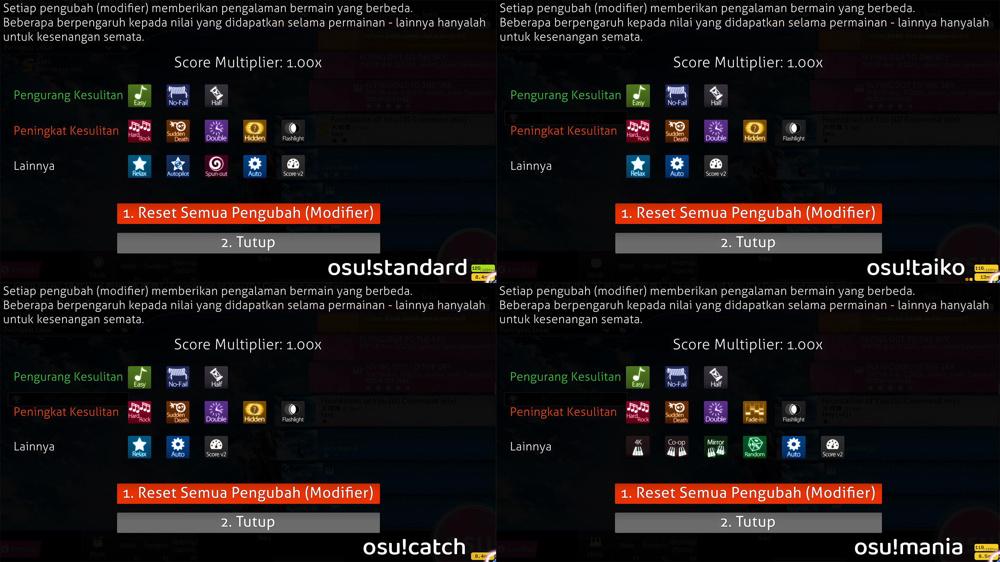

---
tags:
 - mod
 - game modifier
 - overview
 - list of mods
---

# Game modifier

*Untuk penggunaan lainnya, lihat [Mod (disambiguasi)](/wiki/Disambiguation/Mod).*

**Game modifier** (disingkat menjadi "mod") adalah sebuah modifikasi opsional terhadap elemen dan kesulitan dari sebuah [beatmap](/wiki/Beatmap) dimana pemain dapat mengaktifkannya melalui `Layar Pemilihan Mod` (diatas). Mod dapat membuat beatmap menjadi lebih mudah, lebih sulit, atau hanya untuk kesenangan biasa.

Pemain dapat mengakses `Layar Pemilihan Mod` pada layar pemilihan lagu dengan mengklik tombol `Mods` di pojok kiri bawah layar atau dengan menekan `F1`. Setelah memasuki `Layar Pemilihan Mod`, Shortcut untuk memilih mod tertentu juga tersedia. Shortcut tersebut dapat diubah melalui pengaturan.

Mod dibagi menjadi tiga kategori: `Pengurang Kesulitan`, `Peningkat Kesulitan`, dan `Spesial`, dan mereka juga dapat mengurangi, menambah, atau menghapus [`Pengali Skor`](/wiki/Score_multiplier). Ketika dua mod digunakan secara bersamaan, pengali skor tersebut akan dikalikan bersama (misalnya, `1.06x * 1.12x = 1.1872x`).

## Daftar mod

*Lihat juga: [Ringkasan (Game Modifier)](/wiki/Game_modifier/Summary)*

Setiap mod yang berada di bawah, mempunyai ikon dari mode permainan yang sesuai (![][osu!] ![][osu!taiko] ![][osu!catch] ![][osu!mania]) di samping kanan masing-masing mod.

### Pengurang kesulitan

- [Easy (EZ)](/wiki/Game_modifier/Easy) ![][osu!] ![][osu!taiko] ![][osu!catch] ![][osu!mania]
- [No Fail (NF)](/wiki/Game_modifier/No_Fail) ![][osu!] ![][osu!taiko] ![][osu!catch] ![][osu!mania]
- [Half Time (HT)](/wiki/Game_modifier/Half_Time) ![][osu!] ![][osu!taiko] ![][osu!catch] ![][osu!mania]

### Peningkat kesulitan

- [Hard Rock (HR)](/wiki/Game_modifier/Hard_Rock) ![][osu!] ![][osu!taiko] ![][osu!catch] ![][osu!mania]
- [Sudden Death (SD)](/wiki/Game_modifier/Sudden_Death) ![][osu!] ![][osu!taiko] ![][osu!catch] ![][osu!mania]
  - [Perfect (PF)](/wiki/Game_modifier/Perfect) ![][osu!] ![][osu!taiko] ![][osu!catch] ![][osu!mania]
- [Double Time (DT)](/wiki/Game_modifier/Double_Time) ![][osu!] ![][osu!taiko] ![][osu!catch] ![][osu!mania]
  - [Nightcore (NC)](/wiki/Game_modifier/Nightcore) ![][osu!] ![][osu!taiko] ![][osu!catch] ![][osu!mania]
- [Hidden (HD)](/wiki/Game_modifier/Hidden) ![][osu!] ![][osu!taiko] ![][osu!catch] ![][osu!mania]
  - [Fade In (FI)](/wiki/Game_modifier/Fade_In) ![][osu!mania]
- [Flashlight (FL)](/wiki/Game_modifier/Flashlight) ![][osu!] ![][osu!taiko] ![][osu!catch] ![][osu!mania]

### Spesial

- [Relax (RL)](/wiki/Game_modifier/Relax) ![][osu!] ![][osu!taiko] ![][osu!catch]
- [Autopilot (AP)](/wiki/Game_modifier/Autopilot) ![][osu!]
- [Spun Out (SO)](/wiki/Game_modifier/Spun_Out) ![][osu!]
- [1K, 2K, 3K, 4K, 5K, 6K, 7K, 8K, 9K (xK)](/wiki/Game_modifier/xK) ![][osu!mania]
- [Co-op (CP)](/wiki/Game_modifier/Co-op) ![][osu!mania]
- [Mirror (MR)](/wiki/Game_modifier/Mirror) ![][osu!mania]
- [Random (RD)](/wiki/Game_modifier/Random) ![][osu!mania]
- [Auto (AT)](/wiki/Game_modifier/Auto) ![][osu!] ![][osu!taiko] ![][osu!catch] ![][osu!mania]
  - [Cinema (CM)](/wiki/Game_modifier/Cinema) ![][osu!] ![][osu!taiko] ![][osu!catch] ![][osu!mania]
- [ScoreV2 (SV2)](/wiki/Game_modifier/ScoreV2) ![][osu!] ![][osu!taiko] ![][osu!catch] ![][osu!mania]
- [Target Practice (TP)](/wiki/Game_modifier/Target_Practice) ![][osu!] **Cutting Edge (Experimental) only**

### Lain-lain

*Catatan: Mod ini digunakan dan tersedia beberapa waktu lalu, tetapi sekarang sudah tidak tersedia.*

- [10K](/wiki/Game_modifier/10K) ![][osu!mania]
- [Fade Out](/wiki/Game_modifier/Fade_Out) ![][osu!mania]
- [No Video](/wiki/Game_modifier/No_Video) ![][osu!] ![][osu!taiko] ![][osu!catch] ![][osu!mania]

[osu!]: /wiki/shared/mode/osu.png "osu!"
[osu!taiko]: /wiki/shared/mode/taiko.png "osu!taiko"
[osu!catch]: /wiki/shared/mode/catch.png "osu!catch"
[osu!mania]: /wiki/shared/mode/mania.png "osu!mania"
