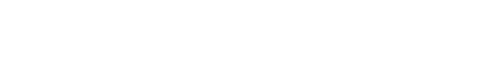
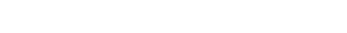
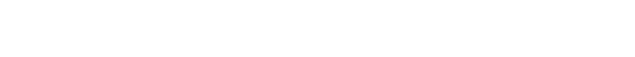
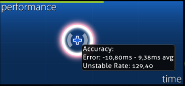

# Précision

La précision est une mesure en pourcentage de la capacité d'un joueur à toucher [les objets](/wiki/Gameplay/Hit_object) à temps. Il y a trois types de précision qu'un joueur peut avoir : la précision de la beatmap, qui dépend des scores de réussite obtenus ; la précision globale du joueur, qui est pondérée pour permettre aux meilleurs scores de ressortir davantage ; et la précision des [points de performance (pp)](/wiki/Performance_points) du joueur, qui dépend de la précision du score soumis.

## Modes de jeu

###  osu!



Dans osu!, la précision est calculée en pondérant le [jugement](/wiki/Gameplay/Judgement) obtenu pour chaque objet par sa valeur et divisé par le maximum possible.

Référence pour les cercles d'un seul coup :

```
300 -> 300 / 300 = 1   = 100.00%
100 -> 100 / 300 = 1/3 =  33.33%
50  ->  50 / 300 = 1/6 =  16.67%
0   ->   0 / 300 = 0   =   0.00%
```

###  osu!taiko


Dans osu!taiko, la précision est calculée en prenant la somme de la précision des notes (à quel point vous étiez proche de toucher la note à temps) divisée par le nombre total de notes notées jusqu'à présent. La précision des notes est indiquée comme suit : GREAT (良) (100%), GOOD (可) (50%) (moitié), et MISS/BAD (不可) (0%, ce qui rompt également le combo). Les drum rolls et les spinners n'influencent pas la précision.

###  osu!catch


Dans osu!catch, la précision est calculée en divisant le nombre total d'objets non spinner par le nombre total d'objets non spinner. Tous les objets ont la même valeur, à l'exception des bananes, car elles font partie des objets spinner.

*Notes pour les utilisateurs de [l'API](/wiki/osu!api) :*

- Le nombre de drops attrapés est retourné sous la forme `count100`.
- Le nombre de drops attrapés est retourné sous la forme `count50`.
- Le nombre de fruits *et* de drops miss cumulés est renvoyé sous la forme `countMiss`.
- Le nombre de droplets miss est renvoyé sous la forme `countKatu`.
- `countGeki` ne doit pas être utilisé pour calculer la précision. Il s'agit du nombre de fruits attrapés en fin de combo.

###  osu!mania

Dans osu!mania, la précision est calculée de façon similaire à [osu!](#osu!). Cependant, la pondération des rainbow 300 (également appelés résultats MAX) dépend de l'activation ou non de ScoreV2.

Sans ScoreV2 actif, les rainbow 300 et les gold 300 ont un poids égal de 300 :



ScoreV2 augmente la pondération des rainbow 300 à 305 :



*Notes pour les utilisateurs de l'API :*

- Le nombre de rainbow 300s est retourné sous la forme `countGeki`.
- Le nombre de 200 est renvoyé sous la forme `countKatu`.

## Graphique de performance



Le graphique de performance est un tableau qui affiche la performance du joueur (basée sur sa barre de vie) au cours d'une partie (temps). Des informations supplémentaires peuvent être affichées lorsque le curseur passe dessus.

*Remarque : les informations supplémentaires ne peuvent être consultées qu'après avoir joué une beatmap ou regardé un replay. Après avoir quitté [écran des résultats](/wiki/Client/Interface#écran-des-résultats), ces informations ne seront pas sauvegardées.*

### Précision

Lorsque l'on survole le graphique de performance, une infobulle s'affiche avec une note `Error` et `Unstable Rate`.

En raison de la façon dont les mods [DT](/wiki/Gameplay/Game_modifier/Double_Time) (Double Time) et [HT](/wiki/Gameplay/Game_modifier/Half_Time) (Half Time) sont implémentés, les valeurs error et unstable rate seront multipliées par le même facteur que la musique. Pour obtenir les valeurs réelles lorsque vous jouez avec le mod DT, divisez les résultats par 1,5. De même, multipliez les résultats par 1,33 lorsque vous jouez avec le mode HT.

#### Error

`Error` affichera toujours deux valeurs qui représentent l'écart moyen des premiers coups et l'écart moyen des derniers coups. Plus la valeur [Overall Difficulty](/wiki/Beatmap/Overall_difficulty) de la beatmap est élevée, plus les valeurs error doivent être faibles pour obtenir de bons résultats.

#### Unstable rate

*Page principale : [Unstable rate](/wiki/Gameplay/Unstable_rate)*

`Unstable Rate` (*UR*) affiche [l'écart-type](https://fr.wikipedia.org/wiki/%C3%89cart_type) des erreurs de frappe, en dixièmes de millisecondes. Un UR plus faible indique une plus grande cohérence.

Notez que la cohérence n'est pas la même chose que la précision. Alors qu'un UR faible est souvent le résultat d'un jeu précis, il est possible d'obtenir un UR très faible en même temps qu'une précision très faible. Par exemple, un joueur peut toucher chaque [objet](/wiki/Gameplay/Hit_object) suffisamment tard pour obtenir un [50](/wiki/Gameplay/Judgement/osu!), mais avec des erreurs constantes.

### Spin

*Remarque : le spin n'est utilisé que pour le mode de jeu [osu!](/wiki/Game_mode/osu!).*

En plus de l'exactitude, certaines informations concernant les spinners sont également affichées dans la même infobulle.

#### Speed

La vitesse représente le nombre moyen de tours par minute (RPM) sur tous les spinners de la beatmap. `Max` est la vitesse la plus élevée atteinte par le joueur sur l'un des spinners de la beatmap.
