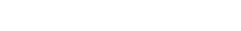
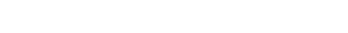
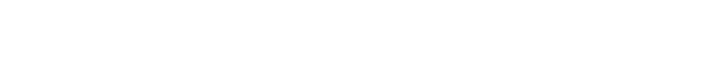
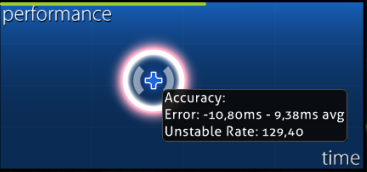

# Akurasi

<!-- TODO: images could be in a more friendly font, wording is sometimes too... wordy -->

Akurasi adalah suatu nilai persentil pengukur konsistensi pemain untuk menekan [hit object](/wiki/Gameplay/Hit_object) dengan tepat. Terdapat tiga jenis akurasi yang dimiliki pemain: akurasi keseluruhan pada beatmap, yang bergantung pada hit skor dari keseluruhan hit object yang diperoleh; akurasi keseluruhan pemain, yang ditimbang untuk memungkinkan skor yang lebih baik dan menonjol; dan akurasi [Performance Point (pp)](/wiki/Performance_points) pada pemain, yang bergantung pada akurasi skor yang terkirim.

## Mode permainan

###  osu!



Di osu!, akurasi dikalkulasi dengan menimbang [judgement](/wiki/Gameplay/Judgement) yang diperoleh dari setiap hit objek berdasarkan nilainya dan dibagi dengan jumlah maksimum yang mungkin.

Referensi untuk satu hit lingkaran:

```
300 -> 300 / 300 = 1   = 100.00%
100 -> 100 / 300 = 1/3 =  33.33%
50  ->  50 / 300 = 1/6 =  16.67%
0   ->   0 / 300 = 0   =   0.00%
```

###  osu!taiko


Di osu!taiko, akurasi dikalkulasikan dengan mengambil jumlah akurasi not dibagi dengan jumlah not. Akurasi not adalah sebagai berikut: sebuah GREAT (良) dihitung sebagai 100%, GOOD (可) sebagai 50% (sebagian), dan MISS/BAD (不可) sebagai 0% (yang juga memutus combo). Drum roll dan spinner tidak mempengaruhi akurasi.

###  osu!catch


Di osu!catch, akurasi dikalkulasi dengan mengambil jumlah hit objek tanpa spinner terambil dibagi dengan jumlah hit objek tanpa spinner. Semua hit objek mempunyai nilai sama, kecuali pisang, karena mereka merupakan bagian dari spinner.

*Catatan untuk pengguna [API](/wiki/osu!api):*

- Jumlah tetesan yang tertangkap dikembalikan sebagai `count100`.
- Jumlah tetesan kecil yang tertangkap dikembalikan sebagai `count50`.
- Jumlah kumulatif buah *dan* tetesan yang terlewat dikembalikan sebagai `countMiss`.
- Jumlah tetesan yang terlewat dikembalikan sebagai `countKatu`.
- `countGeki` tidak boleh digunakan untuk menghitung akurasi sama sekali. `countGeki` adalah jumlah buah pemutus kombo yang tertangkap.

###  osu!mania

Di osu!mania, akurasi dikalkulasi mirip dengan [osu!](#osu!). Namun, pembobotan 300 pelangi (juga disebut MAX) bergantung pada apakah mod ScoreV2 sedang aktif atau tidak.

Jika ScoreV2 tidak aktif, 300 pelangi dan 300 emas akan memiliki bobot yang sama, yaitu 300:



ScoreV2 menaikkan bobot 300 pelangi menjadi 305:



*Catatan untuk pengguna API:*

- Jumlah 300 pelangi dikembalikan sebagai `countGeki`.
- Jumlah 200 dikembalikan sebagai `countKatu`.

## Grafik performa



Grafik performa adalah sebuah grafik yang menampilkan performa pemain (berdasarkan bar nyawa) selama bermain (waktu). Informasi tambahan dapat ditampilkan dengan menunjuk kursor dalam-game di atasnya.

::: alert-notice
**Catatan**: Informasi tambahan hanya dapat dilihat setelah bermain sebuah beatmap atau menonton sebuah putaran ulang terekspor. Setelah keluar dari [layar hasil](/wiki/Client/Interface#papan-peringkat-skor-daring), informasi ini tidak akan tersimpan.
:::

### Akurasi

Saat menggerakkan kursor ke grafik performa, sebuah tooltip akan ditampilkan dengan informasi tentang *Error* dan *Unstable Rate*.

Sebab saat mod [DT](/wiki/Gameplay/Game_modifier/Double_Time) (Double Time) dan [HT](/wiki/Gameplay/Game_modifier/Half_Time) (Half Time) diimplementasikan, nilai error dan unstable rate akan dikalikan dengan faktor yang sama dengan lagu. Untuk mendapat nilai asli saat bermain DT, bagi hasil dengan 1.5. Sama halnya, kalikan hasil dengan 1.33 saat bermain HT.

#### Error

`Error` akan selalu menampilkan dua nilai yang mewakili seberapa jauh hit yang lebih dahulu dari rata-rata dan seberapa jauh hit yang lebih lambat dari rata-rata. Semakin besar nilai [Overall Difficulty](/wiki/Beatmap/Overall_difficulty) dari suatu beatmap, semakin kecil nilai kesalahan yang harus dilakukan saat bermain beatmap.

#### Unstable Rate

::: alert-note
**Halaman Utama:** [Unstable rate](/wiki/Gameplay/Unstable_rate)
:::

`Unstable Rate` (*UR*) menampilkan nilai hit error [simpangan baku](https://id.wikipedia.org/wiki/Simpangan_baku), yang diukur dalam satuan sepersepuluh milidetik. Nilai UR yang lebih rendah menandakan permainan yang lebih konsisten.

Perhatikan bahwa nilai ini mengukur konsistensi, bukan akurasi. Meskipun nilai UR yang rendah biasanya merupakan hasil dari permainan yang akurat, sangat mungkin untuk mendapatkan nilai UR yang sangat rendah sekaligus akurasi yang sangat rendah. Contohnya, seorang pemain bisa mengetuk setiap [objek](/wiki/Gameplay/Hit_object) cukup terlambat untuk mendapatkan [50](/wiki/Gameplay/Judgement/osu!), namun dengan kesalahan yang konsisten.

### Spin

::: alert-notice
**Catatan:** Spin hanya berlaku untuk mode permainan [osu!](/wiki/Game_mode/osu!).
:::

Sebagai tambahan untuk akurasi, beberapa informasi mengenai spinner juga terdapat di tooltip yang sama.

#### Kecepatan

Kecepatan mewakili rata-rata RPM (revolutions per minute) di semua spinner dalam beatmap. `Max` adalah RPM tertinggi yang dapat dicapai oleh pemain pada spinner mana pun di dalam beatmap.
