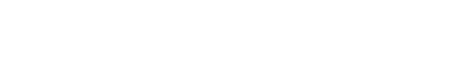
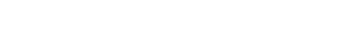
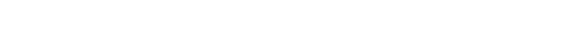
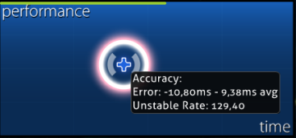

# Akurasi

<!-- TODO: images could be in a more friendly font, wording is sometimes too... wordy -->

Akurasi adalah nilai persentil yang mengukur seberapa konsisten pemain dalam mengenai [objek permainan](/wiki/Gameplay/Hit_object) secara tepat waktu. Terdapat tiga jenis akurasi yang dimiliki pemain: akurasi beatmap (*beatmap accuracy*), yang bergantung pada skor hit dari keseluruhan objek permainan yang dikenai; akurasi keseluruhan (*overall accuracy*), yang dibebankan sedemikian rupa untuk memungkinkan skor yang lebih baik agar lebih menonjol; serta akurasi [Performance Point (pp)](/wiki/Performance_points), yang bergantung pada akurasi skor-skor yang terkirim.

## Mode permainan

###  osu!



Di osu!, akurasi dikalkulasi dengan menimbang [judgement](/wiki/Gameplay/Judgement) yang diperoleh dari setiap hit objek berdasarkan nilainya dan dibagi dengan jumlah maksimum yang mungkin.

Referensi untuk satu hit lingkaran:

```
300 -> 300 / 300 = 1   = 100.00%
100 -> 100 / 300 = 1/3 =  33.33%
50  ->  50 / 300 = 1/6 =  16.67%
0   ->   0 / 300 = 0   =   0.00%
```

###  osu!taiko


Di osu!taiko, akurasi dikalkulasikan dengan mengambil jumlah akurasi not dibagi dengan jumlah not. Akurasi not adalah sebagai berikut: sebuah GREAT (良) dihitung sebagai 100%, GOOD (可) sebagai 50% (sebagian), dan MISS/BAD (不可) sebagai 0% (yang juga memutus combo). Drum roll dan spinner tidak mempengaruhi akurasi.

###  osu!catch


Di osu!catch, akurasi dikalkulasi dengan mengambil jumlah hit objek tanpa spinner terambil dibagi dengan jumlah hit objek tanpa spinner. Semua hit objek mempunyai nilai sama, kecuali pisang, karena mereka merupakan bagian dari spinner.

*Catatan untuk pengguna [API](/wiki/osu!api):*

- Jumlah drop yang tertangkap diberikan sebagai `count100`.
- Jumlah tetesan kecil yang tertangkap diberikan sebagai `count50`.
- Jumlah buah *dan* droplet yang luput ditangkap secara kumulatif diberikan sebagai `countMiss`.
- Jumlah droplet yang luput ditangkap diberikan sebagai `countKatu`.
- `countGeki` sebaiknya tidak digunakan untuk menghitung akurasi sama sekali. Nilai ini adalah jumlah buah di akhir kombo yang tertangkap.

###  osu!mania

Di osu!mania, akurasi dihitung dengan rumus yang mirip dengan yang ada pada mode permainan [osu!](#osu!). Bedanya, osu!mania memiliki pembobotan 300 pelangi (atau yang juga disebut MAX) yang nilainya akan bergantung pada apakah mod ScoreV2 sedang aktif atau tidak.

Jika ScoreV2 tidak aktif, 300 pelangi dan 300 emas akan memiliki bobot yang sama, yaitu 300:



ScoreV2 menaikkan bobot 300 pelangi menjadi 305:



*Catatan untuk pengguna API:*

- Jumlah 300 pelangi diberikan sebagai `countGeki`.
- Jumlah 200 diberikan sebagai `countKatu`.

## Grafik performa



Grafik performa adalah sebuah grafik yang menampilkan performa pemain (berdasarkan bar nyawa) selama bermain (waktu). Informasi tambahan dapat ditampilkan dengan menunjuk kursor dalam-game di atasnya.

::: alert-notice
**Catatan**: Informasi tambahan ini hanya bisa dilihat setelah memainkan beatmap atau menonton tayangan ulang yang diekspor. Setelah pemain keluar dari [layar hasil](/wiki/Client/Interface#papan-peringkat-skor-daring), informasi ini tidak akan disimpan.
:::

### Akurasi

Saat menggerakkan kursor ke grafik performa, sebuah tooltip akan ditampilkan dengan informasi tentang *Error* dan *Unstable Rate*.

Karena cara kerja dari mod [DT](/wiki/Gameplay/Game_modifier/Double_Time) (Double Time) dan [HT](/wiki/Gameplay/Game_modifier/Half_Time) (Half Time), nilai error dan unstable rate yang diperoleh akan dikalikan dengan laju pemutaran lagu itu sendiri. Untuk mendapat nilai error dan unstable rate yang asli pada saat bermain DT, bagi nilai ini dengan 1.5. Begitu juga dengan HT, kalikan nilai ini dengan 1.33.

#### Error

`Error` akan selalu menampilkan dua nilai yang mewakili seberapa jauh hit yang lebih dahulu dari rata-rata dan seberapa jauh hit yang lebih lambat dari rata-rata. Semakin besar nilai [Overall Difficulty](/wiki/Beatmap/Overall_difficulty) dari suatu beatmap, semakin kecil nilai kesalahan yang harus dilakukan saat bermain beatmap.

#### Unstable Rate

::: alert-note
**Halaman Utama:** [Unstable rate](/wiki/Gameplay/Unstable_rate)
:::

`Unstable Rate` (*UR*) adalah nilai [simpangan baku](https://id.wikipedia.org/wiki/Simpangan_baku) dari hit error yang diukur dalam satuan sepersepuluh milidetik. Nilai UR yang lebih rendah menandakan permainan yang lebih konsisten.

Mohon diperhatikan bahwa nilai ini mengukur konsistensi pemain, bukan akurasi. Meskipun nilai UR yang rendah biasanya menandakan permainan yang akurat, sangat mungkin bagi pemain untuk mendapatkan nilai UR sekaligus akurasi yang sangat rendah. Contohnya, seorang pemain bisa saja berkali-kali mengenai semua [objek permainan](/wiki/Gameplay/Hit_object) dengan cukup terlambat untuk mendapatkan [50](/wiki/Gameplay/Judgement/osu!) di sepanjang permainan.

### Spin

::: alert-notice
**Catatan:** Spin hanya berlaku untuk mode permainan [osu!](/wiki/Game_mode/osu!).
:::

Sebagai tambahan untuk akurasi, beberapa informasi mengenai spinner juga terdapat di tooltip yang sama.

#### Kecepatan

Kecepatan mencerminkan nilai RPM (*revolutions per minute*/perputaran per menit) rata-rata pemain di antara semua spinner yang ada pada beatmap. `Max` adalah nilai RPM tertinggi yang berhasil dicapai oleh pemain pada spinner mana pun pada beatmap.
