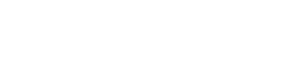
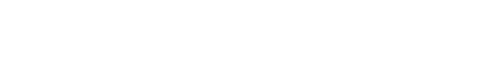

# 정확도

정확도는 플레이어의 일관성을 표시합니다. 플레이어가 가질 수 있는 정확도는 세 가지 타입으로 분류할 수 있습니다. 첫 번째로 비트맵에서 얻은 점수에 따라 좌우되는 정확도입니다. 두 번째로 더 좋은 점수를 돋보이게 하기 위해 가중치가 적용된 점수의 전반적인 정확도입니다. 마지막은 [퍼포먼스 포인트](/wiki/Performance_points) 정확도로, 제출된 점수의 정확도에 따라 달라집니다.

## 게임에서 사용되는 모드

###  osu!



osu!에서 정확도는 각 서클의 [판정](/wiki/Gameplay/Judgement)에 따라 가중치를 부여해 더한 뒤, 각 맵의 최대 서클 개수로 나누어서 계산합니다.

서클 1개 당 정확도 판정:

```
300 -> 300 / 300 = 1   = 100.00%
100 -> 100 / 300 = 1/3 =  33.33%
50  ->  50 / 300 = 1/6 =  16.67%
0   ->   0 / 300 = 0   =   0.00%
```

###  osu!taiko


osu!taiko의 경우 노트 정확도의 합을 노트 수로 나누어 정확도를 계산합니다. 정확도 점수는 다음과 같습니다. GREAT(良)는 100%로, GOOD(可)는 50%로, MISS/BAD(不可)는 0%로 계산됩니다 (또는 콤보 중단). 드럼 롤과 스피너는 정확성에 영향을 주지 않습니다.

###  osu!catch


osu!catch에서는 스피너가 아닌 히트 오브젝트를 얻은 갯수를 총 갯수로 나누어 정확도를 계산합니다. 모든 히트 오브젝트는 스피너로 취급되는 바나나를 제외하고 동일한 값을 가집니다.

*API 사용 시 추가 정보: osu!catch에서 정확도를 계산할 때는, droplets의 갯수는 `count50`에 표시되며, 놓친 droplets의 갯수는 `countkatu`에 표시됩니다.*

###  osu!mania



osu!mania의 정확도는 [osu!](#-osu!)와 유사하게 계산됩니다.

## 퍼포먼스 그래프


퍼포먼스 그래프는 플레이하는 동안 체력 바의 변동 여부를 나타내는 그래프입니다. 게임 내 커서를 그래프 위에 놓으면 추가 정보가 표시됩니다.

*참고: 추가 정보는 비트맵 리플레이를 시청하거나 자신의 플레이가 끝난 후에만 볼 수 있습니다. [결과 화면](/wiki/Client/Interface#결과-화면)에서 넘어간 후에는 이 정보가 저장되지 않습니다.*

### 정확도

게임 내 커서를 그래프 위에 놓으면 *에러*와 *불안정한 정도*가 툴팁으로 표시됩니다.

[더블 타임](/wiki/Gameplay/Game_modifier/Double_Time)이나 [하프 타임](/wiki/Gameplay/Game_modifier/Half_Time) 모드를 사용한 경우 정확한 값을 나타내지 않습니다. 더블 타임으로 플레이 할 때 정확한 값을 얻으려면 측정된 값에 1.5를 나누어야 합니다. 마찬가지로 하프 타임를 플레이할 때에는 측정된 값에 1.33을 곱하셔야 합니다.

#### 에러 (Error)

에러는 자신의 평균 판정 값에서 제일 느린 값과 제일 빠른 값을 표시해줍니다. 비트맵의 [Overall Difficulty](/wiki/Beatmap/Overall_difficulty) 값이 높을수록, 판정이 더 엄격해지기 때문에 이 에러 값을 좁힐 수 있도록 플레이해야 할 것입니다.

#### 불안정한 정도 (Unstable rate)

불안정한 정도는 숫자가 낮을 수록 히트 타이밍의 일관성이 높다는 것을 나타냅니다. (탑 랭커에 속하는 플레이어는 종종 이 수치가 100 이하로 나오기도 합니다) 이 값은 정확도가 아닌 일관성을 측정하므로 만약 플레이 내내 15ms 만큼 빠르게 쳤다고 해도 일관성이 높다고 할 수 있습니다. 공식은 기본적으로 판정 오차의 표준 편차(밀리초)에 10을 곱한 값입니다. [샘플 코드](https://gist.github.com/peppy/3a11cb58c856b6af7c1916422f668899)를 통해 불안정한 정도의 값을 어떻게 계산하는 지 자세하게 알아볼 수 있습니다.

### 스핀 (Spin)

*참고: 스핀은 [osu!](/wiki/Game_mode/osu!)에서만 표시됩니다.*

정확성 외에 스핀에 관한 일부 정보도 퍼포먼스 그래프 툴팁에 표시됩니다.

#### 속도 (Speed)

속도는 해당 비트맵의 모든 스피너에 대한 평균 RPM(분당 회전 수)을 나타냅니다. Max는 이 중 가장 높은 RPM을 기록한 숫자가 표시됩니다.
