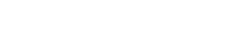

# Celność

Celność to procentowa wartość określająca, jak precyzyjnie gracz trafia [obiekty](/wiki/Gameplay/Hit_object). W grze istnieją trzy różne rodzaje celności: celność beatmapy, przedstawiająca celność poszczególnych trafień na danej beatmapie; ogólna celność gracza, ważona w celu podkreślenia lepszych wyników; oraz celność [pp](/wiki/Performance_points), zależna od celności wyników uzyskanych na rankingowych beatmapach.

## Tryby gry

###  osu!



W trybie osu! celność jest obliczana poprzez ważenie [osądu](/wiki/Gameplay/Judgement) za każde trafienie zgodnie z jego wartością, a następnie podzielenie tej wartości przez maksymalną możliwą do uzyskania wartość.

Wartości dla pojedynczego kółka:

```
300 -> 300 / 300 = 1   = 100.00%
100 -> 100 / 300 = 1/3 =  33.33%
50  ->  50 / 300 = 1/6 =  16.67%
0   ->   0 / 300 = 0   =   0.00%
```

###  osu!taiko


W trybie osu!taiko celność jest obliczana poprzez zsumowanie celności trafień poszczególnych obiektów, a następnie podzielenie jej przez liczbę dotychczas trafionych obiektów. Celności trafień są oznaczane jako GREAT (良) (o wartości 100%), GOOD (可) (o wartości 50%) oraz MISS/BAD (不可) (o wartości 0%; ponadto przerywa combo). Slidery oraz spinnery nie mają wpływu na celność.

###  osu!catch


W trybie osu!catch celność jest obliczana poprzez podzielenie liczby złapanych obiektów przez liczbę wszystkich obiektów. Wszystkie obiekty mają tę samą wartość. Banany, które są częścią spinnerów, nie są brane pod uwagę przy obliczaniu celności.

*Informacje dla osób korzystających z [API](/wiki/osu!api):*

- Liczba złapanych dużych pestek jest zwracana jako `count100`.
- Liczba złapanych pestek jest zwracana jako `count50`.
- Suma niezłapanych owoców *oraz* dużych pestek jest zwracana jako `countMiss`.
- Liczba niezłapanych pestek jest zwracana jako `countKatu`.
- `countGeki` nie powinno być używane do obliczania celności. Jest to liczba złapanych owoców, które doprowadziły do przerwania combo.

###  osu!mania

W trybie osu!mania celność jest obliczana podobnie jak w trybie [osu!](#osu!). Należy jednak pamiętać, że waga tęczowych 300-tek (nazywanych również MAX) różni się w zależności od tego, czy używany jest system ScoreV2.

W ScoreV1 zarówno tęczowe, jak i złote 300-tki mają taką samą wartość, wynoszącą 300:


ScoreV2 zwiększa wartość tęczowych 300-tek z 300 na 305:


*Informacje dla osób korzystających z API:*

- Liczba tęczowych 300-tek jest zwracana jako `countGeki`.
- Liczba 200-tek jest zwracana jako `countKatu`.

## Wykres wyniku


Wykres wyniku przedstawia zmianę wartości punktów życia gracza w trakcie rozgrywki. Po najechaniu kursorem na wykres wyświetlają się dodatkowe informacje.

::: alert-notice
Dodatkowe informacje wyświetlą się jedynie po zagraniu beatmapy lub obejrzeniu zapisanej wcześniej powtórki. Po opuszczeniu [ekranu wyniku](/wiki/Client/Interface#ekran-wyniku) informacje te nie zostaną zapisane.*
:::

### Celność

Po najechaniu na wykres wyniku pojawia się okno z *zakresem błędu* (`Error`) i *wskaźnikiem stabilności* (`Unstable Rate`).

Ze względu na ich sposób działania, mody [DT](/wiki/Gameplay/Game_modifier/Double_Time) (Double Time) oraz [HT](/wiki/Gameplay/Game_modifier/Half_Time) (Half Time) modyfikują obie wartości zgodnie ze współczynnikiem zmiany tempa utworu. Aby uzyskać rzeczywiste wartości, należy je podzielić przez 1,5 w przypadku grania z modem DT, lub pomnożyć przez 1,33 w przypadku grania z modem HT.

#### Zakres błędu

Zakres błędu (`Error`) zawsze składa się z dwóch wartości. Pierwsza z nich oznacza średnie odchylenie dla zbyt wczesnych trafień, a druga dla trafień zbyt późnych. Im większa jest [ogólna trudność](/wiki/Beatmap/Overall_difficulty) beatmapy, tym mniejsze będą musiały być te wartości, aby uzyskać dobry wynik.

#### Wskaźnik stabilności

::: alert-note
**Główny artykuł:** [Wskaźnik stabilności](/wiki/Gameplay/Unstable_rate)
:::

Wskaźnik stabilności (`Unstable Rate`, często skracane do *UR*) określa odchylenie standardowe błędów trafień, wyrażone w dziesiątych częściach milisekundy. Niższa wartość oznacza większą stabilność trafień.

Należy pamiętać, że stabilność to nie to samo co celność. Niska wartość UR najczęściej jest osiągana w wyniku dużej celności, jednak jest możliwe uzyskanie bardzo niskiego UR przy jednoczesnym trafianiu obiektów z bardzo niską celnością. Przykładowo, gracz mógłby trafić każdy obiekt z tak samo dużym opóźnieniem, uzyskując za każdym razem 50-tkę.

### Kręcenie spinnerami

::: alert-notice
Wartości te są wyświetlane jedynie przy wynikach w [trybie osu!](/wiki/Game_mode/osu!).
:::

Oprócz celności wykres wyniku przedstawia również wyświetlane niektóre informacje dotyczące spinnerów (`Spin`).

#### Prędkość

Prędkość (`Speed`) określa średnią wartość obrotów na minutę (RPM) dla wszystkich spinnerów w beatmapie. `Max` oznacza maksymalną wartość uzyskaną na którymkolwiek ze spinnerów beatmapy.
