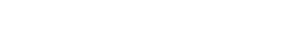
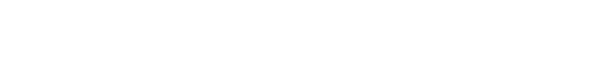
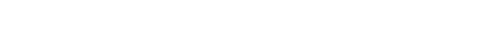
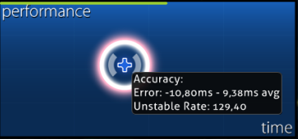

# ความแม่นยำ (Accuracy)

<!-- TODO: images could be in a more friendly font, wording is sometimes too... wordy -->

**ความแม่นยำ (Accuracy)** คือการวัดผลในรูปแบบเปอร์เซ็นต์ของความสามารถในการกด [วัตถุ (Hit objects)](/wiki/Gameplay/Hit_object) ให้ตรงตามจังหวะเวลาที่กำหนด ความแม่นยำมีทั้งหมด 3 ประเภทที่ผู้เล่นควรทราบ ได้แก่: ความแม่นยำของแต่ละบีทแมพ (อิงตามคะแนนการกดที่ได้รับ), ความแม่นยำโดยรวมของผู้เล่น (ซึ่งจะมีการถ่วงน้ำหนักเพื่อให้คะแนนที่ดีโดดเด่นขึ้น) และความแม่นยำสำหรับ [Performance Points (pp)](/wiki/Performance_points) (ซึ่งอิงตามผลการเล่นที่ส่งเข้าระบบ)

## โหมดการเล่นต่างๆ

###  osu!



ในโหมด osu! ความแม่นยำจะถูกคำนวณโดยการนำน้ำหนักคะแนนจาก [การตัดสิน (Judgement)](/wiki/Gameplay/Judgement) ที่ได้รับจากแต่ละวัตถุมาคูณด้วยค่าคะแนนของมัน แล้วหารด้วยคะแนนสูงสุดที่เป็นไปได้

ตัวอย่างน้ำหนักคะแนนสำหรับวงกลม (Hit circle) 1 อัน:

```
300 -> 300 / 300 = 1   = 100.00%
100 -> 100 / 300 = 1/3 =  33.33%
50  ->  50 / 300 = 1/6 =  16.67%
0   ->   0 / 300 = 0   =   0.00%
```

###  osu!taiko


ในโหมด osu!taiko ความแม่นยำจะคำนวณจากผลรวมของความแม่นยำในแต่ละโน้ต (ว่าคุณกดได้ใกล้เคียงจังหวะเพียงใด) หารด้วยจำนวนโน้ตทั้งหมดที่กดไป การตัดสินจะแบ่งเป็น GREAT (良) (นับเป็น 100%), GOOD (可) (นับเป็น 50%) และ MISS/BAD (不可) (นับเป็น 0% และจะทำให้คอมโบหลุด) ส่วน Drum rolls และ Spinner จะไม่มีผลต่อความแม่นยำ

###  osu!catch


ในโหมด osu!catch ความแม่นยำจะคำนวณจากจำนวนรวมของวัตถุที่ไม่ใช่ Spinner ทั้งหมดที่รับได้ หารด้วยจำนวนวัตถุทั้งหมดที่ไม่ใช่ Spinner วัตถุทุกชิ้นมีค่าเท่ากัน ยกเว้นกล้วยซึ่งเป็นส่วนหนึ่งของ Spinner

*หมายเหตุสำหรับผู้ใช้งาน [API](/wiki/osu!api):*

- จำนวนหยดน้ำใหญ่ (Drops) ที่รับได้จะถูกส่งกลับมาในค่า `count100`
- จำนวนหยดน้ำเล็ก (Droplets) ที่รับได้จะถูกส่งกลับมาในค่า `count50`
- จำนวนผลไม้และหยดน้ำใหญ่ที่พลาดรวมกันจะถูกส่งกลับมาในค่า `countMiss`
- จำนวนหยดน้ำเล็กที่พลาดจะถูกส่งกลับมาในค่า `countKatu`
- ห้ามใช้ `countGeki` ในการคำนวณความแม่นยำ เนื่องจากเป็นเพียงตัวนับผลไม้ที่จบชุดคอมโบเท่านั้น

###  osu!mania

ในโหมด osu!mania ความแม่นยำจะคำนวณคล้ายกับโหมด [osu!](#osu!) อย่างไรก็ตาม น้ำหนักคะแนนของ Rainbow 300 (หรือที่เรียกว่า MAX) จะขึ้นอยู่กับว่ามีการเปิดใช้งาน ScoreV2 หรือไม่

หากไม่ได้เปิด ScoreV2 (ใช้ ScoreV1) ทั้ง Rainbow 300 และ Gold 300 จะมีน้ำหนักเท่ากับ 300:



หากเปิดใช้งาน ScoreV2 จะเพิ่มน้ำหนักคะแนนของ Rainbow 300 เป็น 305:



*หมายเหตุสำหรับผู้ใช้งาน API:*

- จำนวน Rainbow 300 จะถูกส่งกลับมาในค่า `countGeki`
- จำนวน 200 จะถูกส่งกลับมาในค่า `countKatu`

## กราฟประสิทธิภาพ (Performance graph)



กราฟประสิทธิภาพคือแผนภูมิที่แสดงประสิทธิภาพการเล่นของผู้เล่น (อิงตามแถบพลังชีวิต) ตลอดช่วงระยะเวลาของเพลง ข้อมูลเพิ่มเติมจะแสดงขึ้นเมื่อคุณวางเคอร์เซอร์เมาส์เหนือจุดต่างๆ บนกราฟ

*หมายเหตุ: ข้อมูลเพิ่มเติมนี้สามารถดูได้หลังจากจบแมพหรือดู Replay เท่านั้น เมื่อออกจาก [หน้าสรุปผล](/wiki/Client/Interface#results-screen) ข้อมูลเหล่านี้จะไม่ถูกบันทึก*

### ความแม่นยำ (Accuracy)

เมื่อวางเมาส์เหนือกราฟประสิทธิภาพ จะมีหน้าต่างเล็กๆ (Tooltip) แสดงค่า `Error` และ `Unstable Rate`

เนื่องจากรูปแบบการทำงานของ Mod [DT](/wiki/Gameplay/Game_modifier/Double_Time) (Double Time) และ [HT](/wiki/Gameplay/Game_modifier/Half_Time) (Half Time) ค่า Error และ Unstable Rate จะถูกคูณด้วยตัวคูณเดียวกับความเร็วเพลง หากต้องการทราบค่าที่แท้จริงเมื่อใช้ DT ให้หารผลลัพธ์ด้วย 1.5 และหากใช้ HT ให้คูณผลลัพธ์ด้วย 1.33

#### Error (ค่าความผิดพลาด)

`Error` จะแสดงตัวเลขสองค่าที่บอกว่าโดยเฉลี่ยแล้วคุณกดเร็วไป (Early) หรือช้าไป (Late) เพียงใด ยิ่งบีทแมพมีค่า [ความยากโดยรวม (Overall Difficulty)](/wiki/Beatmap/Overall_difficulty) สูงเท่าไหร่ ค่าความผิดพลาดของคุณจะต้องยิ่งต่ำลงเพื่อให้ได้คะแนนที่ดี

#### Unstable rate (ค่าความไม่เสถียร)

*หน้าหลัก: [Unstable rate](/wiki/Gameplay/Unstable_rate)*

`Unstable Rate` (*UR*) แสดงค่า [ส่วนเบี่ยงเบนมาตรฐาน](https://en.wikipedia.org/wiki/Standard_deviation) ของความผิดพลาดในการกด มีหน่วยเป็นเศษหนึ่งส่วนสิบของมิลลิวินาที ค่า UR ที่ต่ำกว่าหมายถึงความเสถียรในการกดที่ดีกว่า

โปรดทราบว่าความเสถียรไม่ใช่สิ่งเดียวกับความแม่นยำ แม้ว่าค่า UR ต่ำมักจะเกิดจากการเล่นที่แม่นยำ แต่คุณก็สามารถมีค่า UR ต่ำมากพร้อมกับความแม่นยำที่ต่ำมากได้เช่นกัน ตัวอย่างเช่น หากผู้เล่นกดโน้ตทุกตัวช้าไปในระดับเดียวกันจนได้ [50](/wiki/Gameplay/Judgement/osu!) ทั้งแมพ พวกเขาจะมีค่า UR ที่ต่ำมากแต่ความแม่นยำก็จะต่ำมากด้วย

### Spin (การหมุน)

*หมายเหตุ: ข้อมูลนี้มีเฉพาะใน [โหมดการเล่น osu!](/wiki/Game_mode/osu!) เท่านั้น*

นอกจากเรื่องความแม่นยำแล้ว ยังมีการแสดงข้อมูลเกี่ยวกับสปินเนอร์ใน Tooltip เดียวกันด้วย

#### ความเร็ว (Speed)

ความเร็ว (Speed) แสดงค่าเฉลี่ย RPM (รอบต่อนาที) ของทุกสปินเนอร์ในบีทแมพนั้น ส่วนค่า `Max` คือความเร็วรอบต่อนาทีสูงสุดที่ผู้เล่นทำได้ในสปินเนอร์ตัวใดตัวหนึ่งของแมพ
