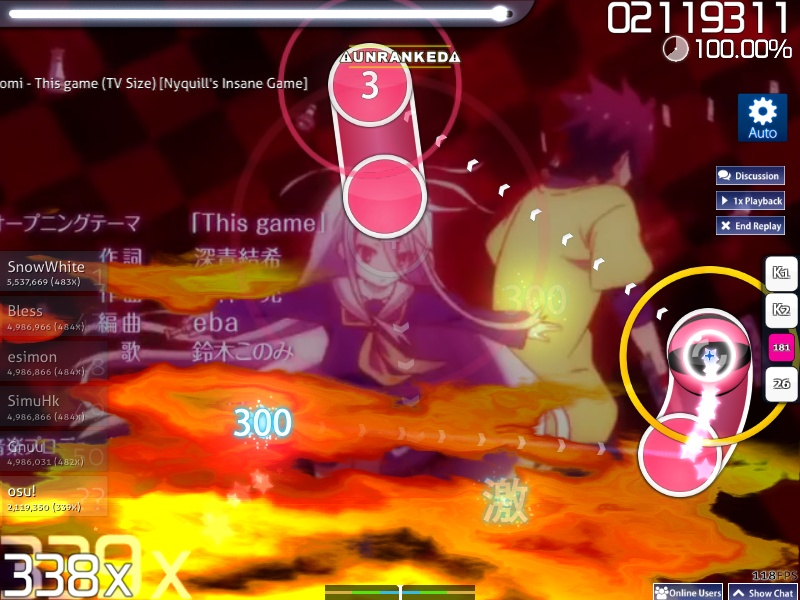

---
tags:
  - combo flame
  - api kombo
---

# Combo fire

::: Infobox

:::

::: Infobox
")
:::

**Combo fire** atau *api kombo* adalah sebuah elemen alur permainan latar belakang yang berasal dari permainan DS [Osu! Tatakae! Ouendan!](/wiki/iNiS_games) yang akhirnya diintegrasikan ke dalam osu!. Ini akan menampilkan nyala api kuning yang menyala setelah mendapatkan sebuah [combo milestone](/wiki/Gameplay/Combo_milestone). Jika pemain memperoleh 500 [combo](/wiki/Gameplay/Combo_(score_multiplier)), combo fire akan berubah warna dari kuning menjadi biru. Api akan padam jika kombo rusak, tetapi akan dapat diperoleh kembali jika kombo diperoleh kembali.

Combo fire dinonaktifkan pada 5 Maret 2013 disebabkan oleh masalah kinerja.
