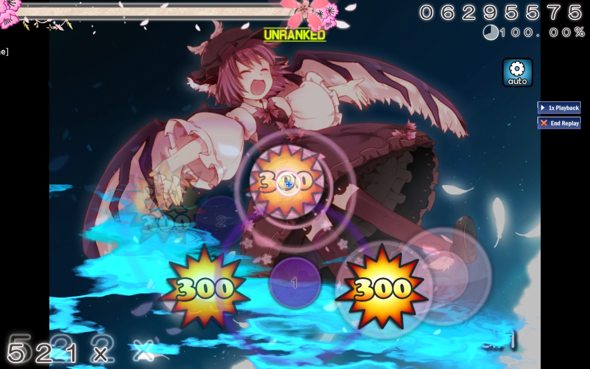

---
tags:
  - 连击火焰
  - combo flame
---

# 连击火焰

::: Infobox

:::

::: Infobox

:::

**连击火焰** (**Combo fire**) 最初是源于 DS 游戏[《押忍！战斗！应援团！》](/wiki/iNiS_games)背景中的游戏元素，最终被引入了 osu!。在达成第一个[连击里程碑](/wiki/Gameplay/Combo_milestone)后，游玩区域背景会显示一团黄色的燃烧火焰。当玩家获得 500 [连击](/wiki/Gameplay/Combo_(score_multiplier))时，连击火焰会变成蓝色。火焰在断连时会熄灭，但后续达成连击里程碑时会再次出现。

出于性能考虑，连击火焰在 2013 年 3 月 5 日被禁用了。
