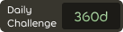
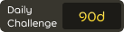
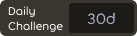

# Daily challenge

The **daily challenge** is a multiplayer mode in [osu!(lazer)](/wiki/Client/Release_stream/Lazer) where players are able to build up a streak by passing consecutive daily beatmaps with an increasing difficulty that resets every 7 days.

Every beatmap is handpicked from the [Featured Artist](/wiki/People/Featured_Artists) listing, and sometimes the maps come with a mod forced onto users, which requires them to pass the map with the selected mod.

## Game menu

From the main menu, the daily challenge menu can be accessed with the following steps:

1. Click the `play` button or press `P`.
2. Click the `daily challenge` button or press `D`.

 

On entering, the user is presented with an intro showing the beatmap the user has to pass, and the mods they have to pass it with.

After the intro ends, the user can view the data for today's challenge. The left side displays various score-related information like the total pass count and the cumulative total score. In the middle, a leaderboard shows the top scores achieved by players. Users are able to discuss the daily challenge in the chat on the right.

## Beatmap difficulty range

## Streak milestones

Play streaks are displayed on the user's profile with different colours depending on certain streak milestones:

<!-- tier images: https://www.figma.com/design/tc79qAgJ35KQvdTO0Oj3dN/Daily-Challenge-Counter?node-id=0-1&t=xjRm9Ke0tUMtAQlh-1 -->

|  | Tier | Total participation | Daily streak | Weekly streak |
| --: | :-: | :-: | :-: | :-: |
|  | Lustrous | 1080 days | 360 days | 53 weeks |
|  | Radiant | 720 days | 240 days | 36 weeks |
|  | Rhodium | 360 days | 120 days | 19 weeks |
|  | Platinum | 180 days | 60 days | 10 weeks |
|  | Gold | 90 days | 30 days | 6 weeks |
|  | Silver | 30 days | 10 days | 3 weeks |
|  | Bronze | 15 days | 5 days | 2 weeks |
|  | Iron | less than 15 days | less than 5 days | less than 2 weeks |

## Contributors

The project is organised by ::{ flag=TN }:: [Hivie](https://osu.ppy.sh/users/14102976). The following community members are responsible for picking beatmaps:

- ::{ flag=SE }:: [bite you death](https://osu.ppy.sh/users/6398464)
- ::{ flag=US }:: [ChillierPear](https://osu.ppy.sh/users/9501251)
- ::{ flag=BR }:: [Dada](https://osu.ppy.sh/users/9119507)
- ::{ flag=GB }:: [Kingling](https://osu.ppy.sh/users/7010761)
- ::{ flag=KR }:: [Luscent](https://osu.ppy.sh/users/2688581)
- ::{ flag=KR }:: [momoyo](https://osu.ppy.sh/users/12469536)

## Trivia

::: Infobox

:::

- The idea for daily challenge was taken from a comment from waxxx14 requesting a "cup of the day" format from [TrackMania](https://en.wikipedia.org/wiki/TrackMania) in osu!, posted under the lazer development video ["deciding what to do with lazer"](https://www.youtube.com/watch?v=xUSxEjQQ1UI).
- The daily challenge launched to the public on July 25, 2024 in osu!(lazer) public release [2024.725.0](https://osu.ppy.sh/home/changelog/lazer/2024.725.0) solely for the [osu! game mode](/wiki/Game_mode/osu!).
- In the initial release, free mods were not selectable, and the total pass count as well as the cumulative total score were only added in a later update.
