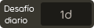

# Desafío diario

El **desafío diario** es un modo multijugador de [osu!(lazer)](/wiki/Client/Release_stream/Lazer) en el que los jugadores pueden acumular una racha al pasar beatmaps diarios consecutivos con una dificultad creciente, la cual se reinicia cada 7 días.

Cada beatmap se selecciona manualmente de la lista de [artistas destacados](/wiki/People/Featured_Artists), y a veces los mapas vienen con un mod que se obliga a usar a los usuarios, lo que requiere que pasen el mapa con el mod seleccionado.

## Menú de juego

Desde el menú principal, se puede acceder al menú del desafío diario con los siguientes pasos:

1. Haz clic en el botón `jugar` o presiona `P`.
2. Haz clic en el botón `desafío diario` o presiona `D`.

 

Al entrar, el usuario se encuentra con una introducción que muestra el beatmap que tiene que pasar, y los mods con los que tiene que pasarlo.

Una vez finalizada la introducción, el usuario podrá ver los datos del desafío del día correspondiente. La parte izquierda muestra diversa información relacionada con la puntuación, como el número total de veces que el beatmap ha sido completado y la puntuación total acumulada. En el centro, una tabla de clasificación muestra las mejores puntuaciones obtenidas por los jugadores. Los usuarios pueden comentar sobre el desafío diario en el chat de la derecha.

## Rango de dificultad de los beatmaps

## Hitos de las rachas

Las rachas de juego se muestran en el perfil del usuario con diferentes colores según los hitos alcanzados:

|  | Rango | Participación total | Racha diaria | Racha semanal |
| --: | :-: | :-: | :-: | :-: |
|  | Lustroso | 1080 días | 360 días | 53 semanas |
|  | Radiante | 720 días | 240 días | 36 semanas |
|  | Rodio | 360 días | 120 días | 19 semanas |
|  | Platino | 180 días | 60 días | 10 semanas |
|  | Oro | 90 días | 30 días | 6 semanas |
|  | Plata | 30 días | 10 días | 3 semanas |
|  | Bronce | 15 días | 5 días | 2 semanas |
|  | Hierro | menos de 15 días | menos de 5 días | menos de 2 semanas |

## Contribuidores

El proyecto está organizado por ::{ flag=TN }:: [Hivie](https://osu.ppy.sh/users/14102976). Los siguientes miembros de la comunidad son responsables de elegir los beatmaps:

- ::{ flag=SE }:: [bite you death](https://osu.ppy.sh/users/6398464)
- ::{ flag=US }:: [ChillierPear](https://osu.ppy.sh/users/9501251)
- ::{ flag=BR }:: [Dada](https://osu.ppy.sh/users/9119507)
- ::{ flag=GB }:: [Kingling](https://osu.ppy.sh/users/7010761)
- ::{ flag=KR }:: [Luscent](https://osu.ppy.sh/users/2688581)
- ::{ flag=KR }:: [momoyo](https://osu.ppy.sh/users/12469536)

## Curiosidades

::: Infobox

:::

- La idea del desafío diario surgió de un comentario de waxxx14 en el que solicitaba un formato similar al de la «copa del día» de [TrackMania](https://es.wikipedia.org/wiki/TrackMania) en osu!, publicado en el vídeo sobre el desarrollo de lazer [«deciding what to do with lazer»](https://www.youtube.com/watch?v=xUSxEjQQ1UI).
- El desafío diario se lanzó al público el 25 de julio de 2024 en la versión pública de osu!(lazer) [2024.725.0](https://osu.ppy.sh/home/changelog/lazer/2024.725.0) únicamente para el modo de juego [osu!](/wiki/Game_mode/osu!).
- En la versión inicial, no podían seleccionarse mods libres, y el número total de veces que el beatmap había sido completado, así como la puntuación total acumulada, se añadieron en una actualización posterior.
