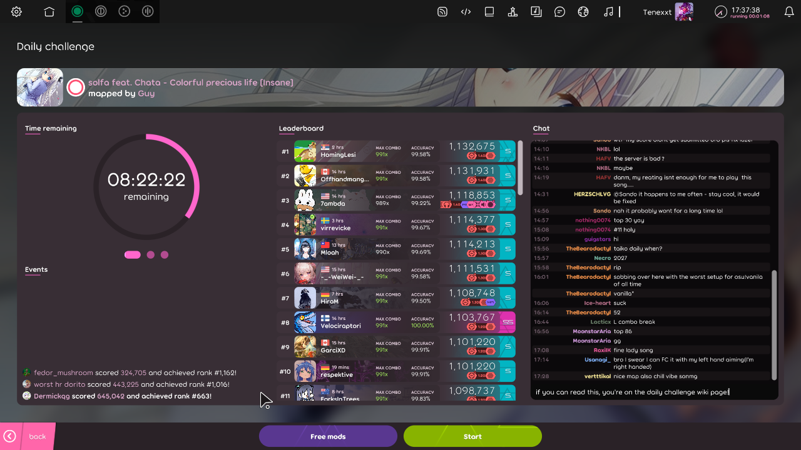
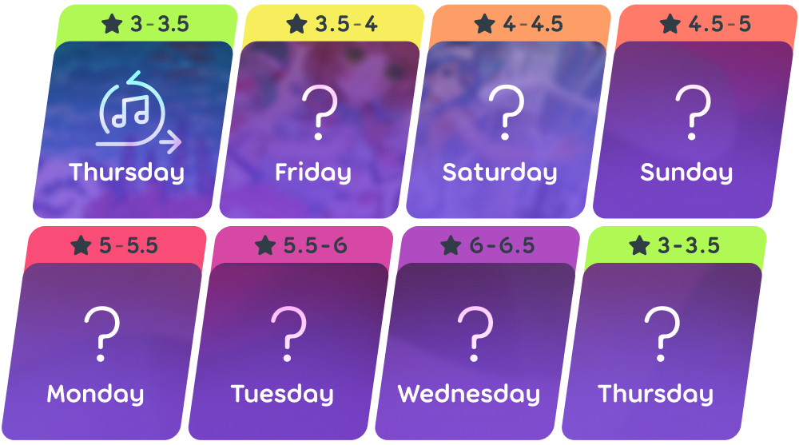
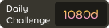
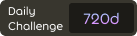
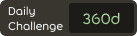
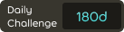
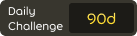
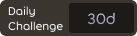
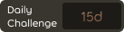

# Défi du jour

Le **défi du jour** est un mode multijoueur de [osu!(lazer)](/wiki/Client/Release_stream/Lazer) où les joueurs peuvent accumuler une série en réussissant à passer des [beatmaps](/wiki/Beatmap) quotidiennement. La difficulté augmente de jour en jour et se réinitialise toutes les semaines.

Chaque beatmap est soigneusement sélectionnée parmi la liste des [Featured Artists](/wiki/People/Featured_Artists), et parfois certaines maps imposent un mod aux joueurs, les obligeant à passer la map avec le mod sélectionné.

## Menu du jeu

Depuis la page principale du jeu, le menu des défis du jour est accessible en suivant les étapes suivantes:

1. Cliquez sur l’icône `jouer` ou appuyez sur `P`.
2. Cliquez sur l’icône `défi du jour` ou appuyez sur `D`.

En entrant, une introduction est présentée au joueur, montrant la beatmap à passer ainsi que les mods imposés.

Après l'introduction, le joueur peut consulter les données relatives au défi du jour. Le côté gauche affiche diverses informations en rapport avec le [score](/wiki/Gameplay/Score), comme le nombre total de joueurs ayant réussi la beatmap et le score cumulé de tous les joueurs. Au centre, un classement montre les meilleurs scores obtenus par les joueurs. À droite, les joueurs peuvent discuter du défi du jour dans un chat.

## Plage de difficulté

## Paliers de séries

Les séries de parties sont affichées sur le profil du joueur avec différentes couleurs en fonction de certain paliers atteints :

<!-- tier images: https://www.figma.com/design/tc79qAgJ35KQvdTO0Oj3dN/Daily-Challenge-Counter?node-id=0-1&t=xjRm9Ke0tUMtAQlh-1 -->

|  | Niveau | Participation totale | Série quotidienne | Série hebdomadaire |
| --: | :-: | :-: | :-: | :-: |
|  | Étincelant | 1080 jours | 360 jours | 53 semaines |
|  | Radiant | 720 jours | 240 jours | 36 semaines |
|  | Rhodium | 360 jours | 120 jours | 19 semaines |
|  | Platine | 180 jours | 60 jours | 10 semaines |
|  | Or | 90 jours | 30 jours | 6 semaines |
|  | Argent | 30 jours | 10 jours | 3 semaines |
|  | Bronze | 15 jours | 5 jours | 2 semaines |
|  | Fer | moins de 15 jours | moins de 5 jours | moins de 2 semaines |

## Contributeurs

Le projet est organisé par ::{ flag=TN }:: [Hivie](https://osu.ppy.sh/users/14102976). Les membres de la communauté suivants sont responsables du choix des beatmaps :

- ::{ flag=SE }:: [bite you death](https://osu.ppy.sh/users/6398464)
- ::{ flag=US }:: [ChillierPear](https://osu.ppy.sh/users/9501251)
- ::{ flag=BR }:: [Dada](https://osu.ppy.sh/users/9119507)
- ::{ flag=GB }:: [Kingling](https://osu.ppy.sh/users/7010761)
- ::{ flag=KR }:: [Luscent](https://osu.ppy.sh/users/2688581)
- ::{ flag=KR }:: [momoyo](https://osu.ppy.sh/users/12469536)

## Anecdote

::: Infobox

:::

- L'idée du défi du jour vient d'un commentaire de waxxx14 demandant une "coupe du jour", format tiré de [TrackMania](https://en.wikipedia.org/wiki/TrackMania), posté sous la vidéo de développement de lazer ["deciding what to do with lazer"](https://www.youtube.com/watch?v=xUSxEjQQ1UI).
- Le défi du jour a été lancé publiquement le 25 juillet 2024 dans osu!(lazer), lors de la version publique [2024.725.0](https://osu.ppy.sh/home/changelog/lazer/2024.725.0), uniquement pour le [mode de jeu osu!](/wiki/Game_mode/osu!).
- Lors de la version initiale, les mods libres n’étaient pas sélectionnables, et le nombre total de réussites ainsi que le score cumulé n’ont été ajoutés que dans une mise à jour ultérieure.
