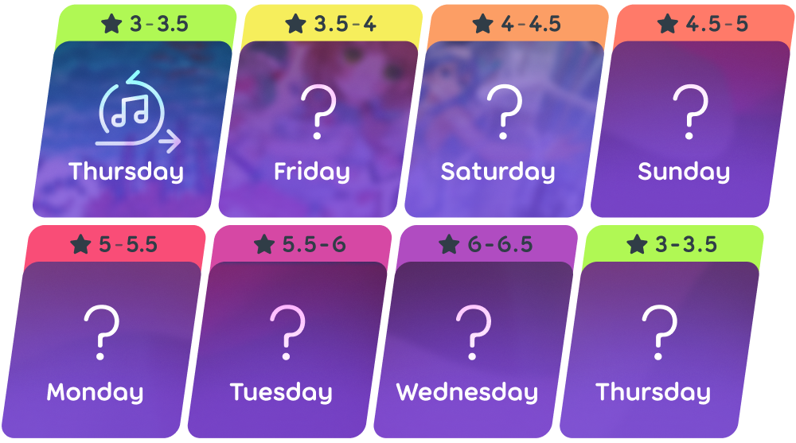
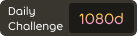

# Wyzwania dnia

**Wyzwania dnia** to wieloosobowy tryb gry w [osu!(lazer)](/wiki/Client/Release_stream/Lazer) gdzie gracze mogą podbudowywać miernik codziennej passy poprzez przechodzenie kolejne codzienne beatmapy z zwiekszającą się trudnością która się resetuje co każde 7 dni.

Każda beatmapa jest starannie wybrana z listy [Polecanych Artystów](/wiki/People/Featured_Artists), a czasami mapy zawierają moda narzuconego na użytkowników, co wymaga od nich przejścia mapy z wybranym modem.

## Menu gry

Z menu głownego, menu wyzwań dziennych można uzyskać poprzez wykonanie poniższych czynności:

1. Kliknij przycisk `graj` lub kliknij `P` na klawiaturze.
2. Kliknij przycisk `wyzwanie dnia` lub kliknij `D` na klawiaturze.

 

Na wejście, użytkownik jest prezentowany wprowadzeniem pokazujące beatmapę, którą użytkownik musi przejść, oraz mody z którymi musi ją przejść.

Po zakończeniu wprowadzenia, użytkownik może wyświetlić dane dotyczące dzisiejszego wyzwania. Lewa strona pokazuje rożne informacje dotyczące wyników, takich jak łączna ilość zaliczeń i łączny wynik wszystkich zaliczeń. W środku, tabela wyników pokazuje najlepsze wyniki uzyskane przez graczy. Użytkownicy mogą dyskutować o wyzwaniu dnia na czacie po prawej.

## Zakres trudności beatmap

## Kamienie milowe codziennej passy

Passy są wyświetlane na profilach użytkownika z innymi kolorami zależnie od różnych kamieni milowych:

<!-- zdjęcia poziomów: https://www.figma.com/design/tc79qAgJ35KQvdTO0Oj3dN/Daily-Challenge-Counter?node-id=0-1&t=xjRm9Ke0tUMtAQlh-1 -->

|  | Poziom | Łączny udział | Codzienna passa | Cotygodniowa passa |
| --: | :-: | :-: | :-: | :-: |
|  | Lśniący | 1080 dni | 360 dni | 53 tygodni |
|  | Promienisty | 720 dni | 240 dni | 36 tygodni |
|  | Rod | 360 dni | 120 dni | 19 tygodni |
|  | Platyna | 180 dni | 60 dni | 10 tygodni |
|  | Złoto | 90 dni | 30 dni | 6 tygodni |
|  | Srebro | 30 dni | 10 dni | 3 tygodni |
|  | Brąz | 15 dni | 5 dni | 2 tygodni |
|  | Żelazo | mniej niż 15 dni | mniej niż 5 dni | mniej niż 2 tygodni |

## Współautorzy

Projekt jest organizowany przez ::{ flag=TN }:: [Hivie](https://osu.ppy.sh/users/14102976). Poniżej przedstawieni członkowie społeczności zajmują się wybieraniem beatmap:

- ::{ flag=SE }:: [bite you death](https://osu.ppy.sh/users/6398464)
- ::{ flag=US }:: [ChillierPear](https://osu.ppy.sh/users/9501251)
- ::{ flag=BR }:: [Dada](https://osu.ppy.sh/users/9119507)
- ::{ flag=GB }:: [Kingling](https://osu.ppy.sh/users/7010761)
- ::{ flag=KR }:: [Luscent](https://osu.ppy.sh/users/2688581)
- ::{ flag=KR }:: [momoyo](https://osu.ppy.sh/users/12469536)

## Ciekawostki

::: Infobox

:::

- Pomysł na wyzwania dnia został wzięty z komentarza od waxxx14 proszącego o "cup of the day" format z [TrackManii](https://en.wikipedia.org/wiki/TrackMania) w osu!, zamieszczonego pod filmem o rozwoju osu!(lazer) ["deciding what to do with lazer"](https://www.youtube.com/watch?v=xUSxEjQQ1UI).
- Wyzwania dnia zostały wypuszczone do publiki 25 lipca, 2024 w publicznej wersji [2024.725.0](https://osu.ppy.sh/home/changelog/lazer/2024.725.0) osu!(lazer) wyłącznie dla [trybu gry osu!](/wiki/Game_mode/osu!).
- W pierwszym wydaniu, nie można było wybierać wolnych modów, i łączna ilość zaliczeń i łączny wynik wszystkich zaliczeń były dodane w późniejszej aktualizacji.
