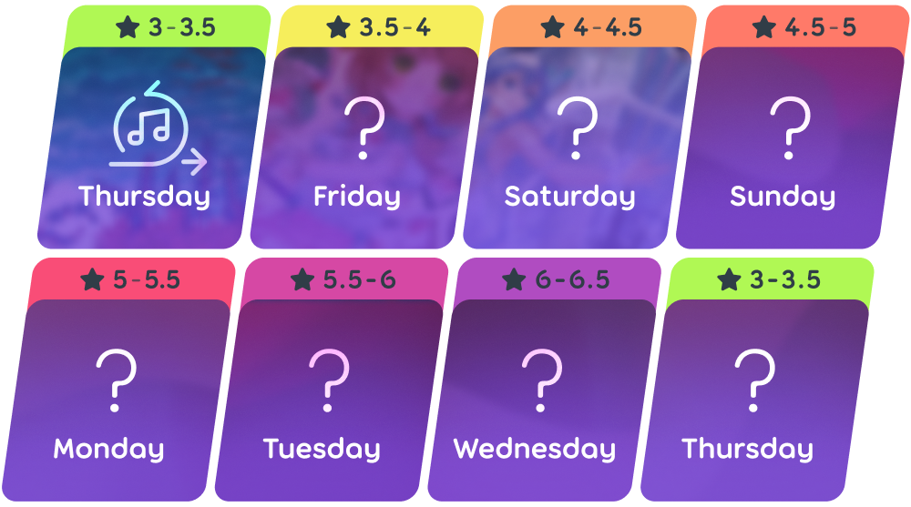

# Карта дня

**Карта дня** (англ. *Daily challenge*) — режим мультиплеера в [osu!(lazer)](/wiki/Client/Release_stream/Lazer), где цель участников — проходить каждый день без перерывов по одной специально отобранной карте и делать так как можно дольше, иначе серия прохождений прервётся. Сложность карт растёт в течение недели и каждые 7 дней сбрасывается.

Карты отбирает группа из разных участников сообщества. Иногда карты объединены общей темой — жанром, исполнителем или каким-нибудь необычным игровым элементом. В конце каждого месяца одну неделю отводят под лучшие карты предыдущего месяца, и этим занимаются несколько членов [команды оценки номинаций](/wiki/People/Nomination_Assessment_Team).

Изредка карта дня идёт с форсированным модом — в этом случае пройти её нужно именно с ним.

Сегодняшнюю и все прошлые карты дня можно посмотреть на [странице рекордов по картам дня](https://osu.ppy.sh/rankings/daily-challenge).

## Меню игры

Перейти к карте дня можно из главного меню:

1. Нажмите на кнопку `Играть` или клавишу `P`.
2. Нажмите на кнопку `Карта дня` или клавишу `D`.

При входе игрока встречает заставка с сегодняшней картой и модами, с которыми её нужно пройти.

Когда заставка заканчивается, открывается экран с подробностями сегодняшней карты. Слева собрана статистика (например, сколько раз карту прошли и сколько очков за это набрали в сумме), в середине находится таблица рекордов с наилучшими результатами, а справа расположен чат, в котором карту дня можно обсудить.

## Диапазон сложности карт

## Уровни серий

Длительность непрерывной серии игр показана в профиле игрока, и её цвет зависит от достигнутого уровня:

<!-- tier images: https://www.figma.com/design/tc79qAgJ35KQvdTO0Oj3dN/Daily-Challenge-Counter?node-id=0-1&t=xjRm9Ke0tUMtAQlh-1 -->

|  | Уровень | Общее число дней | Серия в днях | Серия в неделях |
| --: | :-: | :-: | :-: | :-: |
|  | Lustrous | 1080 дней | 360 дней | 53 недели |
|  | Radiant | 720 дней | 240 дней | 36 недель |
|  | Rhodium | 360 дней | 120 дней | 19 недель |
|  | Platinum | 180 дней | 60 дней | 10 недель |
|  | Gold | 90 дней | 30 дней | 6 недель |
|  | Silver | 30 дней | 10 дней | 3 недели |
|  | Bronze | 15 дней | 5 дней | 2 недели |
|  | Iron | меньше 15 дней | меньше 5 дней | меньше 2 недель |

## Участники проекта

Проектом занимается ::{ flag=TN }:: [Hivie](https://osu.ppy.sh/users/14102976), а за отбор карт отвечают следующие участники сообщества:

- ::{ flag=IT }:: [-kevincela-](https://osu.ppy.sh/users/266596)
- ::{ flag=SE }:: [byd](https://osu.ppy.sh/users/6398464)
- ::{ flag=FI }:: [fllecc](https://osu.ppy.sh/users/14060327)
- ::{ flag=IT }:: [gansijiye](https://osu.ppy.sh/users/9704802)
- ::{ flag=KR }:: [momoyo](https://osu.ppy.sh/users/12469536)
- ::{ flag=MX }:: [Riot](https://osu.ppy.sh/users/4256461)
- ::{ flag=US }:: [TheMagicAnimals](https://osu.ppy.sh/users/17274052)
- ::{ flag=SE }:: [Walavouchey](https://osu.ppy.sh/users/5773079)
- ::{ flag=US }:: [Willy](https://osu.ppy.sh/users/3521482)
- ::{ flag=US }:: [Wispy](https://osu.ppy.sh/users/11106929)

## Факты

::: Infobox

:::

- Идея карты дня взята из комментария waxxx14 под видео о разработке lazer [«deciding what to do with lazer»](https://www.youtube.com/watch?v=xUSxEjQQ1UI), где предлагалось перенести в osu! формат кубка дня (англ. *cup of the day*) из [TrackMania](https://ru.wikipedia.org/wiki/TrackMania).
- Первая карта дня появилась 25 июля 2024 года в публичном релизе osu!(lazer) [2024.725.0](https://osu.ppy.sh/home/changelog/lazer/2024.725.0) и только для [режима osu!](/wiki/Game_mode/osu!).
- В первой версии режима игроки не могли выбирать моды на своё усмотрение, а число прохождений и суммарные очки появились только в одном из следующих обновлений.
