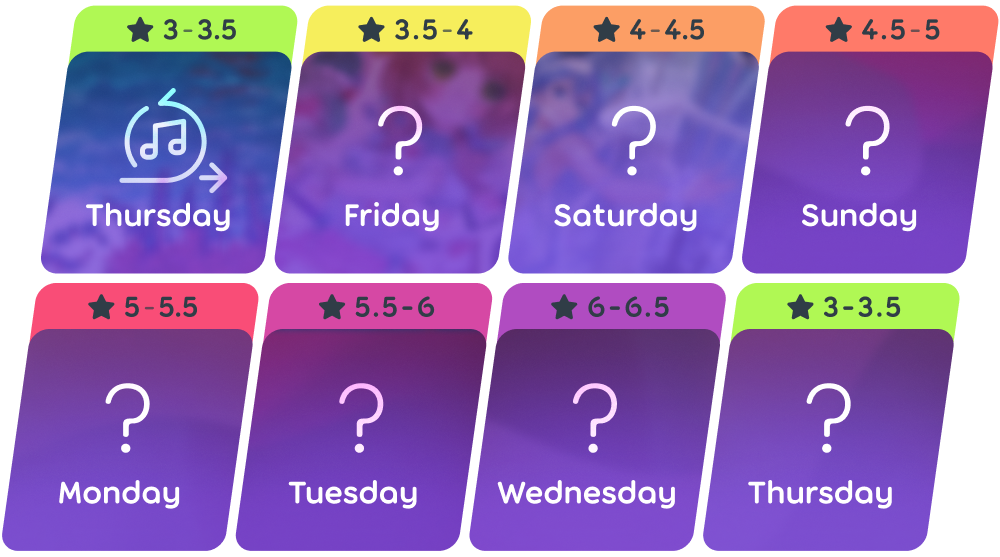
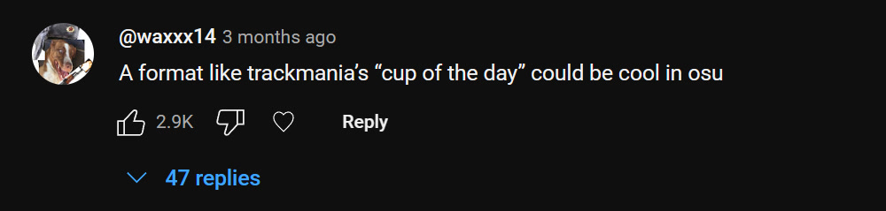

# 每日挑战

**每日挑战**是 [osu!(lazer)](/wiki/Client/Release_stream/lazer) 里面的一种多人模式，其中玩家可以通关连胜一系列越来越难的每日谱面，而谱面每七天会重置。

挑战中的谱面由一群贡献者组成的小组选出。有时候谱面会以特定音乐类型、艺术家或一个技巧为主题。在每个月月末，有一周会用来突出展示上个月的高质量谱面，这一过程由[审核评估团队](/wiki/People/Nomination_Assessment_Team)中的几位成员负责。

谱面偶尔会强制玩家使用模组，要求玩家以指定模组通关谱面。

当前的以及所有过去的每日挑战可以从[每日挑战排名页](https://osu.ppy.sh/rankings/daily-challenge)中找到。

## 游戏菜单

每日挑战菜单可以由以下方法从主菜单进入：

1. 按下`开始游玩`按钮或者 `P`。
2. 按下`每日挑战`按钮或者 `D`。

在进入后，玩家会看到一段过场，介绍需要通关的谱面，以及需要使用的模组。

过场结束后，玩家可以查看今天挑战的数据。左侧显示了各种分数相关的信息，比如总共通关次数和累计分数总和；在中间有一个排行榜展示玩家达成的高分；玩家们可以在右侧的聊天中讨论每日挑战。

## 谱面难度范围

## 连胜里程碑

连胜会在玩家主页上用不同颜色展示，颜色则取决于特定的连胜里程碑：

<!-- tier images: https://www.figma.com/design/tc79qAgJ35KQvdTO0Oj3dN/Daily-Challenge-Counter?node-id=0-1&t=xjRm9Ke0tUMtAQlh-1 -->

|  | 段位 | 参与总和 | 日连胜 | 周连胜 |
| --: | :-: | :-: | :-: | :-: |
|  | 白玉 | 1080 日 | 360 日 | 53 周 |
|  | 耀光 | 720 日 | 240 日 | 36 周 |
|  | 黑金 | 360 日 | 120 日 | 19 周 |
|  | 白金 | 180 日 | 60 日 | 10 周 |
|  | 黄金 | 90 日 | 30 日 | 6 周 |
|  | 白银 | 30 日 | 10 日 | 3 周 |
|  | 青铜 | 15 日 | 5 日 | 2 周 |
|  | 黑铁 | 15 日以下 | 5 日以下 | 2 周以下 |

## 贡献者

此项目由 ::{ flag=TN }:: [Hivie](https://osu.ppy.sh/users/14102976) 组织。以下社区成员负责选择谱面：

- ::{ flag=IT }:: [-kevincela-](https://osu.ppy.sh/users/266596)
- ::{ flag=SE }:: [byd](https://osu.ppy.sh/users/6398464)
- ::{ flag=FI }:: [fllecc](https://osu.ppy.sh/users/14060327)
- ::{ flag=IT }:: [gansijiye](https://osu.ppy.sh/users/9704802)
- ::{ flag=KR }:: [momoyo](https://osu.ppy.sh/users/12469536)
- ::{ flag=MX }:: [Riot](https://osu.ppy.sh/users/4256461)
- ::{ flag=US }:: [TheMagicAnimals](https://osu.ppy.sh/users/17274052)
- ::{ flag=SE }:: [Walavouchey](https://osu.ppy.sh/users/5773079)
- ::{ flag=US }:: [Willy](https://osu.ppy.sh/users/3521482)
- ::{ flag=US }:: [Wispy](https://osu.ppy.sh/users/11106929)

## 冷知识

::: Infobox

:::

- 每日挑战这一创意来自 waxxx14 在 lazer 开发视频[“决定要在 lazer 干什么”](https://www.youtube.com/watch?v=xUSxEjQQ1UI)下面的留言，希望在 osu! 中加入[赛道狂飙](https://en.wikipedia.org/wiki/TrackMania)中的“每日杯”模式。
- 每日挑战于 2024 年 7 月 25 日在 osu!(lazer) 公开版本 [2024.725.0](https://osu.ppy.sh/home/changelog/lazer/2024.725.0) 中向公众推出，只能用 [osu! 游戏模式](wiki/Game_mode/osu!)游玩。
- 在最初版本里，模组不能自由选择，而且总共通关次数和累计分数总和于后期更新才加入。
