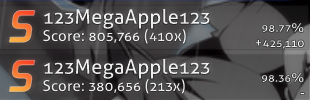

# Full combo

**Full combo** (or *FC* for short) is a term used to describe a player obtaining the maximum possible [combo](/wiki/Beatmapping/Combo) on a [beatmap](/wiki/Beatmap). Full combos are scored by passing a beatmap with no misses<!-- TODO: link -->, [sliderbreaks](/wiki/Gameplay/Judgement/Slider_break), or dropped [slider ends](/wiki/Gameplay/Hit_object/Slider/Slidertail).

Scores that lost combo only via dropped slider ends are widely considered by the community to be full combos. This differs from the game client and website's display. A play with the maximum possible combo may also be referred to as a **perfect full combo** (or *PFC* for short, not to be confused with an [SS](/wiki/Gameplay/Grade) rank) to differentiate between scores with and without dropped slider ends.

Because the [score](/wiki/Gameplay/Score) of an individual object in [osu!](/wiki/Game_mode/osu!) and [osu!catch](/wiki/Game_mode/osu!catch) heavily depends on combo multiplier and is virtually unbounded, full combos typically award the most score in these game modes.
