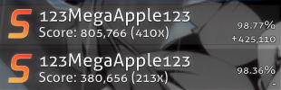

# Полное комбо

**Полное комбо** (англ. *full combo*, жарг. *фулл комбо* или *ФК*, *FC*) — термин для описания максимально возможного [комбо](/wiki/Gameplay/Combo_(score_multiplier)) на [карте](/wiki/Beatmap). Полные комбо засчитываются при прохождении карты без промахов, [слайдербрейков](/wiki/Gameplay/Judgement/Slider_break) или пропущенных [концов слайдеров](/wiki/Gameplay/Hit_object/Slider/Slidertail).

Рекорды без промахов и слайдербрейков, где не доведены концы слайдеров, среди игроков всё равно считаются полными комбо, что расходится с их отображением в клиенте игры и на сайте. Чтобы подчеркнуть разницу между такими рекордами и теми, где поставлено максимально возможное комбо, последние иногда называют **идеальным полным комбо** (англ. *perfect full combo*, *PFC*, не путать с [оценкой](/wiki/Gameplay/Grade) SS).

Поскольку [число очков](/wiki/Gameplay/Score) за один объект в [osu!](/wiki/Game_mode/osu!) и [osu!catch](/wiki/Game_mode/osu!catch) очень сильно зависит от набранного комбо и практически не ограничено, в этих режимах полное комбо обычно приносит больше всего очков.
