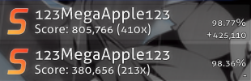

# 全连

**全连** （**Full combo**，简写为 *FC*）用来描述玩家在一张[谱面](/wiki/Beatmap)获得最大理论[连击数](/wiki/Beatmapping/Combo)的情况。在没有 Miss<!-- TODO: link -->、[断滑条](/wiki/Gameplay/Judgement/Slider_break)、漏掉[滑条尾](/wiki/Gameplay/Hit_object/Slider/Slidertail)的情况下通过谱面时，即可获得全连。

osu! 社区公认的是，仅因漏掉滑条尾而失去连击的成绩也属于全连。这个与游戏客户端和网页的显示有所不同。

由于在 [osu!](/wiki/Game_mode/osu!) 与 [osu!catch](/wiki/Game_mode/osu!catch) 游戏模式中，单个物件的[分数](/wiki/Gameplay/Score)与连击乘数紧密相关，并且几乎是无限的，全连成绩在这些模式中取得的分数一般是最高的。
