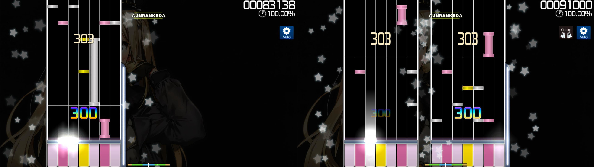

# Co-op（模组）

 模组图标")

*对于所有模组的列表，参见：[游戏模组 (Mods)](/wiki/Gameplay/Game_modifier)*\
*请勿与[多人游戏](/wiki/Client/Interface/Multiplayer)混淆。*

## 关于

- 缩写：CP 或 CO
- 类别：特殊
- 得分系数：0.70x–1.00x （详见[下方表格](#得分系数)）
- 描述：`双倍键位，双人合奏，基情无限！`
- 兼容的游戏模式：![][osu!mania]

## 说明

*注意：启用此模组会导致成绩不计入排名。*

**Co-op** 模组是 [osu!mania](/wiki/Game_mode/osu!mania) 专用的[游戏模组](/wiki/Gameplay/Game_modifier)，会根据当前的 *x*K 设置（例如 7K -> 7K + 7K = 14K）引入第二个游玩区域，使用第二套控制设置。对于 osu!mania 特定[谱面](/wiki/Beatmap)，则会将 *x* 个按键均分（例如 7K -> 4K + 3K = 7K）。

### 得分系数

下列表格仅给出启用 Co-op 模组对从 [osu!](/wiki/Game_mode/osu!) 到 osu!mania 转谱的影响：

| 默认 | 1K | 2K | 3K | 4K | 5K | 6K | 7K | 8K | 9K |
| :-: | :-: | :-: | :-: | :-: | :-: | :-: | :-: | :-: | :-: |
| 4K | 0.82x | 1.00x | 0.90x | 0.90x | 0.90x | 0.90x | 0.90x | 0.90x | 0.90x |
| 5K | 0.78x | 0.86x | 0.90x | 0.90x | 0.90x | 0.90x | 0.90x | 0.90x | 0.90x |
| 6K | 0.74x | 0.82x | 1.00x | 0.90x | 0.90x | 0.90x | 0.90x | 0.90x | 0.90x |
| 7K | 0.70x | 0.78x | 0.86x | 0.90x | 0.90x | 0.90x | 0.90x | 0.90x | 0.90x |

*注意：Co-op 模组对 osu!mania 专谱没有负面影响。*

对于对第二个游玩区域的描述，详见：[游戏模式/osu!mania § Co-op](/wiki/Game_mode/osu!mania#co-op).

### 冷知识

- 此模组于2015年3月5日被引入。

[osu!mania]: /wiki/shared/mode/mania.png "osu!mania"
