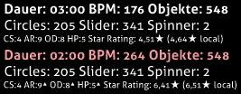

---
tags:
  - doubletime
  - double-time
  - DT
  - mod
  - game modifier
  - Spielmodifikation
---

# Double Time (Mod)

 Modsymbol")

*Für die [lazer-Version](/wiki/Client/Release_stream/Lazer) des Artikels, siehe: [Double Time (lazer-Mod)](/wiki/Gameplay/Game_modifier/Double_Time_(lazer))*\
*Für die vollständige Liste aller Mods, siehe: [Spielmodifikationen](/wiki/Gameplay/Game_modifier)*\
*Siehe auch: [Nightcore (Mod)](/wiki/Gameplay/Game_modifier/Nightcore)*

## Übersicht

- Abkürzung: DT
- Typ: Erhöhung der Schwierigkeit
- Score-Multiplikator:
  - ![][osu!]: 1,12x
  - ![][osu!taiko]: 1,12x
  - ![][osu!catch]: 1,06x
  - ![][osu!mania]: 1,00x
- Standard-Tastenkürzel: `D`
- Untertitel: `Brumm brumm`
- Kompatible Spielmodi: ![][osu!] ![][osu!taiko] ![][osu!catch] ![][osu!mania]
- Variante: [Nightcore](/wiki/Gameplay/Game_modifier/Nightcore)

## Beschreibung

*Anmerkung: Die Methode zur Erhöhung der Geschwindigkeit führt nicht zu einer Erhöhung der Tonhöhe des Songs.*

Die Mod **Double Time** ist eine [Spielmodifikation](/wiki/Gameplay/Game_modifier), die versucht, die Schwierigkeit einer [Beatmap](/wiki/Beatmap) zu erhöhen, indem die allgemeine Geschwindigkeit (BPM) um 150 % (1,5x) erhöht wird, die Länge des Songs um 33 % reduziert wird und die [Approach-Rate (AR)](/wiki/Beatmap/Approach_rate), [allgemeine Schwierigkeit (OD)](/wiki/Beatmap/Overall_difficulty) sowie die [Gesundheit (HP)](/wiki/Gameplay/Health) erhöht werden.

Die Mod Double Time wird weithin als eine der besten Mods beim Erlangen großer Mengen von [Performance-Punkten](/wiki/Performance_points) auf einfacheren Schwierigkeitsgraden in [osu!](/wiki/Game_mode/osu!) angesehen.

### osu!taiko

In [osu!taiko](/wiki/Game_mode/osu!taiko) wird die Trefferquote stark reduziert, sobald die Mod Double Time aktiviert wird, da osu!taiko bereits eine strikte allgemeine Schwierigkeit hat, zusammen mit den wesentlich schwieriger zu treffenden Sliderticks. Aus diesem Grund wird die Mod Double Time weithin als die härteste Mod in osu!taiko angesehen und wird nur selten benutzt.

### osu!catch

In [osu!catch](/wiki/Game_mode/osu!catch) gibt es keine allgemeine Schwierigkeit, die erhöht werden kann. Daher erhöht diese Mod nur die BPM und die AR. Infolgedessen ist sie nur einen 1,06-fachen Multiplikator wert (im Gegensatz zu einem 1,12-fachen Multiplikator bei jeder anderen Mod).

Zwar kommen bei dieser Mod Hyperdashes häufiger vor, allerdings sind Fruits in einigen Fällen trotz der Hyperdashes fast unmöglich zu fangen.

## Trivia

- Wenn die Mod Double Time aktiviert ist, sind die Angaben `Dauer`, `BPM` und `Objekte` rötlich mit anderen Werten gefärbt (siehe Abbildung unten).
  - Die Angabe `Objekte` ist rötlich gefärbt, obwohl es keine tatsächliche Veränderung im Wert gab.
- Die Angaben `AR`, `OD` und `HP` haben ein hochgestelltes Dreieck neben sich, um einen leichten Anstieg ihrer Werte anzuzeigen (siehe Abbildung unten).
- Der Name "Double Time" könnte als falscher Begriff interpretiert werden, da die Mod DT die Geschwindigkeit einer Beatmap nicht wirklich um das Zweifache erhöht (200 %), sondern nur um das 1,5-fache (150 %).

[osu!]: /wiki/shared/mode/osu.png "osu!"
[osu!taiko]: /wiki/shared/mode/taiko.png "osu!taiko"
[osu!catch]: /wiki/shared/mode/catch.png "osu!catch"
[osu!mania]: /wiki/shared/mode/mania.png "osu!mania"
