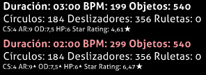

---
tags:
  - doubletime
  - double-time
  - DT
  - mod
  - game modifier
  - modificador de juego
  - modificador del juego
---

# Double Time (mod)

")

*Para la versión de [lazer](/wiki/Client/Release_stream/Lazer) de este artículo, véase: [Double Time (mod de lazer)](/wiki/Gameplay/Game_modifier/Double_Time_(lazer))*\
*Para la lista completa de los mods, véase: [Modificadores del juego](/wiki/Gameplay/Game_modifier)*\
*Véase también: [Nightcore (mod)](/wiki/Gameplay/Game_modifier/Nightcore)*

## Resumen

- Abreviatura: DT
- Tipo: Aumento de dificultad
- Multiplicador de puntuación:
  - ![][osu!]: 1,12x
  - ![][osu!taiko]: 1,12x
  - ![][osu!catch]: 1,06x
  - ![][osu!mania]: 1,00x
- Tecla de acceso directo predeterminada: `D`
- Descripción: `Rápidoooooooooo.`
- Modos de juego compatibles: ![][osu!] ![][osu!taiko] ![][osu!catch] ![][osu!mania]
- Variante: [Nightcore](/wiki/Gameplay/Game_modifier/Nightcore)

## Descripción

*Nota: El método usado para aumentar la velocidad no aumenta el tono de la canción.*

El mod **Double Time** es un [modificador del juego](/wiki/Gameplay/Game_modifier) que intenta aumentar la dificultad de un [beatmap](/wiki/Beatmap) aumentando su velocidad general (BPM) en un 150 % (1,5x), reduciendo la duración de la canción en un 33 % y aumentando la [velocidad de aproximación (AR)](/wiki/Beatmap/Approach_rate), la [dificultad general (OD)](/wiki/Beatmap/Overall_difficulty) y la [salud (HP)](/wiki/Gameplay/Health).

El mod Double Time es ampliamente considerado como uno de los mejores mods usados para obtener grandes cantidades de [puntos de rendimiento](/wiki/Performance_points) en las dificultades fáciles en [osu!](/wiki/Game_mode/osu!).

### osu!taiko

En [osu!taiko](/wiki/Game_mode/osu!taiko), la tolerancia de los aciertos se reduce en gran medida cuando el mod Double Time está activado, debido a la dificultad general de osu!taiko, ya de por sí estricta, junto con sus marcas de los sliders considerablemente más difíciles de acertar. Debido a esto, el mod Double Time es ampliamente considerado como el mod más difícil en osu!taiko y rara vez se usa.

### osu!catch

En [osu!catch](/wiki/Game_mode/osu!catch), no hay dificultad general para aumentar. Por lo tanto, este mod solo aumenta el BPM y el AR. Como resultado, solo vale un multiplicador de 1,06x (a diferencia del multiplicador de 1,12x para cualquier otro mod).

Aunque este mod aumenta en gran medida la tolerancia del hiperdash, haciendo que las frutas requieran hiperdashes que son casi imposibles de atrapar en algunos casos.

## Curiosidades

- Cuando el mod Double Time está activado, los valores `Duración`, `BPM` y `Objetos` se colorean en rojo claro con los nuevos valores. (Mostrado a continuación).
  - El valor de `Objetos` se colorea de rojo claro incluso si no se produce ningún cambio en el valor.
- Los valores `AR`, `OD` y `HP` tendrán un triángulo en superíndice junto a sus valores para indicar un pequeño aumento en sus valores. (Mostrado a continuación).
- El nombre «Double Time» podría etiquetarse como un nombre inapropiado, ya que el mod DT en realidad no aumenta la velocidad de un beatmap dos veces (200 %); acelera los beatmaps en 1,5x (150 %).

[osu!]: /wiki/shared/mode/osu.png "osu!"
[osu!taiko]: /wiki/shared/mode/taiko.png "osu!taiko"
[osu!catch]: /wiki/shared/mode/catch.png "osu!catch"
[osu!mania]: /wiki/shared/mode/mania.png "osu!mania"
