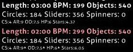

---
tags:
  - doubletime
  - double-time
  - DT
  - mod
  - game modifier
  - modificateur de jeu
outdated_translation: true
outdated_since: 379bac8124180854d6216ee745b2c9b542350824
---

# Le mod Double Time

")

*Pour la liste complète de tous les mods, voir : [modificateurs de jeu](/wiki/Gameplay/Game_modifier)*\
*Voir également : [Nightcore (mod)](/wiki/Gameplay/Game_modifier/Nightcore)*

## À propos

- Abréviation : DT
- Type : Augmentation de la difficulté
- Multiplicateur de score :
  - ![][osu!]: 1.12x
  - ![][osu!taiko]: 1.12x
  - ![][osu!catch]: 1.06x
  - ![][osu!mania]: 1.00x
- Touche de raccourci par défaut : `D`
- Légende : `Tout va plus vite !`
- Modes de jeu compatibles : ![][osu!] ![][osu!taiko] ![][osu!catch] ![][osu!mania]
- Variante : [Nightcore](/wiki/Gameplay/Game_modifier/Nightcore)

## Description

*Note: La méthode utilisée pour augmenter la vitesse n'augmente pas la hauteur de la musique.*

Le mod **Double Time** est un [modificateur de jeu](/wiki/Gameplay/Game_modifier) qui vise à augmenter la difficulté d'une beatmap [beatmap](/wiki/Beatmap) en augmentant sa vitesse générale (BPM) à 150% (1.5x), réduisant de 33% la durée de la musique et augmentant l'[approach rate (AR)](/wiki/Beatmap/Approach_rate), l'[overall difficulty (OD)](/wiki/Beatmap/Overall_difficulty), et la difficulté à garder des [HP](/wiki/Gameplay/Health).

Le mod Double Time est considéré comme un des meilleurs modificateurs de jeu pour obtenir des [points de performance](/wiki/Performance_points) sur les difficultés plus faciles dans le mode [osu!](/wiki/Game_mode/osu!).

### osu!taiko

Dans le mode [osu!taiko](/wiki/Game_mode/osu!taiko), l'indulgence de la précision est grandement réduite lorsque le mod Double Time est activé à cause de la l'overall difficulty déjà stricte et les slider ticks sont considérablement plus difficiles à toucher. À cause de cela, le mod Double Time est considéré comme le mod le plus difficile et est rarement utilisé.

### osu!catch

Dans le mode [osu!catch](/wiki/Game_mode/osu!catch), il n'y a pas d'OD. Ce mod n'augmente alors que le BPM et l'AR et à cause de cela, le multiplicateur n'est que de 1.06x (les autres mods ont un multiplicateur de 1.12x).

Ce mod rend les hyperdashes beaucoup plus indulgents, ce qui fait que certains fruits requièrent des hyperdashes presque impossibles à attraper dans certains cas.

## Le saviez-vous ?

- Lorsque le mod Double Time est activé, les valeurs `Durée`, `BPM`, et `Objets` prennent une couleur rouge claire en affichant les nouvelles valeurs. (Voir l'image ci-dessous.)
  - La valeur `Objets` est coloriée en rouge clair bien qu'aucun changement n'est fait sur cette valeur.
- Les valeurs `AR`, `OD`, et `HP` auront un triangle à leur droite qui indique une augmentation de ces valeurs. (Voir l'image ci-dessous.)
- Le nom "Double Time" est trompeur, le mod DT ne multiplie pas vraiment la vitesse de la beatmap et de la musique par 2 (200%), mais par 1.5 (150%).

[osu!]: /wiki/shared/mode/osu.png "osu!"
[osu!taiko]: /wiki/shared/mode/taiko.png "osu!taiko"
[osu!catch]: /wiki/shared/mode/catch.png "osu!catch"
[osu!mania]: /wiki/shared/mode/mania.png "osu!mania"
