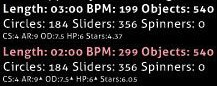

# Double Time (Mod)

 mod icon")

*สำหรับบทความเวอร์ชัน [lazer](/wiki/Client/Release_stream/Lazer) ดูที่: [Double Time (lazer mod)](/wiki/Gameplay/Game_modifier/Double_Time_(lazer))*\
*สำหรับรายการ Mod ทั้งหมด ดูที่: [ตัวปรับแต่งเกม (Game modifier)](/wiki/Gameplay/Game_modifier)*\
*ดูเพิ่มเติม: [Nightcore (Mod)](/wiki/Gameplay/Game_modifier/Nightcore)*

## ข้อมูลทั่วไป

- ตัวย่อ: DT
- ประเภท: เพิ่มความยาก (Difficulty Increasing)
- ตัวคูณคะแนน:
  - ![][osu!]: 1.12x
  - ![][osu!taiko]: 1.12x
  - ![][osu!catch]: 1.06x
  - ![][osu!mania]: 1.00x
- ปุ่มลัดพื้นฐาน: `D`
- คำอธิบาย: `ความเร็วเพิ่มขึ้น`
- โหมดที่รองรับ: ![][osu!] ![][osu!taiko] ![][osu!catch] ![][osu!mania]
- รูปแบบแยกย่อย: [Nightcore](/wiki/Gameplay/Game_modifier/Nightcore)

## รายละเอียด

*หมายเหตุ: วิธีการเพิ่มความเร็วที่ใช้ใน Mod นี้จะไม่ทำให้ระดับเสียง (Pitch) ของเพลงสูงขึ้น*

**Double Time** เป็น [ตัวปรับแต่งเกม](/wiki/Gameplay/Game_modifier) ที่มีจุดประสงค์เพื่อเพิ่มความยากของ [บีทแมพ (Beatmap)](/wiki/Beatmap) โดยการเพิ่มความเร็วโดยรวม (BPM) ขึ้นเป็น 150% (1.5x) ส่งผลให้ความยาวเพลงลดลง 33% และจะเพิ่มค่า [ความเร็วการปรากฏ (AR)](/wiki/Beatmap/Approach_rate), [ความยากโดยรวม (OD)](/wiki/Beatmap/Overall_difficulty) รวมถึง [พลังชีวิต (HP)](/wiki/Gameplay/Health)

Mod Double Time ได้รับการยอมรับอย่างกว้างขวางว่าเป็นหนึ่งใน Mod ที่ดีที่สุดสำหรับการเก็บคะแนน [Performance points (pp)](/wiki/Performance_points) จำนวนมากในบีทแมพที่มีความยากระดับต่ำในโหมด [osu!](/wiki/Game_mode/osu!)

### osu!taiko

ในโหมด [osu!taiko](/wiki/Game_mode/osu!taiko) ความผ่อนปรนในการกดจะถูกลดลงอย่างมากเมื่อเปิดใช้งาน Mod Double Time เนื่องจากค่าความยากโดยรวมของโหมด Taiko ที่ค่อนข้างเข้มงวดอยู่แล้ว ประกอบกับการเก็บจุดจังหวะสไลเดอร์ที่ทำได้ยากขึ้นมาก ด้วยเหตุนี้ Mod Double Time จึงถูกมองว่าเป็น Mod ที่เล่นยากที่สุดในโหมด Taiko และไม่ค่อยมีผู้นิยมใช้มากนัก

### osu!catch

ในโหมด [osu!catch](/wiki/Game_mode/osu!catch) จะไม่มีค่าความยากโดยรวม (OD) ให้เพิ่ม ดังนั้น Mod นี้จึงเพิ่มเพียงแค่ค่า BPM และ AR เท่านั้น ส่งผลให้ตัวคูณคะแนนอยู่ที่ 1.06x (แทนที่จะเป็น 1.12x เหมือนโหมดอื่น)

อย่างไรก็ตาม Mod นี้จะลดความผ่อนปรนของระบบ Hyperdash ลงอย่างมาก ทำให้ผลไม้บางตำแหน่งต้องการการทำ Hyperdash ที่แทบจะเป็นไปไม่ได้ในบางกรณี

## เกร็ดน่ารู้ (Trivia)

- เมื่อเปิดใช้งาน Mod Double Time ค่าความยาวเพลง (`Length`), จังหวะ (`BPM`) และจำนวนวัตถุ (`Objects`) จะแสดงเป็นตัวเลขสีแดงอ่อนพร้อมค่าใหม่ (ดังภาพด้านล่าง)
  - ค่าจำนวนวัตถุจะแสดงเป็นสีแดงอ่อนแม้ว่าจะไม่มีการเปลี่ยนแปลงจำนวนจริงก็ตาม
- ค่า `AR`, `OD` และ `HP` จะมีสัญลักษณ์ลูกศรชี้ขึ้นขนาดเล็กปรากฏอยู่ข้างๆ เพื่อบ่งบอกว่ามีการเพิ่มระดับค่าเหล่านั้นขึ้น
- ชื่อ "Double Time" อาจจะดูคลาดเคลื่อนเล็กน้อย เนื่องจาก Mod นี้ไม่ได้เพิ่มความเร็วเป็นสองเท่า (200%) แต่เพิ่มเพียง 1.5 เท่า (150%) เท่านั้น

[osu!]: /wiki/shared/mode/osu.png "osu!"
[osu!taiko]: /wiki/shared/mode/taiko.png "osu!taiko"
[osu!catch]: /wiki/shared/mode/catch.png "osu!catch"
[osu!mania]: /wiki/shared/mode/mania.png "osu!mania"
