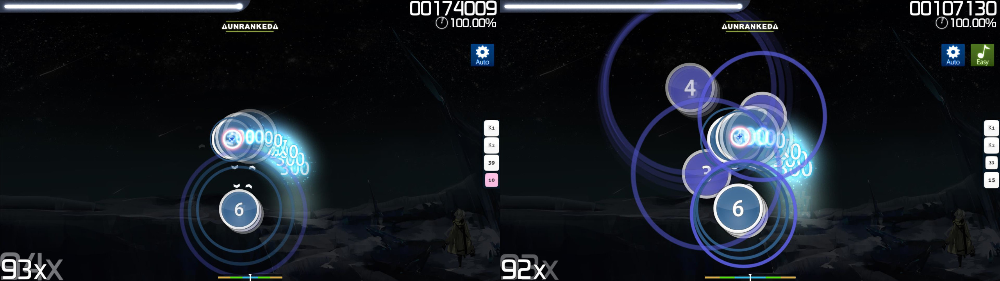

# Easy（模组）

 模组图标")

*对于本文章的 [lazer](/wiki/Client/Release_stream/Lazer) 版本，参见：[Easy（lazer 模组）](/wiki/Gameplay/Game_modifier/Easy_(lazer))*\
*对于更多义项，参见：[Easy（消歧义）](/wiki/Disambiguation/Easy)*\
*对于所有模组的列表，参见：[游戏模组 (Mods)](/wiki/Gameplay/Game_modifier)*

## 关于

- 缩写：EZ
- 类别：降低难度
- 得分系数：0.50x
- 默认快捷键：`Q`
- 描述：
  - ![][osu!]: `降（ti）低（gao）总体难度——更（man）大（ping）的圈（xiang），HP下降更慢，缩圈速度变慢，更（ji）低（gao）的准（du）确（tu）要求，有2次机会原地满状态复活。`
  - ![][osu!taiko]: `降低总体难度，物件移动速度会慢些，更低的准确度要求。`
  - ![][osu!catch]: `降（ti）低（gao）总体难度——更（man）大（ping）的圈（xiang），HP下降更慢，缩圈速度变慢，更（ji）低（gao）的准（du）确（tu）要求，有2次机会原地满状态复活。`
  - ![][osu!mania]: `降低总体难度，HP掉的更慢，更低的准确度要求。`
- 兼容的游戏模式：![][osu!] ![][osu!taiko] ![][osu!catch] ![][osu!mania]

## 说明

**Easy** [游戏模组](/wiki/Gameplay/Game_modifier)会将所选[谱面](/wiki/Beatmap)的所有难度参数减半，由此尝试降低难度。

在除了 [osu!taiko](/wiki/Game_mode/osu!taiko) 的所有[游戏模式](/wiki/Game_mode)中，此模组会在游玩期间给玩家两条额外“生命”。当[血条](/wiki/Client/Interface/Health_bar)降到零时，会暂停游戏，使血条缓慢回复到约 80% 处，并从玩家生命数中除去一条“命”。在此效果期间不会播放音效。

回血开始时，会播放预备音效（`readysound.wav`）提示玩家。回血完毕后，则会播放开始音效（`gosound.wav`），让玩家继续游玩谱面。如果血条归零时玩家无剩余生命，就会照常失败。

### osu!

在 [osu!](/wiki/Game_mode/osu!) 中，此模组会将[圆圈大小 (CS)](/wiki/Beatmap/Circle_size)、[缩圈速度 (AR)](/wiki/Beatmap/Approach_rate)、[整体难度 (OD)](/wiki/Beatmap/Overall_difficulty) 与[掉血速度 (HP)](/wiki/Beatmap/HP_drain_rate) 减半。

尽管如此，值得提及的是，许多玩家没有发现此模组在降低谱面（尤其是在高强度谱面中）相对难度中的帮助。他们认为缩圈速度的降低导致游玩界面混乱而难以读谱，谱面的实际速度在视觉上并没能很好反映出来。（见上图）

*注意：“[Let's talk Easy Mod](https://osu.ppy.sh/community/forums/topics/56606)” 功能请求帖中详细阐述了上述内容，由此改善此模组。*

### osu!taiko

在 [osu!taiko](/wiki/Game_mode/osu!taiko) 中，此模组会将[滑条速率](/wiki/Gameplay/Hit_object/Slider/Slider_velocity)、OD 值与 HD 值减半。

*注意：完成[转盘](/wiki/Gameplay/Hit_object/Spinner)所需打击数会变为 OD 值。*

与其他游戏模式不同，由于游玩过程中不可能失败，在 osu!taiko 中使用此模组并未添加额外生命，而是降低获得血量所需得分，让血条能更快被填满。

### osu!catch

在 [osu!catch](/wiki/Game_mode/osu!catch) 中，此模组的效果与 osu! 中相比相同：水果下落更慢（降低 AR 值），视角被“放大”（降低 CS 值），也会获得额外两条命。

尽管 osu!catch 只需要用到一个轴，水果的大小与下落速度会使它们叠在一起，从而导致与 osu! 中相同的难度问题。

### osu!mania

在 [osu!mania](/wiki/Game_mode/osu!mania) 中，除了玩家*会得到*两条额外生命外，此模组效果与 osu!taiko 中相同，滑条速率与默认键数不变。

## 冷知识

- 回放中使用额外生命时，不会出现回血动画，如同玩家正使用 [No Fail](/wiki/Gameplay/Game_modifier/No_Fail) 模组游玩一般。
- 在[多人游戏](/wiki/Client/Interface/Multiplayer)的 [Tag Co-op 或 Tag Team Vs.](/wiki/Client/Interface/Multiplayer#tag-co-op-/-tag-team-vs) 模式中，“生命数”无效。
- 此模组会自动禁用 [Hard Rock](/wiki/Gameplay/Game_modifier/Hard_Rock) 模组，反之亦然。

[osu!]: /wiki/shared/mode/osu.png "osu!"
[osu!taiko]: /wiki/shared/mode/taiko.png "osu!taiko"
[osu!catch]: /wiki/shared/mode/catch.png "osu!catch"
[osu!mania]: /wiki/shared/mode/mania.png "osu!mania"
