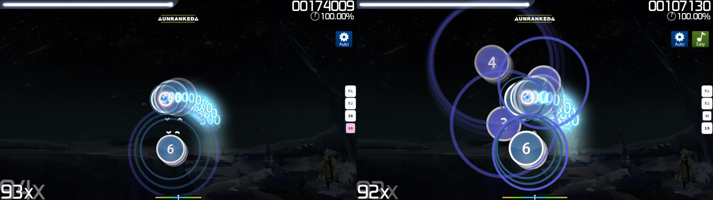
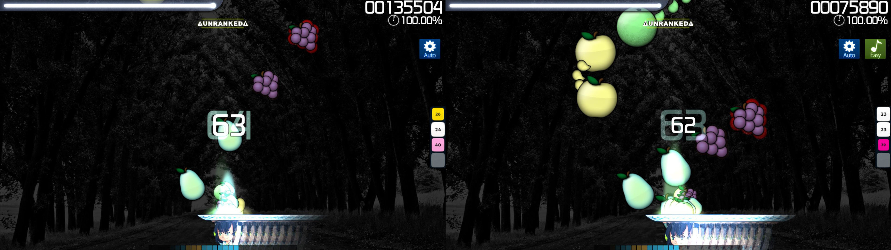

# Easy（模组）

::: Infobox

<!-- lint ignore heading-increment -->

#### Easy

*![][osu!] 降（ti）低（gao）总体难度——更（man）大（ping）的圈（xiang），HP下降更慢，缩圈速度变慢，更（ji）低（gao）的准（du）确（tu）要求，有2次机会原地满状态复活。*\
*![][osu!taiko] 降低总体难度，物件移动速度会慢些，更低的准确度要求。*\
*![][osu!catch] 降（ti）低（gao）总体难度——更（man）大（ping）的圈（xiang），HP下降更慢，缩圈速度变慢，更（ji）低（gao）的准（du）确（tu）要求，有2次机会原地满状态复活。*\
*![][osu!mania] 降低总体难度，HP掉的更慢，更低的准确度要求。*

|  |  |
| :-- | :-- |
| 缩写 | EZ |
| 类别 | 降低难度 |
| 默认快捷键 | `Q` |
| 游戏模式 | ![][osu!] ![][osu!taiko] ![][osu!catch] ![][osu!mania] |
| 得分倍率 | 0.50x |
| 状态 | 可计表现分 |
| 不兼容的模组 | [Hard Rock (HR)](/wiki/Gameplay/Game_modifier/Hard_Rock) |

:::

::: alert-note
**注:** 对于本文章的 [lazer](/wiki/Client/Release_stream/Lazer) 版本，参见：[Easy（lazer 模组）](/wiki/Gameplay/Game_modifier/Easy_(lazer))
:::

::: alert-note
**注:** 对于更多义项，参见：[Easy（消歧义）](/wiki/Disambiguation/Easy)
:::

::: alert-note
**注:** 对于所有模组的列表，参见：[游戏模组 (Mods)](/wiki/Gameplay/Game_modifier)
:::

**Easy (EZ)** 是一个降低难度的[游戏模组](/wiki/Gameplay/Game_modifier)，会将[谱面](/wiki/Beatmap)的所有难度参数减半。

在除了 [osu!taiko](/wiki/Game_mode/osu!taiko) 的所有[游戏模式](/wiki/Game_mode)中，此模组会在游玩期间给玩家两条额外“生命”。当[血条](/wiki/Client/Interface/Health_bar)降到零时游戏会暂停，从玩家生命数中除去一条“命”，并使血条缓慢回复到约 80% 处。

回血开始时，会播放皮肤的 `readysound.wav` 音效提示玩家。回血完毕后，则会播放 `gosound.wav` 音效，让玩家继续游玩谱面。如果血条归零时玩家无剩余生命，就会照常失败。

### osu!

在 [osu!](/wiki/Game_mode/osu!) 中，此模组会将[圆圈大小 (CS)](/wiki/Beatmap/Circle_size)、[缩圈速度 (AR)](/wiki/Beatmap/Approach_rate)、[整体难度 (OD)](/wiki/Beatmap/Overall_difficulty) 与[掉血速度 (HP)](/wiki/Beatmap/HP_drain_rate) 减半。

许多玩家会发现，Easy 模组不会降低物件密集谱面的难度。缩圈速度减半后，会导致游玩区域在视觉上过于混乱，难以读谱。

### osu!taiko

在 [osu!taiko](/wiki/Game_mode/osu!taiko) 中，Easy 模组会将[滑条速率](/wiki/Gameplay/Hit_object/Slider/Slider_velocity)、OD 值与 HD 值减半。

::: alert-notice
**注意**
完成[转盘](/wiki/Gameplay/Hit_object/Spinner)所需打击数会变为 OD 值。
:::

由于 osu!taiko 游玩中途不可能失败，该模组并不会添加额外生命，而是降低填充血条所需血量，让血条能更快被填满。

### osu!catch

在 [osu!catch](/wiki/Game_mode/osu!catch) 中，此模组的效果与 osu! 中相比相同，还连带着一些调整：水果下落更慢（AR 值减半），水果更大（CS 值减半），也会获得额外两条命。

由于 osu!catch 只用一个轴移动，水果变大与下落速度减慢会导致与 osu! 中相同的读图问题。

### osu!mania

在 [osu!mania](/wiki/Game_mode/osu!mania) 中，Easy 模组会将 OD 值与 HP 值减半，并添加两条额外生命。滑条速率与默认键数不受该模组影响。

## 冷知识

- 回放中使用额外生命时，不会出现回血动画，如同玩家正使用 [No Fail](/wiki/Gameplay/Game_modifier/No_Fail) 模组游玩一般。
- 在[多人游戏](/wiki/Client/Interface/Multiplayer)中使用 [Tag Co-op 或 Tag Team Vs. 组队模式](/wiki/Client/Interface/Multiplayer#tag-co-op-/-tag-team-vs)游玩时，将会禁用额外生命机制。

[osu!]: /wiki/shared/mode/osu.png "osu!"
[osu!taiko]: /wiki/shared/mode/taiko.png "osu!taiko"
[osu!catch]: /wiki/shared/mode/catch.png "osu!catch"
[osu!mania]: /wiki/shared/mode/mania.png "osu!mania"
