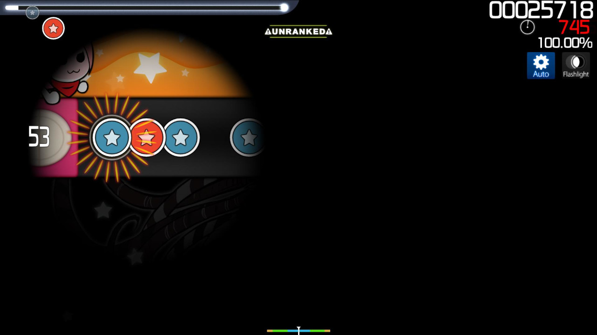
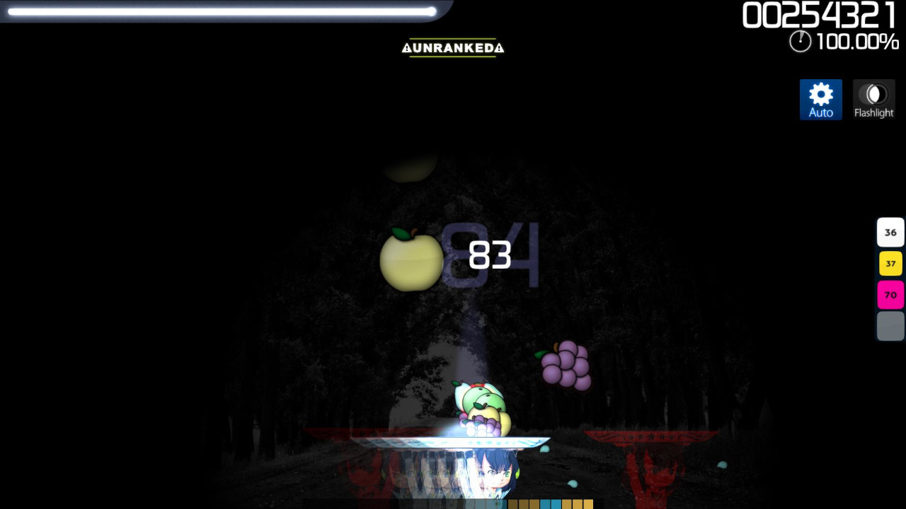
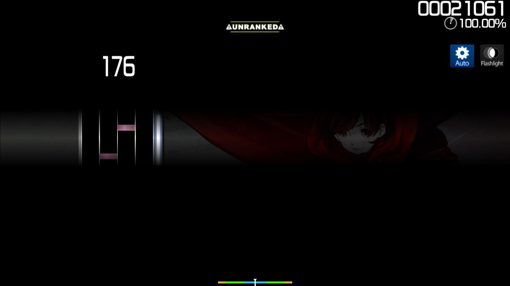

# Flashlight (mod)

 mod icon")

*สำหรับบทความเวอร์ชัน [lazer](/wiki/Client/Release_stream/Lazer) ดูที่: [Flashlight (lazer mod)](/wiki/Gameplay/Game_modifier/Flashlight_(lazer))*\
*สำหรับรายชื่อม็อดทั้งหมด ดูที่: [Game Modifiers](/wiki/Gameplay/Game_modifier)*\
*อย่าสับสนกับ [Hidden (mod)](/wiki/Gameplay/Game_modifier/Hidden)*

## เกี่ยวกับ

- ตัวย่อ: FL
- ประเภท: Difficulty Increase
- Score Multiplier:
  - ![][osu!] ![][osu!taiko] ![][osu!catch]: 1.12x
  - ![][osu!mania]: 1.00x
- คีย์ลัดเริ่มต้น: `G`
- คำอธิบาย: `Restricted view area`
- โหมดเกมที่รองรับ: ![][osu!] ![][osu!taiko] ![][osu!catch] ![][osu!mania]

## คำอธิบาย

ม็อด **Flashlight** เป็น[ม็อด](/wiki/Gameplay/Game_modifier)ที่ตั้งใจเพิ่มความยากของ[บีตแมป](/wiki/Beatmap)แบบจำลอง ด้วยการจำกัดพื้นที่ที่มองเห็นบนหน้าจอ

### osu!

ใน [osu!](/wiki/Game_mode/osu!) จะแสดงเฉพาะวงกลมสว่างเล็ก ๆ หรือพื้นที่ที่มองเห็น รอบเคอร์เซอร์ ซึ่งจะแสดงส่วนของเพลย์ฟีลด์ที่อยู่ภายในวงกลมนั้น ขนาดของวงกลมนี้จะเปลี่ยนตามคอมโบปัจจุบันของผู้เล่น

พื้นที่ที่มองเห็นจะเล็กลงที่คอมโบ 100x และอีกครั้งที่ 200x หากคอมโบของผู้เล่นขาดเมื่อใดก็ตาม พื้นที่ที่มองเห็นจะกลับไปเป็นขนาดเดิม นอกจากนี้ เมื่อกำลังเลื่อนตาม[สไลเดอร์](/wiki/Gameplay/Hit_object/Slider) พื้นที่ที่มองเห็นจะมืดลงบางส่วนจนกว่าสไลเดอร์จะจบ

ทั้งหมดนี้รวมกันเป็นเอฟเฟกต์ที่ดูเหมือนมีไฟฉายเสมือนส่องอยู่ที่เคอร์เซอร์ของผู้เล่น:

, 100x combo (bottom-left), and at 200x combo (bottom-right)")

ควรทราบว่าเมื่อใช้คู่กับม็อด Hidden พื้นที่ที่มองเห็นของ "flashlight" แทบไม่มีความหมาย เพราะเมื่อการมองเห็นถูกจำกัด hit object อาจ fade ขณะเคอร์เซอร์ไม่ได้โฟกัสอยู่ที่จุดที่ hit object ปรากฏ

ม็อด Flashlight ถูกผู้เล่นจำนวนมากมองว่าเป็นม็อดที่ยากที่สุดใน osu! และคะแนนที่ได้ด้วยม็อดนี้มักต้องให้ผู้เล่นจำบีตแมปทั้งแมป

### osu!taiko

ใน [osu!taiko](/wiki/Game_mode/osu!taiko) ตำแหน่งของพื้นที่ที่มองเห็นจะคงอยู่ที่บริเวณตี และคล้ายกับ osu! พื้นที่ที่มองเห็นจะหดลงเมื่อคอมโบเพิ่มขึ้น โดยหดที่ 100x และ 200x combo และกลับเป็นขนาดเดิมหากคอมโบขาด

เมื่อใช้คู่กับม็อด Hidden พื้นที่ที่มองเห็นของ "flashlight" จะไม่มีประโยชน์นัก เพราะในทางเทคนิคโน้ตจะ "ล่องหน" อยู่แล้ว เนื่องจากโน้ต fade out จนหมดเมื่อมาถึงพื้นที่ที่มองเห็น สิ่งนี้ยังต้องอาศัยการจำบีตแมปทั้งแมปด้วย

### osu!catch

ใน [osu!catch](/wiki/Game_mode/osu!catch) พฤติกรรมของม็อด Flashlight เหมือนกับ osu! ยกเว้นว่าพื้นที่ที่มองเห็นจะตาม catcher แทนเคอร์เซอร์ และด้วยลักษณะของ osu!catch พื้นที่ที่มองเห็นจะใหญ่กว่าใน osu! หรือ osu!taiko อย่างเห็นได้ชัด

เมื่อใช้คู่กับม็อด Hidden fruit จะมองเห็นได้ชั่วคราวหาก catcher อยู่ *ใต้* fruit พอดี จนกว่าผู้เล่นจะถึงคอมโบ 100x ซึ่งตอนนั้น fruit จะล่องหนสนิทเมื่อมาถึงพื้นที่ที่มองเห็น เช่นเดียวกับ osu! และ osu!taiko สิ่งนี้ต้องอาศัยการจำบีตแมปทั้งแมป

### osu!mania

ใน [osu!mania](/wiki/Game_mode/osu!mania) พื้นที่ที่มองเห็นจะถูกจำกัดเป็นแถบแนวนอนค่อนข้างบางตรงกลาง track ขณะที่ส่วนอื่นทั้งหมดถูกบังไว้ ในแง่นั้น ม็อด Flashlight อาจมองได้ว่าเป็นการรวมม็อด Hidden กับ [Fade In](/wiki/Gameplay/Game_modifier/Fade_In) เข้าด้วยกัน โดยไม่มีการเปลี่ยนขนาดของพื้นที่ที่มองเห็น

## เกร็ดน่ารู้

- หากผ่านบีตแมปด้วย grade S หรือ SS ขณะเปิดม็อด Flashlight บีตแมปนั้นจะให้ grade เวอร์ชันสีเงินแทน
- เดิมทีม็อด Flashlight เคยเป็นประเด็นถกเถียงหนักในปี 2010 เกี่ยวกับวิธี implementation เพราะเป็นม็อดที่ hack ได้ง่ายที่สุด ส่งผลให้ต้องทำให้ม็อดเป็น unranked จนกว่าจะมีแพตช์มาปิดช่องโหว่การ implementation ของ Flashlight
  - [Flashlight mod disabled #2](https://osu.ppy.sh/community/forums/topics/41039)
  - [Flashlight is back!](https://osu.ppy.sh/community/forums/topics/41519)

[osu!]: /wiki/shared/mode/osu.png "osu!"
[osu!taiko]: /wiki/shared/mode/taiko.png "osu!taiko"
[osu!catch]: /wiki/shared/mode/catch.png "osu!catch"
[osu!mania]: /wiki/shared/mode/mania.png "osu!mania"
