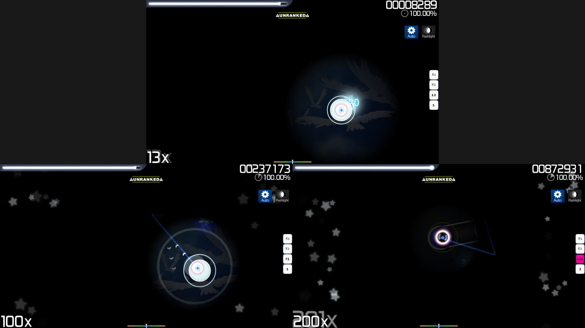

# Flashlight（模组）

 模组图标")

*对于本文章的 [lazer](/wiki/Client/Release_stream/Lazer) 版本，参见：[Flashlight（lazer 模组）](/wiki/Gameplay/Game_modifier/Flashlight_(lazer))*\
*对于所有模组的列表，参见：[游戏模组 (Mods)](/wiki/Gameplay/Game_modifier)*\
*请勿与 [Hidden（模组）](/wiki/Gameplay/Game_modifier/Hidden) 混淆。*

## 关于

- 缩写：FL
- 类别：增加难度
- 得分系数：
  - ![][osu!] ![][osu!taiko] ![][osu!catch]：1.12x
  - ![][osu!mania]：1.00x
- 默认快捷键：`G`
- 描述：`限制视野，在连击100x时再缩小视野一次，200x时缩到最小。准备好记(shuang)忆(ping)力(mu)了么？`
- 兼容的游戏模式：![][osu!] ![][osu!taiko] ![][osu!catch] ![][osu!mania]

## 说明

**Flashlight** [游戏模组](/wiki/Gameplay/Game_modifier)通过限制屏幕可见区域来人为增加[谱面](/wiki/Beatmap)难度。

### osu!

在 [osu!](/wiki/Game_mode/osu!) 中，光标周围只有一个照亮的小圆圈（即可见区域），显示圆圈范围内的游玩界面。可见区域的大小随玩家目前连击数而变化。

在连击数为 100x 时可见区域会缩小，连击数为 200x 时会再次缩小。一旦断连，可见区域会扩大到原始大小。此外，可见区域在完成[滑条](/wiki/Gameplay/Hit_object/Slider)期间会变暗。

此模组的所有功能累加起来，呈现出玩家光标上有虚拟手电筒照着的效果：

需要注意，当与 Hidden 模组并用时，“手电筒”的可见区域几乎不重要：由于可见区域限制，打击物件可能会在光标未处于打击物件出现点时渐隐。

此模组被公认为 osu! 中最难的模组，玩家常常需要背下整张谱面才能用它得分。

### osu!taiko

在 [osu!taiko](/wiki/Game_mode/osu!taiko) 中，可见区域固定于打击区。与 osu! 相似的是，可见区域会随连击数增加而缩小：在连击数为 100x 和 200x 时会缩小，断连时会回到原始大小。

当与 Hidden 模组并用时，“手电筒”的可见区域就失去了意义：音符在到达可见区域时已完全消失，也就在技术上变得“不可见”。这也需要熟背整张谱面。

### osu!catch

在 [osu!catch](/wiki/Game_mode/osu!catch) 中，此模组的表现与 osu! 中相同，但可见区域跟随小人而非光标移动。由于 osu!catch 的性质，可见区域比 osu! 与 osu!taiko 中的大得多。

当与 Hidden 模组并用时，如果小人在水果*正下方*，顷刻间会看到水果。具体来说，在玩家连击数达到 100x 时，水果在到达可见区域时已经完全不可见了。与 osu! 与 osu!taiko 中类似，这也需要熟背整张谱面。

### osu!mania

在 [osu!mania](/wiki/Game_mode/osu!mania) 中，可见区域限于轨道中部相对较小的水平区域，玩家不能看到其他部分的东西。出于这一点，此模组可以类比为 Hidden 与 [Fade In](/wiki/Gameplay/Game_modifier/Fade_In) 模组的结合体。（也就是说，可见区域大小不会改变）

## 冷知识

- 若使用此模组以 S 或 SS 等级完成谱面，则会获得银 S 或银 SS 等级。
- 最初在2010年时，此模组由于最容易被黑而饱受争议；随后此模组被迫不计入排名，直到一个补丁填补了此模组实现方法上的漏洞。
  - [Flashlight mod disabled #2](https://osu.ppy.sh/community/forums/topics/41039)
  - [Flashlight is back!](https://osu.ppy.sh/community/forums/topics/41519)

[osu!]: /wiki/shared/mode/osu.png "osu!"
[osu!taiko]: /wiki/shared/mode/taiko.png "osu!taiko"
[osu!catch]: /wiki/shared/mode/catch.png "osu!catch"
[osu!mania]: /wiki/shared/mode/mania.png "osu!mania"
