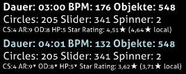

# Half Time (Mod)

 Modsymbol")

*Für die [lazer-Version](/wiki/Client/Release_stream/Lazer) des Artikels, siehe: [Half Time (lazer-Mod)](/wiki/Gameplay/Game_modifier/Half_Time_(lazer))*\
*Für die vollständige Liste aller Mods, siehe: [Spielmodifikationen](/wiki/Gameplay/Game_modifier)*

## Übersicht

- Abkürzung: HT
- Typ: Verringerung der Schwierigkeit
- Score-Multiplikator:
  - ![][osu!] ![][osu!taiko] ![][osu!catch]: 0,30x
  - ![][osu!mania]: 0,50x
- Standard-Tastenkürzel: `E`
- Untertitel: `Tucker tucker`
- Kompatible Spielmodi: ![][osu!] ![][osu!taiko] ![][osu!catch] ![][osu!mania]

## Beschreibung

*Anmerkung: Die eingesetzte Methode für das Verlangsamen des Songs kann dazu führen, dass er matschig oder roboterhaft klingt.*

Die Mod **Half Time** ist eine [Spielmodifikation](/wiki/Gameplay/Game_modifier), die die allgemeine Geschwindigkeit einer [Beatmap](/wiki/Beatmap) (BPM) auf 75 % der ursprünglichen Geschwindigkeit senkt, wodurch der Song 33 % länger wird und die [Approach-Rate (AR)](/wiki/Beatmap/Approach_rate), die [allgemeine Schwierigkeit (OD)](/wiki/Beatmap/Overall_difficulty) sowie [die Gesundheit (HP)](/wiki/Gameplay/Health) ein bisschen erhöht werden.

### osu!taiko

In [osu!taiko](/wiki/Game_mode/osu!taiko) verdichten sich die Noten durch den verlangsamten Song und die geringeren BPM, da sich die AR verringert. Jedoch aufgrund dessen, wie Dendens in osu!taiko berechnet werden, stecken sie zur Absolvierung mehr Treffer ein und sorgen dafür, dass sie eine **höhere Gesamtpunktzahl vergeben als ohne die Mod**, da Denden-Treffer nicht vom [Score-Multiplikator](/wiki/Gameplay/Game_modifier/Mod_multiplier) abhängig sind.

Als Folge daraus führt die Mod Half Time zu einem Anstieg des maximal möglichen Scores für Beatmaps mit geringen Combos und vielen langen Dendens. Dieser Effekt ist noch auffälliger, wenn die Mod [Hard Rock](/wiki/Gameplay/Game_modifier/Hard_Rock) gleichzeitig aktiv ist.

### osu!catch

In [osu!catch](/wiki/Game_mode/osu!catch) wird die BPM und die Geschwindigkeit des Catchers mit demselben Faktor wie in anderen Spielmodi gesenkt. Alle [Fruits](/wiki/Gameplay/Hit_object/Fruit), [Drops](/wiki/Gameplay/Hit_object/Juice_stream#drop), [Droplets](/wiki/Gameplay/Hit_object/Juice_stream#droplet) und [Bananen](/wiki/Gameplay/Hit_object/Banana) bleiben unberührt.

## Trivia

- Wenn die Mod Half Time aktiviert ist, sind die Angaben `Dauer`, `BPM` und `Objekte` hellblau mit anderen Werten gefärbt (siehe Abbildung unten).
  - Die Angabe `Objekte` ist hellblau gefärbt, obwohl es keine tatsächliche Veränderung im Wert gab.
- Die Angaben `AR`, `OD` und `HP` haben ein hochgestelltes Dreieck neben sich, um eine leichte Abnahme ihrer Werte anzuzeigen (siehe Abbildung unten).
- Der Name "Half Time" könnte als falscher Begriff interpretiert werden, da die Mod HT die Geschwindigkeit einer Beatmap nicht wirklich um die Hälfte reduziert (50 %), sondern nur um das 0,75-fache (75 %).

[osu!]: /wiki/shared/mode/osu.png "osu!"
[osu!taiko]: /wiki/shared/mode/taiko.png "osu!taiko"
[osu!catch]: /wiki/shared/mode/catch.png "osu!catch"
[osu!mania]: /wiki/shared/mode/mania.png "osu!mania"
