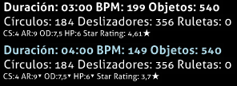

# Half Time (mod)

")

*Para la versión de [lazer](/wiki/Client/Release_stream/Lazer) de este artículo, véase: [Half Time (mod de lazer)](/wiki/Gameplay/Game_modifier/Half_Time_(lazer))*\
*Para la lista completa de los mods, véase: [Modificadores del juego](/wiki/Gameplay/Game_modifier)*

## Resumen

- Abreviatura: HT
- Tipo: Reducción de dificultad
- Multiplicador de puntuación:
  - ![][osu!] ![][osu!taiko] ![][osu!catch]: 0,30x
  - ![][osu!mania]: 0,50x
- Tecla de acceso directo predeterminada: `E`
- Descripción: `Menos velocidad.`
- Modos de juego compatibles: ![][osu!] ![][osu!taiko] ![][osu!catch] ![][osu!mania]

## Descripción

*Nota: El método usado para ralentizar la canción podría causar que el sonido suene raro o robótico.*

El mod **Half Time** es un [modificador del juego](/wiki/Gameplay/Game_modifier) que ralentiza la velocidad general del [beatmap](/wiki/Beatmap) (BPM) a un 75 % del original, incrementa la longitud de la canción en un 33 %, y disminuye la [velocidad de aproximación (AR)](/wiki/Beatmap/Approach_rate), la [dificultad general (OD)](/wiki/Beatmap/Overall_difficulty), y la [salud (HP)](/wiki/Gameplay/Health) por una pequeña cantidad.

### osu!taiko

En [osu!taiko](/wiki/Game_mode/osu!taiko), la canción y el BPM ralentizado hacen que las notas se vuelvan muy densas debido a la disminución del AR. Sin embargo, debido a la forma en que se calculan los dendens en osu!taiko, se necesitan más golpes para completarlos y hacen que otorguen un **valor total más alto que sin el mod**, ya que los golpes de los dendens no se ven afectados por el [multiplicador de puntuación](/wiki/Gameplay/Game_modifier/Mod_multiplier).

Como resultado, usar el mod Half Time conducirá a un aumento en la puntuación máxima posible para mapas con combos muy bajos y muchos dendens largos. Este efecto será aún más significativo cuando [Hard Rock](/wiki/Gameplay/Game_modifier/Hard_Rock) esté activado simultáneamente.

### osu!catch

En [osu!catch](/wiki/Game_mode/osu!catch), el BPM y la velocidad del catcher se reducen por el mismo factor que en otros modos. Todas las [frutas](/wiki/Gameplay/Hit_object/Fruit), [gotas](/wiki/Gameplay/Hit_object/Juice_stream#gota), [gotitas](/wiki/Gameplay/Hit_object/Juice_stream#gotita) y [plátanos](/wiki/Gameplay/Hit_object/Banana) quedan intactos.

## Curiosidades

- Cuando el mod Half Time está activiado, los valores `Duración`, `BPM`, y `Objetos` se colorearán en azul claro con los nuevos valores. (Mostrado a continuación).
- El valor de los `Objetos` seguirá siendo de color azul claro incluso si no se realiza ningún cambio en el valor.
- Los valores `AR`, `OD`, y `HP` tendrán un triángulo en superíndice junto a sus valores que indica una pequeña disminución en sus valores. (Mostrado a continuación).
- El nombre «Half Time» podría etiquetarse como un nombre inapropiado, ya que el mod HT en realidad no reduce la velocidad de un beatmap 0,5 veces (50 %); disminuye la velocidad de los beatmaps en 0,75x (75 %).

[osu!]: /wiki/shared/mode/osu.png "osu!"
[osu!taiko]: /wiki/shared/mode/taiko.png "osu!taiko"
[osu!catch]: /wiki/shared/mode/catch.png "osu!catch"
[osu!mania]: /wiki/shared/mode/mania.png "osu!mania"
