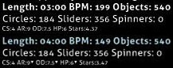

# Half Time (mod)

")

*Untuk melihat daftar keseluruhan dari semua mod, kunjungi: [Game Modifier](/wiki/Gameplay/Game_modifier)*

## Tentang

- Singkatan: HT
- Tipe: Pengurang Kesulitan
- Pengali Skor:
  - ![][osu!] ![][osu!taiko] ![][osu!catch]: 0.30x
  - ![][osu!mania]: 0.50x
- Tombol Shortcut Default: `E`
- Caption: `Mode Siput.`
- Mode-mode game yang cocok: ![][osu!] ![][osu!taiko] ![][osu!catch] ![][osu!mania]

## Deskripsi

*Catatan: Cara yang digunakan untuk memperlambat lagu tersebut bisa mengakibatkan lagunya kedengaran seperti robot atau agak keruh.*

Mod **Half Time** adalah sebuah [game modifier](/wiki/Gameplay/Game_modifier) yang berfungsi mengurangi kecepatan tempo (BPM) dari sebuah [beatmap](/wiki/Beatmap) menjadi 75% dari kecepatan awalnya, dengan meningkatkan durasi lagu sebesar 33%, dan mengurangi sedikit jumlah dari [approach rate (AR)](/wiki/Beatmap/Approach_rate), [overall difficulty (OD)](/wiki/Beatmap/Overall_difficulty), [dan health (HP)](/wiki/Gameplay/Health).

### osu!taiko

Pada [osu!taiko](/wiki/Game_mode/osu!taiko), lagu dan tempo yang sudah diperlambat menyebabkan not-not menjadi sangat bertumpuk karena jumlah dari approach rate (AR) telah dikurangi. Namun, dikarenakan kalkulasi denden pada osu!taiko memerlukan lebih banyak ketukan untuk diselesaikan, mengakibatkan pemberian **jumlah nilai menjadi lebih tinggi daripada tanpa menggunakan mod**, karena ketukan denden tidak dipengaruhi oleh [pengali skor](/wiki/Gameplay/Game_modifier/Mod_multiplier).

Karena itu, menggunakan mod Half Time bisa menyebabkan peningkatan dalam skor maksimum yang dapat dicapai di semua map dengan kombo yang sangat rendah dan jumlah denden panjang yang banyak. Efek ini bisa dilihat secara lebih besar ketika mod [Hard Rock](/wiki/Gameplay/Game_modifier/Hard_Rock) digunakan secara bersamaan.

### osu!catch

Pada [osu!catch](/wiki/Game_mode/osu!catch), tempo lagu dan kecepatan catcher yang kamu miliki akan melambat sesuai dengan nilai-nilai yang telah disebutkan pada mode-mode permainan sebelumnya. Tetapi mod ini *juga* mengurangi kecepatan pemain. Seluruh objek [fruit](/wiki/Gameplay/Hit_object/Fruit), [drop](/wiki/Gameplay/Hit_object/Juice_stream#drop), [droplet](/wiki/Gameplay/Hit_object/Juice_stream#droplet) dan [banana](/wiki/Gameplay/Hit_object/Banana) tetap sama.

## Trivia

- Saat mod Half Time dinyalakan, nilai `Length`, `BPM`, dan `Objects` akan mempunyai warna biru muda dengan nilai baru yang telah ditingkatkan. (Digambarkan di bawah.)
  - Nilai `Objects` tetap bewarna biru muda walaupun tidak ada perubahan yang terjadi pada nilainya.
- Nilai `AR`, `OD`, dan `HP` mempunyai sebuah segitiga kecil dalam bentuk superscript di samping nilai mereka untuk menandakan pengurangan kecil pada nilai mereka. (Digambarkan di bawah.)
- Penamaaan "Half Time" bisa dikatakan sebagai istilah yang tidak cocok karena mod HT sebenarnya tidak mengurangi kecepatan lagunya sebesar 0.5x (50%); mod ini hanya mengurangi kecepatan beatmap menjadi 0.75x (75%).

[osu!]: /wiki/shared/mode/osu.png "osu!"
[osu!taiko]: /wiki/shared/mode/taiko.png "osu!taiko"
[osu!catch]: /wiki/shared/mode/catch.png "osu!catch"
[osu!mania]: /wiki/shared/mode/mania.png "osu!mania"
