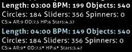

# Half Time (Mod)

 mod icon")

*สำหรับบทความเวอร์ชัน [lazer](/wiki/Client/Release_stream/Lazer) ดูที่: [Half Time (lazer mod)](/wiki/Gameplay/Game_modifier/Half_Time_(lazer))*\
*สำหรับรายการ Mod ทั้งหมด ดูที่: [ตัวปรับแต่งเกม (Game modifier)](/wiki/Gameplay/Game_modifier)*

## ข้อมูลทั่วไป

- ตัวย่อ: HT
- ประเภท: ลดความยาก (Difficulty Reduction)
- ตัวคูณคะแนน:
  - ![][osu!] ![][osu!taiko] ![][osu!catch]: 0.30x
  - ![][osu!mania]: 0.50x
- ปุ่มลัดพื้นฐาน: `E`
- คำอธิบาย: `ความเร็วลดลง`
- โหมดที่รองรับ: ![][osu!] ![][osu!taiko] ![][osu!catch] ![][osu!mania]

## รายละเอียด

*หมายเหตุ: วิธีการลดความเร็วเพลงที่ใช้ใน Mod นี้อาจทำให้เสียงเพลงดูอู้อี้หรือดูเหมือนเสียงหุ่นยนต์*

**Half Time** เป็น [ตัวปรับแต่งเกม](/wiki/Gameplay/Game_modifier) ที่ช่วยลดความเร็วโดยรวม (BPM) ของ [บีทแมพ (Beatmap)](/wiki/Beatmap) ลงเหลือ 75% ของความเร็วเดิม ซึ่งส่งผลให้เพลงมีความยาวเพิ่มขึ้น 33% และจะลดค่า [ความเร็วการปรากฏ (AR)](/wiki/Beatmap/Approach_rate), [ความยากโดยรวม (OD)](/wiki/Beatmap/Overall_difficulty) รวมถึง [พลังชีวิต (HP)](/wiki/Gameplay/Health) ลงเล็กน้อย

### osu!taiko

ในโหมด [osu!taiko](/wiki/Game_mode/osu!taiko) การที่เพลงช้าลงและค่า BPM ลดลงส่งผลให้ค่า AR ลดลงตามไปด้วย ทำให้โน้ตดูหนาแน่นมาก อย่างไรก็ตาม เนื่องจากวิธีการคำนวณคะแนนของ Denden (สปินเนอร์) ในโหมดนี้ Denden จะต้องการการกดเพิ่มขึ้นและให้คะแนนรวมที่ **สูงกว่าปกติ** เนื่องจากคะแนนจากการกด Denden ไม่ได้รับผลกระทบจาก [ตัวคูณคะแนนของ Mod](/wiki/Gameplay/Game_modifier/Mod_multiplier)

ผลที่ตามมาคือ การใช้ Mod Half Time ในบีทแมพที่มีคอมโบน้อยแต่มี Denden ยาวๆ จำนวนมาก อาจทำให้คะแนนสูงสุดที่เป็นไปได้สูงกว่าการไม่ใช้ Mod และเอฟเฟกต์นี้จะยิ่งชัดเจนขึ้นเมื่อเปิดใช้งาน Mod [Hard Rock](/wiki/Gameplay/Game_modifier/Hard_Rock) ควบคู่ไปด้วย

### osu!catch

ในโหมด [osu!catch](/wiki/Game_mode/osu!catch) ค่า BPM และความเร็วในการเคลื่อนที่ของตัวละครคนรับจะถูกลดลงในอัตราเดียวกับโหมดอื่นๆ โดยที่ตำแหน่งของ [ผลไม้ (Fruits)](/wiki/Gameplay/Hit_object/Fruit), [หยดน้ำใหญ่ (Drops)](/wiki/Gameplay/Hit_object/Juice_stream#drop), [หยดน้ำเล็ก (Droplets)](/wiki/Gameplay/Hit_object/Juice_stream#droplet) และ [กล้วย (Bananas)](/wiki/Gameplay/Hit_object/Banana) จะยังคงเหมือนเดิมทุกประการ

## เกร็ดน่ารู้ (Trivia)

- เมื่อเปิดใช้งาน Mod Half Time ค่าความยาวเพลง (`Length`), จังหวะ (`BPM`) และจำนวนวัตถุ (`Objects`) จะแสดงเป็นตัวเลขสีฟ้าพร้อมค่าใหม่ (ดังภาพด้านล่าง)
  - ค่าจำนวนวัตถุจะแสดงเป็นสีฟ้าแม้ว่าจะไม่มีการเปลี่ยนแปลงจำนวนจริงก็ตาม
- ค่า `AR`, `OD` และ `HP` จะมีสัญลักษณ์ลูกศรชี้ลงขนาดเล็กปรากฏอยู่ข้างๆ เพื่อบ่งบอกว่ามีการลดระดับค่าเหล่านั้นลง
- ชื่อ "Half Time" อาจจะดูคลาดเคลื่อนเล็กน้อย เนื่องจาก Mod นี้ไม่ได้ลดความเร็วลงเหลือครึ่งหนึ่ง (50%) แต่ลดลงเหลือเพียง 75% เท่านั้น

[osu!]: /wiki/shared/mode/osu.png "osu!"
[osu!taiko]: /wiki/shared/mode/taiko.png "osu!taiko"
[osu!catch]: /wiki/shared/mode/catch.png "osu!catch"
[osu!mania]: /wiki/shared/mode/mania.png "osu!mania"
