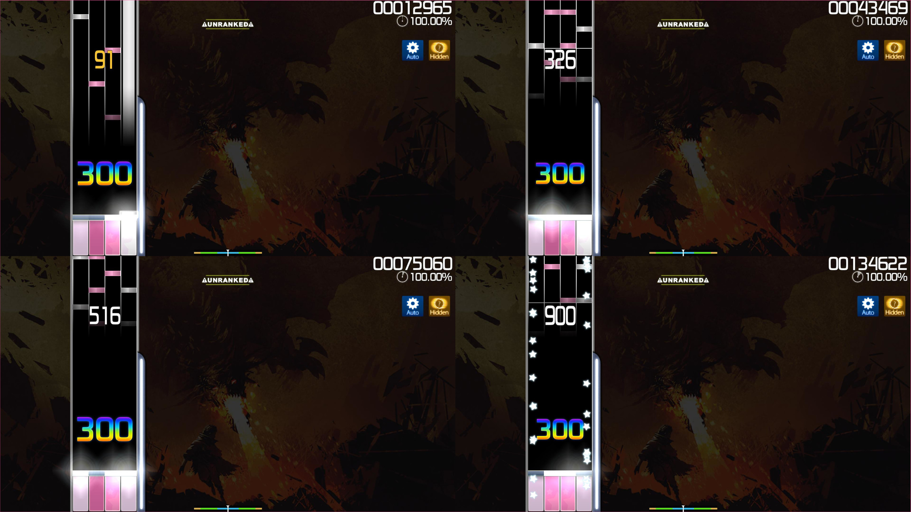

# Hidden (Mod)

 mod icon")

*สำหรับบทความเวอร์ชัน [lazer](/wiki/Client/Release_stream/Lazer) ดูที่: [Hidden (lazer mod)](/wiki/Gameplay/Game_modifier/Hidden_(lazer))*\
*สำหรับรายการ Mod ทั้งหมด ดูที่: [ตัวปรับแต่งเกม (Game modifier)](/wiki/Gameplay/Game_modifier)*\
*อย่าสับสนกับ [Mod Fade In](/wiki/Gameplay/Game_modifier/Fade_In) หรือ [Mod Flashlight](/wiki/Gameplay/Game_modifier/Flashlight)*

## ข้อมูลทั่วไป

- ตัวย่อ: HD
- ประเภท: เพิ่มความยาก (Difficulty Increasing)
- ตัวคูณคะแนน:
  - ![][osu!] ![][osu!taiko] ![][osu!catch]: 1.06x
  - ![][osu!mania]: 1.00x
- ปุ่มลัดพื้นฐาน: `F`
  - ปุ่มลัดพื้นฐาน ([osu!mania](/wiki/Game_mode/osu!mania)): `F` `F` หรือ `Shift` + `F`
- คำอธิบาย:
  - ![][osu!]: `เล่นโดยไม่มีวงกลมบอกจังหวะและโน้ตจะค่อยๆ จางหายไปเพื่อให้ได้คะแนนเพิ่มขึ้นเล็กน้อย`
  - ![][osu!taiko]: `โน้ตจะจางหายไปก่อนที่คุณจะกด!`
  - ![][osu!catch] `เล่นโดยไม่มีวงกลมบอกจังหวะและโน้ตจะค่อยๆ จางหายไปเพื่อให้ได้คะแนนเพิ่มขึ้นเล็กน้อย`
  - ![][osu!mania]: `โน้ตจะจางหายไปก่อนที่คุณจะกด!`
- โหมดที่รองรับ: ![][osu!] ![][osu!taiko] ![][osu!catch] ![][osu!mania]
- รูปแบบแยกย่อย (osu!mania): [Fade In](/wiki/Gameplay/Game_modifier/Fade_In)

## รายละเอียด

**Hidden** เป็น [ตัวปรับแต่งเกม](/wiki/Gameplay/Game_modifier) ที่ช่วยเพิ่มความยากของบีทแมพโดยการนำวงกลมบอกจังหวะ (Approach circles) ออกไป และทำให้ [วัตถุ (Hit objects)](/wiki/Gameplay/Hit_object) ค่อยๆ จางหายไปหลังจากที่ปรากฏขึ้นบนหน้าจอ

### osu!

ในโหมด [osu!](/wiki/Game_mode/osu!) Mod Hidden จะลบวงกลมบอกจังหวะออกและทำให้วัตถุต่างๆ จางหายไปอย่างรวดเร็วหลังจากปรากฏขึ้น บังคับให้ผู้เล่นต้องใช้การจดจำจังหวะเวลา รวมถึงตำแหน่งและการลากสไลเดอร์ด้วยตัวเองในระดับหนึ่ง

อย่างไรก็ตาม ควรทราบว่าผู้เล่นระดับท็อปส่วนใหญ่มองว่า Mod Hidden เป็น Mod เพิ่มความยากที่เล่นง่ายที่สุด เนื่องจากจังหวะเวลาที่วัตถุปรากฏและจางหายไปนั้นมีความสม่ำเสมอคงที่ ทำให้ผู้เล่นสามารถเรียนรู้จังหวะการกดจากการจางหายของโน้ตเพียงอย่างเดียวได้

### osu!taiko

ในโหมด [osu!taiko](/wiki/Game_mode/osu!taiko) โน้ตจะจางหายไปเมื่อเคลื่อนที่มาถึงประมาณครึ่งทางของหน้าจอ ทำให้ผู้เล่นต้องจดจำทั้งจังหวะและสีของโน้ตที่จะมาถึง อย่างไรก็ตาม สไลเดอร์และ Denden (สปินเนอร์) จะยังคงมองเห็นได้ตลอดแนวสายพานและไม่จางหายไป แต่จะไม่มีวงกลมบอกจังหวะสำหรับ Denden เพื่อบอกเวลาที่เหลือ

ในบีทแมพที่มีค่าความยากโดยรวม (OD) สูง ผู้เล่นที่มีประสบการณ์มักเลือกใช้ Mod Hidden เพื่อเพิ่มคะแนนแทน Mod [Hard Rock (HR)](/wiki/Gameplay/Game_modifier/Hard_Rock) เนื่องจาก HR อาจทำให้ช่วงเวลาการกด (Timing window) แคบจนเกินไป

ต่างจากโหมด osu! ปกติ Mod Hidden ในโหมด Taiko มักถูกมองว่าอ่านแมพได้ยากกว่ามากเพราะผู้เล่นต้องจดจำลำดับสีของโน้ตให้แม่นยำ

### osu!catch

ในโหมด [osu!catch](/wiki/Game_mode/osu!catch) Mod Hidden จะทำให้ผลไม้จางหายไปเมื่อหล่นลงมาถึงประมาณครึ่งหน้าจอ

ผลกระทบด้านความยากในโหมดนี้จะแตกต่างกันไปตามแต่ละบีทแมพ แต่โดยทั่วไปแล้ว บีทแมพที่มีค่า [ความเร็วการปรากฏ (AR)](/wiki/Beatmap/Approach_rate) ตั้งแต่ 9 ขึ้นไป การเปิด Mod Hidden จะแทบไม่ส่งผลต่อความยากในการเล่นมากนัก

### osu!mania

ในโหมด [osu!mania](/wiki/Game_mode/osu!mania) Mod Hidden จะทำงานตรงกันข้ามกับ Mod [Fade In](/wiki/Gameplay/Game_modifier/Fade_In) โดยโน้ตจะจางหายไปก่อนที่จะถึงเส้นตัดสิน

## เกร็ดน่ารู้ (Trivia)

- Mod Hidden เปิดตัวครั้งแรกในเกม Ouendan 2 ซึ่งเป็นเกมภาคที่สองในซีรีส์ [Osu! Tatakae! Ouendan](https://en.wikipedia.org/wiki/Osu!_Tatakae!_Ouendan) บนเครื่อง DS (ซึ่งเป็นต้นแบบของ osu!)
- หากผู้เล่นเล่นผ่านบีทแมพด้วยเกรด S หรือ SS ในขณะที่เปิด Mod Hidden จะได้รับเกรดเวอร์ชันสีเงิน (SH หรือ SSH) แทน
- โดยค่าเริ่มต้นในโหมด [osu!](/wiki/Game_mode/osu!) วัตถุชิ้นแรกของแมพจะยังคงแสดงวงกลมบอกจังหวะให้เห็นชั่วคราวเพื่อช่วยให้ผู้เล่นกะจังหวะเริ่มได้ถูก โดยสามารถปิดฟีเจอร์นี้ได้ในเมนู [Options](/wiki/Client/Options) ภายใต้หัวข้อ `Gameplay`
- ในโหมด osu!mania Mod Hidden เป็นรูปแบบแยกย่อยของ Mod [Fade In](/wiki/Gameplay/Game_modifier/Fade_In)
- Mod Hidden ในเวอร์ชันปัจจุบันของ osu!mania เดิมทีเคยเป็น Mod แยกต่างหากที่ชื่อว่า [Fade Out](/wiki/Gameplay/Game_modifier/Fade_Out)

[osu!]: /wiki/shared/mode/osu.png "osu!"
[osu!taiko]: /wiki/shared/mode/taiko.png "osu!taiko"
[osu!catch]: /wiki/shared/mode/catch.png "osu!catch"
[osu!mania]: /wiki/shared/mode/mania.png "osu!mania"
