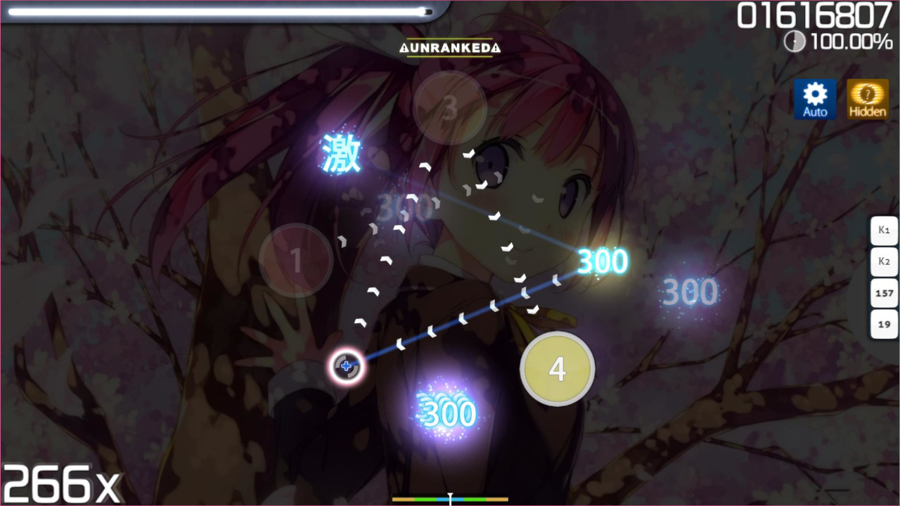
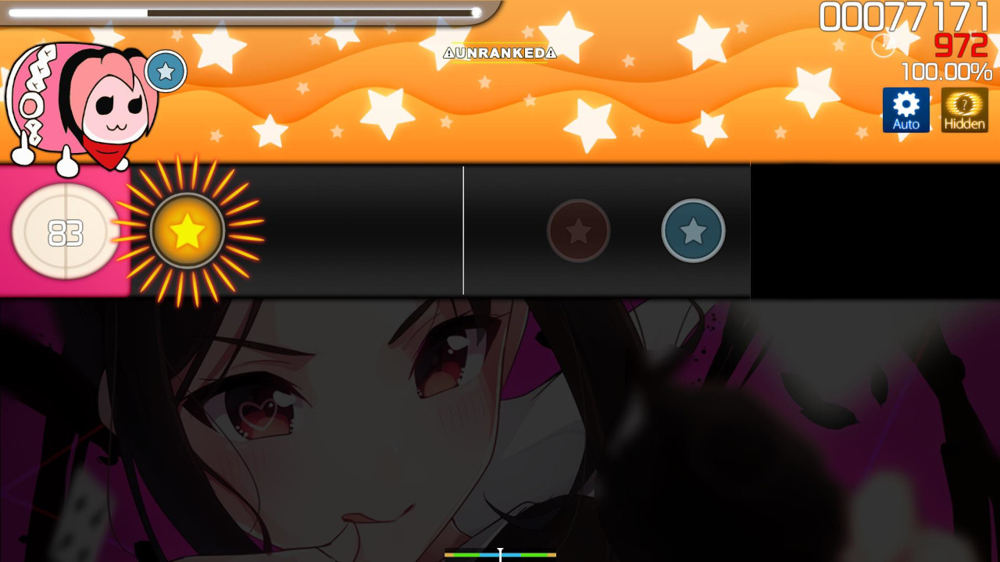
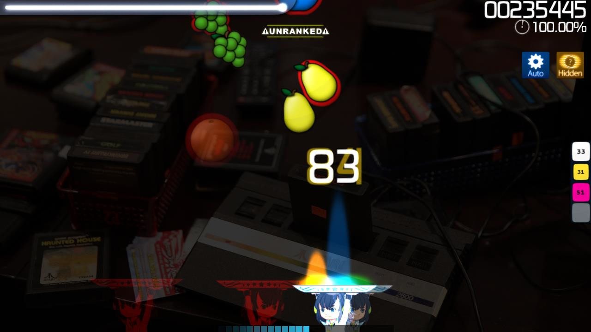

# Hidden (mod)

 mod icon")

*สำหรับบทความเวอร์ชัน [lazer](/wiki/Client/Release_stream/Lazer) ดูที่: [Hidden (lazer mod)](/wiki/Gameplay/Game_modifier/Hidden_(lazer))*\
*สำหรับรายชื่อม็อดทั้งหมด ดูที่: [Game Modifiers](/wiki/Gameplay/Game_modifier)*\
*อย่าสับสนกับ [Fade In (mod)](/wiki/Gameplay/Game_modifier/Fade_In) หรือ [Flashlight (mod)](/wiki/Gameplay/Game_modifier/Flashlight)*

## เกี่ยวกับ

- ตัวย่อ: HD
- ประเภท: Difficulty Increasing
- Score Multiplier:
  - ![][osu!] ![][osu!taiko] ![][osu!catch]: 1.06x
  - ![][osu!mania]: 1.00x
- คีย์ลัดเริ่มต้น: `F`
  - คีย์ลัดเริ่มต้น ([osu!mania](/wiki/Game_mode/osu!mania)): `F` `F` หรือ `Shift` + `F`
- คำอธิบาย:
  - ![][osu!]: `Play with no approach circles and fading notes for a slight score advantage.`
  - ![][osu!taiko]: `The notes fade out before you hit them!`
  - ![][osu!catch] `Play with no approach circles and fading notes for a slight score advantage.`
  - ![][osu!mania]: `The notes fade out before you hit them!`
- โหมดเกมที่รองรับ: ![][osu!] ![][osu!taiko] ![][osu!catch] ![][osu!mania]
- Variant (osu!mania): [Fade In](/wiki/Gameplay/Game_modifier/Fade_In)

## คำอธิบาย

ม็อด **Hidden** เป็น[ม็อด](/wiki/Gameplay/Game_modifier)ที่เพิ่มความยากของบีตแมปด้วยการลบ approach circle และทำให้ [hit object](/wiki/Gameplay/Hit_object) fade หลังปรากฏบนหน้าจอ

### osu!

ใน [osu!](/wiki/Game_mode/osu!) ม็อด Hidden จะลบ approach circle และทำให้ hit object fade out ไม่นานหลังปรากฏ บังคับให้ผู้เล่นต้องจำ timing เป็นหลัก รวมถึงจำตำแหน่งและเส้นทางสไลเดอร์ในระดับหนึ่ง

อย่างไรก็ตาม ควรทราบว่าม็อด Hidden ถูกมองว่าเป็นม็อดเพิ่มความยากที่ง่ายที่สุดในหมู่ผู้เล่นระดับท็อป เนื่องจากเวลาที่ hit object ปรากฏและหายไปมีความสม่ำเสมอ จากความสม่ำเสมอนี้ ผู้เล่นจึงสามารถเรียนรู้จังหวะ tap ออบเจกต์จากตอนที่มัน fade out เพียงอย่างเดียวได้

### osu!taiko

ใน [osu!taiko](/wiki/Game_mode/osu!taiko) โน้ตจะ fade out ประมาณครึ่งหน้าจอ ทำให้ผู้เล่นต้องจำ timing และสี อย่างไรก็ตาม slider และ denden ยังคงวิ่งผ่าน timeline เต็มและไม่ fade out โดยมีเงื่อนไขว่า denden ไม่มี approach circle สำหรับบอกเวลาที่หมด

บนบีตแมปที่มี overall difficulty สูง ผู้เล่นมีประสบการณ์จะใช้ม็อด Hidden เพื่อเพิ่มคะแนนแทนม็อด [Hard Rock (HR)](/wiki/Gameplay/Game_modifier/Hard_Rock) เพราะ HR บางครั้งทำให้ timing window เล็กเกินไป

ต่างจาก osu! ม็อด Hidden มักถูกมองว่าอ่านยากกว่าหรือ "ชินยาก" กว่า เพราะผู้เล่นต้องจำว่าสีอะไรจะมาต่อ

### osu!catch

ใน [osu!catch](/wiki/Game_mode/osu!catch) ม็อด Hidden จะทำให้ fruit fade out ประมาณครึ่งทางของหน้าจอ

ผลด้านความยากของการใช้ม็อด Hidden ใน osu!catch แตกต่างกันไปตามแต่ละบีตแมป แต่โดยทั่วไปถือว่าแมปที่มี [approach rate (AR)](/wiki/Beatmap/Approach_rate) 9 ขึ้นไปจะแทบต่างกันน้อยมากในแง่การเพิ่มความยาก

### osu!mania

ใน [osu!mania](/wiki/Game_mode/osu!mania) ม็อด Hidden ทำงานเป็นด้านตรงข้ามของม็อด Fade In เพราะโน้ตจะ fade out ก่อนถึงเวลาที่ควรกด

, at 326x combo (top-middle), at 516x combo (top-right/bottom-left), and at 900x combo (bottom-right) in osu!mania")

## เกร็ดน่ารู้

- ม็อด Hidden เปิดตัวครั้งแรกใน Ouendan 2 ซึ่งเป็นเกม DS ญี่ปุ่นภาคที่สองในซีรีส์ [Osu! Tatakae! Ouendan](https://en.wikipedia.org/wiki/Osu!_Tatakae!_Ouendan) ซึ่งเป็นซีรีส์ที่ osu! อิงจาก
- หากผ่านบีตแมปด้วย grade S หรือ SS ขณะเปิดม็อด Hidden บีตแมปนั้นจะให้ grade เวอร์ชันสีเงินแทน
- โดยค่าเริ่มต้น ใน [osu!](/wiki/Game_mode/osu!) [approach circle](/wiki/Gameplay/Hit_object/Approach_circle) ของ [hit object](/wiki/Gameplay/Hit_object) ตัวแรกจะมองเห็นได้ชั่วคราวตอนเริ่มแมป เพื่อช่วยให้ผู้เล่นประเมินจังหวะ tap hit object นั้นได้ดีขึ้น สามารถปิดได้ใน[ตัวเลือก](/wiki/Client/Options)ใต้ `Gameplay`
- ใน osu!mania ม็อด Hidden เป็น variant ของม็อด [Fade In](/wiki/Gameplay/Game_modifier/Fade_In)
- ม็อด Hidden เวอร์ชันปัจจุบันใน osu!mania เคยเป็นม็อดแยกที่ชื่อ [Fade Out](/wiki/Gameplay/Game_modifier/Fade_Out)

[osu!]: /wiki/shared/mode/osu.png "osu!"
[osu!taiko]: /wiki/shared/mode/taiko.png "osu!taiko"
[osu!catch]: /wiki/shared/mode/catch.png "osu!catch"
[osu!mania]: /wiki/shared/mode/mania.png "osu!mania"
