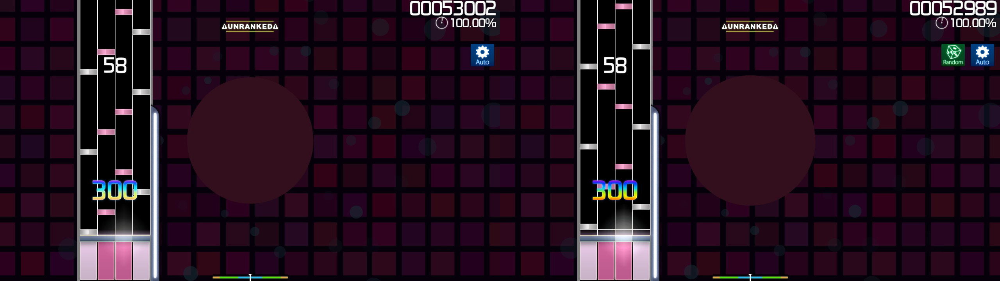

# Random (mod)

 Mod 圖示")

*若要查看 Mod 列表，請見：[遊戲 Mod](/wiki/Gameplay/Game_modifier)*

## 關於

- 別名：RD
- 類型：特殊
- 成績加乘：1.00 倍
- 預設快捷鍵：`X`
- 註解：`隨機排列音符！`
- 適用的遊戲模式：![][osu!mania]

## 說明

**Random** Mod 是 [osu!mania](/wiki/Game_mode/osu!mania)  專用的 Mod，啟用後在每次開始遊玩圖譜都會重新隨機排列音符，來帶給玩家有趣的遊戲體驗。Random Mod 不會改變長按音符的長度。

[osu!mania]: /wiki/shared/mode/mania.png "osu!mania"
