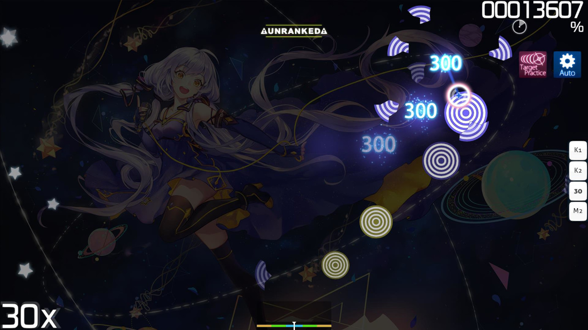

# Target Practice (Mod)

 Modsymbol")

::: alert-note
**Anmerkung:** Für die [lazer-Version](/wiki/Client/Release_stream/Lazer) des Artikels, siehe [Target Practice (lazer-Mod)](/wiki/Gameplay/Game_modifier/Target_Practice_(lazer))
:::

::: alert-note
**Anmerkung:** Für die vollständige Liste aller Mods, siehe [Spielmodifikationen](/wiki/Gameplay/Game_modifier)
:::

::: alert-notice
**Hinweis:** Die Mod Target Practice ist nur in der Updatequelle `Cutting Edge` verfügbar.
:::

## Übersicht

- Abkürzung: TP
- Typ: Sonstige
- Score-Multiplikator: 1,00x
- Kompatible Spielmodi: ![][osu!]

## Beschreibung

::: alert-notice
**Hinweis**
Das Aktivieren der Mod Target Practice sorgt dafür, dass das Spiel nicht gerankt wird.
:::

Die Mod **Target Practice** ist eine experimentelle [Spielmodifikation](/wiki/Gameplay/Game_modifier) für [osu!](/wiki/Game_mode/osu!), die alle [Hit-Objekte](/wiki/Gameplay/Hit_object) einer Beatmap entfernt und sie mit einer vereinfachten Reihe von "Zielscheiben" ersetzt. Sie wird überwiegend zum Spaß verwendet, kann aber auch hilfreich sein, um das Einhalten eines gleichmäßigen Tempos zu üben und seine Treffergenauigkeit zu verbessern.

Wenn Target Practice aktiviert ist, versteckt osu! die Lebensleiste und die Genauigkeitsanzeige. Der Spieler muss die Zielscheiben treffen, die nach und nach auf dem [Spielfeld](/wiki/Client/Playfield) erscheinen, mit der Absicht, ihren Mittelpunkt zu treffen. Um im Rhythmus zu bleiben, können sich Spieler an dem Metronom orientieren, welches im Hintergrund spielt.

Das Spiel läuft bis zum ersten [MISS](/wiki/Gameplay/Judgement/osu!), wonach die [Ergebnisanzeige](/wiki/Client/Interface#ergebnisanzeige) erscheint. Die Bedeutung der verschiedenen Noten ähnelt der in [osu!mania](/wiki/Gameplay/Grade#osu!mania).

## Zielscheiben

Eine Zielscheibe kann als eine spezielle Art von [Hit-Circle](/wiki/Gameplay/Hit_object/Hit_circle) ohne [Combo-Zahl](/wiki/Beatmapping/Combo) betrachtet werden. Trefferpunkte und Genauigkeit hängen davon ab, wo und wann die Zielscheibe getroffen wird. Je genauer und präziser dies geschieht, desto mehr Punkte werden vergeben, wobei man für einen idealen Treffer 250 Punkte erhält. Auf dem Spielfeld werden die Zielscheiben in Gruppen platziert, wobei alle zwei [Beats](/wiki/Music_theory/Beat) eine neue Gruppe beginnt. Der Abstand der Zielscheiben innerhalb einer Gruppe bleibt konstant und erhöht sich ein wenig mit jeder neuen Gruppe.

## Trivia

- Die Mod Target Practice verwendet die [Combo-Farben](/wiki/Beatmapping/Combo_colour) aus der [skin.ini](/wiki/Skinning/skin.ini)-Datei des aktuellen Skins.
- Schließt man eine Beatmap mit Target Practice nicht erfolgreich ab, wird die Ergebnisanzeige anstatt des Niederlagenbildschirms angezeigt.

[osu!]: /wiki/shared/mode/osu.png "osu!"
