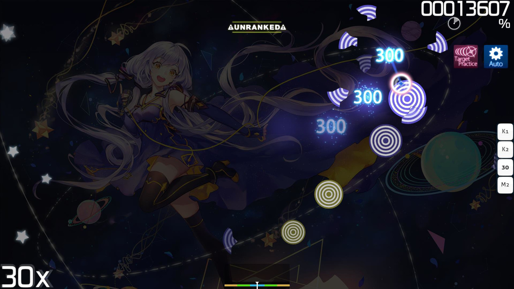

# Target Practice (mod)

 mod icon")

*สำหรับบทความนี้ในเวอร์ชัน [lazer](/wiki/Client/Release_stream/Lazer) ดูที่: [Target Practice (lazer mod)](/wiki/Gameplay/Game_modifier/Target_Practice_(lazer))*\
*สำหรับรายชื่อ Mod ทั้งหมด ดูที่: [Game Modifiers](/wiki/Gameplay/Game_modifier)*\
*หมายเหตุ: Target Practice mod สามารถเข้าถึงได้เฉพาะในบิลด์ `Cutting Edge` เท่านั้น*

## เกี่ยวกับ (About)

- ตัวย่อ: TP
- ประเภท: พิเศษ (Special)
- ตัวคูณคะแนน: 1.00x
- โหมดเกมที่รองรับ: ![][osu!]

## รายละเอียด (Description)

*หมายเหตุ: การเปิดใช้งาน Target Practice จะส่งผลให้การเล่นนั้นเป็นแบบ Unranked (ไม่คิดคะแนนจัดอันดับ)*

**Target Practice** mod เป็น [Game modifier](/wiki/Gameplay/Game_modifier) รุ่นทดลองสำหรับ [osu!](/wiki/Game_mode/osu!) ซึ่งจะนำ [Hit objects](/wiki/Gameplay/Hit_object) ทั้งหมดที่ถูกวางไว้ในแผนที่ออก และแทนที่ด้วย "เป้าหมาย (Targets)" ในรูปแบบที่เรียบง่ายแทน ส่วนใหญ่จะใช้เพื่อความสนุกสนาน แต่ก็มีประโยชน์ในการฝึกจังหวะที่สม่ำเสมอและปรับปรุงความแม่นยำในการกด

เมื่อเปิดใช้งาน Target Practice ตัวเกมจะซ่อนแถบพลังชีวิตและมาตรวัดความแม่นยำ ผู้เล่นจะต้องกดเป้าหมายที่ค่อยๆ ปรากฏขึ้นทั่ว [Playfield](/wiki/Client/Playfield) โดยตั้งเป้าที่จะกดให้ตรงจุดศูนย์กลาง และเพื่อให้รักษารัวจังหวะได้คงที่ ผู้เล่นสามารถฟังเสียง Metronome ที่เล่นเป็นพื้นหลังได้

เกมจะดำเนินต่อไปจนกว่าจะเกิด [MISS](/wiki/Gameplay/Judgement/osu!) ครั้งแรก ซึ่งจะนำผู้เล่นไปยัง [หน้าสรุปผล (Results screen)](/wiki/Client/Interface#results-screen) ทันที โดยความหมายของเกรด (Grades) ต่างๆ จะคล้ายคลึงกับในโหมด [osu!mania](/wiki/Gameplay/Grade#osu!mania)

## เป้าหมาย (Targets)

เป้าหมายสามารถถือเป็น [Hit circle](/wiki/Gameplay/Hit_object/Hit_circle) ประเภทพิเศษที่ไม่มี [Combo number](/wiki/Beatmapping/Combo) คะแนนและสถานะความแม่นยำจะขึ้นอยู่กับตำแหน่งและเวลาที่กด: ยิ่งกดได้แม่นยำและตรงจังหวะมากเท่าไหร่ ก็จะได้คะแนนมากขึ้นเท่านั้น โดยการกดที่สมบูรณ์แบบจะมีค่า 250 คะแนน ใน Playfield เป้าหมายจะถูกวางเป็นกลุ่มๆ โดยกลุ่มใหม่จะเริ่มขึ้นทุกๆ สอง [จังหวะเต็ม (Full beats)](/wiki/Music_theory/Beat) ระยะห่างภายในกลุ่มจะคงที่และจะเพิ่มขึ้นเล็กน้อยในทุกกลุ่มใหม่

## เกร็ดความรู้ (Trivia)

- Target Practice Mod จะใช้ [Combo colours](/wiki/Beatmapping/Combo_colour) จากไฟล์ [skin.ini](/wiki/Skinning/skin.ini) ของ Skin ที่ใช้งานอยู่
- การเล่นพลาดใน Target Practice จะนำผู้เล่นไปยังหน้าสรุปผลทันที แทนที่จะเป็นหน้าแสดงความพ่ายแพ้ (Fail screen)

[osu!]: /wiki/shared/mode/osu.png "osu!"