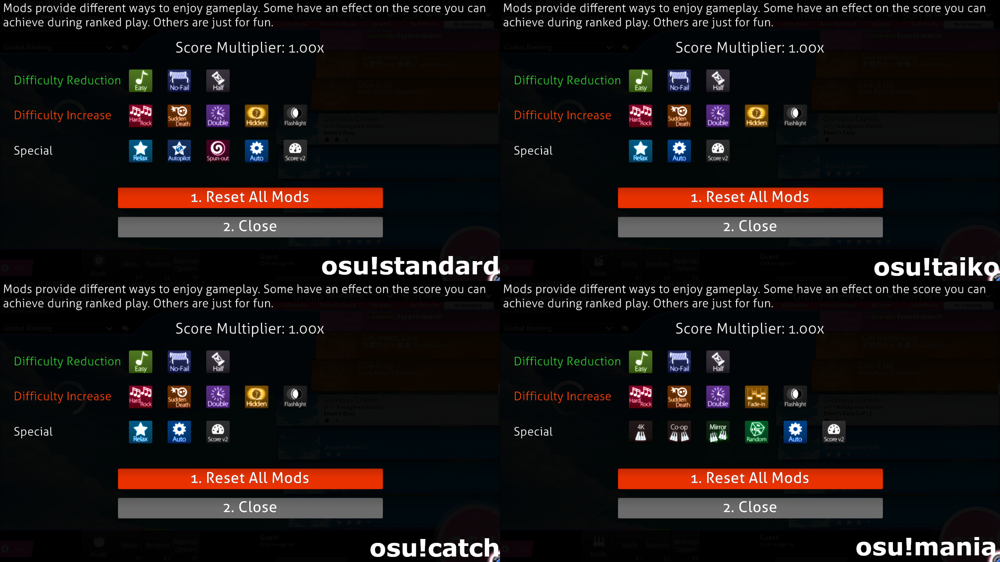

---
tags:
  - mod
  - game modifier
  - overview
  - list of mods
  - NoMod
  - No Mod
  - FreeMod
  - Free Mod
  - mody
  - modyfikatory gry
  - modyfikatory rozgrywki
  - lista modów
  - lista modyfikatorów
---

# Modyfikatory gry

::: alert-note
Aby zapoznać się z listą modyfikatorów w [lazerze](/wiki/Client/Release_stream/Lazer), zobacz artykuł [Modyfikatory gry (lazer)](/wiki/Gameplay/Game_modifier_(lazer))
:::

::: alert-note
Inne użycia słowa "mod" można zobaczyć w atrykule [Mod (strona ujednoznaczniająca)](/wiki/Disambiguation/Mod)
:::

**Modyfikatory gry** (w skrócie "mody") to opcjonalne modyfikatory wpływające na elementy i ustawienia [beatmapy](/wiki/Beatmap), które można wybrać w `ekranie wyboru modów` (pokazany na zdjęciu wyżej). Mody mogą ułatwić lub utrudnić rozgrywkę, albo po prostu zrobić ją przyjemniejszą.

W ekranie wyboru piosenki gracze mogą przejść do `wyboru modów` poprzez kliknięcie przycisku z napisem `Mods`, który znajduje się się w lewym dolnym rogu ekranu, lub poprzez naciśnięcie klawisza `F1`. W `ekranie wyboru modów` również można użyć skrótów klawiszowych do wybierania konkretnych modów. Skróty te można zmienić w opcjach.

Mody są podzielone na trzy różne kategorie: `ułatwiające`, `utrudniające` oraz `specjalne`. Dodatkowo mogą zwiększać, zmniejszać lub całkowicie usuwać [`mnożnik punktów`](/wiki/Gameplay/Game_modifier/Mod_multiplier). Gdy dwa mody są zaznaczone jednocześnie, ich mnożniki zostaną przemnożone przez siebie (np. `1.06x * 1.12x = 1.1872x`).

## Lista modów

::: alert-note
**Zobacz także:** [Podsumowanie modyfikatorów gry](/wiki/Gameplay/Game_modifier/Summary)
:::

Obok każdego z wymienionych niżej modów znajdują się ikony trybów gry (![][osu!] ![][osu!taiko] ![][osu!catch] ![][osu!mania]), z którymi są kompatybilne.

### Ułatwiające

- [Easy (EZ)](/wiki/Gameplay/Game_modifier/Easy) ![][osu!] ![][osu!taiko] ![][osu!catch] ![][osu!mania]
- [No Fail (NF)](/wiki/Gameplay/Game_modifier/No_Fail) ![][osu!] ![][osu!taiko] ![][osu!catch] ![][osu!mania]
- [Half Time (HT)](/wiki/Gameplay/Game_modifier/Half_Time) ![][osu!] ![][osu!taiko] ![][osu!catch] ![][osu!mania]

### Utrudniające

- [Hard Rock (HR)](/wiki/Gameplay/Game_modifier/Hard_Rock) ![][osu!] ![][osu!taiko] ![][osu!catch] ![][osu!mania]
- [Sudden Death (SD)](/wiki/Gameplay/Game_modifier/Sudden_Death) ![][osu!] ![][osu!taiko] ![][osu!catch] ![][osu!mania]
  - [Perfect (PF)](/wiki/Gameplay/Game_modifier/Perfect) ![][osu!] ![][osu!taiko] ![][osu!catch] ![][osu!mania]
- [Double Time (DT)](/wiki/Gameplay/Game_modifier/Double_Time) ![][osu!] ![][osu!taiko] ![][osu!catch] ![][osu!mania]
  - [Nightcore (NC)](/wiki/Gameplay/Game_modifier/Nightcore) ![][osu!] ![][osu!taiko] ![][osu!catch] ![][osu!mania]
- [Hidden (HD)](/wiki/Gameplay/Game_modifier/Hidden) ![][osu!] ![][osu!taiko] ![][osu!catch] ![][osu!mania]
  - [Fade In (FI)](/wiki/Gameplay/Game_modifier/Fade_In) ![][osu!mania]
- [Flashlight (FL)](/wiki/Gameplay/Game_modifier/Flashlight) ![][osu!] ![][osu!taiko] ![][osu!catch] ![][osu!mania]

### Specjalne

- [Relax (RL)](/wiki/Gameplay/Game_modifier/Relax) ![][osu!] ![][osu!taiko] ![][osu!catch]
- [Autopilot (AP)](/wiki/Gameplay/Game_modifier/Autopilot) ![][osu!]
- [Spun Out (SO)](/wiki/Gameplay/Game_modifier/Spun_Out) ![][osu!]
- [1K, 2K, 3K, 4K, 5K, 6K, 7K, 8K, 9K (xK)](/wiki/Gameplay/Game_modifier/xK) ![][osu!mania]
- [Co-op (CP)](/wiki/Gameplay/Game_modifier/Co-op) ![][osu!mania]
- [Mirror (MR)](/wiki/Gameplay/Game_modifier/Mirror) ![][osu!mania]
- [Random (RD)](/wiki/Gameplay/Game_modifier/Random) ![][osu!mania]
- [Auto (AT)](/wiki/Gameplay/Game_modifier/Auto) ![][osu!] ![][osu!taiko] ![][osu!catch] ![][osu!mania]
  - [Cinema (CM)](/wiki/Gameplay/Game_modifier/Cinema) ![][osu!] ![][osu!taiko] ![][osu!catch] ![][osu!mania]
- [ScoreV2 (SV2)](/wiki/Gameplay/Game_modifier/ScoreV2) ![][osu!] ![][osu!taiko] ![][osu!catch] ![][osu!mania]
- [Target Practice (TP)](/wiki/Gameplay/Game_modifier/Target_Practice) ![][osu!] **dostępny jedynie w eksperymentalnej wersji osu! (Cutting Edge)**

### Inne

::: alert-notice
Mody te były dawniej dostępne, lecz zostały od tego czasu wycofane.
:::

- [10K](/wiki/Gameplay/Game_modifier/10K) ![][osu!mania]
- [Fade Out](/wiki/Gameplay/Game_modifier/Fade_Out) ![][osu!mania]
- [No Video](/wiki/Gameplay/Game_modifier/No_Video) ![][osu!] ![][osu!taiko] ![][osu!catch] ![][osu!mania]

### Powiązane terminy

#### No Mod

W rozgrywkach [turniejowych](/wiki/Tournaments) **No Mod** (***NM***) oznacza, że gracze nie mogą używać żadnych modów. Wiele turniejów domyślnie wymaga używania pewnych modów, takich jak [No Fail](/wiki/Gameplay/Game_modifier/No_Fail) czy [ScoreV2](/wiki/Gameplay/Game_modifier/ScoreV2), dlatego ich wybranie nie liczy się jako granie z modem w przypadku beatmapy No Mod.

#### Free Mod

W rozgrywkach [turniejowych](/wiki/Tournaments) **Free Mod** (***FM***) oznacza możliwość wybrania dowolnego moda lub ich kombinacji. Niektóre turnieje dodatkowo precyzują, które mody są dostępne w puli wyboru oraz jakie kombinacje są dozwolone, a także czy granie bez modów jest dozwolone w przypadku beatmapy Free Mod.

[osu!]: /wiki/shared/mode/osu.png "osu!"
[osu!taiko]: /wiki/shared/mode/taiko.png "osu!taiko"
[osu!catch]: /wiki/shared/mode/catch.png "osu!catch"
[osu!mania]: /wiki/shared/mode/mania.png "osu!mania"